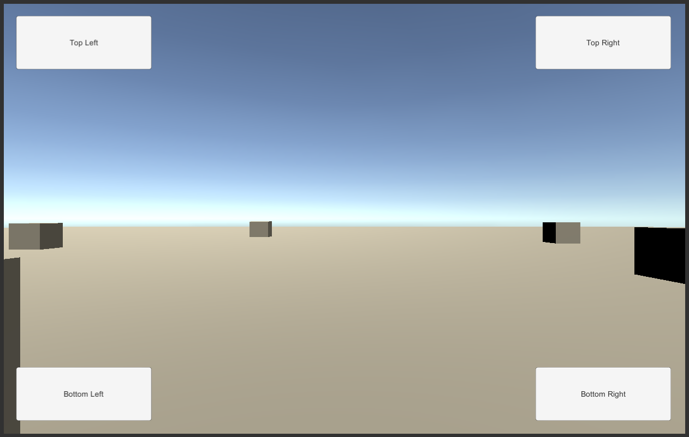

# UI vs Game Input

>NOTE: More information related to ambiguities between UI and game input may be found [here in the documentation](http://docs.unity3d.com/Packages/com.unity.inputsystem@1.1/manual/UISupport.html#ui-and-game-input).

When interactive UI elements are overlaid over a game view, ambiguity may arise for inputs.

If, for example, there is a `UI.Button` on screen that can be clicked/tapped, while clicking/tapping on the scene itself also has associated functionality, clicking on the UI button should not also trigger the corresponding action on the scene.

This sample demonstrates how to handle input in such a situation.

## The Sample Scene

The sample scene has a UI button in each of the corners of the screen. The camera in the scene can be rotated and projectiles can be fired while at the same time the buttons in the UI can be clicked.

There are two ways to control the game:

1. "Pointer", i.e. mouse (optionally combined with keyboard) or touch input, and
2. "Navigation", i.e. gamepad input.

### Mouse/Touch/Keyboard Input

- When clicking any of the buttons, the "status bar" text along the bottom edge of the screen changes.
- Left-click-dragging with the mouse or finger-dragging with touch rotates the camera (note: only when starting the drag on the background). Alternatively, when using mouse&amp;keyboard, holding the the left control key will engage camera control.
- Right-clicking with the mouse or tapping the second finger while rotating the camera shoots a projectile.
- Double-clicking/tapping on the scene resets the camera orientation.
- Pressing `Escape` will bring up the game menu. With touch input, an extra button is shown in the game UI to do that.

### Gamepad Input

- The right stick rotates the camera and the right trigger fires a projectile.
- Double-pressing the A button will reset the camera to its initial orientation.
- Holding the left trigger switch to UI focus. UI selection is now active and can be changed with the d-pad or the sticks. The A button performs a button press.
- Pressing B while in game brings up the main menu.

## How It Works

### Pointer Input

For the most part, input processing is done in `Update()` such that actions are processed on a per-frame basis. Responses to actions that may conflict with UI input use [`IsPointerOverGameObject`](https://docs.unity3d.com/Packages/com.unity.ugui@1.0/api/UnityEngine.EventSystems.EventSystem.html?q=ispointerovergameobj#UnityEngine_EventSystems_EventSystem_IsPointerOverGameObject) to determine whether the pointer is currently over UI. Since this is called from `Update()` and thus *outside* of input processing (i.e. not from within an `InputAction` callback), the method can be safely called and will return an accurate result.

There are two implementations of handling the `Fire` action. One uses the same approach just mentioned where the action's response is dealt with once per frame. The second one, however, immediately creates a projectile within the callback and thus operates at sub-frame accuracy. For a low-frequency input such as the `Fire` action here, this is not generally a useful thing to do but it is done here for the sake of demonstration. We cannot call [`IsPointerOverGameObject`](https://docs.unity3d.com/Packages/com.unity.ugui@1.0/api/UnityEngine.EventSystems.EventSystem.html?q=ispointerovergameobj#UnityEngine_EventSystems_EventSystem_IsPointerOverGameObject) from the action callback and thus need to use the UI's public raycasting interface to determine "over UI?" state manually for the current pointer position.

### Navigation Input

Navigation input employs an explicit mode switch to go from gameplay to UI input. This is handled by `OnUIEngage`.
