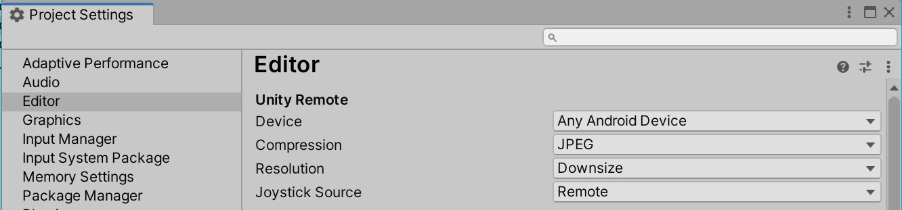

# Unity Remote Sample

This sample is just a simple scene that lets you see try out the Unity Remote app. The app is useful for quickly testing your project in the Unity Editor without having to build and deploy to the device. This is supported for iOS and Android.

More detailed information about the Unity Remote can be found in the [Unity manual](https://docs.unity3d.com/Manual/UnityRemote5.html).

Instructions:

1. Install the Unity Remote app on your Android or iOS device.
2. Connect the device to your computer via USB. On Android, make sure you have the Android SDK installed and configured appropriately in Unity. Also, USB debugging needs to be enabled.
3. In Unity, go to `Edit > Project Settings > Editor` and select the device in the `Unity Remote` section.
   
4. Open the Unity Remote app on the device.
5. Open the [`UnityRemoteTest.unity`](UnityRemoteTest.unity) scene from this sample.
6. Enter play mode. After a short delay, the Unity Remote app on your device should switch to display the scene and you should be able to interact with the scene in the editor using the device.
