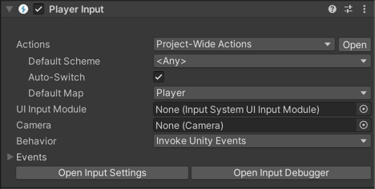
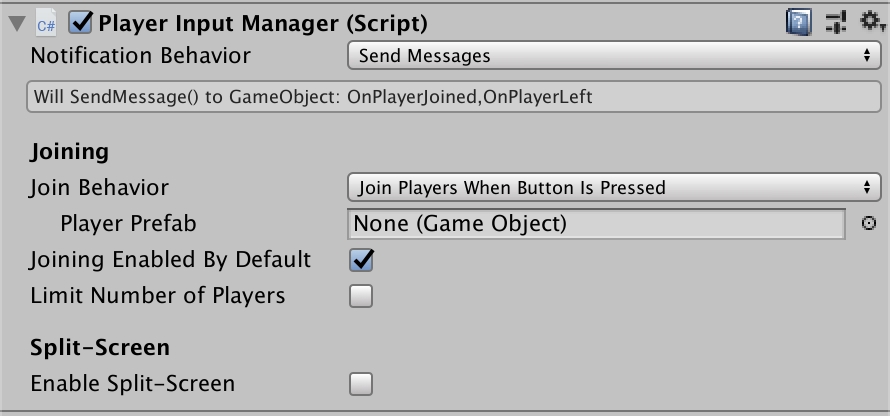
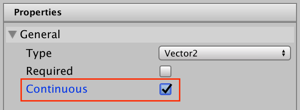
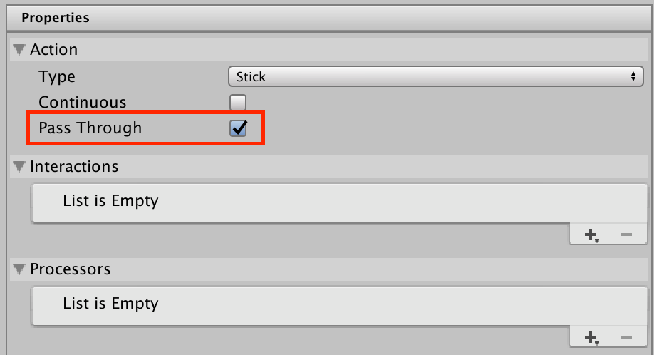
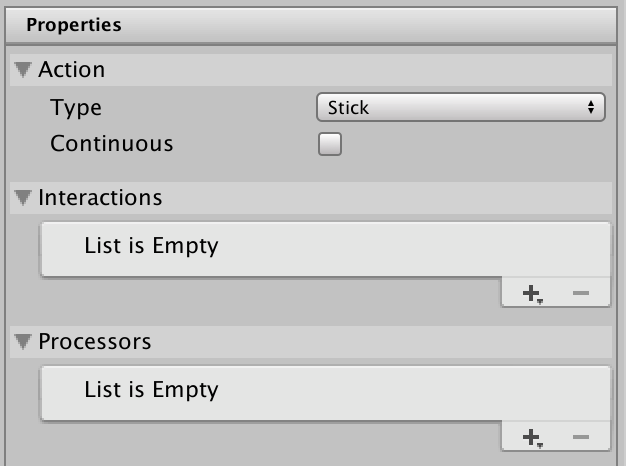
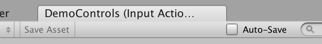

# Changelog

All notable changes to the input system package will be documented in this file.

The format is based on [Keep a Changelog](http://keepachangelog.com/en/1.0.0/)
and this project adheres to [Semantic Versioning](http://semver.org/spec/v2.0.0.html).

Due to package verification, the latest version below is the unpublished version and the date is meaningless.
however, it has to be formatted properly to pass verification tests.

## [1.9.0] - 2024-07-15

### Changed
- Added warning messages to both `OnScreenStick` and `OnScreenButton` Inspector editors that would display a warning message in case on-screen control components are added to a `GameObject` not part of a valid UI hierarchy.
- Changed behavior for internal feature flag relating to Windows Gaming Input to be ignored on non-supported platforms.
- Changed `DualSenseHIDInputReport` from internal to public visibility

### Fixed
- Avoid potential crashes from `NullReferenceException` in `FireStateChangeNotifications`.
- Fixed cases where `wasPressedThisFrame` would not return true if a press and release happened within the same frame before being queried (and vice versa for `wasReleasedThisFrame`).
- Fixed an issue where a composite binding would not be consecutively triggered after ResetDevice() has been called from the associated action handler [ISXB-746](https://issuetracker.unity3d.com/product/unity/issues/guid/ISXB-746).
- Fixed resource designation for "d_InputControl" icon to address CI failure.
- Fixed an issue where a composite binding would not be consecutively triggered after disabling actions while there are action modifiers in progress [ISXB-505](https://issuetracker.unity3d.com/product/unity/issues/guid/ISXB-505).
- Fixed prefabs and missing default control scheme used by PlayerInput component are now correctly shown in the inspector [ISXB-818](https://issuetracker.unity3d.com/product/unity/issues/guid/ISXB-818).
- Fixed error thrown when Cancelling Control Scheme creation in Input Actions Editor.
- Fixed Scheme Name in Control Scheme editor menu that gets reset when editing devices [ISXB-763](https://issuetracker.unity3d.com/product/unity/issues/guid/ISXB-763).
- Fixed an issue where `InputActionAsset.FindAction(string, bool)` would throw `System.NullReferenceException` instead of returning `null` if searching for a non-existent action with an explicit action path and using `throwIfNotFound: false`, e.g. searching for "Map/Action" when `InputActionMap` "Map" exists but no `InputAction` named "Action" exists within that map [ISXB-895](https://issuetracker.unity3d.com/product/unity/issues/guid/ISXB-895).
- Fixed scroll speed being slower when using InputSystemUIInputModule instead of StandaloneInputModule. (https://jira.unity3d.com/browse/ISXB-771)
- Fixed an issue where adding a `OnScreenButton` or `OnScreenStick` to a regular GameObject would lead to exception in editor.
- Fixed an issue where adding a `OnScreenStick` to a regular GameObject and entering play-mode would lead to exceptions being generated.
- Fixed InputActionReference issues when domain reloads are disabled [ISXB-601](https://issuetracker.unity3d.com/product/unity/issues/guid/ISXB-601), [ISXB-718](https://issuetracker.unity3d.com/product/unity/issues/guid/ISXB-718), [ISXB-900](https://issuetracker.unity3d.com/product/unity/issues/guid/ISXB-900)
- Fixed a performance issue with many objects using multiple action maps [ISXB-573](https://issuetracker.unity3d.com/product/unity/issues/guid/ISXB-573).
- Fixed an variable scope shadowing issue causing compilation to fail on Unity 2019 LTS.
- Fixed an issue where changing `InputSettings` instance would not affect associated feature flags.
- Submit and Cancel UI actions will now respect configured interactions. [ISXB-841](https://issuetracker.unity3d.com/product/unity/issues/guid/ISXB-841).
- Fixed the UI generation of enum fields when editing interactions of action properties. The new selected value was lost when saving.
- Fixed the UI generation of custom interactions of action properties when it rely on OnGUI callback. [ISXB-886](https://issuetracker.unity3d.com/product/unity/issues/guid/ISXB-886).
- Fixed deletion of last composite part raising an exception. [ISXB-804](https://issuetracker.unity3d.com/product/unity/issues/guid/ISXB-804)
- Fixed an issue related to Visualizers sample where exceptions would be thrown by InputActionVisualizer and InputControlVisualizer when entering play-mode if added as components to a new `GameObject`.
- Fixed an issue with InputAction Asset editor where invalid ControlScheme names with only spaces could be entered. [ISXB-547](https://issuetracker.unity3d.com/product/unity/issues/guid/ISXB-547).

### Added
- Added additional device information when logging the error due to exceeding the maximum number of events processed
  set by `InputSystem.settings.maxEventsBytesPerUpdate`. This additional information is available in development builds
  only.
- Fixed deletion of last composite part raising an exception. [ISXB-804](https://issuetracker.unity3d.com/product/unity/issues/guid/ISXB-804)
- Expanded editor and build insight analytics to cover ``.inputactions` asset editor usage, `InputSettings` and common component configurations.

### Changed
- Changed `DualSenseHIDInputReport` from internal to public visibility
- Added Input Setting option allowing to keep platform-specific scroll wheel input values instead of automatically converting them to a normalized range.

## [1.8.2] - 2024-04-29

### Added
- Documentation to clarify effects of ordering of interactions when a single action has multiple interactions [ISXB-221](https://issuetracker.unity3d.com/product/unity/issues/guid/ISXB-221).
- Additional tests for UI Input default actions (Navigate, Submit, Scroll etc.)
- Documented behaviour of InputSystemUIInputModule automatically enabling the UI action map. [ISXB-621](https://issuetracker.unity3d.com/product/unity/issues/guid/ISXB-621)

### Fixed
- Fixed an issue where UI interactions would not function without setting up a project-wide actions asset in Project Settings. Default UI actions are now created on the fly, if no asset for project-wide actions has been set. [ISXB-811](https://issuetracker.unity3d.com/product/unity/issues/guid/ISXB-811).
- Physical keyboards used on Android/ChromeOS could have keys "stuck" reporting as pressed after a long press and release [ISXB-475](https://issuetracker.unity3d.com/product/unity/issues/guid/ISXB-475).
- NullReferenceException thrown when right-clicking an empty Action Map list in Input Actions Editor windows [ISXB-833](https://issuetracker.unity3d.com/product/unity/issues/guid/ISXB-833).
- Fixed an issue where `System.ObjectDisposedException` would be thrown when deleting the last ActionMap item in the Input Actions Asset editor.
- Fixed DualSense Edge's vibration and light bar not working on Windows
- Fixed Project-wide Actions asset failing to reload properly after deleting project's Library folder.
- Fixed an issue where `System.InvalidOperationException` is thrown when entering PlayMode after deleting an ActionMap from Project-wide actions and later resetting it.
- Fixed OnPointerClick events not propagating to child objects unless the child also handled OnPointerDown events [ISXB-857](https://issuetracker.unity3d.com/product/unity/issues/guid/ISXB-857).
- Fixed Input Actions Editor window resource leak that could result in unexpected exceptions [ISXB-865](https://issuetracker.unity3d.com/product/unity/issues/guid/ISXB-865).
- Fixed an issue where UI integration would throw exceptions when Project-wide Input Actions asset did not contain the implicitly required `UI` action map or was missing any of the required actions. Additionally this fix now also generates warnings in the console for any divergence from expected action configuration or lack of bindings in edit-mode.
- Fixed a minor issue when importing InputAction assets that could result in unexpected logging during internal package validation checks.

### Changed
- For Unity 6.0 and above, when an `EventSystem` GameObject is created in the Editor it will have the
`InputSystemUIInputModule` by default if the Input System package is installed and enabled.

## [1.8.1] - 2024-03-14

### Fixed
- NullReferenceException thrown when editing a binding path in InputActionAsset windows.

## [1.8.0] - 2024-03-12

### Changed
- From 2023.2 forward: UI toolkit now uses the "UI" action map of project-wide actions as their default input actions. Previously, the actions were hardcoded and were based on `DefaultInputActions` asset which didn't allow user changes. Also, removing bindings or renaming the 'UI' action map of project wide actions will break UI input for UI toolkit.
- Changed the 'Max player count reached' error to a warning instead.
- Removed "Input Actions" title from UI-Toolkit Input Action Editor when used in a window and not embedded in Project Settings.
- Moved project wide input action storage over to an Asset to avoid issues with multiple assets in a single project settings file.
- Migrate any project-wide input actions found in the InputManager.asset file to a new InputSystem_Actions.inputactions asset file.
- `InputSystem.actions` may now only be assigned in edit-mode. Any attempt to assign `InputSystem.actions` during play-mode will generate an exception.
- `InputSystem.actions` may now only be assigned a persisted `InputActionAsset` instance since in-memory objects can anyway not be included in a player build. This now generates an `ArgumentException` when attempting to assign a non-persisted object.
- Project Settings embedded Input Action Editor will now disallow selecting the Project-wide Actions asset during play-mode. The option is only available in edit-mode.
- The "Assign as the Project-wide Input Actions" option visible in the Inspector when selecting an .inputactions asset that is not the current Project-wide Input Actions Asset is now disabled in play-mode.

### Added
- Added new methods and properties to [`InputAction`](xref:UnityEngine.InputSystem.InputAction):
  - [`InputAction.activeValueType`](xref:UnityEngine.InputSystem.InputAction.activeValueType) returns the `Type` expected by `ReadValue<TValue>` based on the currently active control that is driving the action.
  - [`InputAction.GetControlMagnitude`](xref:UnityEngine.InputSystem.InputAction.GetControlMagnitude) returns the current amount of actuation of the control that is driving the action.
  - [`InputAction.WasCompletedThisFrame`](xref:UnityEngine.InputSystem.InputAction.WasCompletedThisFrame) returns `true` on the frame that the action stopped being in the performed phase. This allows for similar functionality to [`WasPressedThisFrame`](xref:UnityEngine.InputSystem.InputAction.WasPressedThisFrame)/[`WasReleasedThisFrame`](xref:UnityEngine.InputSystem.InputAction.WasReleasedThisFrame) when paired with [`WasPerformedThisFrame`](xref:UnityEngine.InputSystem.InputAction.WasPerformedThisFrame) except it is directly based on the interactions driving the action. For example, you can use it to distinguish between the button being released or whether it was released after being held for long enough to perform when using the Hold interaction.
- Added Copy, Paste and Cut support for Action Maps, Actions and Bindings via context menu and key command shortcuts.
- Added Dual Sense Edge controller to be mapped to the same layout as the Dual Sense controller
- Added drag and drop support in the Input Action Asset Editor for Action Maps, Actions and Bindings.
- UI Toolkit input action editor now supports showing the derived bindings.
- Device filtering support for control schemes in the UI-Toolkit Input Asset Editor.
- Added right-click (context) menu support for empty areas below the Action Maps/Actions lists in the Project Settings Input Action Editor and Asset Input Action Editor.
- Added text to show which action map asset was used to create each action in the Input Debug window.

### Fixed
- Fixed syntax of code examples in API documentation for [`AxisComposite`](xref:UnityEngine.InputSystem.Composites.AxisComposite).
- Fixed missing confirmation popup when deleting a control scheme.
- Fixed support for menu bar/customisable keyboard shortcuts used when interacting with Actions and Action Maps.
- Fixed add bindings button to support left button click.
- Fixed icon for adding bindings and composites button.
- Fixed Documentation~/filter.yml GlobalNamespace rule removing all API documentation.
- Fixed `Destroy may not be called from edit mode` error [ISXB-695](https://issuetracker.unity3d.com/product/unity/issues/guid/ISXB-695)
- Fixed possible exceptions thrown when deleting and adding Action Maps.
- Fixed selection not changing when right-clicking an Action Map or Action in the Project Settings Input Actions Editor.
- Fixed right-click context menus throwing errors when dealing with multiple Input Actions Editor windows.
- Fixed potential race condition on access to GCHandle in DefferedResolutionOfBindings and halved number of calls to GCHandle resolution [ISXB-726](https://issuetracker.unity3d.com/product/unity/issues/guid/ISXB-726)
- Fixed issue where composite part dropdown manipulates binding path and leaves composite part field unchanged.
- Fixed lingering highlight effect on Save Asset button after clicking.
- Fixed missing name in window title for Input Action assets.
- Fixed showing action properties view when there were no actions.
- Fixed "Listen" functionality for selecting an input sometimes expecting the wrong input type.
- Fixed console errors that can be produced when opening input package settings from the Inspector.
- Fixed InputManager.asset file growing in size on each Reset call.
- Fixed Opening InputDebugger throws 'Action map must have state at this point' error.
- Fixed Cut/Paste behaviour to match Editor - Cut items will now be cleared from clipboard after pasting.
- Improved window layout to avoid elements being hidden (both the Input Actions in Project Settings, and standalone Input Actions Editor windows).
- Fixed InputAction asset appearing dirty after rename [ISXB-749](https://issuetracker.unity3d.com/product/unity/issues/guid/ISXB-749).
- Fixed Error logged when InputActionsEditor window opened without a valid asset.
- Fixed ArgumentNullExceptions thrown when deleting items quickly in the UITK Editor.
- Fixed Project Settings header title styling for Input Actions editor.
- Fixed Input Actions Editor losing reference to current ControlScheme upon entering Play Mode [ISXB-770](https://issuetracker.unity3d.com/product/unity/issues/guid/ISXB-770).
- Fixed Save shortcut (ctrl/cmd + S by default) not saving changes in Input Actions Editor windows. [ISXB-659](https://issuetracker.unity3d.com/product/unity/issues/guid/ISXB-659).
- Fixed headers in InputActionsEditor windows becoming squashed when there is a large number of Action Maps/Actions.
- Fixed duplication of project wide input actions when loading/unloading scenes.
- Fixed an issue where UI Toolkit based editor would not close itself if the associated asset would be deleted (To mimic IMGUI Input Action Editor behavior).
- Fixed a regression in IMGUI Input Action Editor where editor would auto-save on focus lost even when the auto-save toggle was disabled.
- Fixed an issue where UI Toolkit based editor would not properly track tentative changes associated with a moved asset file.
- Fixed an issue where selection state of UI Toolkit editor state would not be preserved when associated with a new serialized copy of the asset.
- Fixed an issue where any exceptions throw from within UI Toolkit event queue would only log the error message and not the full exception stack trace, making debugging more difficult.
- Fixed an issue where UI Toolkit Input Actions Editor wouldn't provide a correct modification state when coming back from domain reload.
- Fixed an issue in the Input Actions Editor window where entries being cut would be deleted instantly and not after being pasted.
- Fixed an issue where preloaded InputActionAsset objects added by a Unity developer could accidentally be selected as the project-wide actions asset instead of the configured asset in built players.
- Fixed a compile-time warning: `warning CS0109: The member 'UnityRemoteTestScript.camera' does not hide an accessible member. The new keyword is not required.` showing up in the Console window when building a player including the Input System Unity Remote sample.
- Fixed an issue where the InputActionAsset editor window would remove the unsaved changes asterisk when cancelling the window. [ISXB-797](https://issuetracker.unity3d.com/product/unity/issues/guid/ISXB-797).
- Fixed an issue in the Input Actions Editor window where deleting items unfolded other actions or the selection switched unintended.
- Fixed Composite types missing in context menu when "Any" ControlType selected. [ISXB-769](https://issuetracker.unity3d.com/product/unity/issues/guid/ISXB-769).
- Fixed 3D Vector and 1D Axis binding dropdown usage in Input Actions Editor throwing NotImplementedExceptions.
- Fixed several missing tooltips from the Action/Binding Properties pane in Input Actions Editor.
- Fixed an issue in the InputActionAsset Editor where ControlType wasn't updated when ActionType changed.
- Fixed an issue in the InputActionAsset Editor where Canceling ControlScheme changes didn't reset the values in the UI.
- Fixed an issue where newly created action map names were not editable.
- Fixed an issue where having unsaved changes in `InputActionsEditorWindow` would be discarded when entering play-mode (or triggering domain reload in general).
- Fixed an issue where a `InputActionsEditorWindow` would not find an existing open editor window if the editor was open during a domain reload and then the asset was opened from the Project Explorer.
- Fixed a visual glitch in the InputActionAsset Editor when scrolling the Actions list with a rename in progress. [ISXB-748](https://issuetracker.unity3d.com/product/unity/issues/guid/ISXB-748)
- Fixed ProjectWideActions template so Previous/Next Actions are Button instead of Axis.
- Fixed an issue in the Input Action Editor window where entries being cut would be deleted instantly and not after being pasted.
- Fixed an issue in the Input Action Editor window where deleting items unfolded other actions or the selection switched unintended.
- Fixed an issue where InputActionAsset validation where not triggered for Project-wide input actions when the project-wide asset was edited in a regular windowed Input Action Asset editor window.
- Fixed incorrect documentation in InputSystem.actions and InputSystem.onActionsChanged property API contract.
- Fixed an issue where `InputSystem.actions` could be incorrectly evaluated if the associated asset was deleted.

## [1.8.0-pre.2] - 2023-11-09

### Changed
- Removed icons from action map list as these were always the same and the icon was placeholder
- Input asset editor now switched to use UI Toolkit which matches the project wide input actions editor interface.
- Changed [`InputActionProperty`](xref:UnityEngine.InputSystem.InputActionProperty) property drawer to be more compact. Use the More menu (`⋮`) button to open a dropdown menu and select between Use Reference and Use Action.
- Static analysis warnings regarding flag enums have been suppressed in order to avoid compile-time warnings or errors.
- Action Map and Action Tree views of the UI Toolkit based Input Action Editor now prevents deselection in both views when Escape key is pressed.
- Input Action Asset editors Auto-save feature has been modified to trigger on focus-lost when activated instead of triggering on every modification to the asset in order to reduce impact of processing required to handle modified assets.
- Project-wide input actions template extension changed from .inputactions to .json. This avoids showing template actions in the action's selector UI that are not intended to be used.
- Re-enabled some UI tests that were disabled on iOS.
- Reorganized package Project Settings so that "Input System Package" setting node contains "Input Actions" and "Settings" becomes a child node when Project-wide Actions are available. For Unity versions where Project-wide Actions are not available, the settings structure remains unchanged.
- Make Project-wide Actions the default actions for Player Input.

### Added
- Support for [Game rotation vector](https://developer.android.com/reference/android/hardware/Sensor#TYPE_GAME_ROTATION_VECTOR) sensor on Android
- Duplicate Input Action Items in the new Input Action Asset Editor with Ctrl+D (Windows) or Cmd+D (Mac)
- Selection of InputActionReferences from project-wide actions on fields that are of type InputActionReference. Uses a new advanced object picker that allows better searching and filtering of actions.
- Reset project wide Input Settings to default via a new Kebab-menu in Input System Project Settings.

### Fixed
- Partially fixed case ISX-1357 (Investigate performance regressing over time).  A sample showed that leaving an InputActionMap enabled could lead to an internal list of listeners growing.  This leads to slow-down, so we now warn if we think this is happening.
- UI fix for input fields in interactions: they are wider now and the width is fixed.
- Fixed exiting empty input fields for actions, action maps and composites in the input action asset editor.
- Fixed an issue where selecting an Action in the Input Action Asset Editor tree-view and then pressing ESC to unselect would throw an `InvalidOperationException`.
- Fixed an issue where selecting an Action Map in the Input Action Asset Editor list and then pressing ESC to unselect would print an `NullReferenceException` to the Debug console.
- Fixed case [ISXB-251](https://issuetracker.unity3d.com/product/unity/issues/guid/ISXB-251) (Action only calls started & performed callbacks when control type is set to Vector3Composite). `EvaluateMagnitude` wasn't overridden for Vector3Composite, also made some minor changes to Vector3Composite and Vector2Composite for consistency.
- Fixed case [ISXB-580](https://issuetracker.unity3d.com/product/unity/issues/guid/ISXB-580) (UI Submit / Cancel not working with Switch Pro controller) by adding "Submit" & "Cancel" usages to the Switch Pro controller input controls.
- Fixed an issue where undoing deletion of Action Maps did not restore Actions correctly.
- Fixed case [ISXB-628](https://issuetracker.unity3d.com/product/unity/issues/guid/ISXB-628) (OnIMECompositionChange does not return an empty string on accept when using Microsoft IME) by clarifying expectations and intended usage for the IME composition change event.
- Fixed issue where the expanded/collapsed state of items in the input action editor was not properly saved between rebuilds of the UI.
- Fixed issue where The Profiler shows incorrect data and spams the console with "Missing Profiler.EndSample" errors when there is an Input System Component in Scene).
- Fixed an issue where undoing duplications of action maps caused console errors.
- Fix for BindingSyntax `WithInteraction()` which was incorrectly using processors.
- Fix for UITK Input Action Editor binding 'Listen' button which wasn't working in the case for Control Type 'Any'.
- Fixed issue of visual elements being null during editing project-wide actions in project settings which prompted console errors.
- Fixed case ISX-1436 (UI TK Input Action Asset Editor - Error deleting Bindings with DeleteKey on Windows).
- Fixed issue with UI Toolkit based Input Action Editor not restoring it's selected items after Domain Reload.
- Fixed the [`GetHapticCapabilitiesCommand`](xref:UnityEngine.InputSystem.XR.Haptics.GetHapticCapabilitiesCommand) always failing to execute due to a mismatch in the size in bytes of the payload and the size expected by XR devices. Changed [`HapticCapabilities`](xref:UnityEngine.InputSystem.XR.Haptics.HapticCapabilities) to include all properties returned by the XR input subsystem. This makes Input System match the functionality provided by the [XR](https://docs.unity3d.com/Manual/com.unity.modules.xr.html) module's [`InputDevice.TryGetHapticCapabilities`](https://docs.unity3d.com/ScriptReference/XR.InputDevice.TryGetHapticCapabilities.html) and [`HapticCapabilities`](https://docs.unity3d.com/ScriptReference/XR.HapticCapabilities.html).
- Fixed issue where deleting a binding in the Input Action Editor would usually result in an unexpected item being selected next.

## [1.8.0-pre.1] - 2023-09-04

### Added
- Initial version of Project Wide Actions for pre-release (`InputSystem.actions`). This feature is available only on Unity Editor versions 2022.3 and above and can be modified in the Project Settings.

### Fixed
- Fixed device selection menu not responding to mouse clicks when trying to add a device in a Control Scheme ([case ISXB-622](https://issuetracker.unity3d.com/product/unity/issues/guid/ISXB-622)).

## [1.7.0] - 2023-08-14

### Added
- Preliminary support for visionOS.
- Show a list of `Derived Bindings` underneath the Binding Path editor to show all controls that matched.

### Changed
- Changed the `InputAction` constructors so it generates an ID for the action and the optional binding parameter. This is intended to improve the serialization of input actions on behaviors when created through API when the property drawer in the Inspector window does not have a chance to generate an ID.

### Fixed
- Fixed missing prefab errors in InputDeviceTester project ([case ISXB-420](https://issuetracker.unity3d.com/product/unity/issues/guid/ISXB-420)).
- Fixed serialization migration in the Tracked Pose Driver component causing bindings to clear when prefabs are used in some cases ([case ISXB-512](https://issuetracker.unity3d.com/product/unity/issues/guid/ISXB-512), [case ISXB-521](https://issuetracker.unity3d.com/product/unity/issues/guid/ISXB-521)).
- Fixed Tracked Pose Driver to use `Transform.SetLocalPositionAndRotation` when available to improve performance. Based on the user contribution from [DevDunk](https://forum.unity.com/members/devdunk.4432119/) in a [forum post](https://forum.unity.com/threads/more-performant-tracked-pose-driver-solution-included.1462691).
- Fixed the `Clone` methods of `InputAction` and `InputActionMap` so it copies the Initial State Check flag (`InputAction.wantsInitialStateCheck`) of input actions.
- Fixed the "Release tests throws exception in InputSystem" bug ([case ISXB-581](https://issuetracker.unity3d.com/issues/release-tests-fail-when-input-system-package-is-installed)).
- Fixed issues with generating Precompiled Layouts for devices which are not defined in a namespace
- Fixed an issue where some controls like `QuaternionControl` could not be included in a Precompiled Layout because the generated code could not access a setter on child control properties.

## [1.6.3] - 2023-07-11

### Fixed
- Fixed warning in USS file

## [1.6.2] - 2023-07-10

### Added
- Enabled `displayIndex` support for Unity 2022.3.

### Fixed
- Fixed UI clicks not registering when OS provides multiple input sources for the same event, e.g. on Samsung Dex (case ISX-1416, ISXB-342).
- Fixed unstable integration test `Integration_CanSendAndReceiveEvents` by ignoring application focus on integration tests. (case ISX-1381)
- Fixed broken "Listen" button in Input actions editor window with Unity dark skin (case ISXB-536).

## [1.6.1] - 2023-05-26

### Fixed
- Fixed issue with compiling in Unity 2022.1 and with XR Toolkit by guarding the experimental UITK Asset Editor code completely.

## [1.6.0] - 2023-05-25

### Added
- Added internal `InputSystemProvider` class for the new `InputForUI` internal module. `InputForUI` allows the UIToolkit to have a single dependency for input events, regardless of using the new input system or the legacy input system.
- Added `InputSystem.customBindingPathValidators` interface to allow showing warnings in the `InputAsset` Editor for specific InputBindings and draw custom UI in the properties panel.
- Added `InputSystem.runInBackground` to be used internally by specific platforms packages. Allows telling the input system that a specific platform runs in background. It allows fixing of [case UUM-6744](https://issuetracker.unity3d.com/product/unity/issues/guid/UUM-6744).
- Added new UIToolkit version of the `InputActionsAsset` editor. Currently this is incomplete (view-only) and the existing editor is still used by default.
- Added `displayIndex` field to the Touch struct to expose the index of the display that was touched.

### Changed
- Changed XR Layout build behavior to create Axis2D control devices with `StickControl` type instead of `Vector2Control`.

### Fixed
- Fixed BindingPath String-Comparison to be culture and case insensitive (case ISXB-449).
- Fixed custom processor display in the input action asset UI after entering/exiting play mode (previously they got hidden) ([case ISXB-445](https://issuetracker.unity3d.com/product/unity/issues/guid/ISXB-445)).

## [1.5.1] - 2023-03-15

### Fixed
- Fixed unclosed profiler marker in `InvokeCallbacksSafe_AnyCallbackReturnsTrue` which would lead to eventually broken profiler traces in some cases like using `PlayerInput` (case ISXB-393).
- Fixed InputAction.bindings.count not getting correctly updated after removing bindings with Erase().
- Fixed an issue where connecting a gamepad in the editor with certain settings will cause memory and performance to degrade ([case UUM-19480](https://issuetracker.unity3d.com/product/unity/issues/guid/UUM-19480)).
- Fixed issue leading to a stack overflow crash during device initialization in `InsertControlBitRangeNode` (case ISXB-405).
- Fixed the issue where saving and loading override bindings to JSON would set unassigned overrides (that were `null`) to assigned overrides (as an empty string `""`).

## [1.5.0] - 2023-01-24

### Added
- Added support for reading Tracking State in [TrackedPoseDriver](xref:UnityEngine.InputSystem.XR.TrackedPoseDriver) to constrain whether the input pose is applied to the Transform. This should be used when the device supports valid flags for the position and rotation values, which is the case for XR poses.
- Added `InputSettings.shortcutKeysConsumeInput`. This allows programmatic access to opt-in to the enhanced shortcut key behaviour ([case ISXB-254](https://issuetracker.unity3d.com/product/unity/issues/guid/ISXB-254))).
- Significantly optimized cost of `ReadValue`/`ReadUnprocessedValueFromState`/`WriteValueIntoState` for some control types. Optimization is opt-in for now, please call `InputSystem.settings.SetInternalFeatureFlag("USE_OPTIMIZED_CONTROLS", true);` in your project to enable it. You can observe which controls are optimized by looking at new optimized column in device debugger. You will need to call a new `InputControl.ApplyParameterChanges()` method if the code is changing `AxisControl` fields after initial setup is done.
- Added the ability to change the origin positioning and movement behaviour of the OnScreenStick (`OnScreenStick.cs`) via the new `behaviour` property. This currently supports three modes of operation, two of which are new in addition to the previous behaviour. Based on the user contribution from [eblabs](https://github.com/eblabs) in [#658](https://github.com/Unity-Technologies/InputSystem/pull/658).
- Significantly optimized cost of `InputAction.ReadValue` and `InputControl.ReadValue` calls by introducing caching behaviour to input controls. Input controls now keep track of whether their underlying state has been changed and only read the value from the underlying state and apply processors when absolutely necessary. Optimization is opt-in for now, please call `InputSystem.settings.SetInternalFeatureFlag("USE_READ_VALUE_CACHING", true);` in your project to enable it. If there are issues try enabling `InputSystem.settings.SetInternalFeatureFlag("PARANOID_READ_VALUE_CACHING_CHECKS", true);` and check in the console if there are any errors regarding caching.
- Added a note in the [supported devices page](Documentation~/SupportedDevices.md) about DualSense support for Android devices.
- Exposed `displayIndex` property for `Pointer`, `Touchscreen`, `TouchControl`, `TouchState`, `Mouse`, `MouseState` which enables look up of the logical screen associated with a pointer event via (display documentation)[https://docs.unity3d.com/ScriptReference/Display.html]

### Fixed
- Fixed composite bindings incorrectly getting a control scheme assigned when pasting into input asset editor with a control scheme selected.
- Fixed an issue on PS5 where device disconnected events that happen while the app is in the background are missed causing orphaned devices to hang around forever and exceptions when the same device is added again ([case UUM-7842](https://issuetracker.unity3d.com/product/unity/issues/guid/UUM-6744)).
- Fixed Switch Pro, DualShock 4, DualSense gamepads becoming current on PC/macOS when no controls are changing ([case ISXB-223](https://issuetracker.unity3d.com/product/unity/issues/guid/ISXB-223))).
- Fixed an issue that made OnScreenStick unusable when used in conjunction with PlayerInput in Auto-Switch devices mode, or with any code that changes user/device pairing on unsued device activity being detected ([case ISXB-48](https://issuetracker.unity3d.com/product/unity/issues/guid/ISXB-48)).
- Fixed issue where input events were being suppressed during interactive action rebinding even when when their controls were excluded ([case ISXB-367](https://issuetracker.unity3d.com/issues/mouse-position-and-mouse-click-input-not-recognized-when-rebinding-is-active)).
- Removed unneeded check that could trigger a NotImplementedException when binding to a Usage (e.g. Submit) ([case ISXB-373](https://issuetracker.unity3d.com/product/unity/issues/guid/ISXB-373)).
- Display a warning instead of throwing a NotImplementedException when loading binding overrides from json when some of the entries have become outdated ([case ISXB-375](https://issuetracker.unity3d.com/product/unity/issues/guid/ISXB-375)).

### Actions
- Extended input action code generator (`InputActionCodeGenerator.cs`) to support optional registration and unregistration of callbacks for multiple callback instances via `AddCallbacks(...)` and `RemoveCallbacks(...)` part of the generated code. Contribution by [Ramobo](https://github.com/Ramobo) in [#889](https://github.com/Unity-Technologies/InputSystem/pull/889).

### Changed
- Changed define requirements of `Unity.InputSystem.TestFramework`, so that it can be used by other packages without setting the `com.unity.inputsystem` package to be testable in the project manifest.

## [1.4.4] - 2022-11-01

### Fixed
- Fixed `ArgumentNullException` when opening the Prefab Overrides window and selecting a component with an `InputAction`.
- Fixed `{fileID: 0}` getting appended to `ProjectSettings.asset` file when building a project ([case ISXB-296](https://issuetracker.unity3d.com/product/unity/issues/guid/ISXB-296)).
- Fixed `Type of instance in array does not match expected type` assertion when using PlayerInput in combination with Control Schemes and Interactions ([case ISXB-282](https://issuetracker.unity3d.com/product/unity/issues/guid/ISXB-282)).
- The `InputActions consume their inputs` behaviour for shortcut support introduced in v1.4 is opt-in now and can be enabled via the project settings ([case ISXB-254](https://issuetracker.unity3d.com/product/unity/issues/guid/ISXB-254))).
- Fixed Memory alignment issue with deserialized InputEventTraces that could cause infinite loops when playing back replays ([case ISXB-317](https://issuetracker.unity3d.com/product/unity/issues/guid/ISXB-317)).
- Fixed an InvalidOperationException when using Hold interaction, and by extension any interaction that changes to performed state after a timeout ([case ISXB-332](https://issuetracker.unity3d.com/product/unity/issues/guid/ISXB-330)).
- Fixed `Given object is neither an InputAction nor an InputActionMap` when using `InputActionTrace` on input action from an input action asset ([case ISXB-29](https://issuetracker.unity3d.com/product/unity/issues/guid/ISXB-29)).
- Fixing devices not being removed if unplugged during domain reload (entering or exiting play mode) ([case ISXB-232](https://issuetracker.unity3d.com/product/unity/issues/guid/ISXB-232)).

## [1.4.3] - 2022-09-23

### Fixed
- Added missing script and gizmo icon for `TrackedPoseDriver.cs` component ([case ISXB-262](https://issuetracker.unity3d.com/product/unity/issues/guid/ISXB-262)).
- Fix for mitigating symptoms reported in ([case UUM-10774](https://issuetracker.unity3d.com/product/unity/issues/guid/UUM-10774) effectively avoiding reenabling mouse, pen or touch devices in `InputSystemPlugin.OnDestroy()` if currently quitting the editor. The fix avoids editor crashing if closed when Simulator Window is open. Note that the actual issue needs a separate fix in Unity and this package fix is only to avoid running into the issue.
- Fixed an issue where Input Action name would not display correctly in Inspector if serialized as `[SerializedProperty]` within a class not derived from `MonoBehavior` ([case ISXB-124](https://issuetracker.unity3d.com/product/unity/issues/guid/ISXB-124).
- Fix an issue where users could end up with the wrong device assignments when using the InputUser API directly and removing a user ([case ISXB-274](https://issuetracker.unity3d.com/product/unity/issues/guid/ISXB-231)).
- Fixed an issue where PlayerInput behavior description was not updated when changing action assset ([case ISXB-286](https://issuetracker.unity3d.com/product/unity/issues/guid/ISXB-286)).

### Changed
- Readded OnDisable() member to MultiplayerEventSystem which was previously removed from the API
- Improved performance of HID descriptor parsing by moving json parsing to a simple custom predicitve parser instead of relying on Unity's json parsing. This should improve domain reload times when there are many HID devices connected to a machine.

### Changed

- Documentation improvements: New workflows and concepts pages. Reorganised table of contents. Improved some code samples. Updated screenshots.

## [1.4.2] - 2022-08-12

### Changed
- Hide XR legacy HMD and controllers layouts from Editor UI dropdown.

### Fixed
- Fix UI sometimes ignoring the first mouse click event after losing and regaining focus ([case ISXB-127](https://issuetracker.unity3d.com/product/unity/issues/guid/ISXB-127).
- Fixed issue when using MultiplayerEventSystems where the visual state of UI controls would change due to constant toggling of CanvasGroup.interactable on and off ([case ISXB-112](https://issuetracker.unity3d.com/product/unity/issues/guid/ISXB-112)).
- Fixed minor issue when renaming input actions where unique renaming would incorrectly consider the input action being renamed as a different action and not allow renaming of 'A' to 'a' without appending a unique integer for example ([case ISXB-25](https://issuetracker.unity3d.com/product/unity/issues/guid/ISXB-25)).
- Fixed an issue where the Input Action asset icon would not be visible during asset creation ([case ISXB-6](https://issuetracker.unity3d.com/product/unity/issues/guid/ISXB-6)).
- Fixed DualSense low frequency motor speed being always set to min value.
- Fixed an issue where `ReadUnprocessedValueFromState` in PoseControl always returning default values.
- Fix Player 1's UI controls stop working after second player joins ([case ISXB-125](https://issuetracker.unity3d.com/product/unity/issues/guid/ISXB-125)))

## [1.4.1] - 2022-05-30

### Fixed
- Fixed composite touchscreen controls were not firing an action if screen was touched before enabling the action ([case ISXB-98](https://issuetracker.unity3d.com/product/unity/issues/guid/ISXB-98)).

## [1.4.0] - 2022-04-10

### Changed

- `Button` type `InputAction`s now go to `started` when a button goes from a press to below the release threshold but not yet to 0.
  ```CSharp
  // Before:
  Set(Gamepad.current.rightTrigger, 0.7f); // Performed (pressed)
  Set(Gamepad.current.rightTrigger, 0.2f); // Canceled (released)
  Set(Gamepad.current.rightTrigger, 0.1f); // Started!!
  Set(Gamepad.current.rightTrigger, 0f);   // Canceled

  // Now:
  Set(Gamepad.current.rightTrigger, 0.7f); // Performed (pressed)
  Set(Gamepad.current.rightTrigger, 0.2f); // Started (released but not fully)
  Set(Gamepad.current.rightTrigger, 0.1f); // <Nothing>
  Set(Gamepad.current.rightTrigger, 0f);   // Canceled
  ```
  * This also applies to `PressInteraction` when set to `Press` behavior.
  * In effect, it means that a button will be in `started` or `performed` phase for as long as its value is not 0 and will only go to `canceled` once dropping to 0.
- Processors are now always applied when reading action values through `InputAction.ReadValue<>` or `CallbackContext.ReadValue<>`. Previously, if no bound control was actuated, ReadValue calls would return the default value for the action type but not run the value through the processors.([case 1293728](https://issuetracker.unity3d.com/product/unity/issues/guid/1293728/)).
- Made the following internal types public. These types can be useful when deconstructing raw events captured via `InputEventTrace`.
  * `UnityEngine.InputSystem.Android.LowLevel.AndroidAxis`
  * `UnityEngine.InputSystem.Android.LowLevel.AndroidGameControllerState`
  * `UnityEngine.InputSystem.Android.LowLevel.AndroidKeyCode`
- Adding or removing a device no longer leads to affected actions being temporarily disabled ([case 1379932](https://issuetracker.unity3d.com/issues/inputactionreferences-reading-resets-when-inputactionmap-has-an-action-for-the-other-hand-and-that-hand-starts-slash-stops-tracking)).
  * If, for example, an action was bound to `<Gamepad>/buttonSouth` and was enabled, adding a second `Gamepad` would lead to the action being temporarily disabled, then updated, and finally re-enabled.
  * This was especially noticeable if the action was currently in progress as it would get cancelled and then subsequently resumed.
  * Now, an in-progress action will get cancelled if the device of its active control is removed. If its active control is not affected, however, the action will keep going regardless of whether controls are added or removed from its `InputAction.controls` list.
- Installing the package for the first time will now set `"Active Input Handling"` to `"Both"` rather than `"Input System Package"`.
  * This means, that by default, both the old and the new input system will run side by side where supported.
  * This can be manually switched by going to `Edit >> Project Settings >> Player >> Active Input Handling`.

### Fixed

- Fixed an issue where a layout-override registered via `InputSystem.RegisterLayoutOverride(...)` would cause the editor to malfunction or crash if the layout override had a name already used by an existing layout (case 1377685).
- Fixed an issue where attempting to replace an existing layout-override by using an existing layout-override name didn't work as expected and would instead aggregate overrides instead of replacing them when an override with the given name already exists.
- Fixed Switch Pro controller not working correctly in different scenarios ([case 1369091](https://issuetracker.unity3d.com/issues/nintendo-switch-pro-controller-output-garbage), [case 1190216](https://issuetracker.unity3d.com/issues/inputsystem-windows-switch-pro-controller-only-works-when-connected-via-bluetooth-but-not-via-usb), case 1314869).
- Fixed DualShock 4 controller not allowing input from other devices due to noisy input from its unmapped sensors ([case 1365891](https://issuetracker.unity3d.com/issues/input-from-the-keyboard-is-not-working-when-the-dualshock-4-controller-is-connected)).
- Fixed `InputSystem.onAnyButtonPress` so that it doesn't throw exceptions when trying to process non state or delta events ([case 1376034](https://issuetracker.unity3d.com/product/unity/issues/guid/1376034/)).
- Fixed `InputControlPath.Matches` incorrectly reporting matches when only a prefix was matching.
  * This would, for example, cause `Keyboard.eKey` to be matched by `<Keyboard>/escape`.
  * Fix contributed by [Fredrik Ludvigsen](https://github.com/steinbitglis) in [#1485](https://github.com/Unity-Technologies/InputSystem/pull/1485).
- Fixed `OnScreenButton` triggering `NullReferenceException` in combination with custom devices ([case 1380790 ](https://issuetracker.unity3d.com/issues/nullreferenceexception-error-when-setting-on-screen-button-to-a-custom-device)).
- Fixed no devices being available in `Start` and `Awake` methods if, in the player, any `InputSystem` API was accessed during the `SubsystemRegistration` phase ([case 1392358](https://issuetracker.unity3d.com/issues/inputsystem-does-not-initialize-properly-in-a-build-when-accessed-early)).
- Fixed dropdown for "Supported Devices" in settings not showing all device layouts.
- Fixed "STAT event with state format TOUC cannot be used with device 'Touchscreen:/Touchscreen'" when more than max supported amount of fingers, currently 10, are present on the screen at a same time (case 1395648).
- Fixed mouse events not being timesliced when input system is switched to process input in fixed updates (case 1386738).
- Fixed missing tooltips in PlayerInputManagerEditor for the Player Limit and Fixed Splitscreen sizes labels ([case 1396945](https://issuetracker.unity3d.com/issues/player-input-manager-pops-up-placeholder-text-when-hovering-over-it)).
- Fixed DualShock 4 controllers not working in some scenarios by adding support for extended mode HID reports ([case 1281633](https://issuetracker.unity3d.com/issues/input-system-dualshock4-controller-returns-random-input-values-when-connected-via-bluetooth-while-steam-is-running), case 1409867).
- Fixed `BackgroundBehavior.IgnoreFocus` having no effect when `Application.runInBackground` was false ([case 1400456](https://issuetracker.unity3d.com/issues/xr-head-tracking-lost-when-lost-focus-with-action-based-trackedposedriver-on-android)).
- Fixed an issue where a device was left disabled when it was disconnected while an application was out-of-focus and then re-connected when in-focus (case 1404320).

#### Actions

- Fixed `InvalidCastException: Specified cast is not valid.` being thrown when clicking on menu separators in the control picker ([case 1388049](https://issuetracker.unity3d.com/issues/invalidcastexception-is-thrown-when-selecting-the-header-of-an-advanceddropdown)).
- Fixed accessing `InputAction`s directly during `RuntimeInitializeOnLoad` not initializing the input system as a whole and leading to exceptions ([case 1378614](https://issuetracker.unity3d.com/issues/input-system-nullreferenceexception-error-is-thrown-when-using-input-actions-in-builds)).
- Fixed `InputAction.GetTimeoutCompletionPercentage` jumping to 100% completion early ([case 1377009](https://issuetracker.unity3d.com/issues/gettimeoutcompletionpercentage-returns-1-after-0-dot-1s-when-hold-action-was-started-even-though-it-is-not-performed-yet)).
- Fixed d-pad inputs sometimes being ignored on actions that were binding to multiple controls ([case 1389858](https://unity.slack.com/archives/G01RVV1SPU4/p1642501574002300)).
- Fixed `IndexOutOfRangeException` when having multiple interactions on an action and/or binding in an action map other than the first of an asset ([case 1392559](https://issuetracker.unity3d.com/issues/map-index-on-trigger-and-indexoutofrangeexception-are-thrown-when-using-interaction-on-both-binding-and-its-parent-action)).
  * Fix contributed by [Russell Quinn](https://github.com/russellquinn) in [#1483](https://github.com/Unity-Technologies/InputSystem/pull/1483).
- Fixed `AxisComposite` not respecting processors applied to `positive` and `negative` bindings (case 1398942).
  * This was a regression introduced in [1.0.0-pre.6](#axiscomposite-min-max-value-fix).
- Fixed calling `action.AddCompositeBinding(...).With(...)` while action is enabled not correctly updating controls for part bindings of the composite.
- Fixed `TwoModifiersComposite` inadvertently not allowing controls other than `ButtonControl`s being bound to its `binding` part.
- Added support for keyboard shortcuts and mutually exclusive use of modifiers.
  * In short, this means that a "Shift+B" binding can now prevent a "B" binding from triggering.
  * `OneModifierComposite`, `TwoModifiersComposite`, as well as the legacy `ButtonWithOneModifierComposite` and `ButtonWithTwoModifiersComposite` now require their modifiers to be pressed __before__ (or at least simultaneously with) pressing the target button.
    * This check is performed only if the target is a button. For a binding such as `"CTRL+MouseDelta"` the check is bypassed. It can also be manually bypassed via the `overrideModifiersNeedToBePressedFirst`.
  * State change monitors on a device (`IInputStateChangeMonitor`) are now sorted by their `monitorIndex` and will trigger in that order.
  * Actions are now automatically arranging their bindings to trigger in the order of decreasing "complexity". This metric is derived automatically. The more complex a composite a binding is part of, the higher its complexity. So, `"Shift+B"` has a higher "complexity" than just `"B"`.
  * If an binding of higher complexity "consumes" a given input, all bindings waiting to consume the same input will automatically get skipped. So, if a `"Shift+B"` binding composite consumes a `"B"` key press, a binding to `"B"` that is waiting in line will get skipped and not see the key press.
  * If your project is broken by these changes, you can disable the new behaviors via a feature toggle in code:
    ```CSharp
    InputSystem.settings.SetInternalFeatureFlag("DISABLE_SHORTCUT_SUPPORT", true);
    ```
- Added new APIs for getting and setting parameter values on interactions, processors, and composites.
  ```CSharp
  // Get parameter.
  action.GetParameterValue("duration");     // Any "duration" value on any binding.
  action.GetParameterValue("tap:duration"); // "duration" on "tap" interaction on any binding.
  action.GetParameterValue("tap:duration",  // "duration" on "tap" on binding in "Gamepad" group.
      InputBinding.MaskByGroup("Gamepad"));

  // Set parameter.
  action.ApplyParameterOverride("duration", 0.4f);
  action.ApplyParameterOverride("tap:duration", 0.4f);
  action.ApplyParameterOverride("tap:duration", 0.4f,
      InputBinding.MaskByGroup("Gamepad"));

  // Can also apply parameter overrides at the level of
  // InputActionMaps and InputActionAssets with an effect
  // on all the bindings contained therein.
  asset.ApplyParameterOverride("scaleVector2:x", 0.25f,
      new InputBinding("<Mouse>/delta"));
  ```

### Added

- Added support for "Hori Co HORIPAD for Nintendo Switch", "HORI Pokken Tournament DX Pro Pad", "HORI Wireless Switch Pad", "HORI Real Arcade Pro V Hayabusa in Switch Mode", "PowerA NSW Fusion Wired FightPad", "PowerA NSW Fusion Pro Controller (USB only)", "PDP Wired Fight Pad Pro: Mario", "PDP Faceoff Wired Pro Controller for Nintendo Switch", "PDP Faceoff Wired Pro Controller for Nintendo Switch", "PDP Afterglow Wireless Switch Controller", "PDP Rockcandy Wired Controller".
- Added support for SteelSeries Nimbus+ gamepad on Mac (addition contributed by [Mollyjameson](https://github.com/MollyJameson)).
- Added support for Game Core platforms to XR layouts, devices, and input controls. These classes were previously only enabled on platforms where `ENABLE_VR` is defined.
- Added a new `DeltaControl` control type that is now used for delta-style controls such as `Mouse.delta` and `Mouse.scroll`.
  * Like `StickControl`, this control has individual `up`, `down`, `left`, and `right` controls (as well as `x` and `y` that it inherits from `Vector2Control`). This means it is now possible to directly bind to individual scroll directions (such as `<Mouse>/scroll/up`).
- Added the 'Cursor Lock Behavior' setting to InputSystemUIInputModule to control the origin point of UI raycasts when the cursor is locked. This enables the use of PhysicsRaycaster when the cursor is locked to the center of the screen ([case 1395281](https://issuetracker.unity3d.com/product/unity/issues/guid/1395281/)).
- Added support for using the Unity Remote app with the Input System.
  * Requires Unity 2021.2.18 or later.

## [1.3.0] - 2021-12-10

### Changed

- The artificial `ctrl`, `shift`, and `alt` controls (which combine the left and right controls into one) on the keyboard can now be written to and no longer throw `NotSupportedException` when trying to do so ([case 1340793](https://issuetracker.unity3d.com/issues/on-screen-button-errors-on-mouse-down-slash-up-when-its-control-path-is-set-to-control-keyboard)).
- All devices are now re-synced/reset in next update after entering play mode, this is needed to read current state of devices before any intentional input is provided ([case 1231907](https://issuetracker.unity3d.com/issues/mouse-coordinates-reported-as-00-until-the-first-move)).
- Replaced `UnityLinkerBuildPipelineData.inputDirectory` with hardcoded `Temp` folder because `inputDirectory` is deprecated.
- Deprecated `InputSettings.filterNoiseOnCurrent`. Now noise filtering is always enabled. Device only will become `.current` if any non-noise control have changed state.
- A device reset (such as when focus is lost) on `Touchscreen` will now result in all ongoing touches getting cancelled instead of all touches being simply reset to default state.
- Calling `InputTestFixture.Press`, `InputTestFixture.Set`, etc. from within a `[UnityTest]` will no longer immediately process input. Instead, input will be processed like it normally would as part of the Unity player loop.

### Fixed

- Fixed writing values into the half-axis controls of sticks (such as `Gamepad.leftStick.left`) producing incorrect values on the stick ([case 1336240](https://issuetracker.unity3d.com/issues/inputtestfixture-tests-return-inverted-values-when-pressing-gamepads-left-or-down-joystick-buttons)).
- Fixed setting size of event trace in input debugger always growing back to largest size set before.
- Fixed successive clicks not getting triggered with `TouchSimulation` on when not moving the mouse in-between clicks ([case 1330014](https://issuetracker.unity3d.com/issues/onclick-isnt-triggered-on-the-second-click-when-the-mouse-isnt-moved-and-simulate-touch-input-from-mouse-or-pen-is-enabled)).
- Fixed `InputSystemUIInputModule` stopping to listen for input when swapping `InputActionAsset` instances while input was disabled ([case 1371332](https://issuetracker.unity3d.com/issues/ui-navigation-stops-working-after-adding-two-input-devices-to-a-scene)).
- Fixed `InputSystemUIInputModule` showing incorrect bindings after pressing the 'Fix UI Input Module' button in PlayerInput component([case 1319968](https://issuetracker.unity3d.com/product/unity/issues/guid/1319968/)).
- Fixed an issue where UI button clicks could be ignored by `InputSystemUIInputModule` if modifying on-screen devices from Update() callbacks ([case 1365070](https://issuetracker.unity3d.com/product/unity/issues/guid/1365070)).
- Fixed an issue with `InputSystemUIInputModule` that would cause UI to stop responding during play mode after changing a script file while Recompile and Continue mode is active, or by forcing a script recompile using `RequestScriptCompilation`([case 1324215](https://issuetracker.unity3d.com/product/unity/issues/guid/1324215/)).
- Fixed `InputSystemUIInputModule` inspector showing all action bindings as "None" when assigned a runtime created actions asset ([case 1304943](https://issuetracker.unity3d.com/issues/input-system-ui-input-module-loses-prefab-action-mapping-in-local-co-op)).
- Fixed a problem with UI Toolkit buttons remaining active when multiple fingers are used on a touchscreen, using `InputSystemUIInputModule` with pointerBehavior set to `UIPointerBehavior.SingleUnifiedPointer`. UI Toolkit will now always receive the same pointerId when that option is in use, regardless of the hardware component that produced the pointer event. ([case 1369081](https://issuetracker.unity3d.com/issues/transitions-get-stuck-when-pointer-behavior-is-set-to-single-unified-pointer-and-multiple-touches-are-made)).
- Fixed a problem with `InputUser` where devices would be removed and not added again after layout overrides preventing certain devices, e.g. gamepads to not work correctly when associated with action map bindings tied to `PlayerInput` ([case 1347320](https://issuetracker.unity3d.com/product/unity/issues/guid/1347320)).
- Fixed DualSense on iOS not inheriting from `DualShockGamepad` ([case 1378308](https://issuetracker.unity3d.com/issues/input-dualsense-detection-ios)).
- Fixed a device becoming `.current` (e.g. `Gamepad.current`, etc) when sending a new state event that contains no control changes (case 1377952).
- Fixed calling `IsPressed` on an entire device returning `true` ([case 1374024](https://issuetracker.unity3d.com/issues/inputcontrol-dot-ispressed-always-returns-true-when-using-new-input-system)).
- Fixed HIDs having blackslashes in their vendor or product names leading to binding paths generated by interactive rebinding that failed to resolve to controls and thus lead to no input being received ([case 1335465](https://issuetracker.unity3d.com/product/unity/issues/guid/1335465/)).
- Fixed `InputSystem.RegisterLayoutOverride` resulting in the layout that overrides are being applied to losing the connection to its base layout ([case 1377719](https://fogbugz.unity3d.com/f/cases/1377719/)).
- Fixed `Touch.activeTouches` still registering touches after the app loses focus ([case 1364017](https://issuetracker.unity3d.com/issues/input-system-new-input-system-registering-active-touches-when-app-loses-focus)).
- Fixed `MultiplayerEventSystem` not preventing keyboard and gamepad/joystick navigation from one player's UI moving to another player's UI ([case 1306361](https://issuetracker.unity3d.com/issues/input-system-ui-input-module-lets-the-player-navigate-across-other-canvases)).
  * This fix relies on a `CanvasGroup` being injected into each `playerRoot` and the `interactable` property of the group being toggled back and forth depending on which part of the UI is being updated.
- Fixed `InputTestFixture` incorrectly running input updates out of sync with the player loop ([case 1341740](https://issuetracker.unity3d.com/issues/buttoncontrol-dot-waspressedthisframe-is-false-when-using-inputtestfixture-dot-press)).
  * This had effects such as `InputAction.WasPressedThisFrame()` returning false expectedly.
- Fixed broken code example for state structs in `Devices.md` documentation (fix contributed by [jeffreylanters](https://github.com/jeffreylanters)).
- Fixed `TrackedDeviceRaycaster` not picking closest hit in scene (fix originally contributed by [alexboost222](https://github.com/alexboost222)).

#### Actions

- Fixed opening a new project (or one that needs a full reimport) leading to several exceptions in the console if the most recently opened project was closed with a `.inputactions` editor open ([case 1313185](https://issuetracker.unity3d.com/issues/exceptions-about-previously-open-action-map-being-thrown-when-opening-new-project)).
- Fixed incorrect indentation of input actions in the inspector ([case 1285546](https://issuetracker.unity3d.com/product/unity/issues/guid/1285546/)).
- Fixed an issue where serialized `InputAction` properties would have display name "Input Action" in the Inspector window instead of their given name. ([case 1367240](https://issuetracker.unity3d.com/product/unity/issues/guid/1367240)).
- Fixed an issue where `InputAction.Enable` would not reuse memory allocated prior and thus lead to memory leaks ([case 1367442](https://issuetracker.unity3d.com/issues/input-system-puts-a-lot-of-pressure-on-the-garbage-collector-when-enabling-and-disabling-inputactionmaps)).
- Fixed interactions such as `Press` not getting processed correctly when having multiple of them on different bindings of the same action and receiving simultaneous input on all of them ([case 1364667](https://issuetracker.unity3d.com/issues/new-input-system-stops-working-after-pressing-2-keyboard-buttons-at-the-same-time)).
  * If, for example, you bind the A and S key on the same action, put a `Press` interaction on both, and then press both keys, interactions would get missed or got stuck.
- Fixed `InputAction.IsPressed`/`WasPressed`/`WasReleased` returning incorrect results when binding multiple buttons on the same action and pressing/releasing them simultaneously.
- Improved performance of looking up actions by name.
- Fixed `InputAction.controls` exhibiting bad performance when there were no controls bound to an action ([case 1347829](https://issuetracker.unity3d.com/issues/inputaction-dot-controls-are-accessed-slower-when-the-gamepad-slash-controller-is-not-connected)).
- Fixed interactions involving timeouts (such as `HoldInteraction`) performing erroneous delayed triggers on actions when input is composed of multiple controls ([1251231](https://issuetracker.unity3d.com/issues/input-system-composites-hold-interaction-can-be-performed-when-no-keys-are-hold)).
  * For example, if you bind `Shift+B` using a `OneModifierComposite` and put a `HoldInteraction` on the binding, then depending on the order in which the keys are pressed, you would sometimes see the action spuriously getting triggered when in fact no input was received.
- Fixed control schemes of bindings not getting updates when being pasted from one `.inputactions` asset into another ([case 1276106](https://issuetracker.unity3d.com/issues/input-system-control-schemes-are-not-resolved-when-copying-bindings-between-inputactionassets)).
  * For example, if you copied a binding from an asset that had a "Gamepad" control scheme into an asset that had none, the resulting binding would be unusable.
  * All associations with control schemes that do not exist in the target asset are now removed from bindings upon pasting.
- Fixed `InputActionSetupExtensions.AddCompositeBinding` not setting name of composite.

## [1.2.0] - 2021-10-22

### Changed

- When exceptions occur in user code inside of Input System callbacks, the exception message is now printed __first__ and details about the callback second.
  * Previously a message similar to "Exception ... while executing '...' callbacks" was printed first and then followed by exception log. This was hiding the actual exception and created confusion.

### Fixed

- Fixed a performance issue on entering/exiting playmode where HID device capabilities JSON could be parsed multiple times for a single device([case 1362733](https://issuetracker.unity3d.com/issues/input-package-deserializing-json-multiple-times-when-entering-slash-exiting-playmode)).
- Fixed a problem where explicitly switching to the already active control scheme and device set for PlayerInput would cancel event callbacks for no reason when the control scheme switch would have no practical effect. This fix detects and skips device unpairing and re-pairing if the switch is detected to not be a change to scheme or devices. (case 1342297)
- Any unhandled exception in `InputManager.OnUpdate` failing latter updates with `InvalidOperationException: Already have an event buffer set! Was OnUpdate() called recursively?`. Instead the system will try to handle the exception and recover into a working state.
- Fixed an issue that broke the `VirtualMouseInput` component in the editor ([case 1367553](https://issuetracker.unity3d.com/issues/vitrualmouseinput-stickaction-doesnt-work)).
- Fixed a problem where only using runtimes that are not XR supported causes a compile error. This fix adds back in `ENABLE_VR` checks to prevent this case (case 1368300)
- Fixed input action for Android gamepad's right stick will be correctly invoked when only y axis is changing ([case 1308637](https://issuetracker.unity3d.com/issues/android-input-system-right-analog-stick-tracking-is-erratic-when-using-a-gamepad-connected-to-an-android-device)).
- Generic gamepad short display button names were incorrectly mapped on Switch (`A` instead of `B`, etc).
- Fixed an issue where resetting an action via `InputAction.Reset()` while being in disabled state would prevent the action from being enabled again. ([case 1370732](https://issuetracker.unity3d.com/product/unity/issues/guid/1370732/)).
- Fixed "Default constructor not found for type UnityEngine.InputSystem.iOS.LowLevel.iOSStepCounter" any other potential exceptions due to classes, methods, fields and properties being stripped when managed stripping setting set to medium or high ([case 1368761](https://issuetracker.unity3d.com/issues/ios-new-input-system-iosstepcounter-crash-on-launch-with-managed-stripping)).
- Fixed an issue where `InvalidOperationExceptions` are thrown if an input for an action with multiple interactions is held  while disconnecting the device([case 1354098](https://issuetracker.unity3d.com/issues/input-system-errors-are-thrown-when-disconnecting-controller-while-holding-a-button-with-press-and-release-set-up-separately)).
- Fixed `action.ReadValue` and others returning invalid data when used from `FixedUpdate` or early update when running in play mode in the editor ([case 1368559](https://issuetracker.unity3d.com/issues/enter-key-is-not-registered-when-using-waspressedthisframe-with-input-system-1-dot-1-1) [case 1367556](https://issuetracker.unity3d.com/issues/input-action-readvalue-always-returns-zero-when-called-from-fixedupdate) [case 1372830](https://issuetracker.unity3d.com/issues/querying-inputs-before-preupdate-dot-newinputupdate-returns-invalid-data-when-running-in-play-mode-in-editor)).
- Fixed current being `null` for sensors (`Accelerometer.current`, others) ([case 1371204](https://issuetracker.unity3d.com/issues/accelerometer-not-working-when-using-input-system-1-dot-1-1)).

### Added

- Added support for PS5 DualSense controllers on Mac and Windows.
- Improved the user experience when creating single vs multi-touch touchscreen bindings in the Input Action Asset editor by making both options visible in the input action dropdown menu. Now it's not neccessary to be aware of the touch\*/press path binding syntax ([case 1357664](https://issuetracker.unity3d.com/issues/inputsystem-touchscreens-multi-touch-doesnt-work-when-using-a-custom-inputactionasset)).
- Added support for the Unity Remote app.
  * __NOTE__: This unfortunately requires a change in the Unity native runtime. We are in the process of rolling out the change to Unity versions. A public build that receives the change will automatically enable the functionality in the Input System package.

## [1.1.1] - 2021-09-03

### Fixed

- Fixed `InvalidCastException: Specified cast is not valid.` and `InvalidOperationException: Already have an event buffer set! Was OnUpdate() called recursively?` when upgrading from 1.1.0-pre.5 or earlier. If you experience this issue you can also restart the editor to resolve it.
- Fixed `InputDeviceChange.Destroyed` not being available, now it's correctly marked as obsolete instead.
- Removed documentation around platform user account management of `InputUser` which was ahead of actual backend support for the feature.

## [1.1.0] - 2021-08-27

### Changed

- Modified the fix that landed in `1.1-preview.3` for [any given control being added to an action only once](#same_control_multiple_times_fix).
  * This caused a regression with some setups that, for example, bound the same control multiple times in a composite using processors to alter the value of the control.
  * Internally, a control is now again allowed to feed into the same action through more than one binding.
  * However, externally the control will be mentioned on the action's `InputAction.controls` list only once.
- Adding `InputSystemUIInputModule` from code now installs `DefaultInputActions`. This is equivalent to the default setup when adding the component in the editor ([case 1259306](https://issuetracker.unity3d.com/issues/input-system-ugui-button-does-not-react-when-clicked)).
  ```CSharp
  var go = new GameObject();
  go.AddComponent<EventSystem>();
  var uiModule = go.AddComponent<InputSystemUIInputModule>();
  // uiModule.actionsAsset now has a DefaultInputActions() asset assigned to it and the various
  // action references point to its actions.
  ```
  * `InputSystemUIInputModule.UnassignActions` has been added to remove all actions from the module en bloc.
  ```CSharp
  uiModule.UnassignActions();
  ```

### Fixed

- Fixed an issue where mixing test cases based on `InputTestFixture` (using mocked `InputSystem`) and regular test cases (using real `InputSystem`) would lead to static state leaking between test cases causing random failures and unexpected/undefined behavior ([case 1329015](https://issuetracker.unity3d.com/product/unity/issues/guid/1329015)).
- Fixed `InputSystemUIInputModule.AssignDefaultActions` not assigning `trackedDeviceOrientation` and `trackedDevicePosition`.
- Fixed regression introduced by [previous change](#ui_multiple_scenes_fix) where `InputSystemUIInputModule` would not disable actions correctly.
- Fixed `InputAction.canceled` not getting triggered reliably for `InputActionType.PassThrough` actions when `InputSystem.ResetDevice` was called.
- Fixed device resets (e.g. happening as part of focus changes) leading to only some actions bound to these devices getting cancelled instead of all of them.

## [1.1.0-pre.6] - 2021-08-23

### Fixed

- Fixed pairing devices to existing `InputUser`s potentially corrupting list of paired devices from other `InputUser`s ([case 1327628](https://issuetracker.unity3d.com/issues/input-system-devices-are-reassigned-to-the-wrong-users-after-adding-a-new-device)).
- Fixed duplication of control paths when viewing collections of `InputControl`s in the inspector.
  * Fix contributed by [NibbleByte](https://github.com/NibbleByte) in [1354](https://github.com/Unity-Technologies/InputSystem/pull/1354).
- Fixed `StackOverflowException` caused by calling `InputSystem.Update` from inside an input action callback such as `InputAction.performed` ([case 1316000](https://issuetracker.unity3d.com/issues/crash-when-adding-inputsystem-dot-update-to-inputsystem-command-handler-to-force-processing-an-event-and-sending-input)).
- Fixed `InputTestFixture` leaving all `.current` getters uninitialized after a test run ([case 1329015](https://issuetracker.unity3d.com/issues/inputsystem-mouseeventhandler-breaks-when-running-multiple-playmode-tests)).
- Fixed broken script references in Touch Samples project ([case 1190598](https://issuetracker.unity3d.com/issues/input-system-sample-projects-have-missing-script-references)).
- Fixed `PointerInput` composite in `TouchSamples` project being registered only after scenes already loaded ([case 1215048](https://issuetracker.unity3d.com/issues/mobile-input-system-custom-binding-broken-slash-not-registered-when-using-runtimeinitializeonloadmethod-and-loading-scene-directly)).
- Fixed `InputControlExtensions.EnumerateChangedControls` skipping over `left`, `right`, and `down` controls on PS4 controller's dpad ([case 1315107](https://issuetracker.unity3d.com/issues/input-system-left-right-and-down-directional-pad-buttons-do-not-switch-controls-over-to-controller)).
- Fixed undo not working in `Input System Package` project settings pane ([case 1291709](https://issuetracker.unity3d.com/issues/inputsystem-exception-thrown-continuously-when-undo-operation-is-performed-with-supported-devices-list-in-the-project-settings)).
- Fixed incorrect indexing in `InputUser.OnDeviceChanged` that could result in incorrect pairing of devices or `IndexOutOfRangeException` being thrown when removing, adding or reconfiguring a device. Fix contribution by [Mikael Klages](https://github.com/ITR13) in [#1359](https://github.com/Unity-Technologies/InputSystem/pull/1359).
- Fixed incorrect indexing when sorting magnitude based on score in `InputActionRebindingExtensions.RebindingOperation` which could result in incorrect magnitudes for candidates. Contribution by [Fredrik Ludvigsen](https://github.com/steinbitglis) in [#1348](https://github.com/Unity-Technologies/InputSystem/pull/1348).
- Fixed inconsistent ordering and execution when adding to or removing from the various callbacks in the API (such as `InputSystem.onDeviceChange` but also `InputAction.started` etc.) during the execution of a callback ([case 1322530](https://issuetracker.unity3d.com/issues/inputsystems-events-are-not-called-the-order-they-were-added-when-they-are-modified-in-the-middle-of-the-call-by-other-listener).
- Fixed inconsistent behavior of WebGL gamepad left/right stick. Up/Down controls were reverse of X/Y controls. ([case 1348959](https://fogbugz.unity3d.com/f/cases/1348959))
- Fixed `PlayerInputManager`s join action not triggering when using a referenced `InputAction` ([case 1260625](https://issuetracker.unity3d.com/issues/input-system-player-input-managers-join-action-is-not-triggered-when-using-a-referenced-input-action)).
- Fixed UI issue where pressing the wrong button was possible while quickly moving through a UI because the submit action fired on action press instead of action release ([1333563](https://issuetracker.unity3d.com/issues/input-submit-action-is-called-on-release-rather-than-on-press-when-using-enter-key)).
- Fixed InvalidOperationException when opening a preset created from a .inputactions asset ([case 1199544](https://issuetracker.unity3d.com/issues/input-system-properties-are-not-visible-and-invalidoperationexception-is-thrown-on-selecting-inputactionimporter-preset-asset)).
- Fixed a problem arising when combining InputSystemUIInputModule and PlayInput with SendMessage or BroadcastMessage callback behavior on the same game object or hierarchy which is an ambiguous input setup. This fix eliminates callbacks into InputSystemUIInputModule. Related to ([1343712](https://issuetracker.unity3d.com/issues/input-system-ui-components-lags-when-using-input-system-ui-input-module-together-with-player-input-component)).
- Fixed inconsistent usage of `ENABLE_PROFILER` define together with `Profiler.BeginSample`/`Profiler.EndSample` by removing `ENABLE_PROFILER` macro check because `BeginSample`/`EndSample` are already conditional with `[Conditional("ENABLE_PROFILER")]` ([case 1350139](https://issuetracker.unity3d.com/issues/inconsistent-enable-profiler-scripting-defines-in-inputmanager-dot-cs-when-using-profiler-dot-beginssample-and-profiler-dot-endsample)).
- Remediated majority of performance issues with high frequency mice (>=1kHz poll rates) in release mode by merging consecutive mouse move events together ([case 1281266](https://issuetracker.unity3d.com/issues/many-input-events-when-using-1000hz-mouse)), see the events documentation for more information.
- Fixed `InputEventTrace` replays skipping over empty frames and thus causing playback to happen too fast.
- Fixed `"Pointer should have exited all objects before being removed"` error when changing screen orientation on mobile.
- Controls such as mouse positions are no longer reset when focus is lost.
- Pressing a uGUI `Button` and then alt-tabbing away, letting go of the button, and then going back to the application will no longer trigger a button click.
- Fixed `Input.onUnpairedDeviceActivity` triggering from editor input.
- Fixed 'up' and 'down' controls on `WebGLGamepad` left and right sticks not being clamped correctly.

#### Actions

- Fixed right-clicking in empty action map or action list not popping up context menu ([case 1336426](https://issuetracker.unity3d.com/issues/cant-open-drop-down-menu-when-hovering-over-free-space-in-input-action)).
- Fixed binding paths being misaligned in UI when switching to text mode editing ([case 1200107](https://issuetracker.unity3d.com/issues/input-system-path-input-field-text-is-clipping-under-binding-in-the-properties-section)).
- Fixed `"Exception: Style.Draw may not be called with GUIContent that is null."` error from `PlayerInput` inspector when having an action map with no actions ([case 1317735](https://issuetracker.unity3d.com/issues/multiple-error-messages-are-thrown-when-trying-to-expand-the-event-list-of-an-input-actions-asset-that-has-an-empty-action-map)).
- Fixed calling `GetBindingDisplayString()` on an `InputAction` with a composite binding leading to doubled up output ([case 1321175](https://issuetracker.unity3d.com/issues/macos-input-system-getbindingdisplaystring-returns-empty-strings-for-some-mappings)).
- Fixed `MultiTapInteraction` not respecting `InputSettings.multiTapDelayTime` ([case 1292754](https://issuetracker.unity3d.com/issues/multitapdelaytime-does-not-influence-maxtapspacing-in-input-action-assets)).
- Fixed changing values in `Input System Package` project settings not affecting default values displayed in `.inputactions` editor window ([case 1292754](https://issuetracker.unity3d.com/issues/multitapdelaytime-does-not-influence-maxtapspacing-in-input-action-assets)).
- Fixed rebinding a part of a composite with `RebindingOperation.WithTargetBinding` not also changing the type of control being looked for ([case 1272563](https://issuetracker.unity3d.com/issues/input-system-performinteractiverebinding-method-doesnt-detect-button-input-when-rebinding-part-of-a-2d-vector-composite)).
- <a name="axiscomposite-min-max-value-fix"></a> Fixed `AxisComposite` not respecting `minValue` and `maxValue` properties ([case 1335838](https://issuetracker.unity3d.com/issues/inputsystem-1d-axis-composite-binding-will-return-a-incorrect-value-if-minvalue-and-maxvalue-is-not-1-and-1)).
- Fixed `ArgumentOutOfRangeException` caused by `IsPointerOverGameObject` ([case 1337354](https://issuetracker.unity3d.com/issues/mobile-argumentoutofrangeexception-is-thrown-when-calling-ispointerovergameobject)).
- `PlayerInput` no longer logs an error message when it is set to `Invoke UnityEvents` and can't find  an action in the given `.inputactions` asset ([case 1259577](https://issuetracker.unity3d.com/issues/an-error-is-thrown-when-deleting-an-input-action-and-entering-play-mode)).
- Fixed `HoldInteraction` getting stuck when hold and release happens in same event ([case 1346786](https://issuetracker.unity3d.com/issues/input-system-the-canceled-event-is-not-fired-when-clicking-a-button-for-a-precise-amount-of-time)).
- Fixed adding an action in the `.inputactions` editor automatically duplicating interactions and processors from the first action in the map.
- Fixed `InputActionSetupExtensions.ChangeBinding` when modifying binding from a different action than specified. Contribution by [Fredrik Ludvigsen](https://github.com/steinbitglis) in [#1348](https://github.com/Unity-Technologies/InputSystem/pull/1352).

### Added

- Added `InputSystem.runUpdatesInEditMode` to enable processing of non-editor updates without entering playmode (only available for XR).
- Added a new "UI vs Game Input" sample to the package. The sample can be installed from the Unity Package Manager UI in the editor.
  * The sample demonstrates how to deal with inputs that may both lead to UI actions as well as in-game actions.
- Added method `SetMotorSpeedsAndLightBarColor` as a workaround for setting both the light bar and motor speeds simultaneously on a DualShock 4 controller ([case 1271119](https://issuetracker.unity3d.com/issues/dualshock4-setlightbarcolor-and-setmotorspeeds-cannot-be-called-on-the-same-frame-using-input-system)).
- Added the concept of "soft" and "hard" device resets.
  * In general, resetting a device will reset its state to default values.
  * Individual controls can be marked as `dontReset` to exclude them from resets. This makes the reset "soft" (default).
    ```CSharp
    //  Perform a "soft" reset of the mouse. The mouse position will not be affected
    // but controls such as buttons will be reset.
    InputSystem.ResetDevice(Mouse.current);
    ```
  * A "hard" reset can be forced through the API. This also resets `dontReset` controls.
    ```CSharp
    // Perform a "hard" reset of the mouse. The mouse position will also be reset to (0,0).
    InputSystem.ResetDevice(Mouse.current, alsoResetDontResetControls: true);
    ```
  * Resets will lead to `InputAction`s that are enabled and in-progress from controls that being reset, to be canceled. This will not perform actions even if they trigger on, for example, button release.
- `InputDevice.canRunInBackground` can now be force-set through layouts.
   ```CSharp
   // Force XInputWindows gamepads to not run in the background.
   InputSystem.RegisterLayoutOverride(@"
       {
           ""name"": ""XInputWindowsNoCanRunInBackground"",
           ""extend"": ""XInputWindows"",
           ""runInBackground"": ""off""
       }
   ");
   ```
- Improved performance of `Touchscreen` by merging consecutive touch move events together. See the events documentation for more information.

#### Actions

- Added a new `InputAction.wantsInitialStateCheck` property that allows toggling on initial state checks for `Button` and `Pass-Through` actions (implicitly enabled for `Value` actions).
  * This allows responding immediately to controls that are already actuated when the action is enabled.
- Added new API for more easily listening for event changes.
  ```CSharp
  InputSystem.onEvent
    .ForDevice<Gamepad>()
    .Where(e => e.HasButtonPress())
    .CallOnce(e => Debug.Log("Button pressed!));
  ```
- Added new API to easily listen for button presses on any device.
  ```CSharp
  InputSystem.onAnyButtonPress
    .CallOnce(ctrl => Debug.Log($"Button '{ctrl}' pressed"));
  ```
  * This is a simple wrapper around the new API mentioned above.

### Changed

- Application focus handling behavior has been reworked.
  * When `runInBackground` is off, no action will be taken on focus loss. When focus comes back, all devices will receive a sync request. Those that don't support it will see a "soft" reset.
  * When `runInBackground` is on (which, when running in the editor, is considered to always be the case), a new setting `InputSettings.backgroundBehavior` dictates how input is to be handled while the application does not have focus. The default setting of `ResetAndDisableNonBackgroundDevices` will soft-reset and disable all devices for which `InputDevice.canRunInBackground` is false. While in the background, devices that are flagged as `canRunInBackground` will keep running as in the foreground.
  * In the editor, devices other than `Pointer` and `Keyboard` devices (i.e. anything not used to operate the editor UI) are now by default routing their input to the Game View regardless of focus. This also fixes the problem of gamepad sticks resetting to `(0,0)` on focus loss ([case 1222305](https://issuetracker.unity3d.com/issues/input-system-gamepad-stick-values-are-cached-when-changing-editor-window-focus)).
  * A new setting `InputSettings.gameViewFocus` has been introduced to determine how Game View focused is handled in the editor with respect to input.
- Editor: Removed 'Lock Input to Game View' setting in the Input Debugger.
  * The setting has been replaced by the new 'Game View Focus' project setting.
- `InputSystem.defaultButtonPressPoint` is now clamped to a minimum value of `0.0001` ([case 1349002](https://issuetracker.unity3d.com/issues/onclick-not-working-when-in-player)).
- `InputDevice.OnConfigurationChanged` can now be overridden in derived classes.
- `InputSystemUIInputModule` now defers removing pointers for touches by one frame.
  * This is to ensure that `IsPointerOverGameObject` can meaningfully be queried for touches that have happened within the frame &ndash; even if by the time the method is called, a touch has technically already ended ([case 1347048](https://issuetracker.unity3d.com/issues/input-system-ispointerovergameobject-returns-false-when-used-with-a-tap-interaction)).
  * More precisely, this means that whereas before a `PointerExit` and `PointerUp` was received in the same frame, a touch will now see a `PointerUp` in the frame of release but only see a `PointerExit` in the subsequent frame.
- Calling `EventSystem.IsPointerOverGameObject()` from within `InputAction` callbacks (such as `InputAction.performed`) will now result in a warning.
  * UI updates *after* input and consumes input through `InputAction`s as they are processed. Thus, querying UI state from within `InputAction` callbacks will query outdated UI state.
- Changed `TrackedPoseDriver` to use properties of type `InputActionProperty` rather than `InputAction` to allow more flexibility.
- Changed quickstart documentation sample to use the Update method instead of FixedUpdate to show a more correct usage of the `wasPressedThisFrame` API.

## [1.1.0-pre.5] - 2021-05-11

- Fixes a problem with the package's manifest missing a dependency on the UI Elements module.

## [1.1.0-pre.4] - 2021-05-04

### Changed

- The `VirtualMouseInput` component is now part of the Input System assembly. It was previously packaged with the `Gamepad Mouse Cursor` sample.
  * The component has a different GUID from before, so existing setups that use the component from the sample are not broken. To use the built-in component you must explicitly switch over.
- `InputTestFixture` no longer deletes the `GameObject`s in the current scene in its `TearDown` ([case 1286987](https://issuetracker.unity3d.com/issues/input-system-inputtestfixture-destroys-test-scene)).
  * This was added for the sake of the Input System's own tests but should not have been in the public fixture.
- Generic `Gamepad` now has platform independent long button names. Previously it used different names if editor targeted PS4/Switch consoles (case 1321676).
- When creating a new control scheme with a name `All Control Schemes`, `All Control Schemes1` will be created to avoid confusion with implicit `All Control Schemes` scheme ([case 1217379](https://issuetracker.unity3d.com/issues/control-scheme-cannot-be-selected-when-it-is-named-all-control-schemes)).
- Display names of keyboard buttons are now passed through `ToLower` and `ToTitleCase` to enforce consistent casing between different platforms and keyboard layouts ([case 1254705](https://issuetracker.unity3d.com/issues/the-display-names-for-keyboard-keys-in-the-input-debugger-do-not-match-those-defined-in-input-system-package)).
- Editor: All remaining `InputUser` instances are now removed automatically when exiting play mode. This means that all devices are automatically unpaired.
  * In essence, like `InputAction`, `InputUser` is now considered a player-only feature.
- Events queued __during__ event processing (i.e. `InputSystem.Update()`) are now processed in the same frame. This eliminates the 1-frame lag previously incurred by simulated input.
  * Note that this does not extend to input queued __outside__ of event processing but in the same frame. For example, input queued by the UI (such as by `OnScreenButton` and `OnScreenStick`) will still see a 1-frame lag as UI event processing happens later in the frame and outside of input event processing.

#### Actions

- When removing/unplugging a device, it will now also be removed from the device list of `InputActionMap.devices` and `InputActionAsset.devices`.
  ```CSharp
  var gamepad = InputSystem.AddDevice<Gamepad>();
  var actions = new MyGeneratedActions();
  actions.devices = new[] { gamepad };
  InputSystem.RemoveDevice(gamepad);
  // `actions.devices` is now an empty array.
  ```
- Adding an action to a `InputActionMap` that is part of an `InputActionAsset` now requires all actions in the asset to be disabled ([case 1288335](https://issuetracker.unity3d.com/issues/adding-actions-at-runtime-to-existing-map-from-asset-triggers-assertion-error)).
  * This used to trigger an `Assert` at runtime but now properly throws an `InvalidOperationException`.

### Fixed

- Fixed inputs in game view sometimes not working when running in the editor, as initial focus state could end up being incorrect.
- Fixed bad performance in Input Debugger with high-frequency devices (e.g. 1+ KHz gaming mice). Before, high event volumes led to excessive refreshes of debugger data.
- Fixed compile error on tvOS due to step counter support for iOS added in `1.1.0-preview.3`.
- Fixed PS4- and PS3-specific `rightTriggerButton` and `leftTriggerButton` controls not being marked as synthetic and thus conflicting with `rightTrigger` and `leftTrigger` input ([case 1293734](https://issuetracker.unity3d.com/issues/input-system-when-binding-gamepad-controls-triggerbutton-gets-bound-instead-of-triggeraxis)).
  * This manifested itself, for example, when using interactive rebinding and seeing `rightTriggerButton` getting picked instead of the expected `rightTrigger` control.
- Fixed changes to usages of devices in remote player not being reflected in Input Debugger.
- Fixed exceptions and incorrect values with HIDs using 32-bit fields ([case 1189859](https://issuetracker.unity3d.com/issues/inputsystem-error-when-vjoy-is-installed)).
  * This happened, for example, with vJoy installed.
- Fixed `InputUser` no longer sending `InputUserChange.ControlsChanged` when adding a new user after previously, all users were removed.
  * Fix contributed by [Sven Herrmann](https://github.com/SvenRH) in [1292](https://github.com/Unity-Technologies/InputSystem/pull/1292).
- Fixed `AxisDeadzoneProcessor` min/max values not being settable to 0 in editor UI ([case 1293744](https://issuetracker.unity3d.com/issues/input-system-input-system-axis-deadzone-minimum-value-fallsback-to-default-value-if-its-set-to-0)).
- Fixed blurry icons in input debugger, asset editor, input settings ([case 1299595](https://issuetracker.unity3d.com/issues/inputsystem-supported-device-list-dropdown-icons-present-under-project-settings-are-not-user-friendly)).
- Fixed `clickCount` not being incremented correctly by `InputSystemUIInputModule` for successive mouse clicks ([case 1317239](https://issuetracker.unity3d.com/issues/eventdata-dot-clickcount-doesnt-increase-when-clicking-repeatedly-in-the-new-input-system)).
- <a name="ui_multiple_scenes_fix"></a>Fixed UI not working after additively loading scenes with additional InputSystemUIInputModule modules ([case 1251720](https://issuetracker.unity3d.com/issues/input-system-buttons-cannot-be-pressed-after-additively-loading-scenes-with-additional-event-systems)).
- Fixed no `OnPointerExit` received when changing UI state without moving pointer ([case 1232705](https://issuetracker.unity3d.com/issues/input-system-onpointerexit-is-not-triggered-when-a-ui-element-interrupts-a-mouse-hover)).
- Fixed reference to `.inputactions` of `Player Prefab` referenced by `PlayerInputManager` being destroyed on going into play mode, if the player prefab was a nested prefab ([case 1319756](https://issuetracker.unity3d.com/issues/playerinput-component-loses-its-reference-to-an-inputactionasset)).
- Fixed "Scheme Name" label clipped in "Add Control Schema" popup window ([case 1199560]https://issuetracker.unity3d.com/issues/themes-input-system-scheme-name-is-clipped-in-add-control-schema-window-with-inter-default-font)).
- Fixed `InputSystem.QueueEvent` calls from within `InputAction` callbacks getting dropped entirely ([case 1297339](https://issuetracker.unity3d.com/issues/input-system-ui-button-wont-click-when-simulating-a-mouse-click-with-inputsystem-dot-queueevent)).
- Fixed `InputSystemUIInputModule` being in invalid state when added from `Awake` to a game object when entering playmode ([case 1323566](https://issuetracker.unity3d.com/issues/input-system-default-ui-actions-do-not-register-when-adding-inputsystemuiinputmodule-at-runtime-to-an-active-game-object)).
- Fixed `Keyboard.current` becoming `null` after `OnScreenButton` is disabled or destroyed ([case 1305016](https://issuetracker.unity3d.com/issues/inputsystem-keyboard-dot-current-becomes-null-after-onscreenbutton-is-destroyed)).

#### Actions

- Fixed rebinding not working for any discrete control that was held when the rebinding operation started ([case 1317225](https://issuetracker.unity3d.com/issues/inputsystem-a-key-will-not-be-registered-after-rebinding-if-it-was-pressed-when-the-rebinding-operation-started)).
- Fixed bindings being added to every InputAction in a collection when editing a collection of InputActions in the inspector. ([case 1258578](https://issuetracker.unity3d.com/issues/adding-a-binding-to-one-inputaction-element-in-a-list-adds-the-same-binding-to-all-the-other-elements-in-the-list))
- Fixed `Retrieving array element that was out of bounds` and `SerializedProperty ... has disappeared!` errors when deleting multiple action bindings in the input asset editor ([case 1300506](https://issuetracker.unity3d.com/issues/errors-are-thrown-in-the-console-when-deleting-multiple-bindings)).
- Fixed delete key not working in the input actions editor ([case 1282090](https://issuetracker.unity3d.com/issues/input-system-delete-key-doesnt-work-in-the-input-actions-window)).
- Fixed actions embedded into `MonoBehaviours` not showing bindings added directly from within constructors ([case 1291334](https://issuetracker.unity3d.com/issues/input-action-binding-doesnt-show-up-in-the-inspector-when-set-using-a-script)).
  ```CSharp
  public class MyMB : MonoBehaviour {
    // This would end up not showing the binding in the inspector.
    public InputAction action = new InputAction(binding: "<Gamepad>/leftStick");
  ```
- Fixed tooltips not appearing for elements of the Input Actions editor window ([case 1311595](https://issuetracker.unity3d.com/issues/no-tooltips-appear-when-hovering-over-parts-of-input-action-editor-window)).
- Fixed `NullReferenceException` when reading values through `InputAction.CallbackContext` on a `OneModifierComposite` or `TwoModifierComposite` binding.
- Fixed multi-taps not working when multiple controls were bound to an action ([case 1267805](https://issuetracker.unity3d.com/issues/input-system-multi-tap-interaction-doesnt-get-triggered-when-there-are-2-or-more-bindings-in-the-active-control-scheme)).
  * When there were multiple controls bound to an action, this bug would get triggered by any interaction that did not result in a phase change on the action.
- Fixed runtime rebinds added as new bindings from leaking into .inputactions assets when exiting play mode ([case 1190502](https://issuetracker.unity3d.com/issues/inputsystem-runtime-rebinds-are-leaking-into-inputactions-asset))
- Fixed `IndexOutOfRangeException` and `null` elements in `InputUser.lostDevices` when an `InputUser` loses a devices from a control scheme with only optional devices ([case 1275148](https://issuetracker.unity3d.com/issues/disconnecting-and-reconnecting-input-device-causes-exception-in-inputuser)).
- Fixed binding path selection windows not remembering navigation state when going up through hierarchy ([case 1254981](https://issuetracker.unity3d.com/issues/action-binding-path-selection-windows-doesnt-remember-navigation-state)).

### Added

- Support for Device Simulator touchscreen input.
- Enabled XR device support on Magic Leap (Lumin).
- Added ability to force XR Support in a project by defining `UNITY_INPUT_FORCE_XR_PLUGIN`.
- Added a warning message to PlayerInputManager editor when the attached input action asset won't work with Join Players When Button Is Pressed behaviour due to missing control scheme device requirements ([case 1265853](https://issuetracker.unity3d.com/issues/input-system-player-prefabs-are-not-instantiated-on-join-action-when-they-have-inputactionasset-assigned-to-them)).
- Added support for [UI Toolkit](https://docs.unity3d.com/Manual/UIElements.html) with Unity 2021.1+.
  * UITK is now supported as a UI solution in players. Input support for both [Unity UI](https://docs.unity3d.com/Manual/com.unity.ugui.html) and [UI Toolkit](https://docs.unity3d.com/Manual/UIElements.html) is based on the same `InputSystemUIInputModule` code path. More details in the manual.
- `InputSystemUIInputModule` now has an `xrTrackingOrigin` property. When assigned, this will transform all tracked device positions and rotations from it's local space into Unity's world space ([case 1308480](https://issuetracker.unity3d.com/issues/xr-sdk-tracked-device-raycaster-does-not-work-correctly-with-worldspace-canvas-when-xr-camera-is-offset-from-origin)).
- Added `InputSystemUIInputModule.GetLastRaycastResult`. This returns the most recent raycast result and can be used to draw ray visualizations or get information on the most recent UI object hit.
- Added `InputStateBlock` support for `kFormatSBit` when working with floats ([case 1258003](https://issuetracker.unity3d.com/issues/hid-exceptions-are-thrown-when-launching-a-project-while-analog-keyboard-is-connected-to-the-machine)).
- Added an API to parse control paths.
  ```CSharp
  var parsed = InputControlPath.Parse("<XRController>{LeftHand}/trigger").ToArray();

  Debug.Log(parsed.Length); // Prints 2.
  Debug.Log(parsed[0].layout); // Prints "XRController".
  Debug.Log(parsed[0].name); // Prints an empty string.
  Debug.Log(parsed[0].usages.First()); // Prints "LeftHand".
  Debug.Log(parsed[1].layout); // Prints null.
  Debug.Log(parsed[1].name); // Prints "trigger".
  ```
  * Can, for example, be used with `InputBinding.path`.
- Added a new API-only setting in the form of `InputSystem.settings.maxEventBytesPerUpdate`.
  * Puts an upper limit on the number of event bytes processed in a single update.
  * If exceeded, any additional event data will get thrown away and an error will be issued.
  * Set to 5MB by default.
- Added a new API-only setting called `InputSystem.settings.maxQueuedEventsPerUpdate`.
  * This limits the number of events that can be queued during event processing using the `InputSystem.QueueEvent` method. This guards against infinite loops in the case where an action callback queues an event that causes the same action callback to be called again.
- Added `InputSystemUIInputModule.AssignDefaultActions` to assign default actions when creating ui module in runtime.
- Added `UNITY_INCLUDE_TESTS` define constraints to our test assemblies, which is 2019.2+ equivalent to `"optionalUnityReferences": ["TestAssemblies"]`.

## [1.1.0-preview.3] - 2021-02-04

### Changed

- An upper limit of 1024 controls per device and 1kb of memory state per device has been introduced.
  * This allows for certain optimizations.
  * Should the limits prove too tight, they can be raised in the future.
  * The most complex device we have at the moment (`Touchscreen`) has 242 controls and 616 bytes of state.
- `TouchSimulation` now __disables__ the `Pointer` devices it reads input from.
  * This is to address the problem of mouse input leading to __both__ mouse and touch input happening concurrently. Instead, enabling touch simulation will now effectively __replace__ mouse and pen input with touch input.
  * Devices such `Mouse` and `Pen` will remain in place but will not get updated. Events received for them will be consumed by `TouchSimulation`.
- Enabled XR device support on Switch.

### Fixed

- Fixed Right stick to use AXIS.Z and AXIS.RZ for Android gamepads.
- Fixed triggers to always use Axis.Gas and Axis.Brake for Android gamepads.
- Fixed precompiled layouts such as `FastKeyboard` leading to build time regressions with il2cpp (case 1283676).
- Fixed `InputDevice.canRunInBackground` not being correctly set for VR devices (thus not allowing them to receive input while the application is not focused).
- Fixed `InputUser.OnEvent` and `RebindingOperation.OnEvent` exhibiting bad performance profiles and leading to multi-millisecond input update times (case 1253371).
  * In our own measurements, `InputUser.OnEvent` is >9 times faster than before and `RebindingOperation.OnEvent` is ~2.5 times faster.
- Fixed PS4 controller not recognized on Mac when connected over Bluetooth ([case 1286449](https://issuetracker.unity3d.com/issues/input-system-dualshock-4-zct1e-dualshock-2-v1-devices-are-not-fully-recognised-over-bluetooth)).
- Fixed `EnhancedTouch` leaking `NativeArray` memory on domain reloads ([case 1190150](https://issuetracker.unity3d.com/issues/new-input-system-simulated-touch-in-editor-doesnt-work)).
- Fixed `TouchSimulation` leading to `"Pointer should have exited all objects before being removed"` errors ([case 1190150](https://issuetracker.unity3d.com/issues/new-input-system-simulated-touch-in-editor-doesnt-work)).
- Fixed multi-touch not working with `InputSystemUIInputModule` ([case 1271942](https://issuetracker.unity3d.com/issues/android-onenddrag-not-being-called-when-there-are-at-least-2-touches-on-the-screen)).
  * This also manifested itself when using On-Screen Controls and not being able to use multiple controls at the same time (for example, in the [Warriors demo](https://github.com/UnityTechnologies/InputSystem_Warriors)).
- Fixed restart prompt after package installation not appearing on Unity 2020.2+ ([case 1292513](https://issuetracker.unity3d.com/issues/input-system-after-package-install-the-update-slash-switch-and-restart-prompt-does-not-appear)).
- Fixed action with multiple bindings getting stuck in `Performed` state when two or more controls are pressed at the same time ([case 1295535](https://issuetracker.unity3d.com/issues/input-system-not-registering-multiple-inputs)).
  * Regression introduced in 1.1-preview.2.
- Fixed `Touch.activeTouches` having incorrect touch phases after calling `EnhancedTouch.Disable()` and then `EnhancedTouch.Enable()` ([case 1286865](https://issuetracker.unity3d.com/issues/new-input-system-began-moved-and-ended-touch-phases-are-not-reported-when-a-second-scene-is-loaded)).
- Fixed compile errors related to XR/AR on console platforms.

#### Actions

- <a name="same_control_multiple_times_fix"></a>Fixed actions not triggering correctly when multiple bindings on the same action were referencing the same control ([case 1293808](https://issuetracker.unity3d.com/product/unity/issues/guid/1293808/)).
  * Bindings will now "claim" controls during resolution. If several bindings __on the same action__ resolve to the same control, only the first such binding will successfully resolve to the control. Subsequent bindings will only resolve to controls not already referenced by other bindings on the action.
  ```CSharp
  var action = new InputAction();
  action.AddBinding("<Gamepad>/buttonSouth");
  action.AddBinding("<Gamepad>/buttonSouth"); // Will be ignored.
  action.AddBinding("<Gamepad>/button*"); // Will only receive buttonWest, buttonEast, and buttonNorth.
  ```
  * This also means that `InputAction.controls` will now only contain any control at most once.
- Fixed JSON serialization of action maps not preserving empty binding paths ([case 1231968](https://issuetracker.unity3d.com/issues/cloning-actionmap-through-json-converts-empty-paths-to-null-which-is-not-allowed)).

### Added

- Added DualShock4GamepadAndroid and XboxOneGamepadAndroid layout for Android
- Added a new high-performance way to iterate over changed controls in an event.
  ```CSharp
  // Can optionally specify a magnitude threshold that controls must cross.
  // NOTE: This will note allocate GC memory.
  foreach (var control in eventPtr.EnumerateChangedControls(magnitudeThreshold: 0.1f))
      Debug.Log($"Control {control} changed state");
  ```
  * This can be used, for example, to implement much more performant "any button pressed?" queries.
  ```CSharp
  InputSystem.onEvent +=
      (eventPtr, device) =>
      {
          // Ignore anything that is not a state event.
          var eventType = eventPtr.type;
          if (eventType != StateEvent.Type && eventType != DeltaStateEvent.Type)
              return;

          // Find all changed controls actuated above the button press threshold.
          foreach (var control in eventPtr.EnumerateChangedControls
              (device: device, magnitudeThreshold: InputSystem.settings.defaultButtonPressThreshold))
              // Check if it's a button.
              if (control is ButtonControl button)
                  Debug.Log($"Button {button} was pressed");
      }
  ```
- Added support for Step Counter sensors for iOS.
  * You need to enable **Motion Usage** under Input System settings before using the sensor. You can also manually add **Privacy - Motion Usage Description** to your application's Info.plist file.

## [1.1.0-preview.2] - 2020-10-23

### Changed

- The `submit` and the `cancel` actions of the UI input module now trigger on __release__ instead of press. This makes the behavior consistent with clicks triggering UI response on release rather than press.
- Removed the old "Tanks" demo (previously available from the samples shipped with the package).
  * Added a new and improved demo project, which you can download from the [InputSystem_Warriors](https://github.com/UnityTechnologies/InputSystem_Warriors) GitHub repository.

#### Actions

- Actions of type `InputActionType.Button` now respect button press (and release) points.
  * Previously, button-type actions, when used without explicit "Press" interactions, would perform immediately when a bound control was actuated.
  * Now, a button-type action will behave the same as if a "Press" interaction is applied with "Trigger Behavior" set to "Press Only".
  * This means that a button-type action will now perform (and perform __once__ only) when a control crosses the button press threshold defined in the global settings or, if present, locally on a `ButtonControl`. It will then stay performed and finally cancel only when the control falls back to or below the release threshold.
- `InputAction.ReadValue<T>()` now always returns `default<T>` when the action is canceled.
  * This is to make it consistent with `InputAction.CallbackContext.ReadValue<T>()` which already returned `default<T>` when the action was canceled.
  * In general, all APIs that read values will return default values when an action is in a phase other than `Started` or `Performed`.
- If multiple actions in different action maps but in the same .inputactions asset have the same name, calling `InputActionAsset.FindAction()` with just an action name will now return the first __enabled__ action. If none of the actions are enabled, it will return the first action with a matching name as before ([case 1207550](https://issuetracker.unity3d.com/issues/input-system-action-can-only-be-triggered-by-one-of-the-action-maps-when-action-name-is-identical)).
  ```CSharp
  var map1 = new InputActionMap("map1");
  var map2 = new InputActionMap("map2");
  map1.AddAction("actionWithSameName");
  map2.AddAction("actionWithSameName");
  var asset = ScriptableObject.CreateInstance<InputActionAsset>();
  asset.AddActionMap(map1);
  asset.AddActionMap(map2);

  map2["actionWithSameName"].Enable();

  var action = asset["actionWithSameName"];
  // Before: "map1/actionWithSameName"
  // Now: "map2/actionWithSameName"
  ```

### Fixed

- Fixed player build causing `ProjectSettings.asset` to be checked out in Perforce ([case 1254502](https://issuetracker.unity3d.com/issues/projectsettings-dot-asset-is-checked-out-in-perforce-when-building-a-project-with-the-input-system-package-installed)).
- Fixed player build corrupting preloaded asset list in `PlayerSettings` if it was modified by another build processor.
- Fixed remoting in Input Debugger not working for devices in the player that are created from generated layouts (such as XR devices).
- Fixed potential `NullReferenceException` in `InputActionProperty` when the `InputActionReference` is `null`.
- Fixed "On-Screen Controls" sample still using `StandaloneInputModule` and thus throwing `InvalidOperationException` when used with "Active Input Handling" set to "Input System Package (New)" ([case 1201866](https://issuetracker.unity3d.com/issues/input-system-old-input-module-is-available-in-onscreencontrolssample-sample-scene-from-package)).
- Fixed `OnScreenButton` leaving button controls in pressed state when disabled in-between receiving `OnPointerDown` and `OnPointerUp`. Usually manifested itself by having to click the button twice next time it was enabled.
- Fixed exiting out of play mode in the Unity Editor while a test run is in progress leading to the Input System permanently losing all its state until the editor is restarted ([case 1251724](https://issuetracker.unity3d.com/issues/the-input-system-does-not-get-re-enabled-when-a-playmode-input-test-is-interrupted)).
- Fixed max values for `Axis` and `Double` controls stored as multi-bit fields being off by one ([case 1223436](https://issuetracker.unity3d.com/issues/value-equal-to-1-is-not-returned-by-the-input-system-when-reading-a-multi-bit-control)).
  * Fix contributed by [jamre](https://github.com/jamre) in [962](https://github.com/Unity-Technologies/InputSystem/pull/962). Thank you!
- Fixed debug assert in `InputDeviceTester` sample when simultaneously pressing two buttons on gamepad ([case 1244988](https://issuetracker.unity3d.com/issues/input-system-runtime-errors-when-pressing-more-than-one-button-at-the-same-time)).
- Fixed use of UI `Slider` causing drag thresholds to no longer work ([case 1275834](https://issuetracker.unity3d.com/issues/inputsystem-drag-threshold-value-is-ignored-for-scroll-view-after-interacting-with-a-slider-slash-scroll-bar)).
- Fixed layout lists in Input Debugger not updating when removing layouts.
- Fixed device connects leading to different but similar device being reported as reconnected.

#### Actions

- Fixed Action with multiple bindings becoming unresponsive after a Hold interaction was performed ([case 1239551](https://issuetracker.unity3d.com/issues/input-system-hold-interaction-makes-an-input-action-unresponsive-when-2-or-more-binding-are-attached-to-the-same-input-action)).
- Fixed `NullReferenceException` when `Player Input` component `Create Action` is pressed and saved ([case 1245921](https://issuetracker.unity3d.com/issues/input-system-nullreferenceexception-is-thrown-when-player-input-component-create-action-is-pressed-and-saved)).
- Fixed `InputActionTrace.ActionEventPtr.ReadValueAsObject` leading to `InvalidCastException` when trying to read values that came from composite bindings.
- Fixed not being able to stack a `MultiTap` on top of a `Tap` ([case 1261462](https://issuetracker.unity3d.com/issues/multi-tap-and-tap-interactions-in-the-same-action-doesnt-work-properly)).
- Fixed rebinds triggered by the Enter key causing stuck Enter key states ([case 1271591](https://issuetracker.unity3d.com/issues/input-system-rebind-action-requires-two-inputs-slash-presses-when-using-the-enter-key)).
- Fixed `Map index on trigger` and `IndexOutOfRangeException` errors when using multiple Interactions on the same Action. ([case 1253034](https://issuetracker.unity3d.com/issues/map-index-on-trigger-and-indexoutofrangeexception-errors-when-using-multiple-interactions-on-the-same-action)).
- Fixed context menu in action editor not filtering out composites the same way that the `+` icon menu does. This led to, for example, a "2D Vector" composite being shown as an option for a button type action.
- Fixed initial state checks for composite bindings failing if performed repeatedly. For example, doing a `ReadValue<Vector2>` for a WASD binding would return an incorrect value after disabling the map twice while no input from the keyboard was received ([case 1274977](https://issuetracker.unity3d.com/issues/input-system-cannot-read-vector2-values-after-inputactionset-has-been-disabled-and-enabled-twice)).
- Fixed "Add Interaction" menu in action editor not filtering out interactions with incompatible value types ([case 1272772](https://issuetracker.unity3d.com/issues/new-input-system-action-gets-called-only-once-when-using-mouse-press-interaction)).
- Fixed `PlayerInput` no longer auto-switching control schemes if `neverAutoSwitchControlSchemes` was toggled off and back on after the component was first enabled ([case 1232039](https://issuetracker.unity3d.com/issues/input-system-auto-switch-locks-on-one-device-when-its-disabled-and-re-enabled-via-script)).
- Fixed action map name being the same as .inputactions asset name leading to compile errors when `Generate C# Class` is used; now leads to import error ([case 1212052](https://issuetracker.unity3d.com/issues/input-system-user-can-name-inputaction-asset-and-action-map-the-same-creating-compilation-errors-on-generation)).
- Fixed bindings not getting updated when binding by display name and there is no control with the given display name initially.
  ```
  // If at the time this action is enabled, there's no ä key on the keyboard,
  // this did not update properly later when switched to a layout that does have the key.
  var action = new InputAction(binding: "<Keyboard>/#(ä)");
  ```

### Added

- Added tvOS documentation entries in 'Supported Input Devices' page.

#### Actions

- Added "release thresholds" for buttons.
  * Release points are now separated from press points by a percentage threshold.
  * The threshold is defined by `InputSettings.buttonReleaseThreshold`.
  * Thresholds are defined as percentages of press points. A release is thus defined as a button, after having reached a value of at least `InputSettings.defaultButtonPressPoint` (or whatever local press is used), falling back to a value equal to or less than `InputSettings.buttonReleaseThreshold` percent of the press point.
  * This is intended to solve the problem of buttons flickering around button press points.
  * The default threshold is set at 75%, that is, buttons release at 3/4 of the press point.
- Added new methods to the `InputAction` class:
  * `InputAction.IsPressed()`: Whether a bound control has crossed the press threshold and has not yet fallen back below the release threshold.
  * `InputAction.WasPressedThisFrame()`: Whether a bound control has crossed the press threshold this frame.
  * `InputAction.WasReleasedThisFrame()`: Whether a bound control has fallen back below the release threshold this frame.
  * `InputAction.WasPerformedThisFrame()`: Whether the action was performed at any point during the current frame. Equivalent to `InputAction.triggered`, which will be deprecated in the future.
  * `InputAction.Reset()`: Forcibly reset the action state. Cancels the action, if it is currently in progress.
- Added `InputAction.GetTimeoutCompletionPercentage` to query the amount left to complete a currently ongoing interaction.
  ```CSharp
  // Let's say there's a hold interaction on a "warp" action. The user presses a button bound
  // to the action and then holds it. While the user holds the button, we want to know how much
  // longer the user will have to hold it so that we can display feedback in the UI.
  var holdCompleted = playerInput.actions["warp"].GetTimeoutCompletionPercentage();
  ```
- Added three new binding composite types:
  * `OneModifierComposite`: This is a generalization of `ButtonWithOneModifier` (which is still available but now hidden from the UI) which also represents bindings such as "SHIFT+1" but now can be used to target bindings other than buttons (e.g. "SHIFT+delta").
  * `TwoModifiersComposite`: This is a generalization of `ButtonWithTwoModifiers` (which is still available but now hidden from the UI) which also represents bindings such as "SHIFT+CTRL+1" but now can be used to target bindings other than buttons (e.g. "SHIFT+CTRL+delta").
  * `Vector3Composite`: Works the same way `Vector2Composite` does. Adds a `forward` and `backward` binding in addition to `up`, `down`, `left`, and `right`.

## [1.1.0-preview.1] - 2020-08-20

>__The minimum version requirement for the Input System package has been moved up to 2019.4 LTS.__

### Changed

#### Actions

- Auto-generated C# files now have `<auto-generated>` headers so they get ignored by Rider code analysis.
- Auto-generated C# classes are now `partial` so that they can be manually extended.
- Deleting a composite binding with `action.ChangeBinding(0).Erase()` now also erases all the bindings that are part of the composite.
- Trigger binding resolution from within action callbacks (e.g. `InputAction.performed`) will now defer resolution until after the callback has completed.
  * This fixes crashes such as [case 1242406](https://issuetracker.unity3d.com/issues/mecanim-crash-when-entering-or-exiting-play-mode-destroying-gameobjects) where disabling `PlayerInput` from within an action callback led to an action's state being released while the action was still in a callback.

### Fixed

- Fixed input history on Android mono build by alligning memory of history records
- Fixed no input being processed when running a `[UnityTest]` over several frames. Before, this required calling `InputSystem.Update` manually.
- Fixed clicking on help page button in Unity inspector for Input System components not going to relevant manual pages.
- Fixed a bug that prevented DualShock controllers from working on tvOS. (case 1221223).
- `GravitySensor`, `LinearAccelerationSensor`, and `AttitudeSensor` not being initialized on iOS ([case 1251382](https://issuetracker.unity3d.com/product/unity/issues/guid/1251382/)).
- Fixed compilation issues with XR and VR references when building to platforms that do not have complete XR and VR implementations.
- Fixed possible `NullReferenceException`s on ARMs with controls that receive automatic memory offsets.
- Fixed `TouchControl.tapCount` resetting to 0 when "Script Debugging" is enabled (case 1194636).
- Fixed `Touch.activeTouches` not having a `TouchPhase.Began` entry for touches that moved in the same frame that they began in ([case 1230656](https://issuetracker.unity3d.com/issues/input-system-mobile-enhancedtouch-screen-taps-start-with-moved-or-stationary-phase-instead-of-began)).
- Fixed sequential taps causing touches to get stuck in `Touch.activeTouches`.
- Improved performance of `Touch.activeTouches` (most notably, a lot of time was spent in endlessly repetitive safety checks).
- Fixed `EnhancedTouch` APIs not indicating that they need to be enabled with `EnhancedTouchSupport.Enable()`.
  - The APIs now throw `InvalidOperationException` when used without being enabled.
- Fixed memory corruption in `InputEventTrace.AllocateEvent` ([case 1262496](https://issuetracker.unity3d.com/issues/input-system-crash-with-various-stack-traces-when-using-inputactiontrace-dot-subscribetoall))
  * Manifested itself, for example, as crashes when using `InputActionTrace.SubscribeToAll`.
- AxisControls and Vector2Controls' X and Y subcontrols on XR devices now have a minimum range of -1 and a maximum range of 1. This means they can now properly respond to modifiers and interactions in the binding system.

#### Actions

- Fixed drag&drop reordering actions while having one control scheme selected causing bindings from other control schemes to be lost ([case 122800](https://issuetracker.unity3d.com/issues/input-system-bindings-get-cleared-for-other-control-scheme-actions-when-reordering-an-action-in-a-specific-control-scheme)).
- Fixed stack overflow in `PlayerInput.SwitchCurrentActionMap` when called from action callback ([case 1232893](https://issuetracker.unity3d.com/issues/inputsystem-switchcurrentactionmap-causes-a-stackoverflow-when-called-by-each-pahse-of-an-action)).
- Fixed control picker ending up empty when listing devices in "Supported Devices" ([case 1254150](https://issuetracker.unity3d.com/product/unity/issues/guid/1254150/)).

### Added

- Device layouts can now be "precompiled" for speed. `Keyboard`, `Mouse`, and `Touchscreen` are now included as precompiled layouts greatly reducing instantiation time and GC heap cost for these devices. For `Touchscreen`, this results in a >20x speed-up for `InputSystem.AddDevice<Touchscreen>()`.
- Added Pose Control layout. The Pose Control is used on XR Devices and wraps tracking state, position, rotation, and velocity information.

#### Actions

- Can now save binding overrides as JSON strings and restore them from such using the newly added `SaveBindingOverridesAsJson` and `LoadBindingOverridesFromJson` extension methods.
  ```CSharp
  void SaveUserRebinds(PlayerInput player)
  {
      var rebinds = player.actions.SaveBindingOverridesAsJson();
      PlayerPrefs.SetString("rebinds", rebinds);
  }

  void LoadUserRebinds(PlayerInput player)
  {
      var rebinds = PlayerPrefs.GetString("rebinds");
      player.actions.LoadBindingOverridesFromJson(rebinds);
  }
  ```

## [1.0.0] - 2020-04-23

### Fixed

- Fixed compilation issues in `TrackedDeviceRaycaster` when disabling built-in XR module.

## [1.0.0-preview.7] - 2020-04-17

### Fixed

- `VirtualMouseInput` not moving the software cursor when set to `HardwareCursorIsAvailable` but not having a hardware cursor ()
- Can now override built-in Android gamepad layouts. Previously, the input system would always choose its default defaults even after registering more specific layouts using `InputSystem.RegisterLayout`.
- `InputControlPath.TryGetControlLayout` no longer throws `NotImplementedException` for `<Mouse>/scroll/x` and similar paths where the layout is modifying a control it inherited from its base layout ([thread](https://forum.unity.com/threads/notimplementedexception-when-using-inputcontrolpath-trygetcontrollayout-on-mouse-controls.847129/)).
- Fixed compilation errors when disabling built-in VR and XR modules. ([case 1214248](https://issuetracker.unity3d.com/issues/enable-input-system-symbol-is-not-being-updated-when-the-input-system-is-changed-in-player-settings/)).
- Fixed compilation errors when disabling built-in Physics and Physics2D modules. ([case 1191392](https://issuetracker.unity3d.com/issues/inputsystem-trackeddeviceraycaster-has-hard-references-on-both-physics-and-physics2d)).
- No longer throws `NotImplementedException` when matching against a field of `InputDeviceDescription.capabilities` when the value of the field used scientific notation.
- No longer incorrectly matches fields of `InputDeviceDescription.capabilities` by prefix only (i.e. previously it would find the field "foo" when actually looking for "foobar").
- Input device debugger window slowing editor to a crawl when opened on PS4 DualShock controller.
- `InputUser.UnpairDevices()` corrupting user device list.

#### Actions

- Controls are now re-resolved after adding or removing bindings from actions ([case 1218544](https://issuetracker.unity3d.com/issues/input-system-package-does-not-re-resolve-bindings-when-adding-a-new-binding-to-a-map-that-has-already-generated-its-state)).
- Can now have spaces and special characters in action names when using `PlayerInput` with the `SendMessages` or `BroadcastMessages` behavior. Previously, an incorrect method name was generated (fix contributed by [BHSPitMonkey](https://github.com/BHSPitMonkey) in [#1022](https://github.com/Unity-Technologies/InputSystem/pull/1022); [case 1214519](https://issuetracker.unity3d.com/issues/player-input-send-messages-wont-trigger-when-input-action-name-contains-spaces)).
- Adding a new action now sets `expectedControlType` to `Button` as expected ([case 1221015](https://issuetracker.unity3d.com/issues/input-system-default-value-of-expectedcontroltype-is-not-being-set-when-creating-a-new-action)).
- Player joins with `PlayerInputManager` from button presses no longer fail if there are multiple devices of the same type present and the join was not on the first gamepad ([case 226920](https://fogbugz.unity3d.com/f/cases/1226920/)).
- `PlayerInputEditor` no longer leads to the player's `InputActionAsset` mistakenly getting replaced with a clone when the inspector is open on a `PlayerInput` component ([case 1228636](https://issuetracker.unity3d.com/issues/action-map-gets-lost-on-play-when-prefab-is-highlighted-in-inspector)).
- The control picker in the .inputactions editor will no longer incorrectly filter out layouts such as `Xbox One Gamepad (on XB1)` when using them in control schemes. Also, it will no longer filter out controls from base layouts (such as `Gamepad`) ([case 1219415](https://issuetracker.unity3d.com/issues/impossible-to-choose-gamepad-as-binding-path-when-control-scheme-is-set-as-xboxone-scheme)).
- `RebindOperation`s will no longer pick controls right away that are already actuated above the magnitude threshold when the operation starts. Instead, these controls will have to change their actuation from their initial level such that they cross the magnitude threshold configured in the operation ([case 1215784](https://issuetracker.unity3d.com/issues/unnecessary-slash-unwanted-binding-candidates-are-found-when-detecting-and-changing-an-input-value-of-an-input-device)).
- Newly added actions and action maps are now scrolled to when there are more items than fit into view. Previously newly added item was appended but outside of the visible area.
- Actions and bindings in the `.inputactions` editor are no longer force-expanded on every domain reload and whenever a new action or binding is added.
- The importer for `.inputactions` assets will now check out from version control the generated .cs file when overwriting it &ndash; which only happens if the contents differ ([case 1222972](https://issuetracker.unity3d.com/issues/inputsystem-editor-generated-c-number-file-is-not-checked-out-when-overwriting)).
- The editor for `.inputactions` assets will now check out from version control the asset before saving it.
- Drag-reordering action maps no longer throws "Should have drop target" asserts in the console (case [1229146](https://issuetracker.unity3d.com/issues/inputsystem-reordering-of-actionmaps-in-input-action-window-fails-and-throws-should-have-drop-target-error)).
- Drag-reordering actions no longer changes action IDs of some of the existing actions ([case 1231233](https://issuetracker.unity3d.com/issues/input-systems-action-ids-dont-stick-with-action-names-when-input-actions-are-reorganized)).
- References to `InputActionReference` objects created by the importer for `.inputactions` files are no longer broken when the action referenced by the object is renamed ([case 1229145](https://issuetracker.unity3d.com/issues/inputsystem-inputactionreference-loses-guid-when-its-action-is-moved-or-renamed-in-the-inputaction-asset)).
  * __NOTE: This fix does not apply to existing `InputActionReference` instances.__ The problem was inherent in the internal file IDs generated for actions &ndash; which were affected by action and map names. Thus, changing the name of an action or map would change the resulting file ID of the `InputActionReference`.<br>However, changing file IDs will break any existing reference to the object. Thus we had to preserve the existing `InputActionReference` objects under their original file ID. We hide them in the Project Browser, however. The ones that are visible now have the new, fixed file IDs.<br>To switch existing `InputActionReference` properties to the new file IDs, simply replace them with the newly created `InputActionReference`.

### Changed

- `InputDevice.all` has been deprecated due to the confusion it creates with other getters like `Gamepad.all`. Use `InputSystem.devices` instead ([case 1231216](https://issuetracker.unity3d.com/issues/joystick-dot-all-lists-more-than-just-joysticks)).
  * In the same vein, we added a new `Joystick.all` getter that works the same as `Gamepad.all`.
- Changed UI Package to be optional dependency. Removing the package will now disable all UI relevant Input code.

## [1.0.0-preview.6] - 2020-03-06

### Changed

* `InputSystemUIInputModule.trackedDeviceSelect` has been removed. Use `InputSystemUIInputModule.leftClick` instead.
* `InputSystemUIInputModule.repeatDelay` has been renamed to `moveRepeatDelay` and `repeatRate` has been renamed to `moveRepeatRate`.

### Fixed

- Fixed CS0109 warning being generated during player build due to use of `new` with the `PlayerInput.camera property` (case 1174688).
- Fixed a number of issues in `InputSystemUIInputModule`.
  * Fixed GC heap garbage when click-dragging.
  * Fixed number of pointer states growing indefinitely if OS did not reuse touch IDs.
  * Fixed `lastPress` on `PointerEventData` getting lost.
  * Fixed button press-and-release happening in same frame resulting in no UI input.
  * Fixed clicks initiated from non-pointer devices resulting in pointer inputs with `(0,0)` positions.
  * Fixed huge screen deltas on pointer events from tracked devices.
  * Fixed touch input not sending pointer exit events ([case 1213550](https://issuetracker.unity3d.com/issues/input-system-onpointerexit-does-not-work)).
- Fixed `TrackedDeviceRaycaster` not setting `screenPosition` in `RaycastResult`.

#### Actions

- Mixing the enabling&disabling of single actions (as, for example, performed by `InputSystemUIInputModule`) with enabling&disabling of entire action maps (as, for example, performed by `PlayerInput`) no longer leaves to unresponsive input and `"should not reach here"` assertions ([forum thread](https://forum.unity.com/threads/error-while-switching-between-action-maps.825204/)).
- Leaving play mode no longer leaves state change monitors lingering around from enabled actions.
- Enabling action maps with bindings that do not refer to an existing action in the map no longer leads to asserts and exceptions when input on the bindings is received ([case 1213085](https://issuetracker.unity3d.com/issues/input-system-input-actions-cause-exceptions-and-should-not-get-here-errors-to-appear-after-deleting-an-action-map)).
- `PressInteraction` no longer misses the next button press if it gets reset from within the `performed` callback ([case 1205285](https://issuetracker.unity3d.com/issues/inputsystem-problem-with-button-state-after-deactivating-and-reactivating-an-action-map)).
- `InputBinding.DisplayStringOptions.DontIncludeInteractions` is now properly respected.
- Reading the value of a composite binding no longer causes processors from the last active part binding to be applied rather than the processors of the composite itself, if any ([case 1207082](https://issuetracker.unity3d.com/issues/input-system-invert-processors-have-no-effect-on-the-inputaction-dot-callbackcontext-value)).
- Fixed `InputSystem.onActionChange` getting invoked too many times on binding changes.

### Added

- `InputSystemUIInputModule` now sends pointer events using a new `ExtendedPointerEventData` instead of using the base `PointerEventData` class. This surfaces additional input data in pointer events.
- Added `InputSystemUIInputModule.pointerBehavior` to allow dictating how the UI will resolve concurrent input from multiple pointers.

#### Actions

- Added `InputAction.CallbackContext.ReadValueAsButton`.

## [1.0.0-preview.5] - 2020-02-14

### Changed

- We've changed the rules that govern how action phases have to progress:
  * __This is a breaking change!__
    - The primary effect is additional callbacks getting triggered.
  * __Before__:
    - There were no enforced rules about how an action would go through `InputAction.started`, `InputAction.performed`, and `InputAction.canceled`. Which of the callbacks were triggered and in what order depended on a number of factors, the biggest influencer of which were the different interactions that could be applied to actions (like `Press` or `Hold`).
    - This made for unpredictable and frequently surprising results. In addition, it led to bugs where, for [example](https://issuetracker.unity3d.com/issues/input-system-ui-becomes-unresponsive-after-the-first-ui-button-press), adding a `Press` interaction to the `Click` action of `InputSystemUIInputModule` would cause the click state to get stuck because the click action would never cancel.
  * __Now__:
    - The system will now *always* trigger `InputAction.started` first. If this is not done explicitly, it happens implicitly.
    - Likewise, the system will now *always* trigger `InputAction.canceled` before going back to waiting state. Like with `InputAction.started`, if this isn't done explicitly, it will happen implicitly. This implies that `InputAction.canceled` no longer signifies an action getting aborted because it stopped after it started but before it performed. It now simply means "the action has ended" whether it actually got performed or not.
    - In-between `InputAction.started` and `InputAction.canceled`, `InputAction.performed` may be triggered arbitrary many times (including not at all).
  * While late in the cycle for 1.0, we've opted to make this change now in order to fix a range of bugs and problems we've observed that people encountered because of the previous behavior of the system.
- Related to the change above, the behavior of `PressInteraction` has been tweaked and now is the following:
  * `Press Only`: Starts and immediately performs when pressed, then stays performed and cancels when button is released.
  * `Release Only`: Starts when button is pressed and then performs and immediately cancels when the button is released.
  * `Press And Release`: Starts and immediately performs when button is pressed, then stays performed and performs again and immediately cancels when button is released.
- `Vector2Composite` now has a `mode` parameter which can be used to choose between `DigitalNormalized` (the default), `Digital` (same as `DigitalNormalized` but does not normalize the resulting vector), and `Analog` (uses float input values as is).
  * `Vector2Composite.normalize` has been deprecated. Note that it will not work together with `Analog`. The parameter will be removed in the future.

### Fixed

- XR controllers and HMDs have proper display names in the UI again. This regressed in preview.4 such that all XR controllers were displayed as just "XR Controller" in the UI and all HMDs were displayed as "XR HMD".
- `InputSystemUIInputModule` no longer generates GC heap garbage every time mouse events are processed.
- Fixed a bug where an internal array helper method was corrupting array contents leading to bugs in both `InputUser` and `Touch`.
- Fixed exception when saving changes to an Input Action asset and the parent directory has been renamed. ([case 1207527](https://issuetracker.unity3d.com/issues/input-system-console-errors-appear-when-you-save-input-action-asset-after-changing-the-name-of-the-folder-containing-it))

#### Actions

- The regression in 1.0.0-preview.4 of `PlayerInputManager` not joining players correctly if a scheme has more than one device requirement has been fixed.
  * This most notably manifested itself with keyboard+mouse control schemes.
- `PlayerInputManager` will no longer join players when control schemes are used and none of the schemes produces a successful match based on the devices available for the join.
- When no action map is selected in action editor, plus icon to add an action is now disabled; formerly threw an exception when clicked (case 1199562).
- Removing a callback from actions from the callback itself no longer throws `ArgumentOutOfRangeException` ([case 1192972](https://issuetracker.unity3d.com/issues/input-system-package-argumentoutofrangeexception-error-is-thrown-when-the-callback-is-removed-while-its-being-triggered)).
- "Invalid user" `ArgumentException` when turning the same `PlayerInput` on and off ([case 1198889](https://issuetracker.unity3d.com/issues/input-system-package-argumentexception-invalid-user-error-is-thrown-when-the-callback-disables-game-object-with-playerinput)).
- The list of device requirements for a control scheme in the action editor no longer displays devices with their internal layout name rather than their external display name.
- `StackOverflowException` when `Invoke Unity Events` is selected in `PlayerInput` and it cannot find an action (#1033).
- `HoldInteraction` now stays performed after timer has expired and cancels only on release of the control ([case 1195498](https://issuetracker.unity3d.com/issues/inputsystem-inputaction-dot-readvalue-returns-0-when-a-hold-action-is-performed-for-hold-time-amount-of-time)).
- Foldouts in the various action UIs now properly toggle their expansion state when clicked in Unity 2019.3+ ([case 1213781](https://issuetracker.unity3d.com/issues/input-system-package-playerinput-component-events-menu-doesnt-expand-when-clicked-directly-on-the-arrow-icon)).

### Added

- We've added a new `Simple Multiplayer` sample which demonstrates a simple, bare-bones local multiplayer setup.
- We've also added a `Gamepad Mouse Cursor` sample that shows how to drive a UI mouse cursor using the gamepad.
  - The sample contains a reusable `VirtualMouseInput` component that does most of the work.
- Added a `Deselect On Background Click` option to `InputSystemUIInputModule`. This allows toggling the behavior off where clicking the mouse and not hitting a `GameObject` will automatically clear the current selection -- which will break keyboard and gamepad navigation.

## [1.0.0-preview.4] - 2020-01-24

This release includes a number of Quality-of-Life improvements for a range of common problems that users have reported.

### Added

- To aid in debugging issues, we've extended the system's event tracing and replay functionality to allow persisting and replaying arbitrary input event streams.
  * `InputEventTrace` now has APIs to persist the events to disk and to load them back in from previously persisted event streams. The same API can be used to persist in arbitrary C# `Stream` instances, not just in file streams.
     ```CSharp
    // Write.
    myTrace.WriteTo("file.inputtrace");

    // Read.
    InputEventTrace.LoadFrom("file.inputtrace");
     ```
  * `InputEventTrace` now has built-in replay functionality.
     ```CSharp
    myTrace.Replay().PlayAllFramesOneByOne();
     ```
  * The event trace in device windows of the Input Debugger has been extended with controls to save and load traces.
- We've added a new `InputRecording` sample which has a reusable `MonoBehaviour` component that can be used to capture and replay device activity.
- `Keyboard` now has a `FindKeyOnCurrentKeyboardLayout` method to look up key controls by their display names.
- Keyboards now have synthetic controls that combine left and right variants of modifier keys.
  * This means that you can bind to just "shift" now, for example, instead of having to bind to both "left shift" and "right shift".
    ```CSharp
    new InputAction(binding: "<Keyboard>/shift");
    ```
  * The controls are also available as properties on `Keyboard`.
    ```CSharp
    if (Keyboard.current.shiftKey.isPressed) /* ... */;

    // Is equivalent to:
    if (Keyboard.current.leftShiftKey.isPressed ||
        Keyboard.current.rightShiftKey.isPressed) /* ... */;
    ```

#### Actions

- `PlayerInput` now has a new `Controls Changed` event/message which is triggered when the control setup of the player changes (e.g. when switching control schemes).
    ```CSharp
        public void OnControlsChanged()
        {
            // Update UI display hints, for example...
        }
    ```
- We've added APIs to simplify turning bindings into strings suitable for display in UIs.
    ```CSharp
    // Takes things such as currently bound controls and active binding masks into account
    // and can handle composites.
    action.GetBindingDisplayString();
    ```
  * Related to this, custom binding composites can now be annotated with the new `DisplayStringFormat` attribute to control how composites as a whole are turned into display strings.
    ```CSharp
    [DisplayStringFormat("{button}+{stick}")]
    public class MyComposite : InputBindingComposite<Vector2>
    {
        [InputControl(layout = "Button")] public int button;
        [InputControl(layout = "Stick")] public int stick;
    }
    ```
- `InputActionRebindingExtension.RebindingOperation` has a new configuration method `WithMatchingEventsBeingSuppressed` which allows suitable input events to automatically be swallowed while a rebind is ongoing. This greatly helps with not having something else respond to input while a rebind is in progress.
- We've added two new samples:
  * __Rebinding UI__: Demonstrates how to create a rebinding screen using the Input System's APIs. The sample also includes a reusable prefab you can use directly in your projects to quickly put rebinding screens together.
  * __In-Game Hints__: Demonstrates how to show context-sensitive help that respects the current control scheme.

### Changed

- The logic for resetting devices on focus loss has changed somewhat:
  * When focus is lost, all devices are forcibly reset to their default state. As before, a `RequestResetCommand` for each device is also sent to the backend but regardless of whether the device responds or not, the input state for the device will be overwritten to default.
  * __Noisy controls are exempted from resets__. The assumption here is that noisy controls most often represent sensor readings of some kind (e.g. tracking data) and snapping the values back to their default will usually
  * If `Application.runInBackground` is `true`, all devices that return `true` from `InputDevice.canRunInBackground` are exempted from resets entirely. This, for example, allows XR devices to continue running regardless of focus change.
  * This fixes problems such as keyboard keys getting stuck when alt-tabbing between applications (case 1206199).
- `InputControlExtensions.GetStatePtrFromStateEvent` no longer throws `InvalidOperationException` when the state format for the event does not match that of the device. It simply returns `null` instead (same as when control is found in the event's state).
- `InputEventTrace` instances are no longer disposed automatically from their finalizer but __MUST__ be disposed of explicitly using `Dispose()`.
  * This is to allow event traces to survive domain reloads. If they are disposed of automatically during finalizers, even if they survive the reload, the next GC will cause traces to be deallocated.

#### Actions

* `InputActionRebindingExtensions.PerformInteractiveRebinding` has been greatly enhanced to apply a wide range of default configurations to the rebind. This greatly reduces the need to manually configure the resulting rebind.
    ```CSharp
    // Start a rebind with the default configuration.
    myAction.PerformInteractiveRebinding().Start();
    ```
  - Pointer position input will be ignored by default.
  - If not a suitable binding target itself, `<Keyboard>/escape` will automatically be made to quit the rebind.
  - Events with control input not explicitly matching exclusions will now get suppressed. This prevents input actions from getting triggered while a rebind is in progress.
  - The expected control type is automatically adjusted if a part binding of a composite is targeted by the rebind (e.g. if the action expects a `Vector2` but the part binding expects a `Button`, the rebind switches automatically to `Button`).
  - If the targeted binding is part of a control scheme, controls will automatically be restricted to match the device requirements of the control scheme. For example, if the binding belongs to a "Keyboard&Mouse" scheme that has `<Keyboard>` and a `<Mouse>` requirement, the rebind will ignore input on gamepads.
  - As before, you can always create a `RebindingOperation` from scratch yourself or wipe/alter the configuration returned by `PerformInteractiveRebinding` however you see fit.
- Control schemes can now handle ambiguity.
  * This means that, for example, you can now have one control scheme for generic gamepads and another control scheme specifically for PS4 controllers and the system will reliably pick the PS4 scheme when a PS4 controller is used and fall back to the generic gamepad scheme otherwise.
  * While this is exposed as a new `score` property on `InputControlScheme.MatchResult`, no code changes are necessary to take advantage of this feature.
- `PlayerInput.active` has been renamed to `PlayerInput.inputIsActive` to avoid ambiguities with `GameObject` activation.

### Fixed

- `InputUser` in combination with touchscreens no longer throws `InvalidOperationException` complaining about incorrect state format.
 * In a related change, `InputControlExtensions.GetStatePtrFromStateEvent` now works with touch events, too.
- Stack overflow in `InputTestFixture.currentTime` getter.
- Input that occurs in-between pressing the play button and the game starting no longer leaks into the game (case 1191342).
  * This usually manifested itself as large accumulated mouse deltas leading to such effects as the camera immediately jerking around on game start.
- Removing a device no longer has the potential of corrupting state change monitors (and thus actions getting triggered) from other devices.
  * This bug led to input being missed on a device once another device had been removed.
- `TrackedDevice` layout is no longer incorrectly registered as `Tracked Device`.
- Event traces in the input debugger are no longer lost on domain reloads.
- `IndexOutOfRangeException` being thrown when looking up controls on XR devices.

#### Actions

- Clicking the "Replace with InputSystemUIInputModule" button in the inspector when looking at `StandaloneInputModule`, the resulting operation is now undoable and will properly dirty the scene.

## [1.0.0-preview.3] - 2019-11-14

### Fixed

- Fixed wrong event handlers getting removed when having three or more handlers on an event (case 1196143).
  * This was an bug in an internal data structure that impacted a number of code paths that were using the data structure.
- Fixed `LayoutNotFoundException` being thrown when `InputControlPath.ToHumanReadableString` referenced a layout that could not be found.

## [1.0.0-preview.2] - 2019-11-04

### Changed

- Automatic conversion of window coordinates in `EditorWindow` code is now performed regardless of focus or the setting of `Lock Input to Game View` in the input debugger.

### Fixed

- Fixed touch taps triggering when they shouldn't on Android.
- Fixed custom devices registered from `[InitializeOnLoad]` code being lost on domain reload (case 1192379).
  * This happened when there were multiple pieces of `[InitializeOnLoad]` code that accessed the input system in the project and the `RegisterLayout` for the custom device happened to not be the first in sequence.
- OpenVR touchpad controls (`touchpadClicked` & `touchpadPressed`) now report accurate data.

#### Actions

- Fixed missing keyboard bindings in `DefaultInputActions.inputactions` for navigation in UI.
- Fixed using C# reserved names in .inputactions assets leading to compile errors in generated C# classes (case 1189861).
- Assigning a new `InputActionAsset` to a `InputSystemUIInputModule` will no longer look up action names globally but rather only look for actions that are located in action maps with the same name.
  * Previously, if you e.g. switched from one asset where the `point` action was bound to `UI/Point` to an asset that had no `UI` action map but did have an action called `Point` somewhere else, it would erroneously pick the most likely unrelated `Point` action for use by the UI.
- Fixed missing custom editors for `AxisDeadzoneProcessor` and `StickDeadzoneProcessor` that link `min` and `max` values to input settings.
- Fixed actions ending up being disabled if switching to a control scheme that has no binding for the action (case 1187377).
- Fixed part of composite not being bound leading to subsequent part bindings not being functional (case 1189867).
- Fixed `PlayerInput` not pairing devices added after it was enabled when not having control schemes.
  * This problem would also show in the `SimpleDemo` sample when having the `CustomDeviceUsages` sample installed as well. Gamepads would not get picked up in that case.
- Fixed `ArgumentNullException` when adding a device and a binding in an action map had an empty path (case 1187163).
- Fixed bindings that are not associated with any control scheme not getting enabled with other control schemes as they should.

### Added

- Added a new `EditorWindow Demo` sample that illustrates how to use the input system in editor UI code.

## [1.0.0-preview.1] - 2019-10-11

### Changed

- Generated action wrappers now won't `Destroy` the generated Asset in a finalizer, but instead implement `IDisposable`.
- Added back XR layouts (except for Magic Leap) that were removed for `1.0-preview`.
  * We removed these layouts under the assumption that they would almost concurrently become available in the respective device-specific XR packages. However, this did not work out as expected and the gap here turned out to be more than what we anticipated.
  * To deal with this gap, we have moved the bulk of the XR layouts back and will transition things gradually as support in device-specific packages becomes publicly available.

### Fixed

- Fixed a bug where the Input Settings Window might throw exceptions after assembly reload.
- Correctly implemented `IsPointerOverGameObject` method for `InputSystemUIInputModule`.
- Several bugs with layout overrides registered with (`InputSystem.RegisterLayoutOverrides`).
  * In `1.0-preview`, layout overrides could lead to corruption of the layout state and would also not be handled correctly by the various editor UIs.
- Selecting a layout in the input debugger no longer selects its first child item, too.
- Fixed XR devices reporting noise as valid user input (should fix problem of control schemes involving VR devices always activating when using `PlayerInput`).
- Fixed tap/swipe gesture detection in touch samples.

### Actions

- Fixed a bug where multiple composite bindings for the same controls but on different action maps would throw exceptions.
- Fixed `anyKey` not appearing in control picker for `Keyboard`.
- The text on the "Listen" button is no longer clipped off on 2019.3.
- Controls bound to actions through composites no longer show up as duplicates in the input debugger.
- Fixed "Create Actions..." on `PlayerInput` creating an asset with an incorrect binding for taps on Touchscreens. \
  __NOTE: If you have already created an .inputactions asset with this mechanism, update "tap [Touchscreen]" to "Primary Touch/Tap" to fix the problem manually.__
- Fixed `Invoke CSharp Events` when selected in `PlayerInput` not triggering `PlayerInput.onActionTriggered`.
- Fixed duplicating multiple items at the same time in the action editor duplicating them repeatedly.

### Added

- Will now recognize Xbox One and PS4 controllers connected to iOS devices correctly as Xbox One and PS4 controllers.
- Added a new sample called "Custom Device Usages" that shows how to use a layout override on `Gamepad` to allow distinguishing two gamepads in bindings based on which player the gamepad is assigned to.
- Added abstract `TrackedDevice` input device class as the basis for various kinds of tracked devices.

## [1.0.0-preview] - 2019-09-20

### Fixed

- Will now close Input Action Asset Editor windows from previous sessions when the corresponding action was deleted.
- Fixed an issue where Stick Controls could not be created in Players built with medium or high code stripping level enabled.
- Fixed incorrect default state for axes on some controllers.

#### Actions

- Fixed `CallbackContext.ReadValue` throwing when invoked during device removal

### Changed
### Added

## [0.9.6-preview] - 2019-09-06

### Fixed

- Exceptions in scenes of `Visualizers` sample if respective device was not present on system (e.g. in `PenVisualizer` if no pen was present in system).
- Fixed exception in Input Action Asset Editor window when typing whitespace into the search field.
- Fixed control scheme popup window in input action asset editor window showing in the correct screen position on windows.

#### Actions

- Setting timeouts from `IInputInteraction.Process` not working as expected when processing happened in response to previous timeout expiring (#714).
- Pending timeouts on a device not being removed when device was removed.

### Changed

- Replaced `HIDSupport.shouldCreateHID` event with a new `HIDSupport.supportedHIDUsages` property, which takes an array of supported usages.

### Added

#### Actions

- Added `PlayerInput.neverAutoSwitchControlSchemes` to disable logic that automatically enables control scheme switching when there is only a single `PlayerInput` in the game.
- Added `PlayerInput.SwitchControlScheme` to switch schemes manually.

## [0.9.5-preview] - 2019-08-29

### Fixed

- Don't pass events for null devices (for devices which have not been created) to `InputSystem.onEvent` callbacks.
- Will close debugger input state windows, when the state is no longer valid instead of throwing exceptions.
- Fixed pointer coordinates in editor windows for non-mouse pointing devices.
- Fixed using the input system in il2cpp when managed stripping level is set higher then "Low".
- Device debugger window will still show when reading from specific controls throws exceptions.
- Offsets and sizes for elements on Linux joysticks are now computed correctly.
- Joysticks now have a deadzone processor on the stick itself.
- Up/down/left/right on sticks are now deadzoned just like X and Y on sticks are.
- Removed toplevel `X` and `Y` controls on HIDs when there is a `Stick/X` and `Stick/Y` added for the device.
- HID fallback can now deal with sticks that have X and Y controls of different sizes and sitting in non-contiguous locations in the HID input report.
- Button 1 on HID joysticks will now correctly come out as the `trigger` control. Previously, the trigger control on the joystick was left pointing to random state.

#### Actions

- Binding paths now show the same way in the action editor UI as they do in the control picker.
  * For example, where before a binding to `<XInputController>/buttonSouth` was shown as `rightShoulder [XInputController]`, the same binding will now show as `A [Xbox Controller]`.
- When deleting a control scheme, bindings are now updated. A dialog is presented that allows choosing between deleting the bindings or just unassigning them from the control scheme.
- When renaming a control scheme, bindings are now updated. Previously the old name was in place on bindings.
- Control scheme names can no longer be set to empty strings.
- `PlayerInput.Instantiate` now correctly sets up a given control scheme, if specified.
  * When passing a `controlScheme:` argument, the result used to be a correctly assigned control scheme at the `InputUser` level but no restrictions being actually applied to the bindings, i.e. every single binding was active regardless of the specified control scheme.
- NullReferenceExceptions during event processing from `RebindingOperation`.

### Changed

- `InputUser.onUnpairedDeviceUsed` now receives a 2nd argument which is the event that triggered the callback.
  * Also, the callback is now triggered __BEFORE__ the given event is processed rather than after the event has already been written to the device. This allows updating the pairing state of the system before input is processed.
  * In practice, this means that, for example, if the user switches from keyboard&mouse to gamepad, the initial input that triggered the switch will get picked up right away.
- `InputControlPath.ToHumanReadableString` now takes display names from registered `InputControlLayout` instances into account.
  * This means that the method can now be used to generate strings to display in rebinding UIs.
- `AxisControl.clamp` is now an enum-valued property rather than a bool. Can now perform clamping *before* normalization.

#### Actions

- When switching devices/controls on actions, the system will no longer subsequently force an initial state check on __all__ actions. Instead, every time an action's bindings get re-resolved, the system will simply cancel all on-going actions and then re-enable them the same way it would happen by manually calling `InputAction.Enable`.
- Removed non-functional `InputControlScheme.baseScheme` API and `basedOn` serialized property. This was never fully implemented.

### Added

- Can right-click devices in Input Debugger (also those under "Unsupported") and select "Copy Device Description" to copy the internal `InputDeviceDescription` of the device in JSON format to the system clipboard.
  * This information is helpful for us to debug problems related to specific devices.
- If a device description has been copied to the clipboard, a new menu "Paste Device Description as Device" entry in the "Options" menu of the input debugger appears. This instantiates the device from the description as if it was reported locally by the Unity runtime.

## [0.9.3-preview] - 2019-08-15

### Fixed

- `XInputController` and `XboxOneGamepad` no longer have two extraneous, non-functional "menu" and "view" buttons.
- Fixed `InputUser.onUnpairedDeviceUser` ignoring input on controls that do not support `EvaluateMagnitude`.
  * This led to situations, for example, where `PlayerInput` would not initialize a control scheme switch from a `<Mouse>/delta` binding as the delta X and Y axes do not have min&max limits and thus return -1 from `EvaluateMagnitude`.
- Fixed available processor list not updated right away when changing the action type in the Input Action editor window.

#### Actions

- `NullReferenceException` when the input debugger is open with actions being enabled.
- When selecting a device to add to a control scheme, can now select devices with specific usages, too (e.g. "LeftHand" XRController).

### Changed

- Removed `timesliceEvents` setting - and made this tied to the update mode instead. We now always time slice when using fixed updates, and not when using dynamic updates.
- When adding a composite, only ones compatible with the value type of the current action are shown. This will, for example, no longer display a `2D Vector` composite as an option on a floating-point button action.
- The `InputState.onChange` callback now receives a second argument which is the event (if any) that triggered the state change on the device.

### Added

- `InputSystemUIInputModule` can now track multiple pointing devices separately, to allow multi-touch input - required to allow control of multiple On-Scree controls at the same time with different fingers.
- Two new composite bindings have been added.
  * `ButtonWithOneModifier` can be used to represent shortcut-like bindings such as "CTRL+1".
  * `ButtonWithTwoModifiers` can be used to represent shortcut-like bindings such as "CTRL+SHIFT+1".

## [0.9.2-preview] - 2019-08-09

### Fixed

- A `RebindingOperation` will now fall back to the default path generation behavior if the callback provided to `OnGeneratePath` returns null.
- Fixed the Input Action editor window throwing exceptions when trying to view action properties.

### Actions

- `PlayerInput` will now copy overrides when creating duplicate actions.
- It is now possible to use an empty binding path with a non empty override path.
- It is now possible to use set an empty override path to disable a binding.
- It is not possible to query the effectively used path of a binding using `effectivePath`.
- Actions embedded into MonoBehaviour components can now have their properties edited in the inspector. Previously there was no way to get to the properties in this workflow. There is a gear icon now on the action that will open the action properties.

### Changed

### Added

- Added a new sample to the package called `SimpleDemo`. You can install the sample from the package manager. See the [README.md](https://github.com/Unity-Technologies/InputSystem/Assets/Samples/SimpleDemo/README.md) file for details about the sample.

## [0.9.1-preview] - 2019-08-08

### Fixed

- Fixed GC heap garbage being caused by triggered by event processing.
  * This meant that every processing of input would trigger garbage being allocated on the managed heap. The culprit was a peculiarity in the C# compiler which caused a struct in `InputEventPtr.IsA` to be allocated on the heap.
- The bindings selection popup window will now show child controls matching the current action type even if the parent control does not match.
- Fixed `duration` values reported for Hold and Press interactions.
- DualShock 3 on macOS:
  * Fixed actions bound to the dpad control performing correctly.
  * Fixed non-present touchpad button control being triggered incorrectly.
- Fixed compile issues with switch classes on standalone Linux.
- Leak of unmanaged memory in `InputControlList`.

#### Actions

- Fixed actions not updating their set of controls when the usages of a device are changed.
- Composite bindings with the default interaction will now correctly cancel when the composite is released, even if there are multiple composite bindings on the action.

### Changed

- `MouseState`, `KeyboardState`, and `GamepadState` have been made public again.
- `PlayerInput` and `PlayerInputManager` have been moved from the `UnityEngine.InputSystem.PlayerInput` namespace to `UnityEngine.InputSystem`.
- The signature of `InputSystem.onEvent` has changed. The callback now takes a second argument which is the device the given event is sent to (null if there's no corresponding `InputDevice`).
  ```
  // Before:
  InputSystem.onEvent +=
      eventPtr =>
      {
          var device = InputSystem.GetDeviceById(eventPtr.deviceId);
          //...
      };

  // Now:
  InputSystem.onEvent +=
      (eventPtr, device) =>
      {
          //...
      };
  ```
- The signatures of `InputSystem.onBeforeUpdate` and `InputSystem.onAfterUpdate` have changed. The callbacks no longer receive an `InputUpdateType` argument.
  * Use `InputState.currentUpdateType` in case you need to know the type of update being run.
- `InputUpdateType` has been moved to the `UnityEngine.InputSystem.LowLevel` namespace.
- `InputSystem.Update(InputUpdateType)` has been removed from the public API.
- The way input devices are built internally has been streamlined.
  * `InputDeviceBuilder` is now internal. It is no longer necessary to access it to look up child controls. Simply use `InputControl.GetChildControl` instead.
  * To build a device without adding it to the system, call the newly added `InputDevice.Build` method.
    ```
    InputDevice.Build<Mouse>();
    ```
  * `InputSystem.SetLayoutVariant` has been removed. Layout variants can no longer be set retroactively but must be decided on as part of device creation.
- `InputSystem.RegisterControlProcessor` has been renamed to just `InputSystem.RegisterProcessor`.

#### Actions

* `InputAction.ReadValue<TValue>()` is longer correlated to `InputAction.triggered`. It simply returns the current value of a bound control or composite while the action is being interacted with.
* `InputInteractionContext.PerformedAndGoBackToWaiting` has been renamed to just `InputInteractionContext.Performed`.

#### Actions

- Individual composite part bindings can now no longer have interactions assigned to them as that never made any sense.

### Added

- Devices can now have more than one usage.
  * Call `InputSystem.AddDeviceUsage(device,usage)` to add additional usages to a device.
  * Call `InputSystem.RemoveDeviceUsage(device,usage)` to remove existing usages from a device.
  * `InputSystem.SetDeviceUsage(device,usage)` still exists. It will clear all existing usages from the given device.
- A new `VisualizerSamples` sample that can be installed through the package manager.
  * Contains two components `InputControlVisualizer` and `InputActionVisualizer` that help visualizing/debugging control/device and action activity through in-game overlays. A few sample scenes illustrate how to use them.

#### Actions

- Added `InputAction.ReadValueAsObject` API.
- Added `InputAction.activeControl` API.

## [0.9.0-preview] - 2019-07-18

### Fixed

- Validate all parameters on public APIs.
- Fixed an internal bug in `InlinedArray.RemoveAtByMovingTailWithCapacity`, which could cause data corruption.
- Fixed Xbox controller support on macOS il2cpp.
- Fixed issue of Xbox gamepads on Windows desktop not being able to navigate left and down in a UI.
- Allow using InputSystem package if the XR, VR or Physics modules are disabled for smaller builds.
- Fixed documentation landing page and table of contents.
- Fixed tracked devices assigning pointer ids for UI pointer events correctly.
- Adjusted some UI Elements to fit the Unity 19.3 font.
- Fixed NullReferenceException being thrown when project changes.
- Fixed duplicate devices showing in the "Supported Devices" popup when using a search filter.
- Fixed an error when adding new bindings in the Input Actions editor window when a filter was applied.
- Fixed scroll wheel handling in `InputSystemUIInputModule` not being smooth.
- Fixed compile errors from Switch Pro controller code on Linux.

#### Actions

- Fixed `CallbackContext.control` referencing the composite member control which was actually actuated for this trigger for composite bindings.
- Generated C# wrappers for .inputactions assets are no longer placed in Assets/Assets/ folder on Windows.

### Added

- Touch support has been reworked and extended.
  * `Touchscreen.touch[0..9]` are now bindable from the control picker.
  * `Touchscreen.primaryTouch` is now a separate control which tracks the primary touch on the screen.
  * The controls `Touchscreen` inherits from `Pointer` (such as `position`, `phase`, and `delta`) are now tied to `Touchscreen.primaryTouch` and allow for `Touchscreen` to function as a generic `Pointer` (like `Mouse` and `Pen`).
  * `Touchscreen.press` (renamed from `Touchscreen.button`) is now a working, synthetic button that is down whenever at least one finger is on the screen.
  * Recording of start time and start position has been added to touches.
    - `TouchControl.startPosition` gives the starting position of the touch.
    - `TouchControl.startTime` gives the starting time of the touch.
  * Tap detection has been added to `Touchscreen`.
    - Tap time (i.e. time within which a press-and-release must be completed for a tap to register) corresponds to `InputSettings.defaultTapTime`.
    - Tap release must happen within a certain radius of first contact. This is determined by a new setting `InputSettings.tapRadius`.
    - `TouchControl.tap` is a new button control that triggers then the touch is tapped. Note that this happens instantly when a touch ends. The button will go to 1 and __immediately__ go back to 0. This means that polling the button in `Update`, for example, will never trigger a tap. Either use actions to observe the button or use the `Touch` API from `EnhancedTouch` to poll taps.
  * `Touchscreen.activeTouches` has been removed. Use `Touch.activeTouches` from the new enhanced touch API instead for more reliable touch tracking.
  * `Touchscreen.allTouchControls` has been renamed to `Touchscreen.touches`.
  * A new `EnhancedTouch` plugin has been added which offers an enhanced `Touch` and `Finger` API to reliably track touches and fingers across updates. This obsoletes the need to manually track touch IDs and phases and gives access to individual touch history.
  * Touch can be simulated from mouse or pen input now. To enable simulation, call `TouchSimulation.Enable()` or put the `TouchSimulation` MonoBehaviour in your scene. Also, in the input debugger, you can now enable touch simulation from the "Options" dropdown.
- Changing state has been decoupled from events. While input events are the primary means by which to trigger state changes, anyone can perform state changes manually now from anywhere.
    ```
    InputState.Change(gamepad.leftStick, new Vector2(123, 234));
    ```
  * This change makes it possible to update state __from__ state and thus synthesize input data from other input coming in.
- A new API for recording state changes over time has been added.
    ```
    var history = new InputStateHistory("<Gamepad>/leftStick");
    history.StartRecording();

    //...

    foreach (var record in history)
        Debug.Log(record);
    ```
- Added support for generic joysticks on WebGL (which don't use the standard gamepad mapping).
- Added support for DualShock 3 gamepads on desktops.
- Added support for Nintendo Switch Pro Controllers on desktops.

#### Actions

- Actions now also have a __polling API__!
  * `InputAction.triggered` is true if the action was performed in the current frame.
  * `InputAction.ReadValue<TValue>()` yields the last value that `started`, `performed`, or `cancelled` (whichever came last) was called with. If the action is disabled, returns `default(TValue)`. For `InputActionType.Button` type actions, returns `1.0f` if `triggered==true` and `0.0f` otherwise.
- Generated C# wrappers for .inputactions can now placed relative to the .inputactions file by specifying a path starting with './' (e.g. `./foo/bar.cs`).

### Changed

- **The system no longer supports processing input in __BOTH__ fixed and dynamic updates**. Instead, a choice has to be made whether to process input before each `FixedUpdate()` or before each `Update()`.
  * Rationale: the existing code that supported having both updates receive input independently still had several holes and became increasingly complex and brittle. Our solution was based on not actually processing input twice but on channeling input concurrently into both the state of both updates. Together with the fact that specific inputs have to reset (and possibly accumulate) correctly with respect to their update time slices, this became increasingly hard to do right. This, together with the fact that we've come to increasingly question the value of this feature, led us to removing the capability while preserving the ability to determine where input is processed.
  * NOTE: Timeslicing is NOT affected by this. You can still switch to `ProcessEventInFixedUpdates` and get events timesliced to individual `FixedUpdate` periods according to their timestamps.
  * `InputSettings.UpdateMode.ProcessEventsInBothFixedAndDynamicUpdate` has been removed.
  * `InputSettings.UpdateMode.ProcessEventsInDynamicUpdateOnly` has been renamed to `InputSettings.UpdateMode.ProcessEventsInDynamicUpdate` and is now the default.
  * `InputSettings.UpdateMode.ProcessEventsInFixedUpdateOnly` has been renamed to `InputSettings.UpdateMode.ProcessEventsInFixedUpdate`.
- Added icons for PlayerInput, PlayerInputManager, InputSystemUIInputModule and MultiplayerEventSystem components.
- Changed `Keyboard` IME properties (`imeEnabled`, `imeCursorPosition`) to methods (`SetIMEEnabled`, `SetIMECursorPosition`).
- Added getters to all `IInputRuntime` properties.
- Replace some `GetXxx` methods in our API with `xxx`  properties.
- `Pointer.phase` has been removed and `PointerPhase` has been renamed to `TouchPhase`. Phases are now specific to touch. `PointerPhaseControl` has been renamed to `TouchPhaseControl`.
- `Pointer.button` has been renamed to `Pointer.press` and now is a control that indicates whether the pointer is in "press down" state.
  * For mouse, corresponds to left button press.
  * For pen, corresponds to tip contact.
  * For touch, corresponds to primary touch contact (i.e. whether __any__ finger is down).
- The state change monitor APIs (`IInputStateChangeMonitor` and friends) have been moved out of `InputSystem` into a new static class `InputState` in `UnityEngine.Experimental.Input.LowLevel`.
  * Rationale: These APIs are fairly low-level and not of general interest so having them out of `InputSystem` reduces the API surface visible to most users.
- `InputDeviceChange.StateChanged` has been removed and is now a separate callback `InputState.onChange`.
  * Rationale: The other `InputDeviceChange` notifications are low-frequency whereas `StateChanged` is high-frequency. Putting them all on the same callback made adding a callback to `InputSystem.onDeviceChange` unnecessarily expensive.
- `IInputStateCallbackReceiver` has been rewritten from scratch. Now has two simple methods `OnNextUpdate` and `OnEvent`. If implemented by a device, the device now has completely control over changing its own state. Use the `InputState.Change` methods to affect state changes while trigger state change monitors (e.g. for actions) correctly.
- Simplified handling of XR input in `InputSystemUIInputModule` by having only one set of actions for all XR devices.
- We now use the same hierarchical device picker in the "Add Control Scheme" popup, which is already used in the "Input Settings" window.
- Made all `IInputStateTypeInfo` implementations internal, as these did not offer value to the user.
- Made all `IInputDeviceCommandInfo` implementations internal, as these did not offer value to the user.
- Removed `ReadWriteArray`, which was only used for making `RebindingOperation.scores` editable, which did not add any value.
- Removed `PrimitiveValueOrArray`, as non of it's functionality over `PrimitiveValue` was implemented.
- Made all `InputProcessor` implementation internal, as access to these types is exposed only through text mode representations.
- Removed `CurveProcessor` as it was not implemented.
- Renamed XInputControllerOSX to a more descriptive XboxGamepadMacOS.

#### Actions

- `InputAction.continuous` has been removed. Running logic every frame regardless of input can easily be achieved in game code.
- The way action behavior is configured has been simplified.
  * The previous roster of toggles has been replaced with two settings:
    1. `Action Type`: Determines the behavior of the action. Choices are `Value`, `Button`, and `PassThrough`.
    2. `Control Type`: Determines the type of control (and implicitly the type of value) the action is looking for if the action is a `Value` or `PassThrough` action.
  * The previous `Initial State Check` toggle is now implicit in the action type now. `Value` actions perform an initial state check (i.e. trigger if their control is already actuated when the action is enabled). Other types of actions don't.
  * The previous `Pass Through` toggle is now rolled into the action type.

## [0.2.10-preview] - 2019-05-17

### Added

- Added a `MultiplayerEventSystem` class, which allows you use multiple UI event systems to control different parts of the UI by different players.
- `InputSystemUIInputModule` now lets you specify an `InputActionAsset` in the `actionsAsset` property. If this is set, the inspector will populate all actions from this asset. If you have a `PlayerInput` component on the same game object, referencing the same  `InputActionAsset`, the `PlayerInput` component will keep the actions on the `InputSystemUIInputModule` in synch, allowing easy setup of multiplayer UI systems.

### Changed

- `StickControl.x` and `StickControl.y` are now deadzoned, i.e. have `AxisDeadzone` processors on them. This affects all gamepads and joysticks.
  * __NOTE:__ The deadzoning is __independent__ of the stick. Whereas the stack has a radial deadzones, `x` and `y` have linear deadzones. This means that `leftStick.ReadValue().x` is __not__ necessary equal to `leftStick.x.ReadValue()`.
  * This change also fixes the problem of noise from sticks not getting filtered out and causing devices such as the PS4 controller to constantly make itself `Gamepad.current`.

- Redesigned `UIActionInputModule`
 * Added a button in the inspector to automatically assign actions from an input action asset based on commonly used action names.
 * Will now populate actions with useful defaults.
 * Removed `clickSpeed` property - will use native click counts from the OS where available instead.
 * Removed `sendEventsWhenInBackground` property.
 * Hiding `Touches` and `TrackedDevices` until we decide how to handle them.
 * Remove `moveDeadzone` property as it is made redundant by the action's dead zone.
 * Removed `UIActionInputModuleEnabler` component, `UIActionInputModule` will now enable itself.
- Changed default button press point to 0.5.
- Changed all constants in public API to match Unity naming conventions ("Constant" instead of "kConstant").
- Changed namespace from `UnityEngine.Experimental.Input` to `UnityEngine.InputSystem`.
- Generated wrapper code now has nicer formatting.
- Renamed `UIActionInputModule` to `InputSystemUIInputModule`.
- Nicer icons for `InputActionAssets` and `InputActions` and for `Button` and generic controls.
- Change all public API using `IntPtr` to use unsafe pointer types instead.
- `PlayerInput` will no longer disable any actions not in the currently active action map when disabling input or switching action maps.
- Change some public fields into properties.
- Input System project settings are now called "Input System Package" in the project window instead of "Input (NEW)".
- Removed `Plugins` from all namespaces.
- Rename "Cancelled" -> "Canceled" (US spelling) in all APIs.

### Fixed

- Adding devices to "Supported Devices" in input preferences not allowing to select certain device types (like "Gamepad").
- Fixed scrolling in `UIActionInputModule`.
- Fixed compiling the input system package in Unity 19.2 with ugui being moved to a package now.
- In the Input System project settings window, you can no longer add a supported device twice.

#### Actions

- Custom inspector for `PlayerInput` no longer adds duplicates of action events if `Invoke Unity Events` notification behavior is selected.
- Fixed `Hold` interactions firing immediately before the duration has passed.
- Fixed editing bindings or processors for `InputAction` fields in the inspector (Changes wouldn't persist before).
- Fixed exception message when calling `CallbackContext.ReadValue<TValue>()` for an action with a composite binding with `TValue` not matching the composite's value type.

### Added

#### Actions

- `PlayerInput` can now handle `.inputactions` assets that have no control schemes.
  * Will pair __all__ devices mentioned by any of the bindings except if already paired to another player.

## [0.2.8-preview] - 2019-04-23

### Added

- Added a `clickCount` control to the `Mouse` class, which specifies the click count for the last mouse click (to allow distinguishing between single-, double- and multi-clicks).
- Support for Bluetooth Xbox One controllers on macOS.

#### Actions

- New API for changing bindings on actions
```
    // Several variations exist that allow to look up bindings in various ways.
    myAction.ChangeBindingWithPath("<Gamepad>/buttonSouth")
        .WithPath("<Keyboard>/space");

    // Can also replace the binding wholesale.
    myAction.ChangeBindingWithPath("<Keyboard>/space")
        .To(new InputBinding { ... });

    // Can also remove bindings programmatically now.
    myAction.ChangeBindingWithPath("<Keyboard>/space").Erase();
```

### Changed

- `Joystick.axes` and `Joystick.buttons` have been removed.
- Generated wrapper code for Input Action Assets are now self-contained, generating all the data from code and not needing a reference to the asset; `InputActionAssetReference` has been removed.
- The option to generate interfaces on wrappers has been removed, instead we always do this now.
- The option to generate events on wrappers has been removed, we felt that this no longer made sense.
- Will now show default values in Input Action inspector if no custom values for file path, class name or namespace have been provided.
- `InputSettings.runInBackground` has been removed. This should now be supported or not on a per-device level. Most devices never supported it in the first place, so a global setting did not seem to be useful.
- Several new `Sensor`-based classes have been added. Various existing Android sensor implementations are now based on them.
- `InputControlLayoutAttribute` is no longer inherited.
  * Rationale: A class marked as a layout will usually be registered using `RegisterLayout`. A class derived from it will usually be registered the same way. Because of layout inheritance, properties applied to the base class through `InputControlLayoutAttribute` will affect the subclass as intended. Not inheriting the attribute itself, however, now allows having properties such as `isGenericTypeOfDevice` which should not be inherited.
- Removed `acceleration`, `orientation`, and `angularVelocity` controls from `DualShockGamepad` base class.
  * They are still on `DualShockGamepadPS4`.
  * The reason is that ATM we do not yet support these controls other than on the PS4. The previous setup pretended that these controls work when in fact they don't.
- Marking a control as noisy now also marks all child controls as noisy.
- The input system now defaults to ignoring any HID devices with usage types not known to map to game controllers. You can use `HIDSupport.supportedUsages` to enable specific usage types.
- In the Input Settings window, asset selection has now been moved to the "gear" popup menu. If no asset is created, we now automatically create one.
- In the inspector for Input Settings assets, we now show a button to go to the Input Settings window, and a button to make the asset active if it isn't.
- Tests are now no longer part of the com.unity.inputsystem package. The `InputTestFixture` class still is for when you want to write input-related tests for your project. You can reference the `Unity.InputSystem.TestFixture` assembly when you need to do that.
- Implemented adding usages to and removing them from devices.

#### Actions

- A number of changes have been made to the control picker UI in the editor. \
  
  * The button to pick controls interactively (e.g. by pressing a button on a gamepad) has been moved inside the picker and renamed to "Listen". It now works as a toggle that puts the picker into a special kind of 'search' mode. While listening, suitable controls that are actuated will be listed in the picker and can then be picked from.
  * Controls are now displayed with their nice names (e.g. "Cross" instead of "buttonSouth" in the case of the PS4 controller).
  * Child controls are indented instead of listed in "parent/child" format.
  * The hierarchy of devices has been rearranged for clarity. The toplevel groups of "Specific Devices" and "Abstract Devices" are now merged into one hierarchy that progressively groups devices into more specific groups.
  * Controls now have icons displayed for them.
- There is new support for binding to keys on the keyboard by their generated character rather than by their location. \
  
  * At the toplevel of the Keyboard device, you now have the choice of either binding by keyboard location or binding by generated/mapped character.
  * Binding by location shows differences between the local keyboard layout and the US reference layout.
  * The control path language has been extended to allow referencing controls by display name. `<Keyboard>/#(a)` binds to the control on a `Keyboard` with the display name `a`.
- `continuous` flag is now ignored for `Press and Release` interactions, as it did not  make sense.
- Reacting to controls that are already actuated when an action is enabled is now an __optional__ behavior rather than the default behavior. This is a __breaking__ change.
  * Essentially, this change reverts back to the behavior before 0.2-preview.
  * To reenable the behavior, toggle "Initial State Check" on in the UI or set the `initialStateCheck` property in code.
  
  * The reason for the change is that having the behavior on by default made certain setups hard to achieve. For example, if `<Keyboard>/escape` is used in one action map to toggle *into* the main menu and in another action map to toggle *out* of it, then the previous behavior would immediately exit out of the menu if `escape` was still pressed from going into the menu. \
  We have come to believe that wanting to react to the current state of a control right away is the less often desirable behavior and so have made it optional with a separate toggle.
- Processors and Interactions are now shown in a component-inspector-like fashion in the Input Action editor window, allowing you to see the properties of all items at once.
- The various `InputAction.lastTriggerXXX` APIs have been removed.
  * Rationale: They have very limited usefulness and if you need the information, it's easy to set things up in order to keep track of it yourself. Also, we plan on having a polling API for actions in the future which is really what the `lastActionXXX` APIs were trying to (imperfectly) solve.
- `Tap`, `SlowTap`, and `MultiTap` interactions now respect button press points.
- `Tap`, `SlowTap`, and `MultiTap` interactions now have improved parameter editing UIs.

### Fixed

- Input Settings configured in the editor are now transferred to the built player correctly.
- Time slicing for fixed updates now works correctly, even when pausing or dropping frames.
- Make sure we Disable any InputActionAsset when it is being destroyed. Otherwise, callbacks which were not cleaned up would could cause exceptions.
- DualShock sensors on PS4 are now marked as noisy (#494).
- IL2CPP causing issues with XInput on windows and osx desktops.
- Devices not being available yet in `MonoBehavior.Awake`, `MonoBehaviour.Start`, and `MonoBehaviour.OnEnable` in player or when entering play mode in editor.
- Fixed a bug where the event buffer used by `InputEventTrace` could get corrupted.

#### Actions

- Actions and bindings disappearing when control schemes have spaces in their names.
- `InputActionRebindingExceptions.RebindOperation` can now be reused as intended; used to stop working properly the first time a rebind completed or was cancelled.
- Actions bound to multiple controls now trigger correctly when using `PressInteraction` set to `ReleaseOnly` (#492).
- `PlayerInput` no longer fails to find actions when using UnityEvents (#500).
- The `"{...}"` format for referencing action maps and actions using GUIDs as strings has been obsoleted. It will still work but adding the extra braces is no longer necessary.
- Drag&dropping bindings between other bindings that came before them in the list no longer drops the items at a location one higher up in the list than intended.
- Editing name of control scheme in editor not taking effect *except* if hitting enter key.
- Saving no longer causes the selection of the current processor or interaction to be lost.
  * This was especially annoying when having "Auto-Save" on as it made editing parameters on interactions and processors very tedious.
- In locales that use decimal separators other than '.', floating-point parameters on composites, interactions, and processors no longer lead to invalid serialized data being generated.
- Fix choosing "Add Action" in action map context menu throwing an exception.
- The input action asset editor window will no longer fail saving if the asset has been moved.
- The input action asset editor window will now show the name of the asset being edited when asking for saving changes.
- Clicking "Cancel" in the save changes dialog for the input action asset editor window will now cancel quitting the editor.
- Fixed pasting or dragging a composite binding from one action into another.
- In the action map editor window, switching from renaming an action to renaming an action map will no longer break the UI.
- Fixed calling Enable/Disable from within action callbacks sometimes leading to corruption of state which would then lead to actions not getting triggered (#472).
- Fixed setting of "Auto-Save" toggle in action editor getting lost on domain reload.
- Fixed blurry icons in editor for imported .inputactions assets and actions in them.
- `Press` and `Release` interactions will now work correctly if they have multiple bound controls.
- `Release` interactions will now invoke a `Started` callback when the control is pressed.
- Made Vector2 composite actions respect the press points of button controls used to compose the value.

## [0.2.6-preview] - 2019-03-20

>NOTE: The UI code for editing actions has largely been rewritten. There may be regressions.
>NOTE: The minimum version requirement for the new input system has been bumped
       to 2019.1

### Added

- Support gamepad vibration on Switch.
- Added support for Joysticks on Linux.

#### Actions

- Added ability to change which part of a composite a binding that is part of the composite is assigned to.
  * Part bindings can now be freely duplicated or copy-pasted. This allows having multiple bindings for "up", for example. Changing part assignments retroactively allows to freely edit the composite makeup.
- Can now drag&drop multiple items as well as drop items onto others (equivalent to cut&paste). Holding ALT copies data instead of moving it.
- Edits to control schemes are now undoable.
- Control schemes are now sorted alphabetically.
- Can now search by binding group (control scheme) or devices directly from search box.
  * `g:Gamepad` filters bindings to those in the "Gamepad" group.
  * `d:Gamepad` filters bindings to those from Gamepad-compatible devices.

### Changed

- The input debugger will no longer automatically show remote devices when the profiler is connected. Instead, use the new menu in debugger toolbar to connect to players or to enable/disable remote input debugging.
- "Press and Release" interactions will now invoke the `performed` callback on both press and release (instead of invoking `performed` and `cancel`, which was inconsistent with other behaviors).

#### Actions

- Bindings have GUIDs now like actions and maps already did. This allows to persistently and uniquely identify individual bindings.
- Replaced UI overlay while rebinding interactively with cancellable progress bar. Interactive rebinding now cancels automatically after 4 seconds without suitable input.
- Bindings that are not assigned to any control scheme are now visible when a particular control scheme is selected.
  * Bindings not assigned to any control scheme are active in *ALL* control schemes.
  * The change makes this visible in the UI now.
  * When a specific control scheme is selected, these bindings are affixed with `{GLOBAL}` for added visibility.
- When filtering by devices from a control scheme, the filtering now takes layout inheritance into account. So, a binding to a control on `Pointer` will now be shown when the filter is `Mouse`.
- The public control picker API has been revised.
  * The simplest way to add control picker UI to a control path is to add an `InputControlAttribute` to the field.
    ```
    // In the inspector, shows full UI to select a control interactively
    // (including interactive picking through device input).
    [InputControl(layout = "Button")]
    private string buttonControlPath;
    ```
- Processors of incompatible types will now be ignored instead of throwing an exception.

### Fixed

- Remote connections in input debugger now remain connected across domain reloads.
- Don't incorrectly create non-functioning devices if a physical device implements multiple incompatible logical HID devices (such as the MacBook keyboard/touch pad and touch bar).
- Removed non-functioning sort triangles in event list in Input Debugger device windows.
- Sort events in input debugger window by id rather then by timestamp.
- Make parsing of float parameters support floats represented in "e"-notation and "Infinity".
- Input device icons in input debugger window now render in appropriate resolution on retina displays.
- Fixed Xbox Controller on macOS reporting negative values for the sticks when represented as dpad buttons.
- `InputSettings.UpdateMode.ProcessEventsManually` now correctly triggers updates when calling `InputSystem.Update(InputUpdateType.Manual)`.

#### Actions

- Pasting or duplicating an action in an action map asset will now assign a new and unique ID to the action.
- "Add Action" button being active and triggering exceptions when no action map had been added yet.
- Fixed assert when generating C# class and make sure it gets imported correctly.
- Generate directories as needed when generating C# class, and allow path names without "Assets/" path prefix.
- Allow binding dpad controls to actions of type "Vector2".
- Fixed old name of action appearing underneath rename overlay.
- Fixed inspector UIs for on-screen controls throwing exceptions and being non-functional.
- Fixed deleting multiple items at same time in action editor leading to wrong items being deleted.
- Fixed copy-pasting actions not preserving action properties other than name.
- Fixed memory corruptions coming from binding resolution of actions.
- InputActionAssetReferences in ScriptableObjects will continue to work after domain reloads in the editor.
- Fixed `startTime` and `duration` properties of action callbacks.

## [0.2.1-preview] - 2019-03-11

### Changed

 - NativeUpdateCallback API update to match Unity 2018.3.8f1

## [0.2.0-preview] - 2019-02-12

This release contains a number of fairly significant changes. The focus has been on further improving the action system to make it easier to use as well as to make it work more reliably and predictably.

>NOTE: There are some breaking changes. Please see the "Changed" section below.

### Changed

- Removed Unity 2018.2 support code.
- Removed .NET 3.5 support code.
- Started using C# 7.
- `IInputControlProcessor<TValue>` has been replaced with `InputProcessor` and `InputProcessor<TValue>` base classes.
- `IInputBindingComposite` has been replaced with an `InputBindingComposite` base class and the `IInputBindingComposite<TValue>` interface has been merged with the `InputBindingComposite<TValue>` class which had already existed.
- `InputUser.onUnpairedDeviceUser` will now notify for each actuated control until the device is paired or there are no more actuated controls.
- `SensitivityProcessor` has been removed.
    * The approach needs rethinking. What `SensitivityProcessor` did caused more problems than it solved.
- State monitors no longer have their timeouts removed automatically when they fire. This makes it possible to have a timeout that is removed only in response to a specific state change.
- Events for devices that implement `IInputStateCallbacks` (such as `Touchscreen`) are allowed to go back in time. Avoids the problem of having to order events between multiple fingers correctly or seeing events getting rejected.
- `PenState.Button` is now `PenButton`.
- Removed TouchPositionTransformProcessor, was used only by Android, the position transformation will occur in native backend in 2019.x

#### Actions:
- Bindings that have no interactions on them will trigger differently now. __This is a breaking change__.
  * Previously, these bindings would trigger `performed` on every value change including when going back to their default value. This is why you would see two calls of `performed` with a button; one when the button was pressed, another when it was depressed.
  * Now, a binding without an interaction will trigger `started` and then `performed` when a bound control is actuated. Thereafter, the action will remain in `Started` phase. For as long as the control is actuated, every value change will trigger `performed` again. When the control stops being actuated, it will trigger `cancelled` and the action will remain in `Waiting` state.
  * Control actuation is defined as a control having a magnitude (see `InputControl.EvaluateMagnitude`) greater than zero. If a control does not support magnitudes (returns -1 from `EvaluateMagnitude`), then the control is considered actuated when it changes state away from its default state.
  * To restore the previous behavior, simply change code like
      ```
        myAction.performed += MyCallback;
      ```
    to
      ```
        myAction.performed += MyCallback;
        myAction.cancelled += MyCallback;
      ```
  * Alternatively, enable `passThrough` mode on an action. This effectively restores the previous default behavior of actions.
    ```
        new InputAction(binding: "<Gamepad>/leftTrigger") { passThrough = true };
    ```
- As part of the aforementioned change, the following interactions have been removed as they are no longer relevant:
  - `StickInteraction`: Can simply be removed from bindings. The new default behavior obsoletes the need for what `StickInteraction` did. Use `started` to know then the stick starts being actuated, `performed` to be updated on movements, and `cancelled` to know when the stick goes back into rest position.
  - `PressAndReleaseInteraction`: Can simply be removed from bindings. The default behavior with no interaction encompasses press and release detection. Use `started` to know then a button is pressed and `cancelled` to know when it is released. To set a custom button press point, simply put an `AxisDeadzoneProcessor` on the binding.
- `PressInteraction` has been completely rewritten.
  - Trigger behavior can be set through `behavior` parameter and now provides options for observing just presses (`PressOnly`), just releases (`ReleaseOnly`), or both presses and releases (`PressAndRelease`).
  - Also, the interaction now operates on control actuation rather than reading out float values directly. This means that any control that supports magnitudes can be used.
  - Also supports continuous mode now.
- If bound controls are already actuated when an action is enabled, the action will now trigger in the next input update as if the control had just been moved from non-actuated to actuated state.
  - In other words, if e.g. you have a binding to the A button of the gamepad and the A button is already pressed when the action is first enabled, then the action associated with the A button will trigger as if the button had just been pressed. Previously, it required releasing and re-pressing the button first -- which, together with certain interactions, could lead to actions ending up in a confused state.
- When an action is disabled, it will now cancel all ongoing interactions, if any (i.e. you will see `InputAction.cancelled` being called).
  - Note that unlike the above-mentioned callbacks that happen when an action starts out with a control already actuated, the cancellation callbacks happen __immediately__ rather than in the next input update.
- Actions that at runtime are bound to multiple controls will now perform *conflict resolution*, if necessary.
  - This applies only if an action actually receives multiple concurrent actuations from controls.
  - When ambiguity is detected, the greatest amount of actuation on any of the controls gets to drive the action.
  - In practice, this means that as long as any of the controls bound to an action is actuated, the action will keep going. This resolves ambiguities when an action has primary and secondary bindings, for examples, or when an action is bound to multiple different devices at the same time.
  - Composite bindings count as single actuations regardless of how many controls participate in the composite.
  - This behavior __can be bypassed__ by setting the action to be pass-through.
- Action editor now closes when asset is deleted.
  - If there are unsaved changes, asks for confirmation first.
- Interactions and processors in the UI are now filtered based on the type of the action (if set) and sorted by name.
- Renamed "Axis" and "Dpad" composites to "1D Axis" and "2D Vector" composite.
  - The old names can still be used and existing data will load as expected.
  - `DpadComposite` got renamed to `Vector2Composite`; `AxisComposite` is unchanged.
- `InputInteractionContext.controlHasDefaultValue` has been replaced with `InputInteractionContext.ControlIsActuated()`.
- `InputActionChange.BindingsHaveChangedWhileEnabled` has been reworked and split in two:
    1. `InputActionChange.BoundControlsAboutToChange`: Bindings have been previously resolved but are about to be re-resolved.
    2. `InputActionChange.BoundControlsChanged`: Bindings have been resolved on one or more actions.
- Actions internally now allocate unmanaged memory.
  - Disposing should be taken care of automatically (though you can manually `Dispose` as well). If you see errors in the console log about unmanaged memory being leaked, please report the bug.
  - All execution state except for C# heap objects for processors, interactions, and composites has been collapsed into a single block of unmanaged memory. Actions should now be able to re-resolve efficiently without allocating additional GC memory.

### Added

- `PlayerInput` component which simplifies setting up individual player input actions and device pairings. \
  
- `PlayerInputManager` component which simplifies player joining and split-screen setups. \
  
- `InputDevice.all` (equivalent to `InputSystem.devices`)
- `InputControl.IsActuated()` can be used to determine whether control is currently actuated (defined as extension method in `InputControlExtensions`).
- Can now read control values from buffers as objects using `InputControl.ReadValueFromBufferAsObject`. This allows reading a value stored in memory without having to know the value type.
- New processors:
    * `ScaleProcessor`
    * `ScaleVector2Processor`
    * `ScaleVector3Processor`
    * `InvertVector2Processor`
    * `InvertVector3Processor`
    * `NormalizeVector2Processor`
    * `NormalizeVector3Processor`
- Added `MultiTapInteraction`. Can be used to listen for double-taps and the like.
- Can get total and average event lag times through `InputMetrics.totalEventLagTime` and `InputMetrics.averageEventLagTime`.
- `Mouse.forwardButton` and `Mouse.backButton`.
- The input debugger now shows users along with their paired devices and actions. See the [documentation](Documentation~/UserManagement.md#debugging)
- Added third and fourth barrel buttons on `Pen`.

#### Actions:
- Actions have a new continuous mode that will cause the action to trigger continuously even if there is no input. See the [documentation](Documentation~/Actions.md#continuous-actions) for details. \
  
- Actions have a new pass-through mode. In this mode an action will bypass any checks on control actuation and let any input activity on the action directly flow through. See the [documentation](Documentation~/Actions.md#pass-through-actions) for details. \
  
- Can now add interactions and processors directly to actions.
  
    * This is functionally equivalent to adding the respective processors and/or interactions to every binding on the action.
- Can now change the type of a composite retroactively.
  
- Values can now be read out as objects using `InputAction.CallbackContext.ReadValueAsObject()`.
    * Allocates GC memory. Should not be used during normal gameplay but is very useful for testing and debugging.
- Added auto-save mode for .inputactions editor.
  
- Processors, interactions, and composites can now define their own parameter editor UIs by deriving from `InputParameterEditor`. This solves the problem of these elements not making it clear that the parameters usually have global defaults and do not need to be edited except if local overrides are necessary.
- Can now set custom min and max values for axis composites.
    ```
    var action = new InputAction();
    action.AddCompositeBinding("Axis(minValue=0,maxValue=2)")
        .With("Positive", "<Keyboard>/a")
        .With("Negative", "<Keyboard>/d");
    ```
- "C# Class File" property on .inputactions importer settings now has a file picker next to it.
- `InputActionTrace` has seen various improvements.
    * Recorded data will now stay valid even if actions are rebound to different controls.
    * Can listen to all actions using `InputActionTrace.SubscribeToAll`.
    * `InputActionTrace` now maintains a list of subscriptions. Add subscriptions with `SubscribeTo` and remove a subscription with `UnsubscribeFrom`. See the [documentation](Documentation~/Actions.md#tracing-actions) for details.

### Fixes

- Fixed support for Unity 2019.1 where we landed a native API change.
- `InputUser.UnpairDevicesAndRemoveUser()` corrupting device pairings of other InputUsers
- Control picker in UI having no devices if list of supported devices is empty but not null
- `IndexOutOfRangeException` when having multiple action maps in an asset (#359 and #358).
- Interactions timing out even if there was a pending event that would complete the interaction in time.
- Action editor updates when asset is renamed or moved.
- Exceptions when removing action in last position of action map.
- Devices marked as unsupported in input settings getting added back on domain reload.
- Fixed `Pen` causing exceptions and asserts.
- Composites that assign multiple bindings to parts failing to set up properly when parts are assigned out of order (#410).

### Known Issues

- Input processing in edit mode on 2019.1 is sporadic rather than happening on every editor update.

## [0.1.2-preview] - 2018-12-19

    NOTE: The minimum version requirement for the new input system has been bumped
          to 2018.3. The previous minum requirement of 2018.2 is no longer supported.
          Also, we have dropped support for the .NET 3.5 runtime. The new .NET 4
          runtime is now required to use the new input system.

We've started working on documentation. The current work-in-progress can be found on [GitHub](https://github.com/Unity-Technologies/InputSystem/blob/develop/Packages/com.unity.inputsystem/Documentation~/InputSystem.md).

### Changed

- `InputConfiguration` has been replaced with a new `InputSettings` class.
- `InputConfiguration.lockInputToGame` has been moved to `InputEditorUserSettings.lockInputToGameView`. This setting is now persisted as a local user setting.
- `InputSystem.updateMask` has been replaced with `InputSettings.updateMode`.
- `InputSystem.runInBackground` has been moved to `InputSettings.runInBackground`.
- Icons have been updated for improved styling and now have separate dark and light skin versions.
- `Lock Input To Game` and `Diagnostics Mode` are now persisted as user settings
- Brought back `.current` getters and added `InputSettings.filterNoiseOnCurrent` to control whether noise filtering on the getters is performed or not.
- Removed old and outdated Doxygen-generated API docs.

### Added

- `InputSystem.settings` contains the current input system settings.
- A new UI has been added to "Edit >> Project Settings..." to edit input system settings. Settings are stored in a user-controlled asset in any location inside `Assets/`. Multiple assets can be used and switched between.
- Joystick HIDs are now supported on Windows, Mac, and UWP.
- Can now put system into manual update mode (`InputSettings.updateMode`). In this mode, events will not get automatically processed. To process events, call `InputSystem.Update()`.
- Added shortcuts to action editor window (requires 2019.1).
- Added icons for .inputactions assets.

### Fixed

- `InputSystem.devices` not yet being initialized in `MonoBehaviour.Start` when in editor.

### Known Issues

- Input settings are not yet included in player builds. This means that at the moment, player builds will always start out with default input settings.
- There have been reports of some stickiness to buttons on 2019.1 alpha builds.  We are looking at this now.

## [0.0.14-preview] - 2018-12-11

### Changed

- `Pointer.delta` no longer has `SensitivityProcessor` on it. The processor was causing many issues with mouse deltas. It is still available for adding it manually to action bindings but the processor likely needs additional work.

### Fixed

Core:
- Invalid memory accesses when using .NET 4 runtime
- Mouse.button not being identical to Mouse.leftButton
- DualShock not being recognized when connected via Bluetooth

Actions:
- Parameters disappearing on processors and interactions in UI when edited
- Parameters on processors and interactions having wrong value type in UI (e.g. int instead of float)
- RebindingOperation calling OnComplete() after being cancelled

Misc:
- Documentation no longer picked up as assets in user project

## [0.0.13-preview] - 2018-12-05

First release from stable branch.
