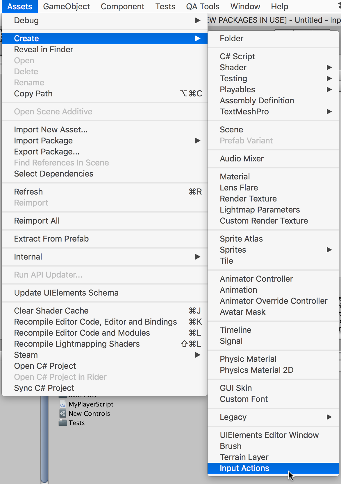
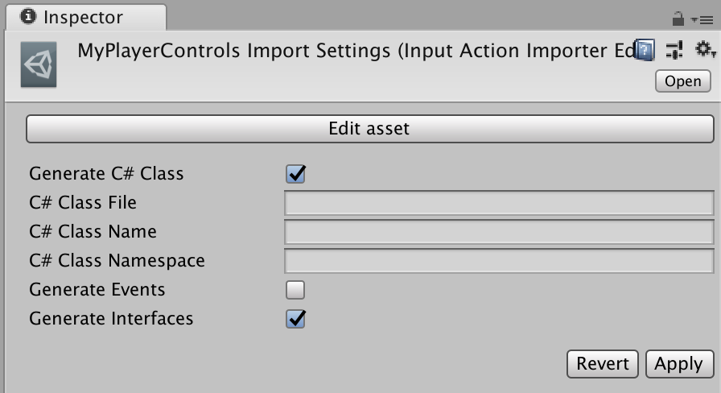

    ////TODO: make how we refer to these assets consistent across the docs

# Input Action Assets

* [Creating action assets](#creating-action-assets)
* [Editing action assets](#editing-action-assets)
* [Using action assets](#using-action-assets)

An "action asset" is an asset containing [input actions](Actions.md) as well as their associated [bindings](ActionBindings.md) and [control schemes](ActionBindings.md#control-schemes). These assets are distinguished by the `.inputactions` file extension and are stored in a plain JSON format.

## Creating Action Assets

To create an asset containing [input actions](Actions.md) in Unity, right-click in the Project window or open the `Assets` entry in Unity's main menu. From there, select `Create >> Input Actions`.



## Editing Action Assets

To bring up the action editor, double-click an `.inputactions` asset in the Project Browser click the "Edit asset" button in the inspector for the asset. Multiple action editor windows can be open concurrently (not on the same asset, though).


The action editor comes up as a separate window which can optionally be docked into Unity's main UI.

>NOTE: For details about how action maps, actions, and bindings work, see the documentation on [actions](Actions.md).

Edits made in the action asset window are not saved automatically with the project by default. To save your changes, click `Save Asset` in the window's toolbar. To discard your changes, close the window and choose "Don't Save". Alternatively, auto-saving can be toggled on by ticking the "Auto-Save" checkbox in the toolbar. This will cause any change to the asset to automatically be persisted back to disk. This setting will take effect for all `.inputactions` assets and will persist across editor sessions.

The editor window is divided into three panes.

1. The left pane lists the "action maps" in the asset. Each map is a collection of actions that can be enabled and disabled in bulk.
2. The middle pane contains the actions in the currently selection action map and the bindings associated with each action.
3. The right pane contains the properties of the currently selected action or binding.

Multiple shorts are available to provide quick access to certain common operations.

|Shortcut|Description|
|--------|-----------|


>Pro Tip: You can search quickly by devices and/or control schemes directly from the search box. "d:gamepad" filters for bindings to gamepad devices whereas "g:gamepad" filters for bindings in the gamepad control scheme. Matching is case-insensitive and will match any partial name.

### Editing Action Maps


>NOTE: Action map names should not contain slashes (`/`).

* To add a new action map, click the plus icon in the header of the action map column.
* To rename an existing map, either long-click the name or right-click the action map and select "Rename" from the context menu.
* To delete an existing map, either right-click it and select "Delete" from the context menu or use the `Delete` key (Windows) / `Cmd-Backspace` (Mac).
* To duplicate an existing map, either right-click it and select "Duplicate" or use `Ctrl-D` (Windows) / `Cmd-D` (Mac).

### Editing Actions


### Editing Bindings


#### Picking Controls


#### Editing Composite Bindings

### Editing Control Schemes


## Using Action Assets

### Auto-Generating Script Code for Actions

One of the most convenient ways to work with `.inputactions` assets in script is to generate a C# wrapper class for them automatically. This obviates the need for manually looking up actions and maps using their names and also provides easier ways for setting up callbacks.

To enable this, tick the `Generate C# Class` in the importer properties in the inspector of the `.inputactions` asset when selected in Unity and hit "Apply".

    ////TODO: Update screenshot


This will generate a C# script that makes working with the asset a lot simpler. TODO

```CSharp
using UnityEngine;
using UnityEngine.Experimental.Input;

// IGameplayActions is an interface generated from the "gameplay" action map
// we added (note that if you called the action map differently, the name of
// the interface will be different). This was triggered by the "Generate Interfaces"
// checkbox.
public class MyPlayerScript : MonoBehaviour, IGameplayActions
{
    // MyPlayerControls is the C# class that has been generated for us.
    // It wraps around a reference to the .inputactions asset we created
    // and automatically looks up all the maps and actions for us.
    public MyPlayerControls controls;

    public void Awake()
    {
        // Tell the "gameplay" action map that we want to get told about
        // when actions get triggered.
        controls.gameplay.SetCallbacks(this);
    }

    public void OnEnable()
    {
        controls.gameplay.Enable();
    }

    public void OnDisable()
    {
        controls.gameplay.Disable();
    }

    public void OnUse(InputAction.CallbackContext context)
    {
        // 'Use' code here.
    }

    public void OnMove(InputAction.CallbackContext context)
    {
        // 'Move' code here.
    }

}
```

### Using Action Assets with `PlayerInput`

### Loading Action Assets
