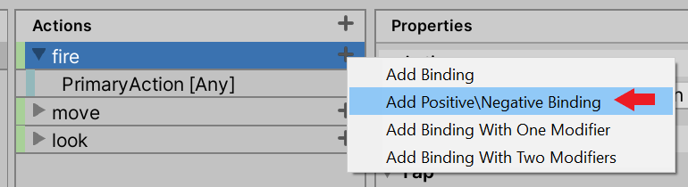
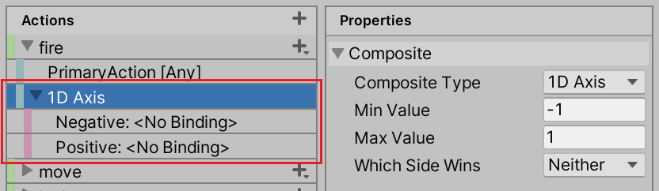
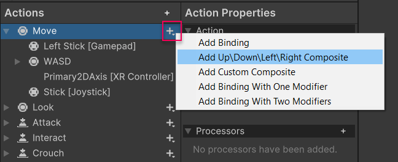
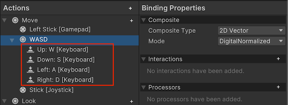
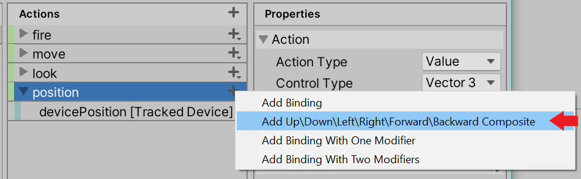
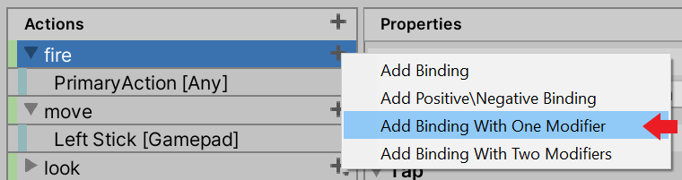
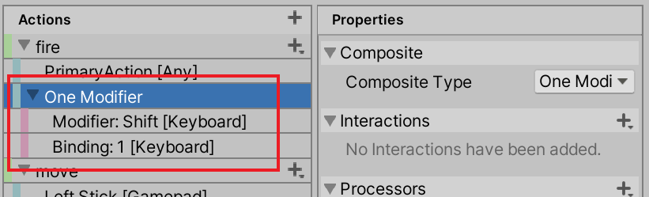
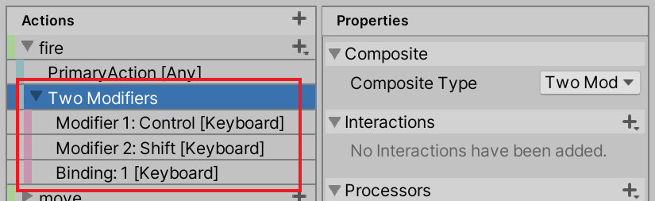
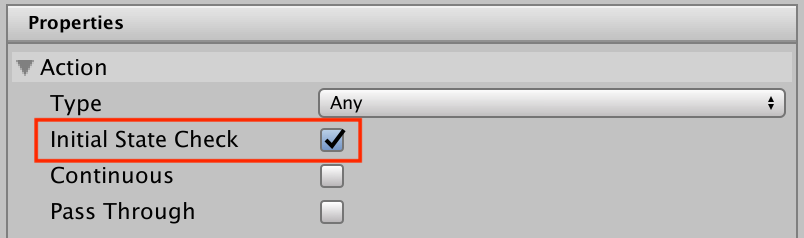

# Input Bindings

* [Composite Bindings](#composite-bindings)
  * [1D Axis](#1d-axis)
  * [2D Vector](#2d-vector)
  * [3D Vector](#3d-vector)
  * [One Modifier](#one-modifier)
  * [Two Modifiers](#two-modifiers)
  * [Writing custom Composites](#writing-custom-composites)
* [Working with Bindings](#working-with-bindings)
  * [Looking up Bindings](#looking-up-bindings)
  * [Changing Bindings](#changing-bindings)
    * [Applying overrides](#applying-overrides)
    * [Erasing Bindings](#erasing-bindings)
    * [Adding Bindings](#adding-bindings)
    * [Setting parameters](#setting-parameters)
  * [Interactive rebinding](#interactive-rebinding)
  * [Saving and loading rebinds](#saving-and-loading-rebinds)
  * [Restoring original Bindings](#restoring-original-bindings)
  * [Displaying Bindings](#displaying-bindings)
* [Control schemes](#control-schemes)
* [Details](#details)
  * [Binding resolution](#binding-resolution)
    * [Binding resolution while Actions are enabled](#binding-resolution-while-actions-are-enabled)
    * [Choosing which Devices to use](#choosing-which-devices-to-use)
  * [Conflicting inputs](#conflicting-inputs)
  * [Initial state check](#initial-state-check)

An [`InputBinding`](../api/UnityEngine.InputSystem.InputBinding.html) represents a connection between an [Action](Actions.md) and one or more [Controls](Controls.md) identified by a [Control path](Controls.md#control-paths). An Action can have an arbitrary number of Bindings pointed at it. Multiple Bindings can reference the same Control.

Each Binding has the following properties:

|Property|Description|
|--------|-----------|
|[`path`](../api/UnityEngine.InputSystem.InputBinding.html#UnityEngine_InputSystem_InputBinding_path)|[Control path](Controls.md#control-paths) that identifies the control(s) from which the Action should receive input.<br><br>Example: `"<Gamepad>/leftStick"`|
|[`overridePath`](../api/UnityEngine.InputSystem.InputBinding.html#UnityEngine_InputSystem_InputBinding_overridePath)|[Control path](Controls.md#control-paths) that overrides `path`. Unlike `path`, `overridePath` is not persistent, so you can use it to non-destructively override the path on a Binding. If it is set to something other than null, it takes effect and overrides `path`.  To get the path which is currently in effect (that is, either `path` or `overridePath`), you can query the [`effectivePath`](../api/UnityEngine.InputSystem.InputBinding.html#UnityEngine_InputSystem_InputBinding_effectivePath) property.|
|[`action`](../api/UnityEngine.InputSystem.InputBinding.html#UnityEngine_InputSystem_InputBinding_action)|The name or ID of the Action that the Binding should trigger. Note that this can be null or empty (for instance, for  [composites](#composite-bindings)). Not case-sensitive.<br><br>Example: `"fire"`|
|[`groups`](../api/UnityEngine.InputSystem.InputBinding.html#UnityEngine_InputSystem_InputBinding_groups)|A semicolon-separated list of Binding groups that the Binding belongs to. Can be null or empty. Binding groups can be anything, but are mostly used for [Control Schemes](#control-schemes). Not case-sensitive.<br><br>Example: `"Keyboard&Mouse;Gamepad"`|
|[`interactions`](../api/UnityEngine.InputSystem.InputBinding.html#UnityEngine_InputSystem_InputBinding_interactions)|A semicolon-separated list of [Interactions](Interactions.md) to apply to input on this Binding. Note that Unity appends Interactions applied to the [Action](Actions.md) itself (if any) to this list. Not case-sensitive.<br><br>Example: `"slowTap;hold(duration=0.75)"`|
|[`processors`](../api/UnityEngine.InputSystem.InputBinding.html#UnityEngine_InputSystem_InputBinding_processors)|A semicolon-separated list of [Processors](Processors.md) to apply to input on this Binding. Note that Unity appends Processors applied to the [Action](Actions.md) itself (if any) to this list. Not case-sensitive.<br><br>Processors on Bindings apply in addition to Processors on Controls that are providing values. For example, if you put a `stickDeadzone` Processor on a Binding and then bind it to `<Gamepad>/leftStick`, you get deadzones applied twice: once from the deadzone Processor sitting on the `leftStick` Control, and once from the Binding.<br><br>Example: `"invert;axisDeadzone(min=0.1,max=0.95)"`|
|[`id`](../api/UnityEngine.InputSystem.InputBinding.html#UnityEngine_InputSystem_InputBinding_id)|Unique ID of the Binding. You can use it to identify the Binding when storing Binding overrides in user settings, for example.|
|[`name`](../api/UnityEngine.InputSystem.InputBinding.html#UnityEngine_InputSystem_InputBinding_name)|Optional name of the Binding. Identifies part names inside [Composites](#composite-bindings).<br><br>Example: `"Positive"`|
|[`isComposite`](../api/UnityEngine.InputSystem.InputBinding.html#UnityEngine_InputSystem_InputBinding_isComposite)|Whether the Binding acts as a [Composite](#composite-bindings).|
|[`isPartOfComposite`](../api/UnityEngine.InputSystem.InputBinding.html#UnityEngine_InputSystem_InputBinding_isPartOfComposite)|Whether the Binding is part of a [Composite](#composite-bindings).|

To query the Bindings to a particular Action, you can use [`InputAction.bindings`](../api/UnityEngine.InputSystem.InputAction.html#UnityEngine_InputSystem_InputAction_bindings). To query a flat list of Bindings for all Actions in an Action Map, you can use [`InputActionMap.bindings`](../api/UnityEngine.InputSystem.InputActionMap.html#UnityEngine_InputSystem_InputActionMap_bindings).

## Composite Bindings

Sometimes, you might want to have several Controls act in unison to mimic a different type of Control. The most common example of this is using the W, A, S, and D keys on the keyboard to form a 2D vector Control equivalent to mouse deltas or gamepad sticks. Another example is to use two keys to form a 1D axis equivalent to a mouse scroll axis.

This is difficult to implement with normal Bindings. You can bind a  [`ButtonControl`](../api/UnityEngine.InputSystem.Controls.ButtonControl.html) to an action expecting a `Vector2`, but doing so results in an exception at runtime when the Input System tries to read a `Vector2` from a Control that can deliver only a `float`.

Composite Bindings (that is, Bindings that are made up of other Bindings) solve this problem. Composites themselves don't bind directly to Controls; instead, they source values from other Bindings that do, and then synthesize input on the fly from those values.

To see how to create Composites in the editor UI, see documentation on [editing Composite Bindings](ActionAssets.md#editing-composite-bindings).

To create composites in code, you can use the [`AddCompositeBinding`](../api/UnityEngine.InputSystem.InputActionSetupExtensions.html#UnityEngine_InputSystem_InputActionSetupExtensions_AddCompositeBinding_UnityEngine_InputSystem_InputAction_System_String_System_String_System_String_) syntax.

```CSharp
myAction.AddCompositeBinding("Axis")
    .With("Positive", "<Gamepad>/rightTrigger")
    .With("Negative", "<Gamepad>/leftTrigger");
```

Each Composite consists of one Binding that has [`InputBinding.isComposite`](../api/UnityEngine.InputSystem.InputBinding.html#UnityEngine_InputSystem_InputBinding_isComposite) set to true, followed by one or more Bindings that have [`InputBinding.isPartOfComposiste`](../api/UnityEngine.InputSystem.InputBinding.html#UnityEngine_InputSystem_InputBinding_isPartOfComposite) set to true. In other words, several consecutive entries in [`InputActionMap.bindings`](../api/UnityEngine.InputSystem.InputActionMap.html#UnityEngine_InputSystem_InputActionMap_bindings) or [`InputAction.bindings`](../api/UnityEngine.InputSystem.InputAction.html#UnityEngine_InputSystem_InputAction_bindings) together form a Composite.

Note that each composite part can be bound arbitrary many times.

```CSharp
// Make both shoulders and triggers pull on the axis.
myAction.AddCompositeBinding("Axis")
    .With("Positive", "<Gamepad>/rightTrigger")
    .With("Positive", "<Gamepad>/rightShoulder")
    .With("Negative", "<Gamepad>/leftTrigger");
    .With("Negative", "<Gamepad>/leftShoulder");
```

Composites can have parameters, just like [Interactions](Interactions.md) and [Processors](Processors.md).

```CSharp
myAction.AddCompositeBinding("Axis(whichSideWins=1)");
```

There are currently five Composite types that come with the system out of the box: [1D-Axis](#1d-axis), [2D-Vector](#2d-vector), [3D-Vector](#3d-vector), [One Modifier](#one-modifier) and [Two Modifiers](#two-modifiers). Additionally, you can [add your own](#writing-custom-composites) types of Composites.

### 1D axis





A Composite made of two buttons: one that pulls a 1D axis in its negative direction, and another that pulls it in its positive direction. Implemented in the [`AxisComposite`](../api/UnityEngine.InputSystem.Composites.AxisComposite.html) class. The result is a `float`.

```CSharp
myAction.AddCompositeBinding("1DAxis") // Or just "Axis"
    .With("Positive", "<Gamepad>/rightTrigger")
    .With("Negative", "<Gamepad>/leftTrigger");
```

The axis Composite has two part bindings.

|Part|Type|Description|
|----|----|-----------|
|[`positive`](../api/UnityEngine.InputSystem.Composites.AxisComposite.html#UnityEngine_InputSystem_Composites_AxisComposite_positive)|`Button`|Controls pulling in the positive direction (towards [`maxValue`](../api/UnityEngine.InputSystem.Composites.AxisComposite.html#UnityEngine_InputSystem_Composites_AxisComposite_maxValue)).|
|[`negative`](../api/UnityEngine.InputSystem.Composites.AxisComposite.html#UnityEngine_InputSystem_Composites_AxisComposite_negative)|`Button`|Controls pulling in the negative direction, (towards [`minValue`](../api/UnityEngine.InputSystem.Composites.AxisComposite.html#UnityEngine_InputSystem_Composites_AxisComposite_minValue)).|

You can set the following parameters on an axis Composite:

|Parameter|Description|
|---------|-----------|
|[`whichSideWins`](../api/UnityEngine.InputSystem.Composites.AxisComposite.html#UnityEngine_InputSystem_Composites_AxisComposite_whichSideWins)|What happens if both [`positive`](../api/UnityEngine.InputSystem.Composites.AxisComposite.html#UnityEngine_InputSystem_Composites_AxisComposite_positive) and [`negative`](../api/UnityEngine.InputSystem.Composites.AxisComposite.html#UnityEngine_InputSystem_Composites_AxisComposite_negative) are actuated. See table below.|
|[`minValue`](../api/UnityEngine.InputSystem.Composites.AxisComposite.html#UnityEngine_InputSystem_Composites_AxisComposite_minValue)|The value returned if the [`negative`](../api/UnityEngine.InputSystem.Composites.AxisComposite.html#UnityEngine_InputSystem_Composites_AxisComposite_negative) side is actuated. Default is -1.|
|[`maxValue`](../api/UnityEngine.InputSystem.Composites.AxisComposite.html#UnityEngine_InputSystem_Composites_AxisComposite_maxValue)|The value returned if the [`positive`](../api/UnityEngine.InputSystem.Composites.AxisComposite.html#UnityEngine_InputSystem_Composites_AxisComposite_positive) side is actuated. Default is 1.|

If Controls from both the `positive` and the `negative` side are actuated, then the resulting value of the axis Composite depends on the `whichSideWin` parameter setting.

|[`WhichSideWins`](../api/UnityEngine.InputSystem.Composites.AxisComposite.WhichSideWins.html)|Description|
|---------------|-----------|
|(0) `Neither`|Neither side has precedence. The Composite returns the midpoint between `minValue` and `maxValue` as a result. At their default settings, this is 0.<br><br>This is the default value for this setting.|
|(1) `Positive`|The positive side has precedence and the Composite returns `maxValue`.|
|(2) `Negative`|The negative side has precedence and the Composite returns `minValue`.|

>__Note__: There is no support yet for interpolating between the positive and negative over time.

### 2D vector





A Composite that represents a 4-way button setup like the D-pad on gamepads. Each button represents a cardinal direction. Implemented in the [`Vector2Composite`](../api/UnityEngine.InputSystem.Composites.Vector2Composite.html) class. The result is a `Vector2`.

This Composite is most useful for representing up-down-left-right controls, such as WASD keyboard input.

```CSharp
myAction.AddCompositeBinding("2DVector") // Or "Dpad"
    .With("Up", "<Keyboard>/w")
    .With("Down", "<Keyboard>/s")
    .With("Left", "<Keyboard>/a")
    .With("Right", "<Keyboard>/d");

// To set mode (2=analog, 1=digital, 0=digitalNormalized):
myAction.AddCompositeBinding("2DVector(mode=2)")
    .With("Up", "<Gamepad>/leftStick/up")
    .With("Down", "<Gamepad>/leftStick/down")
    .With("Left", "<Gamepad>/leftStick/left")
    .With("Right", "<Gamepad>/leftStick/right");
```

The 2D vector Composite has four part Bindings.

|Part|Type|Description|
|----|----|-----------|
|[`up`](../api/UnityEngine.InputSystem.Composites.Vector2Composite.html#UnityEngine_InputSystem_Composites_Vector2Composite_up)|`Button`|Controls representing `(0,1)` (+Y).|
|[`down`](../api/UnityEngine.InputSystem.Composites.Vector2Composite.html#UnityEngine_InputSystem_Composites_Vector2Composite_down)|`Button`|Controls representing `(0,-1)` (-Y).|
|[`left`](../api/UnityEngine.InputSystem.Composites.Vector2Composite.html#UnityEngine_InputSystem_Composites_Vector2Composite_left)|`Button`|Controls representing `(-1,0)` (-X).|
|[`right`](../api/UnityEngine.InputSystem.Composites.Vector2Composite.html#UnityEngine_InputSystem_Composites_Vector2Composite_right)|`Button`|Controls representing `(1,0)` (+X).|

In addition, you can set the following parameters on a 2D vector Composite:

|Parameter|Description|
|---------|-----------|
|[`mode`](../api/UnityEngine.InputSystem.Composites.Vector2Composite.html#UnityEngine_InputSystem_Composites_Vector2Composite_mode)|Whether to treat the inputs as digital or as analog controls.<br><br>If this is set to [`Mode.DigitalNormalized`](../api/UnityEngine.InputSystem.Composites.Vector2Composite.Mode.html#UnityEngine_InputSystem_Composites_Vector2Composite_Mode_DigitalNormalized), inputs are treated as buttons (off if below [`defaultButtonPressPoint`](../api/UnityEngine.InputSystem.InputSettings.html#UnityEngine_InputSystem_InputSettings_defaultButtonPressPoint) and on if equal to or greater). Each input is 0 or 1 depending on whether the button is pressed or not. The vector resulting from the up/down/left/right parts is normalized. The result is a diamond-shaped 2D input range.<br><br>If this is set to [`Mode.Digital`](../api/UnityEngine.InputSystem.Composites.Vector2Composite.Mode.html#UnityEngine_InputSystem_Composites_Vector2Composite_Mode_Digital), the behavior is essentially the same as [`Mode.DigitalNormalized`](../api/UnityEngine.InputSystem.Composites.Vector2Composite.Mode.html#UnityEngine_InputSystem_Composites_Vector2Composite_Mode_DigitalNormalized) except that the resulting vector is not normalized.<br><br>Finally, if this is set to [`Mode.Analog`](../api/UnityEngine.InputSystem.Composites.Vector2Composite.Mode.html#UnityEngine_InputSystem_Composites_Vector2Composite_Mode_Analog), inputs are treated as analog (i.e. full floating-point values) and, other than [`down`](../api/UnityEngine.InputSystem.Composites.Vector2Composite.html#UnityEngine_InputSystem_Composites_Vector2Composite_down) and [`left`](../api/UnityEngine.InputSystem.Composites.Vector2Composite.html#UnityEngine_InputSystem_Composites_Vector2Composite_left) being inverted, values will be passed through as is.<br><br>The default is [`Mode.DigitalNormalized`](../api/UnityEngine.InputSystem.Composites.Vector2Composite.Mode.html#UnityEngine_InputSystem_Composites_Vector2Composite_Mode_DigitalNormalized).|

>__Note__: There is no support yet for interpolating between the up/down/left/right over time.

### 3D vector




A Composite that represents a 6-way button where two combinations each control one axis of a 3D vector. Implemented in the [`Vector3Composite`](../api/UnityEngine.InputSystem.Composites.Vector3Composite.html) class. The result is a `Vector3`.

```CSharp
myAction.AddCompositeBinding("3DVector")
    .With("Up", "<Keyboard>/w")
    .With("Down", "<Keyboard>/s")
    .With("Left", "<Keyboard>/a")
    .With("Right", "<Keyboard>/d");

// To set mode (2=analog, 1=digital, 0=digitalNormalized):
myAction.AddCompositeBinding("3DVector(mode=2)")
    .With("Up", "<Gamepad>/leftStick/up")
    .With("Down", "<Gamepad>/leftStick/down")
    .With("Left", "<Gamepad>/leftStick/left")
    .With("Right", "<Gamepad>/leftStick/right");
```

The 3D vector Composite has four part Bindings.

|Part|Type|Description|
|----|----|-----------|
|[`up`](../api/UnityEngine.InputSystem.Composites.Vector3Composite.html#UnityEngine_InputSystem_Composites_Vector3Composite_up)|`Button`|Controls representing `(0,1,0)` (+Y).|
|[`down`](../api/UnityEngine.InputSystem.Composites.Vector3Composite.html#UnityEngine_InputSystem_Composites_Vector3Composite_down)|`Button`|Controls representing `(0,-1,0)` (-Y).|
|[`left`](../api/UnityEngine.InputSystem.Composites.Vector3Composite.html#UnityEngine_InputSystem_Composites_Vector3Composite_left)|`Button`|Controls representing `(-1,0,0)` (-X).|
|[`right`](../api/UnityEngine.InputSystem.Composites.Vector3Composite.html#UnityEngine_InputSystem_Composites_Vector3Composite_right)|`Button`|Controls representing `(1,0,0)` (+X).|
|[`forward`](../api/UnityEngine.InputSystem.Composites.Vector3Composite.html#UnityEngine_InputSystem_Composites_Vector3Composite_forward)|`Button`|Controls representing `(0,0,1)` (+Z).|
|[`backward`](../api/UnityEngine.InputSystem.Composites.Vector3Composite.html#UnityEngine_InputSystem_Composites_Vector3Composite_backward)|`Button`|Controls representing `(0,0,-1)` (-Z).|

In addition, you can set the following parameters on a 3D vector Composite:

|Parameter|Description|
|---------|-----------|
|[`mode`](../api/UnityEngine.InputSystem.Composites.Vector3Composite.html#UnityEngine_InputSystem_Composites_Vector3Composite_mode)|Whether to treat the inputs as digital or as analog controls.<br><br>If this is set to [`Mode.DigitalNormalized`](../api/UnityEngine.InputSystem.Composites.Vector3Composite.Mode.html#UnityEngine_InputSystem_Composites_Vector3Composite_Mode_DigitalNormalized), inputs are treated as buttons (off if below [`defaultButtonPressPoint`](../api/UnityEngine.InputSystem.InputSettings.html#UnityEngine_InputSystem_InputSettings_defaultButtonPressPoint) and on if equal to or greater). Each input is 0 or 1 depending on whether the button is pressed or not. The vector resulting from the up/down/left/right/forward/backward parts is normalized.<br><br>If this is set to [`Mode.Digital`](../api/UnityEngine.InputSystem.Composites.Vector3Composite.Mode.html#UnityEngine_InputSystem_Composites_Vector3Composite_Mode_Digital), the behavior is essentially the same as [`Mode.DigitalNormalized`](../api/UnityEngine.InputSystem.Composites.Vector3Composite.Mode.html#UnityEngine_InputSystem_Composites_Vector3Composite_Mode_DigitalNormalized) except that the resulting vector is not normalized.<br><br>Finally, if this is set to [`Mode.Analog`](../api/UnityEngine.InputSystem.Composites.Vector3Composite.Mode.html#UnityEngine_InputSystem_Composites_Vector3Composite_Mode_Analog), inputs are treated as analog (that is, full floating-point values) and, other than [`down`](../api/UnityEngine.InputSystem.Composites.Vector3Composite.html#UnityEngine_InputSystem_Composites_Vector3Composite_down), [`left`](../api/UnityEngine.InputSystem.Composites.Vector3Composite.html#UnityEngine_InputSystem_Composites_Vector3Composite_left), and [`backward`](../api/UnityEngine.InputSystem.Composites.Vector3Composite.html#UnityEngine_InputSystem_Composites_Vector3Composite_backward) being inverted, values will be passed through as they are.<br><br>The default is [`Analog`](../api/UnityEngine.InputSystem.Composites.Vector3Composite.Mode.html#UnityEngine_InputSystem_Composites_Vector3Composite_Mode_Analog).|

### One Modifier





A Composite that requires the user to hold down a "modifier" button in addition to another control from which the actual value of the Binding is determined. This can be used, for example, for Bindings such as "SHIFT+1". Implemented in the [`OneModifierComposite`](../api/UnityEngine.InputSystem.Composites.OneModifierComposite.html) class. The buttons can be on any Device, and can be toggle buttons or full-range buttons such as gamepad triggers.

The result is a value of the same type as the controls bound to the [`binding`](../api/UnityEngine.InputSystem.Composites.OneModifierComposite.html#UnityEngine_InputSystem_Composites_OneModifierComposite_binding) part.

```CSharp
// Add binding for "CTRL+1".
myAction.AddCompositeBinding("OneModifier")
    .With("Binding", "<Keyboard>/1")
    .With("Modifier", "<Keyboard>/ctrl")

// Add binding to mouse delta such that it only takes effect
// while the ALT key is down.
myAction.AddCompositeBinding("OneModifier")
    .With("Binding", "<Mouse>/delta")
    .With("Modifier", "<Keyboard>/alt");
```

The button with one modifier Composite has two part Bindings.

|Part|Type|Description|
|----|----|-----------|
|[`modifier`](../api/UnityEngine.InputSystem.Composites.OneModifierComposite.html#UnityEngine_InputSystem_Composites_OneModifierComposite_modifier)|`Button`|Modifier that has to be held for `binding` to come through. If the user holds any of the buttons bound to the `modifier` at the same time as the button that triggers the action, the Composite assumes the value of the `modifier` Binding. If the user does not press any button bound to the `modifier`, the Composite remains at default value.|
|[`binding`](../api/UnityEngine.InputSystem.Composites.OneModifierComposite.html#UnityEngine_InputSystem_Composites_OneModifierComposite_binding)|Any|The control(s) whose value the Composite assumes while the user holds down the `modifier` button.|

This Composite has no parameters.

### Two Modifiers




A Composite that requires the user to hold down two "modifier" buttons in addition to another control from which the actual value of the Binding is determined. This can be used, for example, for Bindings such as "SHIFT+CTRL+1". Implemented in the [`TwoModifiersComposite`](../api/UnityEngine.InputSystem.Composites.TwoModifiersComposite.html) class. The buttons can be on any Device, and can be toggle buttons or full-range buttons such as gamepad triggers.

The result is a value of the same type as the controls bound to the [`binding`](../api/UnityEngine.InputSystem.Composites.TwoModifiersComposite.html#UnityEngine_InputSystem_Composites_TwoModifiersComposite_binding) part.

```CSharp
myAction.AddCompositeBinding("TwoModifiers")
    .With("Button", "<Keyboard>/1")
    .With("Modifier1", "<Keyboard>/leftCtrl")
    .With("Modifier1", "<Keyboard>/rightCtrl")
    .With("Modifier2", "<Keyboard>/leftShift")
    .With("Modifier2", "<Keyboard>/rightShift");
```

The button with two modifiers Composite has three part Bindings.

|Part|Type|Description|
|----|----|-----------|
|[`modifier1`](../api/UnityEngine.InputSystem.Composites.TwoModifiersComposite.html#UnityEngine_InputSystem_Composites_TwoModifiersComposite_modifier1)|`Button`|The first modifier the user must hold alongside `modifier2`, for `binding` to come through. If the user does not press any button bound to the `modifier1`, the Composite remains at default value.|
|[`modifier2`](../api/UnityEngine.InputSystem.Composites.TwoModifiersComposite.html#UnityEngine_InputSystem_Composites_TwoModifiersComposite_modifier2)|`Button`|The second modifier the user must hold alongside `modifier1`, for `binding` to come through. If the user does not press any button bound to the `modifier2`, the Composite remains at default value.|
|[`binding`](../api/UnityEngine.InputSystem.Composites.TwoModifiersComposite.html#UnityEngine_InputSystem_Composites_TwoModifiersComposite_binding)|Any|The control(s) whose value the Composite assumes while the user presses both `modifier1` and `modifier2` at the same time.|

This Composite has no parameters.

### Writing custom Composites

You can define new types of Composites, and register them with the API. Unity treats these the same as predefined types, which the Input System internally defines and registers in the same way.

To define a new type of Composite, create a class based on [`InputBindingComposite<TValue>`](../api/UnityEngine.InputSystem.InputBindingComposite-1.html).

> __IMPORTANT__: Composites must be __stateless__. This means that you cannot store local state that changes depending on the input being processed. For __stateful__ processing on Bindings, see [interactions](./Interactions.md#writing-custom-interactions).

```CSharp
// Use InputBindingComposite<TValue> as a base class for a composite that returns
// values of type TValue.
// NOTE: It is possible to define a composite that returns different kinds of values
//       but doing so requires deriving directly from InputBindingComposite.
#if UNITY_EDITOR
[InitializeOnLoad] // Automatically register in editor.
#endif
// Determine how GetBindingDisplayString() formats the composite by applying
// the  DisplayStringFormat attribute.
[DisplayStringFormat("{firstPart}+{secondPart}")]
public class CustomComposite : InputBindingComposite<float>
{
    // Each part binding is represented as a field of type int and annotated with
    // InputControlAttribute. Setting "layout" restricts the controls that
    // are made available for picking in the UI.
    //
    // On creation, the int value is set to an integer identifier for the binding
    // part. This identifier can read values from InputBindingCompositeContext.
    // See ReadValue() below.
    [InputControl(layout = "Button")]
    public int firstPart;

    [InputControl(layout = "Button")]
    public int secondPart;

    // Any public field that is not annotated with InputControlAttribute is considered
    // a parameter of the composite. This can be set graphically in the UI and also
    // in the data (e.g. "custom(floatParameter=2.0)").
    public float floatParameter;
    public bool boolParameter;

    // This method computes the resulting input value of the composite based
    // on the input from its part bindings.
    public override float ReadValue(ref InputBindingCompositeContext context)
    {
        var firstPartValue = context.ReadValue<float>(firstPart);
        var secondPartValue = context.ReadValue<float>(secondPart);

        //... do some processing and return value
    }

    // This method computes the current actuation of the binding as a whole.
    public override float EvaluateMagnitude(ref InputBindingCompositeContext context)
    {
        // Compute normalized [0..1] magnitude value for current actuation level.
    }

    static CustomComposite()
    {
        // Can give custom name or use default (type name with "Composite" clipped off).
        // Same composite can be registered multiple times with different names to introduce
        // aliases.
        //
        // NOTE: Registering from the static constructor using InitializeOnLoad and
        //       RuntimeInitializeOnLoadMethod is only one way. You can register the
        //       composite from wherever it works best for you. Note, however, that
        //       the registration has to take place before the composite is first used
        //       in a binding. Also, for the composite to show in the editor, it has
        //       to be registered from code that runs in edit mode.
        InputSystem.RegisterBindingComposite<CustomComposite>();
    }

    [RuntimeInitializeOnLoadMethod(RuntimeInitializeLoadType.BeforeSceneLoad)]
    static void Init() {} // Trigger static constructor.
}
```

The Composite should now appear in the editor UI when you add a Binding, and you can now use it in scripts.

```CSharp
    myAction.AddCompositeBinding("custom(floatParameter=2.0)")
        .With("firstpart", "<Gamepad>/buttonSouth")
        .With("secondpart", "<Gamepad>/buttonNorth");
```

To define a custom parameter editor for the Composite, you can derive from  [`InputParameterEditor<TObject>`](../api/UnityEngine.InputSystem.Editor.InputParameterEditor-1.html).

```CSharp
#if UNITY_EDITOR
public class CustomParameterEditor : InputParameterEditor<CustomComposite>
{
    public override void OnGUI()
    {
        EditorGUILayout.Label("Custom stuff");
        target.floatParameter = EditorGUILayout.FloatField("Some Parameter", target.floatParameter);
    }
}
#endif
```

## Working with Bindings

## Looking up Bindings

You can retrieve the bindings of an action using its [`InputAction.bindings`](../api/UnityEngine.InputSystem.InputAction.html#UnityEngine_InputSystem_InputAction_bindings) property which returns a read-only array of [`InputBinding`](../api/UnityEngine.InputSystem.InputBinding.html) structs.

```CSharp
    // Get bindings of "fire" action.
    var fireBindings = playerInput.actions["fire"].bindings;
```

Also, all the bindings for all actions in an [`InputActionMap`](../api/UnityEngine.InputSystem.InputActionMap.html) are made available through the [`InputActionMap.bindings`](../api/UnityEngine.InputSystem.InputActionMap.html#UnityEngine_InputSystem_InputActionMap_bindings) property. The bindings are associated with actions through an [action ID](../api/UnityEngine.InputSystem.InputAction.html#UnityEngine_InputSystem_InputAction_id) or [action name](../api/UnityEngine.InputSystem.InputAction.html#UnityEngine_InputSystem_InputAction_name) stored in the [`InputBinding.action`](../api/UnityEngine.InputSystem.InputBinding.html#UnityEngine_InputSystem_InputBinding_action) property.

```CSharp
    // Get all bindings in "gameplay" action map.
    var gameplayBindings = playerInput.actions.FindActionMap("gameplay").bindings;
```

You can also look up specific the indices of specific bindings in [`InputAction.bindings`](../api/UnityEngine.InputSystem.InputAction.html#UnityEngine_InputSystem_InputAction_bindings) using the [`InputActionRebindingExtensions.GetBindingIndex`](../api/UnityEngine.InputSystem.InputActionRebindingExtensions.html#UnityEngine_InputSystem_InputActionRebindingExtensions_GetBindingIndex_UnityEngine_InputSystem_InputAction_UnityEngine_InputSystem_InputBinding_) method.

```CSharp
    // Find the binding in the "Keyboard" control scheme.
    playerInput.actions["fire"].GetBindingIndex(group: "Keyboard");

    // Find the first binding to the space key in the "gameplay" action map.
    playerInput.FindActionMap("gameplay").GetBindingIndex(
        new InputBinding { path = "<Keyboard>/space" });
```

Finally, you can look up the binding that corresponds to a specific control through [`GetBindingIndexForControl`](../api/UnityEngine.InputSystem.InputActionRebindingExtensions.html#UnityEngine_InputSystem_InputActionRebindingExtensions_GetBindingIndexForControl_). This way, you can, for example, map a control found in the [`controls`](../api/UnityEngine.InputSystem.InputAction.html#UnityEngine_InputSystem_InputAction_controls) array of an [`InputAction`](../api/UnityEngine.InputSystem.InputAction.html) back to an [`InputBinding`](../api/UnityEngine.InputSystem.InputBinding.html).

```CSharp
    // Find the binding that binds LMB to "fire". If there is no such binding,
    // bindingIndex will be -1.
    var fireAction = playerInput.actions["fire"];
    var bindingIndex = fireAction.GetBindingIndexForControl(Mouse.current.leftButton);
    if (binding == -1)
        Debug.Log("Fire is not bound to LMB of the current mouse.");
```

## Changing Bindings

In general, you can change existing bindings via the [`InputActionSetupExtensions.ChangeBinding`](../api/UnityEngine.InputSystem.InputActionSetupExtensions.html#UnityEngine_InputSystem_InputActionSetupExtensions_ChangeBinding_UnityEngine_InputSystem_InputAction_System_Int32_) method. This returns an accessor that can be used to modify the properties of the targeted [`InputBinding`](../api/UnityEngine.InputSystem.InputBinding.html). Note that most of the write operations of the accessor are destructive. For non-destructive changes to bindings, see [Applying Overrides](#applying-overrides).

```CSharp
// Get write access to the second binding of the 'fire' action.
var accessor = playerInput.actions['fire'].ChangeBinding(1);

// You can also gain access through the InputActionMap. Each
// map contains an array of all its bindings (see InputActionMap.bindings).
// Here we gain access to the third binding in the map.
accessor = playerInput.actions.FindActionMap("gameplay").ChangeBinding(2);
```

You can use the resulting accessor to modify properties through methods such as [`WithPath`](../api/UnityEngine.InputSystem.InputActionSetupExtensions.BindingSyntax.html#UnityEngine_InputSystem_InputActionSetupExtensions_BindingSyntax_WithPath_) or [`WithProcessors`](../api/UnityEngine.InputSystem.InputActionSetupExtensions.BindingSyntax.html#UnityEngine_InputSystem_InputActionSetupExtensions_BindingSyntax_WithProcessors_).

```CSharp
playerInput.actions["fire"].ChangeBinding(1)
    // Change path to space key.
    .WithPath("<Keyboard>/space");
```

You can also use the accessor to iterate through bindings using [`PreviousBinding`](../api/UnityEngine.InputSystem.InputActionSetupExtensions.BindingSyntax.html#UnityEngine_InputSystem_InputActionSetupExtensions_BindingSyntax_PreviousBinding_) and [`NextBinding`](../api/UnityEngine.InputSystem.InputActionSetupExtensions.BindingSyntax.html#UnityEngine_InputSystem_InputActionSetupExtensions_BindingSyntax_NextBinding_).

```CSharp
// Move accessor to previous binding.
accessor = accessor.PreviousBinding();

// Move accessor to next binding.
accessor = accessor.NextBinding();
```

If the given binding is a [composite](../api/UnityEngine.InputSystem.InputBinding.html#UnityEngine_InputSystem_InputBinding_isComposite), you can address it by its name rather than by index.

```CSharp
// Change the 2DVector composite of the "move" action.
playerInput.actions["move"].ChangeCompositeBinding("2DVector")


//
playerInput.actions["move"].ChangeBinding("WASD")
```

### Applying overrides

You can override aspects of any Binding at run-time non-destructively. Specific properties of [`InputBinding`](../api/UnityEngine.InputSystem.InputBinding.html) have an `override` variant that, if set, will take precedent over the property that they shadow.  All `override` properties are of type `String`.

|Property|Override|Description|
|--------|--------|-----------|
|[`path`](../api/UnityEngine.InputSystem.InputBinding.html#UnityEngine_InputSystem_InputBinding_path)|[`overridePath`](../api/UnityEngine.InputSystem.InputBinding.html#UnityEngine_InputSystem_InputBinding_overridePath)|Replaces the [Control path](./Controls.md#control-paths) that determines which Control(s) are referenced in the binding. If [`overridePath`](../api/UnityEngine.InputSystem.InputBinding.html#UnityEngine_InputSystem_InputBinding_overridePath) is set to an empty string, the binding is effectively disabled.<br><br>Example: `"<Gamepad>/leftStick"`|
|[`processors`](../api/UnityEngine.InputSystem.InputBinding.html#UnityEngine_InputSystem_InputBinding_processors)|[`overrideProcessors`](../api/UnityEngine.InputSystem.InputBinding.html#UnityEngine_InputSystem_InputBinding_overrideProcessors)|Replaces the [processors](./Processors.md) applied to the binding.<br><br>Example: `"invert,normalize(min=0,max=10)"`|
|[`interactions`](../api/UnityEngine.InputSystem.InputBinding.html#UnityEngine_InputSystem_InputBinding_interactions)|[`overrideInteractions`](../api/UnityEngine.InputSystem.InputBinding.html#UnityEngine_InputSystem_InputBinding_overrideInteractions)|Replaces the [interactions](./Interactions.md) applied to the binding.<br><br>Example: `"tap(duration=0.5)"`|

>NOTE: The `override` property values will not be saved along with the Actions (for example, when calling [`InputActionAsset.ToJson()`](../api/UnityEngine.InputSystem.InputActionAsset.html#UnityEngine_InputSystem_InputActionAsset_ToJson)). See [Saving and loading rebinds](#saving-and-loading-rebinds) for details about how to persist user rebinds.

To set the various `override` properties, you can use the [`ApplyBindingOverride`](../api/UnityEngine.InputSystem.InputActionRebindingExtensions.html#UnityEngine_InputSystem_InputActionRebindingExtensions_ApplyBindingOverride_UnityEngine_InputSystem_InputAction_UnityEngine_InputSystem_InputBinding_) APIs.

```CSharp
// Rebind the "fire" action to the left trigger on the gamepad.
playerInput.actions["fire"].ApplyBindingOverride("<Gamepad>/leftTrigger");
```

In most cases, it is best to locate specific bindings using APIs such as [`GetBindingIndexForControl`](../api/UnityEngine.InputSystem.InputActionRebindingExtensions.html#UnityEngine_InputSystem_InputActionRebindingExtensions_GetBindingIndexForControl_) and to then apply the override to that specific binding.

```CSharp
// Find the "Jump" binding for the space key.
var jumpAction = playerInput.actions["Jump"];
var bindingIndex = jumpAction.GetBindingIndexForControl(Keyboard.current.spaceKey);

// And change it to the enter key.
jumpAction.ApplyBindingOverride(bindingIndex, "<Keyboard>/enter");
```

### Erasing Bindings

You can erase a binding by calling [`Erase`](../api/UnityEngine.InputSystem.InputActionSetupExtensions.BindingSyntax.html#UnityEngine_InputSystem_InputActionSetupExtensions_BindingSyntax_Erase_) on the [binding accessor](../api/UnityEngine.InputSystem.InputActionSetupExtensions.BindingSyntax.html).

```CSharp
// Erase first binding on "fire" action.
playerInput.actions["fire"].ChangeBinding(0).Erase();

// Erase "2DVector" composite. This will also erase the part
// bindings of the composite.
playerInput.actions["move"].ChangeCompositeBinding("2DVector").Erase();

// Can also do this by using the name given to the composite binding.
playerInput.actions["move"].ChangeCompositeBinding("WASD").Erase();

// Erase first binding in "gameplay" action map.
playerInput.actions.FindActionMap("gameplay").ChangeBinding(0).Erase();
```

### Adding Bindings

New bindings can be added to an Action using [`AddAction`](../api/UnityEngine.InputSystem.InputActionSetupExtensions.html#UnityEngine_InputSystem_InputActionSetupExtensions_AddBinding_UnityEngine_InputSystem_InputAction_System_String_System_String_System_String_System_String_) or [`AddCompositeBinding`](../api/UnityEngine.InputSystem.InputActionSetupExtensions.html#UnityEngine_InputSystem_InputActionSetupExtensions_AddCompositeBinding_UnityEngine_InputSystem_InputAction_System_String_System_String_System_String_).

```CSharp
// Add a binding for the left mouse button to the "fire" action.
playerInput.actions["fire"].AddBinding("<Mouse>/leftButton");

// Add a WASD composite binding to the "move" action.
playerInput.actions["move"]
    .AddCompositeBinding("2DVector")
        .With("Up", "<Keyboard>/w")
        .With("Left", "<Keyboard>/a")
        .With("Down", "<Keyboard>/s")
        .With("Right", "<Keyboard>/d");
```

### Setting parameters

A Binding may, either through itself or through its associated Action, lead to [processor](Processors.md), [interaction](Interactions.md), and/or [composite](#composite-bindings) objects being created. These objects can have parameters you can configure through in the [Binding properties view](ActionAssets.md#editing-bindings) of the Action editor or through the API. This configuration will give parameters their default value.

```CSharp
// Create an action with a "Hold" interaction on it.
// Set the "duration" parameter to 4 seconds.
var action = new InputAction(interactions: "hold(duration=4)");
```

You can query the current value of any such parameter using the [`GetParameterValue`](../api/UnityEngine.InputSystem.InputActionRebindingExtensions.html#UnityEngine_InputSystem_InputActionRebindingExtensions_GetParameterValue_UnityEngine_InputSystem_InputAction_System_String_UnityEngine_InputSystem_InputBinding_) API.

```CSharp
// This returns a PrimitiveValue?. It will be null if the
// parameter is not found. Otherwise, it is a PrimitiveValue
// which can be converted to a number or boolean.
var p = action.GetParameterValue("duration");
Debug.Log("'duration' is set to: " + p.Value);
```

The above looks for the parameter on any object found on any of the bindings on the action. You can restrict either or both to a more narrow set.

```CSharp
// Retrieve the value of the "duration" parameter specifically of a
// "Hold" interaction and only look on bindings in the "Gamepad" group.
action.GetParameterValue("hold:duration", InputBinding.MaskByGroup("Gamepad"));
```

Alternatively, you can use an expression parameter to encapsulate both the type and the name of the parameter you want to get the value of. This has the advantage of not needing a string parameter but rather references both the type and the name of the parameter in a typesafe way.

```CSharp
// Retrieve the value of the "duration" parameter of TapInteraction.
// This version returns a float? instead of a PrimitiveValue? as it
// sees the type of "duration" at compile-time.
action.GetParameterValue((TapInteraction x) => x.duration);
```

To alter the current value of a parameter, you can use what is referred to as a "parameter override". You can apply these at the level of an individual [`InputAction`](../api/UnityEngine.InputSystem.InputAction.html), or at the level of an entire [`InputActionMap`](../api/UnityEngine.InputSystem.InputActionMap.html), or even at the level of an entire [`InputActionAsset`](../api/UnityEngine.InputSystem.InputActionAsset.html). Such overrides are stored internally and applied automatically even on bindings added later.

To add an override, use the [`ApplyParameterOverride`](../api/UnityEngine.InputSystem.InputActionRebindingExtensions.html#UnityEngine_InputSystem_InputActionRebindingExtensions_ApplyParameterOverride_UnityEngine_InputSystem_InputAction_System_String_UnityEngine_InputSystem_Utilities_PrimitiveValue_UnityEngine_InputSystem_InputBinding_) API or any of its overloads.

```CSharp
// Set the "duration" parameter on all bindings of the action to 4.
action.ApplyParameterOverride("duration", 4f);

// Set the "duration" parameter specifically for "tap" interactions only.
action.ApplyParameterOverride("tap:duration", 0.5f);

// Set the "duration" parameter on tap interactions but only for bindings
// in the "Gamepad" group.
action.ApplyParameterOverride("tap:duration", 0.5f, InputBinding.MaskByGroup("Gamepad");

// Set tap duration for all bindings in an action map.
map.ApplyParameterOverride("tap:duration", 0.5f);

// Set tap duration for all bindings in an entire asset.
asset.ApplyParameterOverride("tap:duration", 0.5f);

// Like for GetParameterValue, overloads are available that take
// an expression instead.
action.ApplyParameterOverride((TapInteraction x) => x.duration, 0.4f);
map.ApplyParameterOverride((TapInteraction x) => x.duration, 0.4f);
asset.ApplyParameterOverride((TapInteraction x) => x.duration, 0.4f);
```

The new value will be applied immediately and affect all composites, processors, and interactions already in use and targeted by the override.

Note that if multiple parameter overrides are applied &ndash; especially when applying some directly to actions and some to maps or assets &ndash;, there may be conflicts between which override to apply. In this case, an attempt is made to chose the "most specific" override to apply.

```CSharp
// Let's say you have an InputAction `action` that is part of an InputActionAsset asset.
var map = action.actionMap;
var asset = map.asset;

// And you apply a "tap:duration" override to the action.
action.ApplyParameterOverride("tap:duration", 0.6f);

// But also apply a "tap:duration" override to the action specifically
// for bindings in the "Gamepad" group.
action.ApplyParameterOverride("tap:duration", 1f, InputBinding.MaskByGroup("Gamepad"));

// And finally also apply a "tap:duration" override to the entire asset.
asset.ApplyParameterOverride("tap:duration", 0.3f);

// Now, bindings on `action` in the "Gamepad" group will use a value of 1 for tap durations,
// other bindings on `action` will use 0.6, and every other binding in the asset will use 0.3.
```

You can use parameter overrides, for example, to scale mouse delta values on a "Look" action.

```CSharp
// Set up an example "Look" action.
var look = new InputAction("look", type: InputActionType.Value);
look.AddBinding("<Mouse>/delta", groups: "KeyboardMouse", processors: "scaleVector2");
look.AddBinding("<Gamepad>/rightStick", groups: "Gamepad", processors: "scaleVector2");

// Now you can adjust stick sensitivity separately from mouse sensitivity.
look.ApplyParameterOverride("scaleVector2:x", 0.5f, InputBinding.MaskByGroup("KeyboardMouse"));
look.ApplyParameterOverride("scaleVector2:y", 0.5f, InputBinding.MaskByGroup("KeyboardMouse"));

look.ApplyParameterOverride("scaleVector2:x", 2f, InputBinding.MaskByGroup("Gamepad"));
look.ApplyParameterOverride("scaleVector2:y", 2f, InputBinding.MaskByGroup("Gamepad"));

// Alternative to using groups, you can also apply overrides directly to specific binding paths.
look.ApplyParameterOverride("scaleVector2:x", 0.5f, new InputBinding("<Mouse>/delta"));
look.ApplyParameterOverride("scaleVector2:y", 0.5f, new InputBinding("<Mouse>/delta"));
```

>NOTE: Parameter overrides are *not* persisted along with an asset.

## Interactive rebinding

>__Note:__ To download a sample project which demonstrates how to set up a rebinding user interface with Input System APIs, open the Package Manager, select the Input System Package, and choose the sample project "Rebinding UI" to download.

Runtime rebinding allows users of your application to set their own Bindings.

To allow users to choose their own Bindings interactively, use the  [`InputActionRebindingExtensions.RebindingOperation`](../api/UnityEngine.InputSystem.InputActionRebindingExtensions.RebindingOperation.html) class. Call the [`PerformInteractiveRebinding()`](../api/UnityEngine.InputSystem.InputActionRebindingExtensions.html#UnityEngine_InputSystem_InputActionRebindingExtensions_PerformInteractiveRebinding_UnityEngine_InputSystem_InputAction_System_Int32_) method on an Action to create a rebinding operation. This operation waits for the Input System to register any input from any Device which matches the Action's expected Control type, then uses [`InputBinding.overridePath`](../api/UnityEngine.InputSystem.InputBinding.html#UnityEngine_InputSystem_InputBinding_overridePath) to assign the Control path for that Control to the Action's Bindings. If the user actuates multiple Controls, the rebinding operation chooses the Control with the highest [magnitude](Controls.md#control-actuation).

>IMPORTANT: You must dispose of [`InputActionRebindingExtensions.RebindingOperation`](../api/UnityEngine.InputSystem.InputActionRebindingExtensions.RebindingOperation.html) instances via `Dispose()`, so that they don't leak memory on the unmanaged memory heap.

```C#
    void RemapButtonClicked(InputAction actionToRebind)
    {
        var rebindOperation = actionToRebind
            .PerformInteractiveRebinding().Start();
    }
```

The [`InputActionRebindingExtensions.RebindingOperation`](../api/UnityEngine.InputSystem.InputActionRebindingExtensions.RebindingOperation.html) API is highly configurable to match your needs. For example, you can:

* Choose expected Control types ([`WithExpectedControlType()`](../api/UnityEngine.InputSystem.InputActionRebindingExtensions.RebindingOperation.html#UnityEngine_InputSystem_InputActionRebindingExtensions_RebindingOperation_WithExpectedControlType_System_Type_)).

* Exclude certain Controls ([`WithControlsExcluding()`](../api/UnityEngine.InputSystem.InputActionRebindingExtensions.RebindingOperation.html#UnityEngine_InputSystem_InputActionRebindingExtensions_RebindingOperation_WithControlsExcluding_System_String_)).

* Set a Control to cancel the operation ([`WithCancelingThrough()`](../api/UnityEngine.InputSystem.InputActionRebindingExtensions.RebindingOperation.html#UnityEngine_InputSystem_InputActionRebindingExtensions_RebindingOperation_WithCancelingThrough_UnityEngine_InputSystem_InputControl_)).

* Choose which Bindings to apply the operation on if the Action has multiple Bindings ([`WithTargetBinding()`](../api/UnityEngine.InputSystem.InputActionRebindingExtensions.RebindingOperation.html#UnityEngine_InputSystem_InputActionRebindingExtensions_RebindingOperation_WithTargetBinding_System_Int32_), [`WithBindingGroup()`](../api/UnityEngine.InputSystem.InputActionRebindingExtensions.RebindingOperation.html#UnityEngine_InputSystem_InputActionRebindingExtensions_RebindingOperation_WithBindingGroup_System_String_), [`WithBindingMask()`](../api/UnityEngine.InputSystem.InputActionRebindingExtensions.RebindingOperation.html#UnityEngine_InputSystem_InputActionRebindingExtensions_RebindingOperation_WithBindingMask_System_Nullable_UnityEngine_InputSystem_InputBinding__)).

Refer to the scripting API reference for [`InputActionRebindingExtensions.RebindingOperation`](../api/UnityEngine.InputSystem.InputActionRebindingExtensions.RebindingOperation.html) for a full overview.

Note that [`PerformInteractiveRebinding()`](../api/UnityEngine.InputSystem.InputActionRebindingExtensions.html#UnityEngine_InputSystem_InputActionRebindingExtensions_PerformInteractiveRebinding_UnityEngine_InputSystem_InputAction_System_Int32_) automatically applies a set of default configurations based on the given action and targeted binding.

## Saving and loading rebinds

You can serialize override properties of [Bindings](../api/UnityEngine.InputSystem.InputBinding.html) by serializing them as JSON strings and restoring them from these. Use [`SaveBindingOverridesAsJson`](../api/UnityEngine.InputSystem.InputActionRebindingExtensions.html#UnityEngine_InputSystem_InputActionRebindingExtensions_SaveBindingOverridesAsJson_UnityEngine_InputSystem_IInputActionCollection2_) to create these strings and [`LoadBindingOverridesFromJson`](../api/UnityEngine.InputSystem.InputActionRebindingExtensions.html#UnityEngine_InputSystem_InputActionRebindingExtensions_LoadBindingOverridesFromJson_UnityEngine_InputSystem_IInputActionCollection2_System_String_System_Boolean_) to restore overrides from them.

```CSharp
// Store player rebinds in PlayerPrefs.
var rebinds = playerInput.actions.SaveBindingOverridesAsJson();
PlayerPrefs.SetString("rebinds", rebinds);

// Restore player rebinds from PlayerPrefs (removes all existing
// overrides on the actions; pass `false` for second argument
// in case you want to prevent that).
var rebinds = PlayerPrefs.GetString("rebinds");
playerInput.actions.LoadBindingOverridesFromJson(rebinds);
```

### Restoring original Bindings

You can remove Binding overrides and thus restore defaults by using [`RemoveBindingOverride`](../api/UnityEngine.InputSystem.InputActionRebindingExtensions.html#UnityEngine_InputSystem_InputActionRebindingExtensions_RemoveBindingOverride_UnityEngine_InputSystem_InputAction_System_Int32_) or [`RemoveAllBindingOverrides`](../api/UnityEngine.InputSystem.InputActionRebindingExtensions.html#UnityEngine_InputSystem_InputActionRebindingExtensions_RemoveAllBindingOverrides_UnityEngine_InputSystem_IInputActionCollection2_).

```CSharp
// Remove binding overrides from the first binding of the "fire" action.
playerInput.actions["fire"].RemoveBindingOverride(0);

// Remove all binding overrides from the "fire" action.
playerInput.actions["fire"].RemoveAllBindingOverrides();

// Remove all binding overrides from a player's actions.
playerInput.actions.RemoveAllBindingOverrides();
```

### Displaying Bindings

It can be useful for the user to know what an Action is currently bound to (taking any potentially active rebindings into account) while rebinding UIs, and for on-screen hints while the app is running. You can use [`InputBinding.effectivePath`](../api/UnityEngine.InputSystem.InputBinding.html#UnityEngine_InputSystem_InputBinding_effectivePath) to get the currently active path for a Binding (which returns [`overridePath`](../api/UnityEngine.InputSystem.InputBinding.html#UnityEngine_InputSystem_InputBinding_overridePath) if set, or otherwise returns [`path`](../api/UnityEngine.InputSystem.InputBinding.html#UnityEngine_InputSystem_InputBinding_path)).

The easiest way to retrieve a display string for an action is to call [`InputActionRebindingExtensions.GetBindingDisplayString`](../api/UnityEngine.InputSystem.InputActionRebindingExtensions.html#UnityEngine_InputSystem_InputActionRebindingExtensions_GetBindingDisplayString_) which is an extension method for [`InputAction`](../api/UnityEngine.InputSystem.InputAction.html).

```CSharp
    // Get a binding string for the action as a whole. This takes into account which
    // bindings are currently active and the actual controls bound to the action.
    m_RebindButton.GetComponentInChildren<Text>().text = action.GetBindingDisplayString();

    // Get a binding string for a specific binding on an action by index.
    m_RebindButton.GetComponentInChildren<Text>().text = action.GetBindingDisplayString(1);

    // Look up binding indices with GetBindingIndex.
    var bindingIndex = action.GetBindingIndex(InputBinding.MaskByGroup("Gamepad"));
    m_RebindButton.GetComponentInChildren<Text>().text =
        action.GetBindingDisplayString(bindingIndex);
```

You can also use this method to replace the text string with images.

```CSharp
    // Call GetBindingDisplayString() such that it also returns information about the
    // name of the device layout and path of the control on the device. This information
    // is useful for reliably associating imagery with individual controls.
    // NOTE: The first argument is the index of the binding within InputAction.bindings.
    var bindingString = action.GetBindingDisplayString(0, out deviceLayout, out controlPath);

    // If it's a gamepad, look up an icon for the control.
    Sprite icon = null;
    if (!string.IsNullOrEmpty(deviceLayout)
        && !string.IsNullOrEmpty(controlPath)
        && InputSystem.IsFirstLayoutBasedOnSecond(deviceLayout, "Gamepad"))
    {
        switch (controlPath)
        {
            case "buttonSouth": icon = aButtonIcon; break;
            case "dpad/up": icon = dpadUpIcon; break;
            //...
        }
    }

    // If you have an icon, display it instead of the text.
    var text = m_RebindButton.GetComponentInChildren<Text>();
    var image = m_RebindButton.GetComponentInChildren<Image>();
    if (icon != null)
    {
        // Display icon.
        text.gameObject.SetActive(false);
        image.gameObject.SetActive(true);
        image.sprite = icon;
    }
    else
    {
        // Display text.
        text.gameObject.SetActive(true);
        image.gameObject.SetActive(false);
        text.text = bindingString;
    }
```

Additionally, each Binding has a [`ToDisplayString`](../api/UnityEngine.InputSystem.InputBinding.html#UnityEngine_InputSystem_InputBinding_ToDisplayString_UnityEngine_InputSystem_InputBinding_DisplayStringOptions_UnityEngine_InputSystem_InputControl_) method, which you can use to turn individual Bindings into display strings. There is also a generic formatting method for Control paths, [`InputControlPath.ToHumanReadableString`](../api/UnityEngine.InputSystem.InputControlPath.html#UnityEngine_InputSystem_InputControlPath_ToHumanReadableString_System_String_UnityEngine_InputSystem_InputControlPath_HumanReadableStringOptions_UnityEngine_InputSystem_InputControl_), which you can use with arbitrary Control path strings.

Note that the Controls a Binding resolves to can change at any time, and the display strings for controls might change dynamically. For example, if the user switches the currently active keyboard layout, the display string for each individual key on the [`Keyboard`](../api/UnityEngine.InputSystem.Keyboard.html) might change.

## Control Schemes

A Binding can belong to any number of Binding groups. Unity stores these on the [`InputBinding`](../api/UnityEngine.InputSystem.InputBinding.html) class as a semicolon-separated string in the  [`InputBinding.groups`](../api/UnityEngine.InputSystem.InputBinding.html#UnityEngine_InputSystem_InputBinding_groups) property, and you can use them for any arbitrary grouping of bindings. To enable different sets of binding groups for an [`InputActionMap`](../api/UnityEngine.InputSystem.InputActionMap.html) or [`InputActionAsset`](../api/UnityEngine.InputSystem.InputActionAsset.html), you can use the [`InputActionMap.bindingMask`](../api/UnityEngine.InputSystem.InputActionMap.html#UnityEngine_InputSystem_InputActionMap_bindingMask)/[`InputActionAsset.bindingMask`](../api/UnityEngine.InputSystem.InputActionAsset.html#UnityEngine_InputSystem_InputActionAsset_bindingMask) property. The Input System uses this to implement the concept of grouping Bindings into different  [`InputControlSchemes`](../api/UnityEngine.InputSystem.InputControlScheme.html).

Control Schemes use Binding groups to map Bindings in an [`InputActionMap`](../api/UnityEngine.InputSystem.InputActionMap.html) or [`InputActionAsset`](../api/UnityEngine.InputSystem.InputActionAsset.html) to different types of Devices. The [`PlayerInput`](PlayerInput.md) class uses these to enable a matching Control Scheme for a new [user](UserManagement.md) joining the game, based on the Device they are playing on.

## Details

### Binding resolution

When the Input System accesses the [Controls](Controls.md) bound to an Action for the first time, the Action resolves its Bindings to match them to existing Controls on existing Devices. In this process, the Action calls [`InputSystem.FindControls<>()`](../api/UnityEngine.InputSystem.InputSystem.html#UnityEngine_InputSystem_InputSystem_FindControls__1_System_String_UnityEngine_InputSystem_InputControlList___0___) (filtering for devices assigned to the InputActionMap, if there are any) for the Binding path of each of the Action's bindings. This creates a list of resolved Controls that are now bound to the Action.

Note that a single [Binding path](Controls.md#control-paths) can match multiple Controls:

* A specific Device path such as `<DualShockGamepad>/buttonEast` matches the "Circle" button on a [PlayStation controller](Gamepad.md#playstation-controllers). If you have multiple PlayStation controllers connected, it resolves to the "Circle" button on each of these controllers.

* An abstract Device path such as `<Gamepad>/buttonEast` matches the right action button on any connected gamepad. If you have a PlayStation controller and an [Xbox controller](Gamepad.md#xbox-controllers) connected, it resolves to the "Circle" button on the PlayStation controller, and to the "B" button on the Xbox controller.

* A Binding path can also contain wildcards, such as `<Gamepad>/button*`. This matches any Control on any gamepad with a name starting with "button", which matches all the four action buttons on any connected gamepad. A different example: `*/{Submit}` matches any Control tagged with the "Submit" [usage](Controls.md#control-usages) on any Device.

If there are multiple Bindings on the same Action that all reference the same Control(s), the Control will effectively feed into the Action multiple times. This is to allow, for example, a single Control to produce different input on the same Action by virtue of being bound in a different fashion (composites, processors, interactions, etc). However, regardless of how many times a Control is bound on any given action, it will only be mentioned once in the Action's [array of `controls`](../api/UnityEngine.InputSystem.InputAction.html#UnityEngine_InputSystem_InputAction_controls).

To query the Controls that an Action resolves to, you can use [`InputAction.controls`](../api/UnityEngine.InputSystem.InputAction.html#UnityEngine_InputSystem_InputAction_controls). You can also run this query if the Action is disabled.

To be notified when binding resolution happens, you can listen to [`InputSystem.onActionChange`](../api/UnityEngine.InputSystem.InputSystem.html#UnityEngine_InputSystem_InputSystem_onActionChange) which triggers [`InputActionChange.BoundControlsAboutToChange`](../api/UnityEngine.InputSystem.InputActionChange.html#UnityEngine_InputSystem_InputActionChange_BoundControlsAboutToChange) before modifying Control lists and triggers [`InputActionChange.BoundControlsChanged`](../api/UnityEngine.InputSystem.InputActionChange.html#UnityEngine_InputSystem_InputActionChange_BoundControlsChanged) after having updated them.

#### Binding resolution while Actions are enabled

In certain situations, the [Controls](../api/UnityEngine.InputSystem.InputAction.html#UnityEngine_InputSystem_InputAction_controls) bound to an Action have to be updated more than once. For example, if a new [Device](Devices.md) becomes usable with an Action, the Action may now pick up input from additional controls. Also, if Bindings are added, removed, or modified, Control lists will need to be updated.

This updating of Controls usually happens transparently in the background. However, when an Action is [enabled](../api/UnityEngine.InputSystem.InputAction.html#UnityEngine_InputSystem_InputAction_enabled) and especially when it is [in progress](../api/UnityEngine.InputSystem.InputAction.html#UnityEngine_InputSystem_InputAction_IsInProgress_), there may be a noticeable effect on the Action.

Adding or removing a device &ndash; either [globally](../api/UnityEngine.InputSystem.InputSystem.html#UnityEngine_InputSystem_InputSystem_devices) or to/from the [device list](../api/UnityEngine.InputSystem.InputActionAsset.html#UnityEngine_InputSystem_InputActionAsset_devices) of an Action &ndash; will remain transparent __except__ if an Action is in progress and it is the device of its [active Control](../api/UnityEngine.InputSystem.InputAction.html#UnityEngine_InputSystem_InputAction_activeControl) that is being removed. In this case, the Action will automatically be [cancelled](../api/UnityEngine.InputSystem.InputAction.html#UnityEngine_InputSystem_InputAction_canceled).

Modifying the [binding mask](../api/UnityEngine.InputSystem.InputActionAsset.html#UnityEngine_InputSystem_InputActionAsset_bindingMask) or modifying any of the Bindings (such as through [rebinding](#interactive-rebinding) or by adding or removing bindings) will, however, lead to all enabled Actions being temporarily disabled and then re-enabled and resumed.

#### Choosing which Devices to use

>__Note__: [`InputUser`](UserManagement.md) and [`PlayerInput`](PlayerInput.md) make use of this facility automatically. They set [`InputActionMap.devices`](../api/UnityEngine.InputSystem.InputActionMap.html#UnityEngine_InputSystem_InputActionMap_devices) automatically based on the Devices that are paired to the user.

By default, Actions resolve their Bindings against all Devices present in the Input System (that is, [`InputSystem.devices`](../api/UnityEngine.InputSystem.InputSystem.html#UnityEngine_InputSystem_InputSystem_devices)). For example, if there are two gamepads present in the system, a Binding to `<Gamepad>/buttonSouth` picks up both gamepads and allows the Action to be used from either.

You can override this behavior by restricting [`InputActionAssets`](../api/UnityEngine.InputSystem.InputActionAsset.html) or individual [`InputActionMaps`](../api/UnityEngine.InputSystem.InputActionMap.html) to a specific set of Devices. If you do this, Binding resolution only takes the Controls of the given Devices into account.

```
    var actionMap = new InputActionMap();

    // Restrict the action map to just the first gamepad.
    actionMap.devices = new[] { Gamepad.all[0] };
```

### Conflicting inputs

There are two situations where a given input may lead to ambiguity:

1. Several Controls are bound to the same Action and more than one is feeding input into the Action at the same time. Example: an Action that is bound to both the left and right trigger on a Gamepad and both triggers are pressed.
2. The input is part of a sequence of inputs and there are several possible such sequences. Example: one Action is bound to the `B` key and another Action is bound to `Shift-B`.

#### Multiple, concurrently used Controls

>__Note:__ This section does not apply to [`PassThrough`](Actions.md#pass-through) Actions as they are by design meant to allow multiple concurrent inputs.

For a [`Button`](Actions.md#button) or [`Value`](Actions.md#value) Action, there can only be one Control at any time that is "driving" the Action. This Control is considered the [`activeControl`](../api/UnityEngine.InputSystem.InputAction.html#UnityEngine_InputSystem_InputAction_activeControl).

When an Action is bound to multiple Controls, the [`activeControl`](../api/UnityEngine.InputSystem.InputAction.html#UnityEngine_InputSystem_InputAction_activeControl) at any point is the one with the greatest level of ["actuation"](Controls.md#control-actuation), that is, the largest value returned from [`EvaluateMagnitude`](../api/UnityEngine.InputSystem.InputControl.html#UnityEngine_InputSystem_InputControl_EvaluateMagnitude_). If a Control exceeds the actuation level of the current [`activeControl`](../api/UnityEngine.InputSystem.InputAction.html#UnityEngine_InputSystem_InputAction_activeControl), it will itself become the active Control.

The following example demonstrates this mechanism with a [`Button`](Actions.md#button) Action and also demonstrates the difference to a [`PassThrough`](Actions.md#pass-through) Action.

```CSharp
// Create a button and a pass-through action and bind each of them
// to both triggers on the gamepad.
var buttonAction = new InputAction(type: InputActionType.Button,
    binding: "<Gamepad>/*Trigger");
var passThroughAction = new InputAction(type: InputActionType.PassThrough,
    binding: "<Gamepad>/*Trigger");

buttonAction.performed += c => Debug.Log("${c.control.name} pressed (Button)");
passThroughAction.performed += c => Debug.Log("${c.control.name} changed (Pass-Through)");

buttonAction.Enable();
passThroughAction.Enable();

// Press the left trigger all the way down.
// This will trigger both buttonAction and passThroughAction. Both will
// see leftTrigger becoming the activeControl.
Set(gamepad.leftTrigger, 1f);

// Will log
//   "leftTrigger pressed (Button)" and
//   "leftTrigger changed (Pass-Through)"

// Press the right trigger halfway down.
// This will *not* trigger or otherwise change buttonAction as the right trigger
// is actuated *less* than the left one that is already driving action.
// However, passThrough action is not performing such tracking and will thus respond
// directly to the value change. It will perform and make rightTrigger its activeControl.
Set(gamepad.rightTrigger, 0.5f);

// Will log
//   "rightTrigger changed (Pass-Through)"

// Release the left trigger.
// For buttonAction, this will mean that now all controls feeding into the action have
// been released and thus the button releases. activeControl will go back to null.
// For passThrough action, this is just another value change. So, the action performs
// and its active control changes to leftTrigger.
Set(gamepad.leftTrigger,  0f);

// Will log
//   "leftTrigger changed (Pass-Through)"
```

For [composite bindings](#composite-bindings), magnitudes of the composite as a whole rather than for individual Controls are tracked. However, [`activeControl`](../api/UnityEngine.InputSystem.InputAction.html#UnityEngine_InputSystem_InputAction_activeControl) will stick track individual Controls from the composite.

##### Disabling Conflict Resolution

Conflict resolution is always applied to [Button](Actions.md#button) and [Value](Actions.md#value) type Actions. However, it can be undesirable in situations when an Action is simply used to gather any and all inputs from bound Controls. For example, the following Action would monitor the A button of all available gamepads:

```CSharp
var action = new InputAction(type: InputActionType.PassThrough, binding: "<Gamepad>/buttonSouth");
action.Enable();
```

By using the [Pass-Through](Actions.md#pass-through) Action type, conflict resolution is bypassed and thus, pressing the A button on one gamepad will not result in a press on a different gamepad being ignored.

#### Multiple input sequences (such as keyboard shortcuts)

>__Note__: The mechanism described here only applies to Actions that are part of the same [`InputActionMap`](../api/UnityEngine.InputSystem.InputActionMap.html) or [`InputActionAsset`](../api/UnityEngine.InputSystem.InputActionAsset.html).

Inputs that are used in combinations with other inputs may also lead to ambiguities. If, for example, the `b` key on the Keyboard is bound both on its own as well as in combination with the `shift` key, then if you first press `shift` and then `b`, the latter key press would be a valid input for either of the Actions.

The way this is handled is that Bindings will be processed in the order of decreasing "complexity". This metric is derived automatically from the Binding:

* A binding that is *not* part of a [composite](#composite-bindings) is assigned a complexity of 1.
* A binding that *is* part of a [composite](#composite-bindings) is assigned a complexity equal to the number of part bindings in the composite.

In our example, this means that a [`OneModifier`](#one-modifier) composite Binding to `Shift+B` has a higher "complexity" than a Binding to `B` and thus is processed first.

Additionally, the first Binding that results in the Action changing [phase](Actions.md#action-callbacks) will "consume" the input. This consuming will result in other Bindings to the same input not being processed. So in our example, when `Shift+B` "consumes" the `B` input, the Binding to `B` will be skipped.

The following example illustrates how this works at the API level.

```CSharp
// Create two actions in the same map.
var map = new InputActionMap();
var bAction = map.AddAction("B");
var shiftbAction = map.AddAction("ShiftB");

// Bind one of the actions to 'B' and the other to 'SHIFT+B'.
bAction.AddBinding("<Keyboard>/b");
shiftbAction.AddCompositeBinding("OneModifier")
    .With("Modifier", "<Keyboard>/shift")
    .With("Binding", "<Keyboard>/b");

// Print something to the console when the actions are triggered.
bAction.performed += _ => Debug.Log("B action performed");
shiftbAction.performed += _ => Debug.Log("SHIFT+B action performed");

// Start listening to input.
map.Enable();

// Now, let's assume the left shift key on the keyboard is pressed (here, we manually
// press it with the InputTestFixture API).
Press(Keyboard.current.leftShiftKey);

// And then the B is pressed. This is a valid input for both
// bAction as well as shiftbAction.
//
// What will happen now is that shiftbAction will do its processing first. In response,
// it will *perform* the action (i.e. we see the `performed` callback being invoked) and
// thus "consume" the input. bAction will stay silent as it will in turn be skipped over.
Press(keyboard.bKey);
```

### Initial state check

After an Action is [enabled](../api/UnityEngine.InputSystem.InputAction.html#UnityEngine_InputSystem_InputAction_enabled), it will start reacting to input as it comes in. However, at the time the Action is enabled, one or more of the Controls that are [bound](../api/UnityEngine.InputSystem.InputAction.html#UnityEngine_InputSystem_InputAction_controls) to an action may already have a non-default state at that point.

Using what is referred to as an "initial state check", an Action can be made to respond to such a non-default state as if the state change happened *after* the Action was enabled. The way this works is that in the first input [update](../api/UnityEngine.InputSystem.InputSystem.html#UnityEngine_InputSystem_InputSystem_Update_) after the Action was enabled, all its bound controls are checked in turn. If any of them has a non-default state, the Action responds right away.

This check is implicitly enabled for [Value](Actions.md#value) actions. If, for example, you have a `Move` Action bound to the left stick on the gamepad and the stick is already pushed in a direction when `Move` is enabled, the character will immediately start walking.

By default, [Button](Actions.md#button) and [Pass-Through](Actions.md#pass-through) type Actions, do not perform this check. A button that is pressed when its respective Action is enabled first needs to be released and then pressed again for it to trigger the Action.

However, you can manually enable initial state checks on these types of Actions using the checkbox in the editor:


