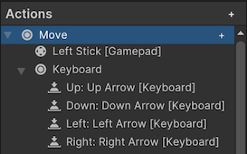
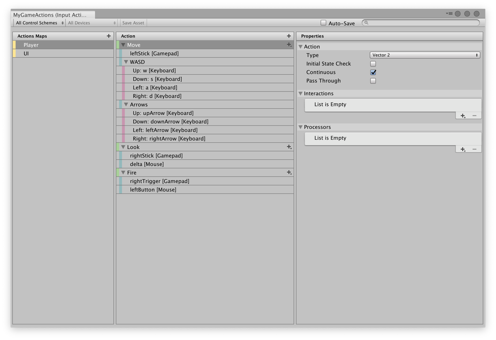
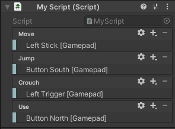
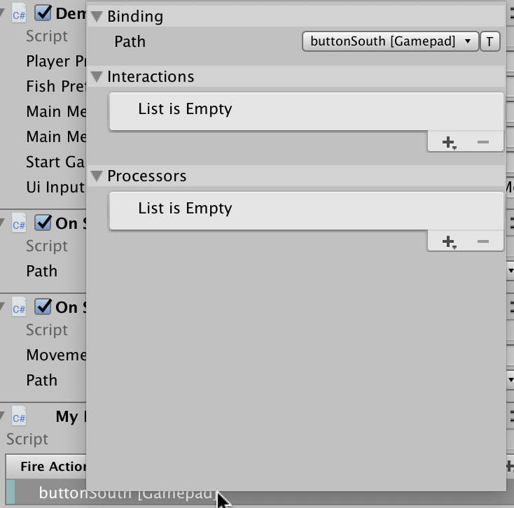
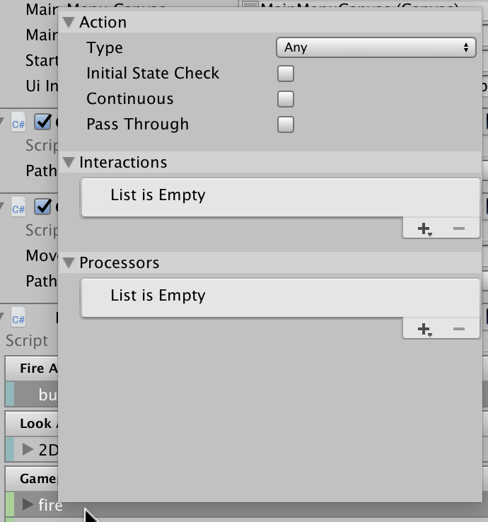

# Actions

- [Actions](#actions)
  - [Overview](#overview)
  - [Creating Actions](#creating-actions)
    - [Creating Actions using the Action editor](#creating-actions-using-the-action-editor)
    - [Creating Actions by embedding them in MonoBehaviours](#creating-actions-by-embedding-them-in-monobehaviours)
    - [Loading Actions from JSON](#loading-actions-from-json)
    - [Creating Actions in code](#creating-actions-in-code)
      - [Default Actions](#default-actions)
  - [Using Actions](#using-actions)
    - [Responding to Actions](#responding-to-actions)
      - [Action callbacks](#action-callbacks)
        - [`InputActionMap.actionTriggered` callback](#inputactionmapactiontriggered-callback)
        - [`InputSystem.onActionChange` callback](#inputsystemonactionchange-callback)
      - [Polling Actions](#polling-actions)
      - [`InputActionTrace`](#inputactiontrace)
    - [Action types](#action-types)
      - [Value](#value)
      - [Button](#button)
      - [Pass-Through](#pass-through)
    - [Debugging Actions](#debugging-actions)
    - [Using Actions with multiple players](#using-actions-with-multiple-players)


Related pages:

* [Assets](ActionAssets.md)
* [Bindings](ActionBindings.md)
* [Interactions](Interactions.md)

**Actions** allow you to separate the logical meaning of an input (the things your user can do in your game or app, such as move, jump, crouch) and the device-specific controls (for example, pressing a button or moving a gamepad stick).

Without Actions, the meaning of your input and the device controls end up hard-coded together in your scripts, which although quick to implement, is not very flexible and therefore not always desirable. For example, here the moveVector variable is hard-coded to read values from the right stick of a gamepad:

```CSharp
    // without Actions, you end up hard-coding device controls
    // like this: (not always desirable)
    moveVector = gamepad.rightStick.ReadValue<Vector2>();
```

When you use Actions, you do not need to refer to specific devices or their controls in your code. Instead the Action's binding defines which controls on which device is used to perform the action, and your code becomes simpler. In this example, `moveAction` would contain a reference to an Action, defined either in code, or in an Action Asset:

```CSharp
    // using Actions removes the need to refer directly to device controls
    moveAmount = moveAction.ReadValue<Vector2>();
```


You can then use the visual editor (either in the inspector, or in the Actions Asset editor) to establish the mapping between the Action and one or more device controls. For example in this screenshot, the "move" action is bound to the left gamepad stick, and the keyboard's arrow keys.



This also makes it easier to let players [customize bindings at runtime](ActionBindings.md#interactive-rebinding).

>!Note
>* Actions are a game-time only feature. You can't use them in `EditorWindow` code.
>* For an overview of the terms and terminology used on this page, see [Concepts](Concepts.md).

## Overview

There are three key classes for Actions in the API:

|Class|Description|
|-----|-----------|
|`InputActionAsset`|An Asset that contains one or more Action Maps and, optionally, a sequence of Control Schemes. For more information on how to create, edit, and work with these Assets, see [Action Assets](ActionAssets.md).|
|`InputActionMap`|A named collection of Actions.|
|`InputAction`|A named Action that triggers callbacks in response to input.|

Actions use `InputBinding` to refer to the inputs they collect. For more information about Bindings and how to use them, see [Action Bindings](ActionBindings.md).

Each Action has a name ([`InputAction.name`](../api/UnityEngine.InputSystem.InputAction.html#UnityEngine_InputSystem_InputAction_name)), which must be unique within the Action Map that the Action belongs to, if any (see [`InputAction.actionMap`](../api/UnityEngine.InputSystem.InputAction.html#UnityEngine_InputSystem_InputAction_actionMap)). Each Action also has a unique ID ([`InputAction.id`](../api/UnityEngine.InputSystem.InputAction.html#UnityEngine_InputSystem_InputAction_id)), which you can use to reference the Action. The ID remains the same even if you rename the Action.

Each Action Map has a name ([`InputActionMap.name`](../api/UnityEngine.InputSystem.InputActionMap.html#UnityEngine_InputSystem_InputActionMap_name)), which must be unique within the Action Asset that the Action Map belongs to, if any (see [`InputActionMap.asset`](../api/UnityEngine.InputSystem.InputActionMap.html#UnityEngine_InputSystem_InputActionMap_asset)). Each Action Map also has a unique ID ([`InputActionMap.id`](../api/UnityEngine.InputSystem.InputActionMap.html#UnityEngine_InputSystem_InputActionMap_id)), which you can use to reference the Action Map. The ID remains the same even if you rename the Action Map.

## Creating Actions

You can create Actions in any of the following ways:

- Use the dedicated editor for [Input Action Assets](ActionAssets.md).
- [Embed them](Workflow-Embedded.md) in MonoBehaviour components, then set up bindings in the Inspector.
- Manually load them from JSON.
- Create them entirely in code, including setting up the bindings.

### Creating Actions using the Action editor

For information on how to create and edit Input Action Assets in the dedicated editor, see [Action Assets](ActionAssets.md). This is the recommended workflow if you want to organise all your input actions and bindings together into a single Asset, which is often the case for many types of game or app.



### Creating Actions by embedding them in MonoBehaviours

As an alternative to using an Action Asset, You can embed individual [Input Action](../api/UnityEngine.InputSystem.InputAction.html) and [Input Action Maps](../api/UnityEngine.InputSystem.InputActionMap.html) as fields directly inside `MonoBehaviour` components, like this:

```CSharp
using UnityEngine;
using UnityEngine.InputSystem;

public class ExampleScript : MonoBehaviour
{
    public InputAction move;
    public InputAction jump;
}
```

The result is similar to using an Action Asset, except the Actions are defined in the GameObject's properties and saved as Scene or Prefab data, instead of in a dedicated Asset.

When you embed actions in a MonoBehaviour and assign that MonoBehaviour to a GameObject, the GameObject's Inspector window displays an interface similar to the Actions Asset window, which allows you to set up the bindings for those actions. For example:



The visual editors work similarly to the [Action Asset editor](ActionAssets.md).

* To add or remove Actions or Bindings, click the Add (+) or Remove (-) icon in the header.
* To edit Bindings, double-click them.<br>
  
* To edit Actions, double-click them in an Action Map, or click the gear icon on individual Action properties.<br>
  
* You can also right-click entries to bring up a context menu, and you can drag them. Hold the Alt key and drag an entry to duplicate it.

You must manually [enable and disable](#using-actions) Actions and Action Maps that are embedded in MonoBehaviour components.

```CSharp
public class MyBehavior : MonoBehaviour
{
    // ...

    void Awake()
    {
        fireAction.performed += OnFire;
        lookAction.performed += OnLook;

        gameplayActions["fire"].performed += OnFire;
    }

    void OnEnable()
    {
        fireAction.Enable();
        lookAction.Enable();

        gameplayActions.Enable();
    }

    void OnDisable()
    {
        fireAction.Disable();
        lookAction.Disable();

        gameplayActions.Disable();
    }
}
```

### Loading Actions from JSON

You can load Actions as JSON in the form of a set of Action Maps or as a full [`InputActionAsset`](../api/UnityEngine.InputSystem.InputActionAsset.html). This also works at runtime in the Player.

```CSharp
// Load a set of action maps from JSON.
var maps = InputActionMap.FromJson(json);

// Load an entire InputActionAsset from JSON.
var asset = InputActionAsset.FromJson(json);
```

### Creating Actions in code

You can manually create and configure Actions entirely in code, including assigning the bindings. This also works at runtime in the Player. For example:

```CSharp
// Create free-standing Actions.
var lookAction = new InputAction("look", binding: "<Gamepad>/leftStick");
var moveAction = new InputAction("move", binding: "<Gamepad>/rightStick");

lookAction.AddBinding("<Mouse>/delta");
moveAction.AddCompositeBinding("Dpad")
    .With("Up", "<Keyboard>/w")
    .With("Down", "<Keyboard>/s")
    .With("Left", "<Keyboard>/a")
    .With("Right", "<Keyboard>/d");

// Create an Action Map with Actions.
var map = new InputActionMap("Gameplay");
var lookAction = map.AddAction("look");
lookAction.AddBinding("<Gamepad>/leftStick");

// Create an Action Asset.
var asset = ScriptableObject.CreateInstance<InputActionAsset>();
var gameplayMap = new InputActionMap("gameplay");
asset.AddActionMap(gameplayMap);
var lookAction = gameplayMap.AddAction("look", "<Gamepad>/leftStick");
```

Any action that you create in this way during Play mode do not persist in the Input Action Asset after you exit Play mode. This means you can test your application in a realistic manner in the Editor without having to worry about inadvertently modifying the asset.

#### Default Actions

An [asset](./ActionAssets.md) called `DefaultInputActions.inputactions` containing a default setup of Actions comes with the Input System Package. You can reference this asset directly in your projects like any other Unity asset. However, the asset is also available in code form through the [`DefaultInputActions`](../api/UnityEngine.InputSystem.DefaultInputActions.html) class.

```CSharp
void Start()
{
    // Create an instance of the default actions.
    var actions = new DefaultInputActions();
    actions.Player.Look.performed += OnLook;
    actions.Player.Move.performed += OnMove;
    actions.Enable();
}
```

## Using Actions

For an Action to do something, you must first enable it. You can do this either by individually enabling Actions, or by enabling them in bulk through Action Maps. The second method is more efficient in all scenarios.

```CSharp
// Enable a single action.
lookAction.Enable();

// Enable an en entire action map.
gameplayActions.Enable();
```

When you enable an Action, the Input System resolves its bindings, unless it has done so already, or if the set of devices that the Action can use has not changed. For more details about this process, see the documentation on [binding resolution](ActionBindings.md#binding-resolution).

You can't change certain aspects of the configuration, such Action Bindings, while an Action is enabled. To stop Actions or Action Maps from responding to input, call  [`Disable`](../api/UnityEngine.InputSystem.InputAction.html#UnityEngine_InputSystem_InputAction_Disable).

While enabled, an Action actively monitors the [Control(s)](Controls.md) it's bound to. If a bound Control changes state, the Action processes the change. If the Control's change represents an [Interaction](Interactions.md) change, the Action creates a response. All of this happens during the Input System update logic. Depending on the [update mode](Settings.md#update-mode) selected in the input settings, this happens once every frame, once every fixed update, or manually if updates are set to manual.

### Responding to Actions

An Action doesn't represent an actual response to input by itself. Instead, an Action informs your code that a certain type of input has occurred. Your code then responds to this information.

There are several ways to do this:

1. Each Action has a [`started`, `performed`, and `canceled` callback](#action-callbacks).
2. Each Action Map has an [`actionTriggered` callback](#inputactionmapactiontriggered-callback).
3. The Input System has a global [`InputSystem.onActionChange` callback](#inputsystemonactionchange-callback).
4. You can [poll the current state](#polling-actions) of an Action whenever you need it.
5. [`InputActionTrace`](#inputactiontrace) can record changes happening on Actions.

There are also two higher-level, more streamlined ways of picking up input from Actions: use [`PlayerInput`](PlayerInput.md#notification-behaviors), or [generate script code](ActionAssets.md#auto-generating-script-code-for-actions) that wraps around the Input Actions.

#### Action callbacks

Every Action has a set of distinct phases it can go through in response to receiving input.

|Phase|Description|
|-----|-----------|
|`Disabled`|The Action is disabled and can't receive input.|
|`Waiting`|The Action is enabled and is actively waiting for input.|
|`Started`|The Input System has received input that started an Interaction with the Action.|
|`Performed`|An Interaction with the Action has been completed.|
|`Canceled`|An Interaction with the Action has been canceled.|

You can read the current phase of an action using [`InputAction.phase`](../api/UnityEngine.InputSystem.InputAction.html#UnityEngine_InputSystem_InputAction_phase).

The `Started`, `Performed`, and `Canceled` phases each have a callback associated with them:

```CSharp
    var action = new InputAction();

    action.started += ctx => /* Action was started */;
    action.performed += ctx => /* Action was performed */;
    action.canceled += ctx => /* Action was canceled */;
```

Each callback receives an [`InputAction.CallbackContext`](../api/UnityEngine.InputSystem.InputAction.CallbackContext.html) structure, which holds context information that you can use to query the current state of the Action and to read out values from Controls that triggered the Action ([`InputAction.CallbackContext.ReadValue`](../api/UnityEngine.InputSystem.InputAction.CallbackContext.html#UnityEngine_InputSystem_InputAction_CallbackContext_ReadValue__1)).

>__Note__: The contents of the structure are only valid for the duration of the callback. In particular, it isn't safe to store the received context and later access its properties from outside the callback.

When and how the callbacks are triggered depends on the [Interactions](Interactions.md) present on the respective Bindings. If the Bindings have no Interactions that apply to them, the [default Interaction](Interactions.md#default-interaction) applies.

##### `InputActionMap.actionTriggered` callback

Instead of listening to individual actions, you can listen on an entire Action Map for state changes on any of the Actions in the Action Map.

```CSharp
var actionMap = new InputActionMap();
actionMap.AddAction("action1", "<Gamepad>/buttonSouth");
actionMap.AddAction("action2", "<Gamepad>/buttonNorth");

actionMap.actionTriggered +=
    context => { ... };
```

The argument received is the same `InputAction.CallbackContext` structure that you receive through the [`started`, `performed`, and `canceled` callbacks](#action-callbacks).

>__Note__: The Input System calls `InputActionMap.actionTriggered` for all three of the individual callbacks on Actions. That is, you get `started`, `performed`, and `canceled` all on a single callback.

##### `InputSystem.onActionChange` callback

Similar to `InputSystem.onDeviceChange`, your app can listen for any action-related change globally.

```CSharp
InputSystem.onActionChange +=
    (obj, change) =>
    {
        // obj can be either an InputAction or an InputActionMap
        // depending on the specific change.
        switch (change)
        {
            case InputActionChange.ActionStarted:
            case InputActionChange.ActionPerformed:
            case InputActionChange.ActionCanceled:
                Debug.Log($"{((InputAction)obj).name} {change}");
                break;
        }
    }
```

#### Polling Actions

Instead of using callbacks, it might be simpler sometimes to poll the value of an Action where you need it in your code.

You can poll the current value of an Action using [`InputAction.ReadValue<>()`](../api/UnityEngine.InputSystem.InputAction.html#UnityEngine_InputSystem_InputAction_ReadValue__1):

```CSharp
    public InputAction moveAction;
    public float moveSpeed = 10.0f;
    public Vector2 position;

    void Start()
    {
        moveAction.Enable();
    }

    void Update()
    {
        var moveDirection = moveAction.ReadValue<Vector2>();
        position += moveDirection * moveSpeed * Time.deltaTime;
    }
```

Note that the value type has to correspond to the value type of the control that the value is being read from.

To determine whether an action was performed in the current frame, you can use [`InputAction.WasPerformedThisFrame()`](../api/UnityEngine.InputSystem.InputAction.html#UnityEngine_InputSystem_InputAction_WasPerformedThisFrame):

```CSharp
    private InputAction action;

    void Start()
    {
        // Set up an action that triggers when the A button is
        // held for 1 second.
        action = new InputAction(
            type: InputActionType.Button,
            binding: "<Gamepad>/buttonSouth",
            interactions: "hold(duration=1)");

        action.Enable();
    }

    void Update()
    {
        if (action.WasPerformedThisFrame())
            Debug.Log("A button on gamepad was held for one second");
    }
```

Finally, there are three methods you can use to poll for button presses and releases:

|Method|Description|
|------|-----------|
|[`InputAction.IsPressed()`](../api/UnityEngine.InputSystem.InputAction.html#UnityEngine_InputSystem_InputAction_IsPressed)|True if the level of [actuation](../api/UnityEngine.InputSystem.InputControl.html#UnityEngine_InputSystem_InputControl_EvaluateMagnitude) on the action has crossed the [press point](../api/UnityEngine.InputSystem.InputSettings.html#UnityEngine_InputSystem_InputSettings_defaultButtonPressPoint) and did not yet fall to or below the [release threshold](../api/UnityEngine.InputSystem.InputSettings.html#UnityEngine_InputSystem_InputSettings_buttonReleaseThreshold).|
|[`InputAction.WasPressedThisFrame()`](../api/UnityEngine.InputSystem.InputAction.html#UnityEngine_InputSystem_InputAction_WasPressedThisFrame)|True if the level of [actuation](../api/UnityEngine.InputSystem.InputControl.html#UnityEngine_InputSystem_InputControl_EvaluateMagnitude) on the action has, at any point during the current frame, reached or gone above the [press point](../api/UnityEngine.InputSystem.InputSettings.html#UnityEngine_InputSystem_InputSettings_defaultButtonPressPoint).|
|[`InputAction.WasReleasedThisFrame()`](../api/UnityEngine.InputSystem.InputAction.html#UnityEngine_InputSystem_InputAction_WasReleasedThisFrame)|True if the level of [actuation](../api/UnityEngine.InputSystem.InputControl.html#UnityEngine_InputSystem_InputControl_EvaluateMagnitude) on the action has, at any point during the current frame, gone from being at or above the [press point](../api/UnityEngine.InputSystem.InputSettings.html#UnityEngine_InputSystem_InputSettings_defaultButtonPressPoint) to at or below the [release threshold](../api/UnityEngine.InputSystem.InputSettings.html#UnityEngine_InputSystem_InputSettings_buttonReleaseThreshold).|

Example:

```CSharp
    public PlayerInput playerInput;

    public void Update()
    {
        // IsPressed
        if (playerInput.actions["up"].IsPressed())
            transform.Translate(0, 10 * Time.deltaTime, 0);

        // WasPressedThisFrame
        if (playerInput.actions["teleport"].WasPressedThisFrame())
            Teleport();

        // WasReleasedThisFrame
        if (playerInput.actions["submit"].WasReleasedThisFrame())
            ConfirmSelection();
    }
```

#### `InputActionTrace`

You can trace Actions to generate a log of all activity that happened on a particular set of Actions. To do so, use [`InputActionTrace`](../api/UnityEngine.InputSystem.Utilities.InputActionTrace.html). This behaves in a similar way to [`InputEventTrace`](../api/UnityEngine.InputSystem.LowLevel.InputEventTrace.html) for events.

>__Note__: `InputActionTrace` allocates unmanaged memory and needs to be disposed of so that it doesn't create memory leaks.

```CSharp
var trace = new InputActionTrace();

// Subscribe trace to single Action.
// (Use UnsubscribeFrom to unsubscribe)
trace.SubscribeTo(myAction);

// Subscribe trace to entire Action Map.
// (Use UnsubscribeFrom to unsubscribe)
trace.SubscribeTo(myActionMap);

// Subscribe trace to all Actions in the system.
trace.SubscribeToAll();

// Record a single triggering of an Action.
myAction.performed +=
    ctx =>
    {
        if (ctx.ReadValue<float>() > 0.5f)
            trace.RecordAction(ctx);
    };

// Output trace to console.
Debug.Log(string.Join(",\n", trace));

// Walk through all recorded Actions and then clear trace.
foreach (var record in trace)
{
    Debug.Log($"{record.action} was {record.phase} by control {record.control}");

    // To read out the value, you either have to know the value type or read the
    // value out as a generic byte buffer. Here, we assume that the value type is
    // float.

    Debug.Log("Value: " + record.ReadValue<float>());

    // If it's okay to accept a GC hit, you can also read out values as objects.
    // In this case, you don't have to know the value type.

    Debug.Log("Value: " + record.ReadValueAsObject());
}
trace.Clear();

// Unsubscribe trace from everything.
trace.UnsubscribeFromAll();

// Release memory held by trace.
trace.Dispose();
```

Once recorded, a trace can be safely read from multiple threads as long as it is not concurrently being written to and as long as the Action setup (that is, the configuration data accessed by the trace) is not concurrently being changed on the main thread.

### Action types

Each Action can be one of three different [Action types](../api/UnityEngine.InputSystem.InputActionType.html). You can select the Action type in the Input Action editor window, or by specifying the `type` parameter when calling the [`InputAction()`](../api/UnityEngine.InputSystem.InputAction.html#UnityEngine_InputSystem_InputAction__ctor_System_String_UnityEngine_InputSystem_InputActionType_System_String_System_String_System_String_System_String_) constructor. The Action type influences how the Input System processes state changes for the Action. The default Action type is `Value`.

#### Value

This is the default Action type. Use this for any inputs which should track continuous changes to the state of a Control.

 [`Value`](../api/UnityEngine.InputSystem.InputActionType.html#UnityEngine_InputSystem_InputActionType_Value) type actions continuously monitor all the Controls which are bound to the Action, and then choose the one which is the most actuated to be the Control driving the Action, and report the values from that Control in callbacks, triggered whenever the value changes. If a different bound Control actuated more, then that Control becomes the Control driving the Action, and the Action starts reporting values from that Control. This process is called [conflict resolution](ActionBindings.md#conflicting-inputs). This is useful if you want to allow different Controls to control an Action in the game, but only take input from one Control at the same time.

When the Action initially enables, it performs an [initial state check](ActionBindings.md#initial-state-check) of all bound Controls. If any of them is actuated, the Action then triggers a callback with the current value.

#### Button

This is very similar to [`Value`](../api/UnityEngine.InputSystem.InputActionType.html#UnityEngine_InputSystem_InputActionType_Value), but [`Button`](../api/UnityEngine.InputSystem.InputActionType.html#UnityEngine_InputSystem_InputActionType_Button) type Actions can only be bound to [`ButtonControl`](../api/UnityEngine.InputSystem.Controls.ButtonControl.html) Controls, and don't perform an initial state check like [`Value`](../api/UnityEngine.InputSystem.InputActionType.html#UnityEngine_InputSystem_InputActionType_Value) Actions do (see the Value section above). Use this for inputs that trigger an Action once every time they are pressed. The initial state check is usually not useful in such cases, because it can trigger actions if the button is still held down from a previous press when the Action was enabled.

#### Pass-Through

 [`Pass-Through`](../api/UnityEngine.InputSystem.InputActionType.html#UnityEngine_InputSystem_InputActionType_PassThrough) Actions bypass the [conflict resolution](ActionBindings.md#conflicting-inputs) process described above for `Value` Actions and don't use the concept of a specific Control driving the Action. Instead, any change to any bound Control triggers a callback with that Control's value. This is useful if you want to process all input from a set of Controls.

### Debugging Actions

To see currently enabled Actions and their bound Controls, use the [Input Debugger](Debugging.md#debugging-actions).

You can also use the [`InputActionVisualizer`](Debugging.md#inputactionvisualizer) component from the Visualizers sample to get an on-screen visualization of an Action's value and Interaction state in real-time.

### Using Actions with multiple players

You can use the same Action definitions for multiple local players (for example, in a local co-op game). For more information, see documentation on the [Player Input Manager](PlayerInputManager.md) component.
