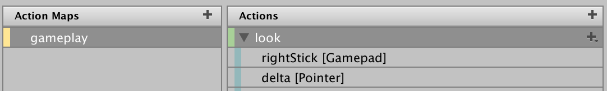
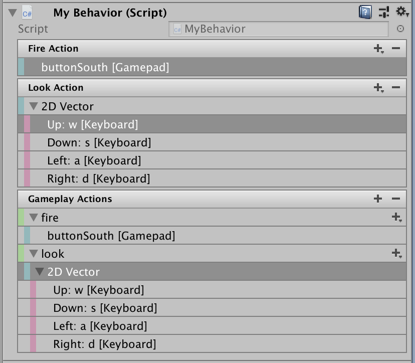

    ////TODO: explain initial state check

# Actions

>NOTE: Actions are a game-time only feature. They cannot be used in `EditorWindow` code.

* [Overview](#overview)
* [Creating Actions](#creating-actions)
    * [Using the Action Editor](#using-the-action-editor)
    * [Embedding Actions in MonoBehaviours](#embedding-actions-in-monobehaviours)
    * [Loading Actions from JSON](#loading-actions-from-json)
    * [Creating Actions in Code](#creating-actions-in-code)
* [Using Actions](#using-actions)
    * [Responding to Actions](#responding-to-actions)
    * [Continuous Actions](#continuous-actions)
    * [Pass-Through Actions](#pass-through-actions)
    * [Debugging Actions](#debugging-actions)
    * [Extending Actions](#extending-actions)
* [Assets](ActionAssets.md)
* [Bindings](ActionBindings.md)
* [Interactions](Interactions.md)

Input actions are designed to separate the logical meaning of an input from the physical means (i.e. activity on an input device) by which the input is generated. Instead of writing input code like so:

```CSharp
    var look = new Vector2();

    var gamepad = Gamepad.current;
    if (gamepad != null)
        look = gamepad.rightStick.ReadValue();

    var mouse = Mouse.current;
    if (mouse != null)
        look = mouse.delta.ReadValue();
```

You can instead write code that is agnostic to where the input is coming from:

```CSharp
    myControls.gameplay.look.performed +=
        context => look = context.ReadValue<Vector2>();
```

The mapping can then be established graphically in the editor:



This also makes it easier to let players to [customize bindings at runtime](ActionBindings.md#runtime-rebinding).

>NOTE: For an overview of the terms and terminology used on this page, see [Terms and Concepts](#terms-and-concepts).

## Overview

There are three key classes for actions in the API:

|Class|Description|
|-----|-----------|
|`InputActionAsset`|An asset that contains one or more action maps as well as, optionally, a sequence of control schemes. Details how to create, edit, and work with such assets can be found [here](ActionAssets.md).|
|`InputActionMap`|A named collection of actions.|
|`InputAction`|A named action which will trigger callbacks in response to input.|

The key mechanism by which bindings refer to the inputs they collect is `InputBinding`. More details about bindings and how to use them can be found [here](ActionBindings.md).

Each action has a name (`InputAction.name`) which must be unique within the action map that the action belongs to (if any; see `InputAction.actionMap`). Also, each action has a unique ID (`InputAction.id`) that can be used to reference the action. The ID will remain the same even if the action is renamed.

Each action map has a name (`InputActionMap.name`) which must be unique within the action asset that the map belongs to (if any; see `InputActionMap.asset`). Also, each action map has a unique ID (`InputActionMap.id`) that can be used to reference the map. The ID will remain the same even if the map is renamed.

    ////TODO: Clarify *when* actions are updated and how it relates to fixed/dynamic update.

## Creating Actions

Actions can be created in a variety of ways:

1. Using the dedicated editor for `.inputactions` assets.
2. By embedding them in MonoBehaviour components.
3. By manually loading them from JSON.
4. By simply creating them directly in code.

### Using the Action Editor

How to create and edit input action assets using the dedicated editor is described on a [separate page](ActionEditor.md).


### Embedding Actions in MonoBehaviours

`InputAction` and `InputActionMap` can be embedded as fields directly inside `MonoBehaviour` components. In the editor, these fields will receive a custom editor UI.

```CSharp
public MyBehavior : MonoBehaviour
{
    public InputAction fireAction;
    public InputAction lookAction;

    public InputActionMap gameplayActions;
}
```

This is presented in the editor like so:



The editors work similar to the [action asset editor](ActionEditor.md).

* To add or remote actions or bindings, click the plus or minus icon in the header.
* To edit binding entries, double-click them.<br>
  
* To edit action entries, double-click them.<br>
  
* Entries can also be right-clicked to bring up a context menu and can be dragged around (hold alt to duplicate).

Actions and action maps that are embedded in MonoBehaviour components have to be manually [enabled and disabled](#enabling-and-disabling-actions).

```CSharp
public class MyBehavior : MonoBehaviour
{
    // ...

    void Awake()
    {
        fireAction.performed += OnFire;
        lookAction.performed += OnLook;

        gameplayActions["fire"].performed += OnFire;
    }

    void OnEnable()
    {
        fireAction.Enable();
        lookAction.Enable();

        gameplayActions.Enable();
    }

    void OnDisable()
    {
        fireAction.Disable();
        lookAction.Disable();

        gameplayActions.Disable();
    }
}
```

### Loading Actions from JSON

Actions can be loaded as JSON in the form of a set of action maps or as a full `InputActionAsset`. This also works at runtime in the player.

```CSharp
// Load a set of action maps from JSON.
var maps = InputActionMap.FromJson(json);

// Load an entire InputActionAsset from JSON.
var asset = InputActionAsset.FromJson(json);
```

### Creating Actions in Code

Actions can be manually created and configured in code. This also works at runtime in the player.

```CSharp
// Create a free-standing actions.
var lookAction = new InputAction("look", binding: "<Gamepad>/leftStick");
var moveAction = new InputAction("move", binding: "<Gamepad>/rightStick");

lookAction.AddBinding("<Mouse>/delta");
moveAction.AddCompositeBinding("Dpad")
    .With("Up", "<Keyboard>/w")
    .With("Down", "<Keyboard>/s")
    .With("Left", "<Keyboard>/a")
    .With("Right", "<Keyboard>/d");

// Create an action map with actions.
var map = new InputActionMap("Gameplay");
var lookAction = map.AddAction("look");
lookAction.AddBinding("<Gamepad>/leftStick");

// Create an action asset.
var asset = ScriptableObject.CreateInstance<InputActionAsset>();
var gameplayMap = new InputActionMap("gameplay");
asset.AddActionMap(gameplayMap);
var lookAction = gameplayMap.AddAction("look", "<Gamepad>/leftStick");
```

## Using Actions

For an action to do something, it must be enabled. This can be done either by individually enabling actions or by enabling them in bulk through action maps. Note that the latter is always more efficient.

```CSharp
// Enable a single action.
lookAction.Enable();

// Enable an en entire action map.
gameplayActions.Enable();
```

When an action is enabled, all its bindings will be resolved, if this hasn't happened already or if the set of devices usable by the action has changed. For more details about this process, see [here](ActionBindings.md#binding-resolution).

To stop actions or action maps from responding to input, call `Disable`. Note that while actions are enabled, it is not possible to change certain aspects of the configuration (such as their bindings).

While enabled, an action will actively monitor the [control(s)](Controls.md) it is bound to. If a bound control changes state, the action will process the change and create a response if the state change represents an [interaction](Interactions.md) change.

### Responding to Actions

By itself, an action does not represent an actual response to input. Instead, an action tells your code that a certain kind of input has been performed. It is up to your code to in turn respond.

There are several ways in which this can be done.

1. Each action has a [`started`, `performed`, and `cancelled` callback](#started-performed-and-cancelled-callbacks).
2. Each action map has an [`actionTriggered` callback](#inputactionmap-actiontriggered-callback).
3. There is a global [`InputSystem.onActionChange` callback](#inputsystem-onactionchange-callback).
4. [`InputActionTrace`](#inputactiontrace) can record changes happening on actions.

>NOTE: A polling API for actions is on the TODO list.

There are also higher-level, more streamlined ways of picking up input from actions. One is to use [`PlayerInput`](Components.md#notification-behaviors) and another one is to [generate script code](ActionEditor.md#generating-script-code) that wraps around the input actions.

#### `started`, `performed`, and `cancelled` Callbacks

Every action has a set of dictinct phases it can go through in response to receiving input.

|Phase|Description|
|-----|-----------|
|`Disabled`|The action is disabled and will not receive input.|
|`Waiting`|The action is enabled and is actively waiting for input.|
|`Started`|Input has been received that started an interaction with the action.|
|`Performed`|An interaction with the action has been completed.|
|`Cancelled`|An interaction with the action has been cancelled.|

The current phase of an action can be read using `InputAction.phase`.

The `Started`, `Performed`, and `Cancelled` phases each have a callback associated with them:

```CSharp
    var action = new InputAction();

    action.started += ctx => /* Action was started */;
    action.performed += ctx => /* Action was performed */;
    action.cancelled += ctx => /* Action was started */;
```

Each callback receives an `InputAction.CallbackContext` structure holding context information that can be used to query the current state of the action and to read out values from controls that triggered the action (`InputAction.CallbackContext.ReadValue`). Note that the contents of the structure are __only valid for the duration of the callback__. In particular, it is not safe to store the received context and later access its properties from outside the callback.

When an how the callbacks are triggered depends on the [interactions](Interactions.md) present on the respective bindings. If no interactions are applied to them, the [default interaction](Interactions.md#default-interactions) applies.

#### `InputActionMap.actionTriggered` Callback

Alternatively, instead of listening to individual actions, you can listen on an entire action map for state changes on any of the actions in the map.

```CSharp
var actionMap = new InputActionMap();
actionMap.AddAction("action1", "<Gamepad>/buttonSouth");
actionMap.AddAction("action2", "<Gamepad>/buttonNorth");

actionMap.onActionTriggered +=
    context => { ... };
```

The argument received is the same `InputAction.CallbackContext` structure that is received through the [`started`, `performed`, and `cancelled` callbacks](#started-performed-and-cancelled-callbacks).

>NOTE: The `InputActionMap.actionTriggered` will be called for all three of the individual callbacks on actions, i.e. you get `started`, `performed`, and `cancelled` all on a single callback.

#### `InputSystem.onActionChange` Callback

Similar to `InputSystem.onDeviceChange`, it is possible to listen for any action-related change globally.

```CSharp
InputSystem.onActionChange +=
    (obj, change) =>
    {
        // obj can be either an InputAction or an InputActionMap
        // depending on the specific change.
        switch (change)
        {
            case InputActionChange.ActionStarted:
            case InputActionChange.ActionPerformed:
            case InputActionChange.ActionCancelled:
                Debug.Log($"{((InputAction)obj).name} {change}");
                break;
        }
    }
```

#### `InputActionTrace`

As when using `InputEventTrace` for events, actions can be traced in order to generate a log of all activity that happened on a particular set of actions. To do so, use `InputActionTrace`.

>NOTE: `InputActionTrace` allocates unmanaged memory and needs to be disposed of in order to not create memory leaks.

```CSharp
var trace = new InputActionTrace();

// Subscribe trace to single action.
// (Use UnsubscribeFrom to unsubscribe)
trace.SubscribeTo(myAction);

// Subscribe trace to entire action map.
// (Use UnsubscribeFrom to unsubscribe)
trace.SubscribeTo(myActionMap);

// Subscribe trace to all actions in the system.
trace.SubscribeToAll();

// Record a single triggering of an action.
myAction.performed +=
    ctx =>
    {
        if (ctx.ReadValue<float>() > 0.5f)
            trace.RecordAction(ctx);
    };

// Output trace to console.
Debug.Log(string.Join(",\n", trace));

// Walk through all recorded actions and then clear trace.
foreach (var record in trace)
{
    Debug.Log($"{record.action} was {record.phase} by control {record.control}");

    // To read out the value, you either have to know the value type or read the
    // value out as a generic byte buffer. Here we assume that the value type is
    // float.

    Debug.Log("Value: " + record.ReadValue<float>());

    // If it's okay to accept a GC hit, you can also read out values as objects.
    // In this case, you don't have to know the value type.

    Debug.Log("Value: " + record.ReadValueAsObject());
}
trace.Clear();

// Unsubscribe trace from everything.
trace.UnsubscribeFromAll();

// Release memory held by trace.
trace.Dispose();
```

Once recorded, a trace can be safely read from multiple threads as long as it is not concurrently being written to and as long as the action setup (i.e. the configuration data accessed by the trace) is not concurrently being changed on the main thread.

### Continuous Actions

By default, actions will trigger only in response to input events. This means that, for example, an action bound to the left stick of a gamepad will only trigger when the left stick is actually moved. This behavior can be undesirable when an input is meant to register for as long as a control is actuated -- regardless of whether it changes value in a particular frame or not.

This is what "continuous" mode is for. It can be enabled in the UI by selecting the action in the [action editor](ActionEditor.md) and ticking the "Continuous" checkbox.

    ////TODO: Update screenshot


When continuous mode is enabled, an action that goes into `Performed` phase will stay in the phase until it is `Cancelled`. Also, while in the `Performed` phase, an action in continuous mode will be `Performed` in a frame even if there is no input. The value returned by `ReadValue` will be the value of the control that was last used with the action.

>NOTE: Not all interactions support continuous mode. See [here](Interactions.md#predefined-interactions) for details.

### Pass-Through Actions

    ////TODO
Input on an action is "filtered" through an interaction model. Details about this process can be found [here](Interactions.md).

### Debugging Actions

### Extending Actions

Actions employ

### Using Actions with Multiple Players

It is possible to use the same action definitions for multiple local players. This setup is useful in a local co-op games, for example. More details about this can be found [here](LocalMultiplayer.md#multiplayer-actions).

## Terms and Concepts

The following terms and concepts are used through the input action system:

|Concept|Description|
|-------|-----------|
|__Action__|A "logical" input such as "Jump" or "Fire". I.e. an input action that can triggered by a player through one or more input devices and which will run a piece of game logic in response.|
|__Binding__|A connection between an action and one or more controls represented by a [control path](Controls.md#control-paths). At runtime, a binding is "resolved" to yield zero or more controls which are then connected to the action.|
|__Interaction__|A distinct input pattern that can be recognized on a control. Interactions trigger actions as they are being recognized.<br><br>An example of an interaction is a "hold" which requires a control to be actuated and then held for a certain time before the associated action is triggered.<br><br>Interactions are described in detail [here](Interactions.md).|
|__Processor__|An operation that is applied to an input value. An example is "invert" which inverts a floating-point value.<br><br>Processors are described in detail [here](Processors.md).|
|__Phase__||
|__Control Scheme__||
|__Action Map__||
|__Action Asset__||
