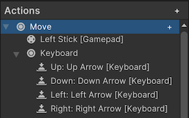

# Actions

**Actions** allow you to separate the purpose of an input from the device controls which perform that input, and associate the purpose and device controls together in a flexible way.

For example, the purpose of an input in a game might be to make the player's character move. The device control associated with that action might be the left gamepad stick.

To associate an action with one or more device controls, you set up input bindings in the [Input Actions Editor](actions-editor.md). Then you can refer to those actions in your code, instead of the specific devices. The input bindings define which device's controls are used to perform the action. For example this screenshot shows the "Move" action's bindings to the left gamepad stick and the keyboard's arrow keys.

 
*The Actions panel of the Input Actions Editor in Project Settings*

When you get a reference to an action in your code, you can use it to check its value, or attach a callback method to be notified when it is performed. For a simple example script demonstrating this, refer to [Workflow Overview - Actions](using-actions-workflow.md).

Actions also make it simpler to create a system that lets your players [customize their bindings at runtime](rebind-action-runtime.md), which is a common requirement for games.

> [!NOTE]
> - Actions are a runtime only feature. You can't use them in [Editor window code](https://docs.unity3d.com/ScriptReference/EditorWindow.html).
>
> - You can read input without using actions and bindings by directly reading specific device controls. This is less flexible, but can be quicker to implement for certain situations. Read more about [directly reading devices from script](using-direct-workflow.md).
>
