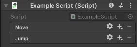

# Actions

**Actions** are an important concept in the Input System. They allow you to separate the purpose of an input from the device controls which perform that input. Actions allow you to associate the purpose and device controls together in a flexible way.

For example, the purpose of an input in a game might be to make the player's character move around. The device control associated with that action might be the motion of the left gamepad stick.

The association between an Action and the device controls which perform that input is a **binding**, and you can set up bindings in the [Input Actions editor](ActionsEditor.md). When you use Actions in your code, you do not need to refer to specific devices because the binding defines which device's controls are used to perform the action.

To use actions in your code, you must use the [Input Actions editor](ActionsEditor.md) to establish the mapping between the Action and one or more device controls. For example in this screenshot, the "Move" action is displayed, showing its bindings the left gamepad stick, and the keyboard's arrow keys.

<br/>
*The Actions panel of the Input Actions Editor in Project Settings*

You can then get a reference to this action in your code, and check its value, or attach a callback method to be notified when it is performed. See the [Actions Workflow page](Workflow-Actions.md) for a simple example script demonstrating this.

Actions also make it simpler to create a system that lets your players [customize their bindings at runtime](ActionBindings.md#interactive-rebinding), which is a common requirement for games.

>**Notes:**
> - Actions are a runtime only feature. You can't use them in [Editor window code](https://docs.unity3d.com/ScriptReference/EditorWindow.html).
>
> - You can read input without using Actions and Bindings by directly reading specific device controls. This is less flexible, but can be quicker to implement for certain situations. Read more about [directly reading devices from script](Workflow-Direct.md).
>
> - Although you can reorder actions in this window, the ordering is for visual convenience only, and does not affect the order in which the actions are triggered in your code. If multiple actions are performed in the same frame, the order in which they are reported by the input system is undefined. To avoid problems, you should not write code that assumes they will be reported in a particular order.
> <br/>&nbsp;


## Overview

When scripting with Actions in the Input System, there are number of important API you can use, which are described here:

|API name|Description|
|-----|-----------|
|[`InputSystem.actions`](../api/UnityEngine.InputSystem.InputSystem.html)|A reference to the set of actions assigned as the [project-wide Actions](./ProjectWideActions.md).|
|[`InputActionMap`](../api/UnityEngine.InputSystem.InputActionMap.html)|A named collection of Actions. The API equivalent to an entry in the "Action Maps" column of the [Input Actions editor](ActionsEditor.md).|
|[`InputAction`](../api/UnityEngine.InputSystem.InputAction.html)|A named Action that can return the current value of the controls that it is bound to, or can trigger callbacks in response to input. The API equivalent to an entry in the "Actions" column of the [Input Actions editor](ActionsEditor.md).|
|[`InputBinding`](../api/UnityEngine.InputSystem.InputBinding.html)|The relationship between an Action and the specific device controls for which it receives input. For more information about Bindings and how to use them, see [Action Bindings](ActionBindings.md).|

Each Action has a name ([`InputAction.name`](../api/UnityEngine.InputSystem.InputAction.html#UnityEngine_InputSystem_InputAction_name)), which must be unique within the Action Map that the Action belongs to, if any (see [`InputAction.actionMap`](../api/UnityEngine.InputSystem.InputAction.html#UnityEngine_InputSystem_InputAction_actionMap)). Each Action also has a unique ID ([`InputAction.id`](../api/UnityEngine.InputSystem.InputAction.html#UnityEngine_InputSystem_InputAction_id)), which you can use to reference the Action. The ID remains the same even if you rename the Action.

Each Action Map has a name ([`InputActionMap.name`](../api/UnityEngine.InputSystem.InputActionMap.html#UnityEngine_InputSystem_InputActionMap_name)), which must also be unique with respect to the other Action Maps present, if any. Each Action Map also has a unique ID ([`InputActionMap.id`](../api/UnityEngine.InputSystem.InputActionMap.html#UnityEngine_InputSystem_InputActionMap_id)), which you can use to reference the Action Map. The ID remains the same even if you rename the Action Map.

## Creating Actions

The simplest way to create actions is to use the [Input Actions editor](ActionsEditor.md) in the Project Settings window. This is the primary recommended workflow and suitable for most scenarios.

However, because the input system API is very open, there are many other ways to create actions which may suit less common scenarios. For example, by loading actions from JSON data, or creating actions entirely in code.

### Creating Actions using the Action editor

For information on how to create and edit Input Actions in the editor, see the [Input Actions editor](ActionsEditor.md). This is the recommended workflow if you want to organise all your input actions and bindings in one place, which applies across the whole of your project. This often the case for most types of game or app.


*The Input Actions Editor in the Project Settings window*


# Other ways to create Actions

The simplest way to create actions is to use the [Input Actions editor](ActionsEditor.md) to configure a set of actions in an asset, as described above. However, because the Input System package API is open and flexible, you can create actions using alternative techniques. These alternatives might be more suitable if you want to customize your project beyond the standard workflow.

### Creating Actions by declaring them in MonoBehaviours

As an alternative workflow, you can declare individual [Input Action](../api/UnityEngine.InputSystem.InputAction.html) and [Input Action Maps](../api/UnityEngine.InputSystem.InputActionMap.html) as fields directly inside `MonoBehaviour` components.

```CSharp
using UnityEngine;
using UnityEngine.InputSystem;

public class ExampleScript : MonoBehaviour
{
    public InputAction move;
    public InputAction jump;
}
```

The result is similar to using an Actions defined in the Input Actions editor, except the Actions are defined in the GameObject's properties and saved as Scene or Prefab data, instead of in a dedicated Asset.

When you embed actions like this, by defining serialized InputAction fields in a MonoBehaviour, the GameObject's Inspector window displays an interface similar to the Actions column of the [Actions Editor](./ActionsEditor.md), which allows you to set up the bindings for those actions. For example:



* To add or remove Actions or Bindings, click the Add (+) or Remove (-) icon in the header.
* To edit Bindings, double-click them.<br>
* To edit Actions, double-click them in an Action Map, or click the gear icon on individual Action properties.<br>
* You can also right-click entries to bring up a context menu, and you can drag them. Hold the Alt key and drag an entry to duplicate it.

Unlike the project-wide actions in the Project Settings window, you must manually enable and disable Actions and Action Maps that are embedded in MonoBehaviour components.

When you use this workflow, the serialised action configurations are stored with the parent GameObject as part of the scene, opposite to being serialised with an Action Asset. This can be useful if you want to bundle the control bindings and behaviour together in a single monobehaviour or prefab, so it can be distributed together. However, this can also make it harder to organize your full set of control bindings if they are distributed across multiple prefabs or scenes.

### Loading Actions from JSON

You can load Actions as JSON in the form of a set of Action Maps or as a full [`InputActionAsset`](../api/UnityEngine.InputSystem.InputActionAsset.html). This also works at runtime in the Player.

```CSharp
// Load a set of action maps from JSON.
var maps = InputActionMap.FromJson(json);

// Load an entire InputActionAsset from JSON.
var asset = InputActionAsset.FromJson(json);
```

### Creating Actions in code

You can manually create and configure Actions entirely in code, including assigning the bindings. This also works at runtime in the Player. For example:

```CSharp
// Create free-standing Actions.
var lookAction = new InputAction("look", binding: "<Gamepad>/leftStick");
var moveAction = new InputAction("move", binding: "<Gamepad>/rightStick");

lookAction.AddBinding("<Mouse>/delta");
moveAction.AddCompositeBinding("Dpad")
    .With("Up", "<Keyboard>/w")
    .With("Down", "<Keyboard>/s")
    .With("Left", "<Keyboard>/a")
    .With("Right", "<Keyboard>/d");

// Create an Action Map with Actions.
var map = new InputActionMap("Gameplay");
var lookAction = map.AddAction("look");
lookAction.AddBinding("<Gamepad>/leftStick");

// Create an Action Asset.
var asset = ScriptableObject.CreateInstance<InputActionAsset>();
var gameplayMap = new InputActionMap("gameplay");
asset.AddActionMap(gameplayMap);
var lookAction = gameplayMap.AddAction("look", "<Gamepad>/leftStick");
```

Any action that you create in this way during Play mode do not persist in the Input Action Asset after you exit Play mode. This means you can test your application in a realistic manner in the Editor without having to worry about inadvertently modifying the asset.


## Enabling actions

Actions have an **enabled** state, meaning you can enable or disable them to suit different situations.

If you have an Action Asset assigned as [project-wide](./ProjectWideActions.md), the actions it contains are enabled by default and ready to use.

For actions defined elsewhere, such as in an Action Asset not assigned as project-wide, or defined your own code, they begin in a disabled state, and you must enable them before they will respond to input.

You can enable actions individually, or as a group by enabling the Action Map which contains them.

```CSharp
// Enable a single action.
lookAction.Enable();

// Enable an en entire action map.
gameplayActions.Enable();
```

When you enable an Action, the Input System resolves its bindings, unless it has done so already, or if the set of devices that the Action can use has not changed. For more details about this process, see the documentation on [binding resolution](ActionBindings.md#binding-resolution).

You can't change certain aspects of the configuration, such Action Bindings, while an Action is enabled. To stop Actions or Action Maps from responding to input, call  [`Disable`](../api/UnityEngine.InputSystem.InputAction.html#UnityEngine_InputSystem_InputAction_Disable).

While enabled, an Action actively monitors the [Control(s)](Controls.md) it's bound to. If a bound Control changes state, the Action processes the change. If the Control's change represents an [Interaction](Interactions.md) change, the Action creates a response. All of this happens during the Input System update logic. Depending on the [update mode](Settings.md#update-mode) selected in the input settings, this happens once every frame, once every fixed update, or manually if updates are set to manual.
