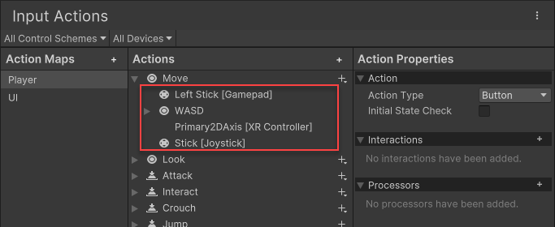

# Configuring Input with the Actions Editor

The **Input Actions Editor** allows you to edit [Action Assets](ActionAssets.md), which contain a saved configuration of [Input Actions](Actions.md) and their associated [Bindings](ActionBindings.md).

It allows you to group collections of Actions into [Action Maps](ActionsEditor.html#configure-action-maps), which represent different input scenarios in your project (such as UI navigation, gameplay, etc.)

It also alows you to define [Control Schemes](ActionBindings.md#control-schemes) which are a way to enable or disable a set of devices, or respond to which type of device is being used. This is often useful if you want to customise your UI based on whether your users are using mouse, keyboard, or gamepad as their chosen input.

### Action Assets and Project-Wide Actions

The typical workflow for most projects is to have a single Action Asset, which is assigned as the **project-wide actions**. If you have not yet created and assigned an Actions Asset as the project-wide actions, the recommended workflow is to do this first. Read more about [project-wide actions](ProjectWideActions.md).

### Opening the Actions Editor

The **Input Actions Editor** is an editor window displayed when you open an Action Asset by double-clicking it.

It is also displayed in the Project Settings window under **Edit** > **Project Settings** > **Input System Package** if you have an Action Asset assigned as project-wide.

*The Input Actions editor, displaying the default actions*

### The Actions Editor panels

The Input Actions editor is divided into three panels (marked A, B & C above).

|Name|Description|
|-|-|
|**(A)&nbsp;Action Maps**|Displays the list of currently defined Action Maps. Each Action Map is a collection of Actions that you can enable or disable together as a group.|
|**(B)&nbsp;Actions**|Displays all the actions defined in the currently selected Action Map, and the bindings associated with each Action.|
|**(C)&nbsp;Properties**|Displays the properties of the currently selected Action or Binding from the Actions panel. The title of this panel changes depending on whether you have an Action or a Binding selected in the Actions panel.|

### Configure Action Maps

* To add a new Action Map, select the Add (+) icon in the header of the Action Map panel.
* To rename an existing Action Map, either long-click the name, or right-click the Action Map and select __Rename__ from the context menu. Note that Action Map names can't contain slashes  (`/`).
* To delete an existing Action Map, right-click it and select __Delete__ from the context menu.
* To duplicate an existing Action Map, right-click it and select __Duplicate__ from the context menu.

### Configure Actions

* To add a new Action, select the Add (+) icon in the header of the Action column.
* To rename an existing Action, either long-click the name, or right-click the Action Map and select __Rename__ from the context menu.
* To delete an existing Action, either right-click it and select __Delete__ from the context menu.
* To duplicate an existing Action, either right-click it and select __Duplicate__ from the context menu.
*

## Action type and Control type

If you select an Action, you can edit its properties in the right-hand pane of the window:

#### Action Type

The Action Type setting allows to to select between **Button**, **Value** or **PassThrough**.

These options relate to whether this action should represent a discrete on/off button-style interaction or a value that can change over time while the control is being used.

For device controls such as keyboard keys, mouse clicks, or gamepad buttons, select **Button**. For device controls such as mouse movement, a joystick or gamepad stick, or device orientation that provide continuously changing input over a period of time, select **Value**.

The Button and Value types of action also provides data about the action such as whether it has started and stopped, and conflict resolution in situations where multiple bindings are mapped to the same action.

The third option, **PassThrough**, is also a value type, and as such is suitable for the same types of device controls as value. The difference is that actions set to PassThrough only provide basic information about the values incoming from the device controls bound to it, and does not provide the extra data relating to the phase of the action, nor does it perform conflict resolution in the case of multiple controls mapped to the same action.

For more detail about how these types work, see [action types](RespondingToActions.html#action-types) and [default interactions](Interactions.html#default-interaction).

#### Control Type

The Control Type setting allows you to select the type of control expected by the action. This limits the controls shown when setting up bindings in the UI and also limits which contols can be bound interactively to the action.

For example, if you select **2D axis**, only those controls that can supply a 2D vector as value are available as options for the binding control path.

There are more specific control types available which futher filter the available bindings, such as "Stick", "Dpad" or "Touch". If you select one of these control types, the list of available controls is further limited to only those controls of those specific types when you select a binding for your action (see directly below).

### Bindings

* To add a new Binding, select the Add (+) icon on the action you want to add it to, and select the binding type from the menu that appears.
* To delete an existing Binding, either right-click it and select __Delete__ from the context menu.
* To duplicate an existing Binding, either right-click it and select __Duplicate__ from the context menu.

You can add multiple bindings to an action, which is generally useful for supporting multiple types of input device. For example, in the default set of actions, the "Move" action has a binding to the left gamepad stick and the WSAD keys, which means input through any of these bindings will perform the action.

 
_The default "Move" action in the Actions Editor window, displaying the multiple bindings associated with it._

If you select a Binding, you can edit its properties in the right-hand pane of the window:

#### Picking Controls

The most important property of any Binding is the [control path](Controls.md#control-paths) it's bound to. To edit it, open the __Path__ drop-down list. This displays a Control picker window.

In the Control picker window, you can explore a tree of Input Devices and Controls that the Input System recognizes, and bind to these Controls. Unity filters this list by the Action's [`Control Type`](../api/UnityEngine.InputSystem.InputAction.html#UnityEngine_InputSystem_InputAction_expectedControlType) property. For example, if the Control type is `Vector2`, you can only select a Control that generates two-dimensional values, like a stick.

The Device and Control tree is organized hierarchically from generic to specific. For example, the __Gamepad__ Control path `<Gamepad>/buttonSouth` matches the lower action button on any gamepad. Alternatively, if you navigate to __Gamepad__ > __More Specific Gamepads__ and select __PS4 Controller__, and then choose the Control path `<DualShockGamepad>/buttonSouth`, this only matches the "Cross" button on PlayStation gamepads, and doesn't match any other gamepads.

Instead of browsing the tree to find the Control you want, it's easier to let the Input System listen for input. To do that, select the __Listen__ button. At first, the list of Controls is empty. Once you start pressing buttons or actuating Controls on the Devices you want to bind to, the Control picker window starts listing any Bindings that match the controls you pressed. Select any of these Bindings to view them.

Finally, you can choose to manually edit the Binding path, instead of using the Control picker. To do that, select the __T__ button next to the Control path popup. This changes the popup to a text field, where you can enter any Binding string. This also allows you to use wildcard (`*`) characters in your Bindings. For example, you can use a Binding path such as `<Touchscreen>/touch*/press` to bind to any finger being pressed on the touchscreen, instead of manually binding to `<Touchscreen>/touch0/press`, `<Touchscreen>/touch1/press` and so on.

#### Editing Composite Bindings

Composite Bindings are Bindings consisting of multiple parts, which form a Control together. For instance, a [2D Vector Composite](ActionBindings.md#2d-vector) uses four buttons (left, right, up, down) to simulate a 2D stick input. See the [Composite Bindings](ActionBindings.md#composite-bindings) documentation to learn more.

To create a Composite Binding, in the Input Action Asset editor window, select the Add (+) icon on the Action you want to add it to, and select the Composite Binding type from the popup menu.

This creates multiple Binding entries for the Action: one for the Composite as a whole, and then, one level below that, one for each Composite part. The Composite itself doesn't have a Binding path property, but its individual parts do, and you can edit these parts like any other Binding. Once you bind all the Composite's parts, the Composite can work together as if you bound a single control to the Action.

**Note**: The set of Composites displayed in the menu is depends on the value type of the Action. This means that, for example, if the Action is set to type "Button", then only Composites able to return values of type `float` will be shown.

To change the type of a Composite retroactively, select the Composite, then select the new type from the **Composite Type** drop-down in the **Properties** pane.

To change the part of the Composite to which a particular Binding is assigned, use the **Composite Part** drop-down in the Binding's properties.

You can assign multiple Bindings to the same part. You can also duplicate individual part Bindings: right-click the Binding, then select **Duplicate** to create new part Bindings for the Composite. This can be used, for example, to create a single Composite for both "WASD" style controls and arrow keys.

### Editing Control Schemes

Input Action Assets can have multiple [Control Schemes](ActionBindings.md#control-schemes), which let you enable or disable different sets of Bindings for your Actions for different types of Devices.

To see the Control Schemes in the Input Action Asset editor window, open the Control Scheme drop-down list in the top left of the window. This menu lets you add or remove Control Schemes to your Actions Asset. If the Actions Asset contains any Control Schemes, you can select a Control Scheme, and then the window only shows bindings that are associated with that Scheme. If you select a binding, you can now pick the Control Schemes for which this binding should be active in the __Properties__ view to the left of the window.

When you add a new Control Scheme, or select an existing Control Scheme, and then select __Edit Control Scheme__, you can edit the name of the Control Scheme and which devices the Scheme should be active for. When you add a new Control Scheme, the "Device Type" list is empty by default (as shown above). You must add at least one type of device to this list for the Control Scheme to be functional.
