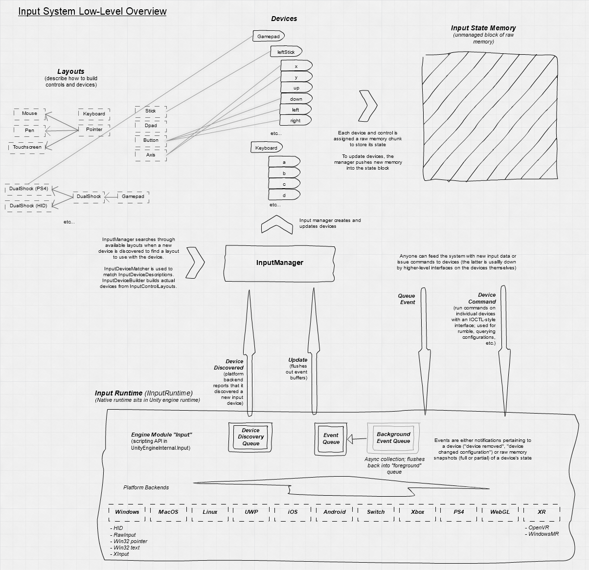
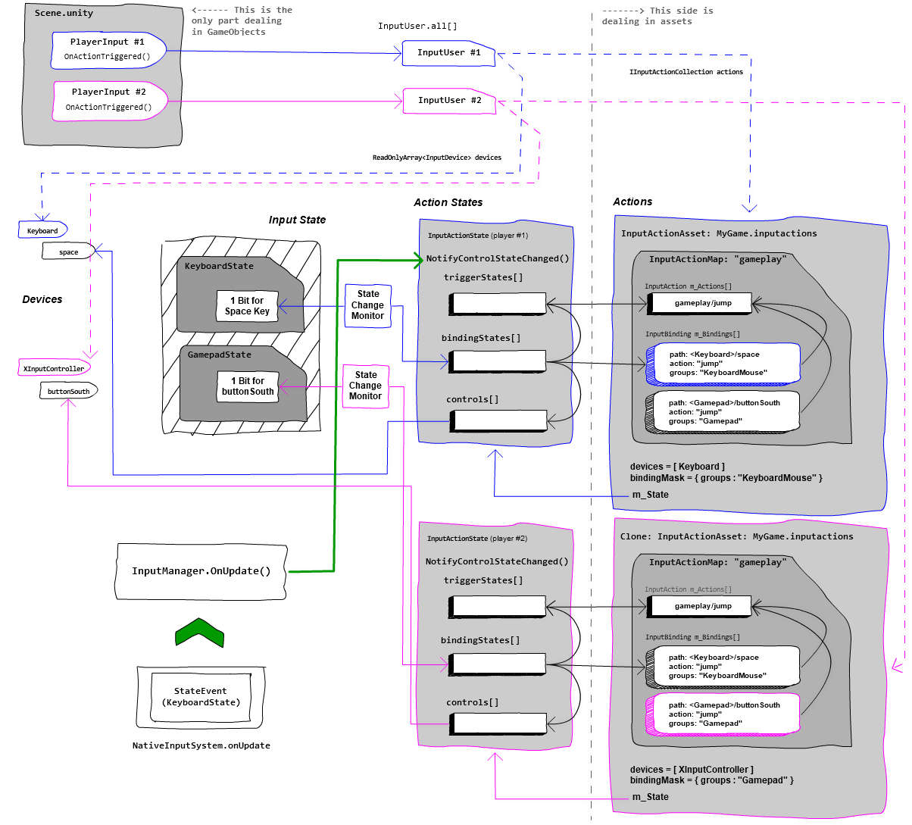

# Architecture

The Input System has a layered architecture that consists of a low-level layer and a high-level layer.

# Native backend

The foundation of the Input System is the native backend code. This is platform-specific code which collects information about available Devices and input data from Devices. This code is not part of the Input System package, but is included with Unity itself. It has implementations for each runtime platform supported by Unity. This is why some platform-specific input bugs can only be fixed by an update to Unity, rather than a new version of the Input System package.

The Input System interfaces with the native backend using [events](Events.md) that the native backend sends. These events notify the system of the creation and removal of [Input Devices](Devices.md), as well as any updates to the Device states. For efficiency and to avoid creating any garbage, the native backend reports these events as a simple buffer of raw, unmanaged memory containing a stream of events.

The Input System can also send data back to the native backend in the form of [commands](Devices.md#device-commands) sent to Devices, which are also buffers of memory that the native backend interprets. These commands can have different meanings for different Device types and platforms.

# Input System (low-level)

The low-level Input System code processes and interprets the memory from the event stream that the native backend provides, and dispatches individual events.

The Input System creates Device representations for any newly discovered Device in the event stream. The low-level code sees a Device as a block of raw, unmanaged memory. If it receives a state event for a Device, it writes the data from the state event into the Device's [state representation](Controls.md#control-state) in memory, so that the state always contains an up-to-date representation of the Device and all its Controls.

The low-level system code also contains structs which describe the data layout of commonly known Devices.

# Input System (high-level)

The high-level Input System code interprets the data in a Device's state buffers by using [layouts](Layouts.md), which describe the data layout of a Device and its Controls in memory. The Input System creates layouts from either the pre-defined structs of commonly known Devices supplied by the low level system, or dynamically at runtime, as in the case of [generic HIDs](HID.md#auto-generated-layouts).

Based on the information in the layouts, the Input System then creates [Control](Controls.md) representations for each of the Device's controls, which let you read the state of each individual Control in a Device.

As part of the high-level system, you can also build another abstraction layer to map Input Controls to your application mechanics. Use [Actions](Actions.md) to [bind](ActionBindings.md) one or more Controls to an input in your application. The Input System then monitors these Controls for state changes, and notifies your game logic using [callbacks](Actions.md#responding-to-actions). You can also specify more complex behaviors for your Actions using [Processors](Processors.md) (which perform processing on the input data before sending it to you) and [Interactions](Interactions.md) (which let you specify patterns of input on a Control to listen to, such as multi-taps).
