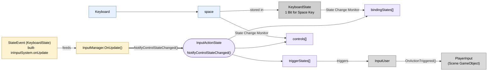
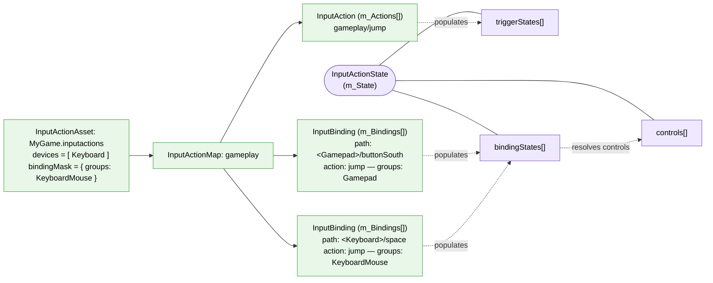

# Architecture

The Input System architecture has two layers: low-level high-level. It interacts with the built-in back end in the Unity Editor.

## The built-in back end

The foundation of the Input System is the built-in back end code. This is platform-specific code that collects information about available devices and input data from devices. This code isn't part of the Input System package; it's included with Unity itself. It has implementations for each runtime platform supported by Unity. This is why some platform-specific input bugs can only be fixed by an update to Unity, rather than a new version of the Input System package.

The Input System interfaces with the built-in back end in one of two ways:

- With [events](input-events.md) that the built-in back end sends. These events notify the system of the creation and removal of [Input devices](devices.md) and any updates to the device states. For efficiency, the built-in back end reports these events as a simple buffer of raw, unmanaged memory containing a stream of events.
- Sending data back to the built-in back end in the form of [commands](device-commands.md) sent to devices, which are also buffers of memory that the built-in back end interprets. These commands can have different meanings for different device types and platforms.

## Low-level diagram

The diagram of the low-level Input System reads top-to-bottom as a layered pipeline: 

1. The built-in platform back ends feed the InputManager.
1. The InputManager uses layouts to build devices. 
1. The device's state is stored in Input State Memory.

```mermaid
flowchart TB
    %% ---------- Input State Memory (top) ----------
    StateMemory["Input State Memory
    (unmanaged raw memory — each device and control
    gets a chunk that stores its current state)"]

    %% ---------- Devices (built from layouts) ----------
    Gamepad_D["Gamepad (device)"] --> leftStick
    leftStick --> x & y & up & down & left & right
    Keyboard_D["Keyboard (device)"] --> a & b & c & d
    leftStick -->|"state written to"| StateMemory
    Keyboard_D -->|"state written to"| StateMemory

    %% ---------- Layouts (describe how to build controls and devices) ----------
    Mouse -->|derives| Pointer
    Pen -->|derives| Pointer
    Touchscreen -->|derives| Pointer
    DS_PS4["DualShock (PS4)"] --> DualShock
    DS_HID["DualShock (HID)"] --> DualShock
    DualShock --> Gamepad_L["Gamepad (layout)"]
    Keyboard_L["Keyboard (layout)"]
    Stick(("Stick"))
    Axis(("Axis"))
    Button(("Button"))
    Dpad(("Dpad"))

    %% Layout building blocks build the individual device controls
    Gamepad_L -.->|builds| Gamepad_D
    Stick -.->|builds| leftStick
    Axis -.->|builds| x & y
    Button -.->|builds| up & down & left & right
    Keyboard_L -.->|builds| Keyboard_D

    %% ---------- InputManager (middle) ----------
    InputManager(["<b>InputManager</b>
    Matches layouts to devices (InputDeviceMatcher),
    builds devices (InputDeviceBuilder), creates & updates them"])
    Gamepad_L -->|"searched by"| InputManager
    InputManager -->|"creates & updates"| Gamepad_D
    InputManager -->|"creates & updates"| Keyboard_D

    %% ---------- Input Runtime (bottom) ----------
    DDQ["Device Discovery Queue"]
    EQ["Event Queue"]
    BEQ["Background Event Queue
    (async; flushes into the foreground queue)"]
    back ends["Platform back ends
    Windows · macOS · Linux · UWP · iOS · Android
    · Switch · Xbox · PS4 · WebGL · XR"]
    back ends --> DDQ & EQ & BEQ
    DDQ -->|"Device Discovered"| InputManager
    EQ -->|"Update (flushes event buffers)"| InputManager
    InputManager -->|"Queue Event"| EQ
    InputManager -->|"Device Command (IOCTL-style)"| back ends

    %% ---------- Grouping by color ----------
    classDef layout fill:#e6f0ff,stroke:#4a78c0,color:#000;
    classDef device fill:#e8f7e8,stroke:#4aa04a,color:#000;
    classDef runtime fill:#fdf3d0,stroke:#b9962e,color:#000;
    classDef mem fill:#f0e6f6,stroke:#8a5ea0,color:#000;
    classDef manager fill:#ffffff,stroke:#e0403f,stroke-width:2px,color:#000;
    class Mouse,Pen,Touchscreen,Pointer,DS_PS4,DS_HID,DualShock,Gamepad_L,Keyboard_L,Stick,Axis,Button,Dpad layout;
    class Gamepad_D,leftStick,x,y,up,down,left,right,Keyboard_D,a,b,c,d device;
    class DDQ,EQ,BEQ,back ends runtime;
    class StateMemory mem;
    class InputManager manager;
```

The low-level Input System code processes and interprets the memory from the event stream that the built-in back end provides, and dispatches individual events.

When the Input System discovers a device in the event stream, it creates a device representation for it. The low-level code sees a device as a block of raw, unmanaged memory. When the low-level code receives a state event for a device, it writes the data from the state event into the device's [state representation](control-state.md) in memory. This means that the state always contains an up-to-date representation of the device and all its controls.

The low-level system code also contains structs that describe the data layout of commonly known devices.

## High-level diagram

The high-level system is easiest to understand in two parts:

- How input flows through the system at runtime.
- How actions are authored as assets. 

The diagram shows both parts for a single player; each additional player gets its own `InputActionState` and a cloned `InputActionAsset` with its own device list and binding mask.

The first diagram is for the runtime data flow:

1. A device's control state is written into Input State memory.
1. A State Change Monitor notices the change.
1. The `InputActionState` is updated.
1. The resulting action fires a callback on the `PlayerInput` component in the scene.

```mermaid
flowchart LR
    %% ---------- Devices ----------
    Keyboard["Keyboard"] --> space["space"]

    %% ---------- Input State (unmanaged raw memory) ----------
    KBbit["KeyboardState
    1 Bit for Space Key"]
    space -->|"stored in"| KBbit

    %% ---------- Runtime ----------
    StateEvent["StateEvent (KeyboardState)
    built-inInputSystem.onUpdate"] -->|feeds| OnUpdate["InputManager.OnUpdate()"]

    %% ---------- Action state ----------
    AState(["InputActionState
    NotifyControlStateChanged()"])
    trig["triggerStates[]"]
    bind["bindingStates[]"]
    ctrl["controls[]"]
    AState --> trig & bind & ctrl
    OnUpdate ==>|"NotifyControlStateChanged()"| AState
    KBbit -->|"State Change Monitor"| bind
    space -->|"State Change Monitor"| ctrl

    %% ---------- Callback out to the scene ----------
    trig -->|triggers| IU["InputUser"]
    IU -->|"OnActionTriggered()"| PI["PlayerInput
    (Scene GameObject)"]

    classDef device fill:#e6f0ff,stroke:#4a78c0,color:#000;
    classDef state fill:#cfcfcf,stroke:#555,color:#000;
    classDef astate fill:#efe9ff,stroke:#7a5ec0,color:#000;
    classDef runtime fill:#fdf3d0,stroke:#b9962e,color:#000;
    classDef go fill:#d9d9d9,stroke:#666,color:#000;
    class Keyboard,space device;
    class KBbit state;
    class AState,trig,bind,ctrl astate;
    class StateEvent,OnUpdate runtime;
    class IU,PI go;
```

The second diagram is for the asset structure:

1. An `InputActionAsset` contains maps, actions, and bindings. 
1. At runtime these populate the arrays inside the `InputActionState` shown in the previous diagram (`m_State`).

```mermaid
flowchart LR
    %% ---------- Asset hierarchy ----------
    Asset["InputActionAsset: MyGame.inputactions
    devices = [ Keyboard ]
    bindingMask = { groups: KeyboardMouse }"]
    Map["InputActionMap: gameplay"]
    Act["InputAction (m_Actions[])
    gameplay/jump"]
    Bind_a["InputBinding (m_Bindings[])
    path: &lt;Keyboard&gt;/space
    action: jump — groups: KeyboardMouse"]
    Bind_b["InputBinding (m_Bindings[])
    path: &lt;Gamepad&gt;/buttonSouth
    action: jump — groups: Gamepad"]
    Asset --> Map
    Map --> Act
    Map --> Bind_a & Bind_b

    %% ---------- Populates the runtime action state ----------
    Act -.->|populates| trig["triggerStates[]"]
    Bind_a -.->|populates| bind["bindingStates[]"]
    Bind_b -.->|populates| bind
    bind -.->|resolves controls| ctrl["controls[]"]
    State(["InputActionState
    (m_State)"]) --- trig & bind & ctrl

    classDef asset fill:#e8f7e8,stroke:#4aa04a,color:#000;
    classDef astate fill:#efe9ff,stroke:#7a5ec0,color:#000;
    class Asset,Map,Act,Bind_a,Bind_b asset;
    class trig,bind,ctrl,State astate;
```

The high-level Input System code uses [layouts](layouts.md) to interpret the data in a device's state buffers. The layouts describe a device's data and its controls in memory. The Input System creates layouts from either the predefined structs of commonly known devices supplied by the low-level system, or dynamically at runtime, for example, for [generic HIDs](hid-specification.md).

Based on the information in the layouts, the Input System creates representations for each of the device's [controls](controls.md). You can now read the state of each of the device's controls individually.

As part of the high-level system, you can also:

- Build another abstraction layer to map controls to your application mechanics: Use [actions](actions.md) to [bind](bindings.md) one or more controls to an input in your application. The Input System then monitors these controls for state changes, and notifies your game logic using [callbacks](set-callbacks-on-actions.md). 
- Specify more complex behaviors for your actions using [processors](processors.md), which perform processing on the input data before sending it to you, and [interactions](Interactions.md), which let you specify patterns of input on a control to listen to, such as multi-taps.