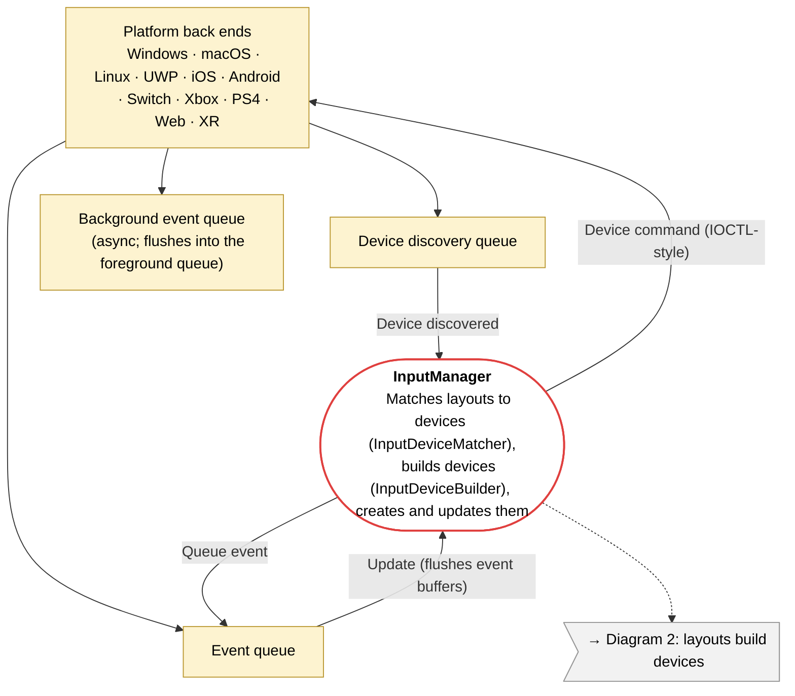
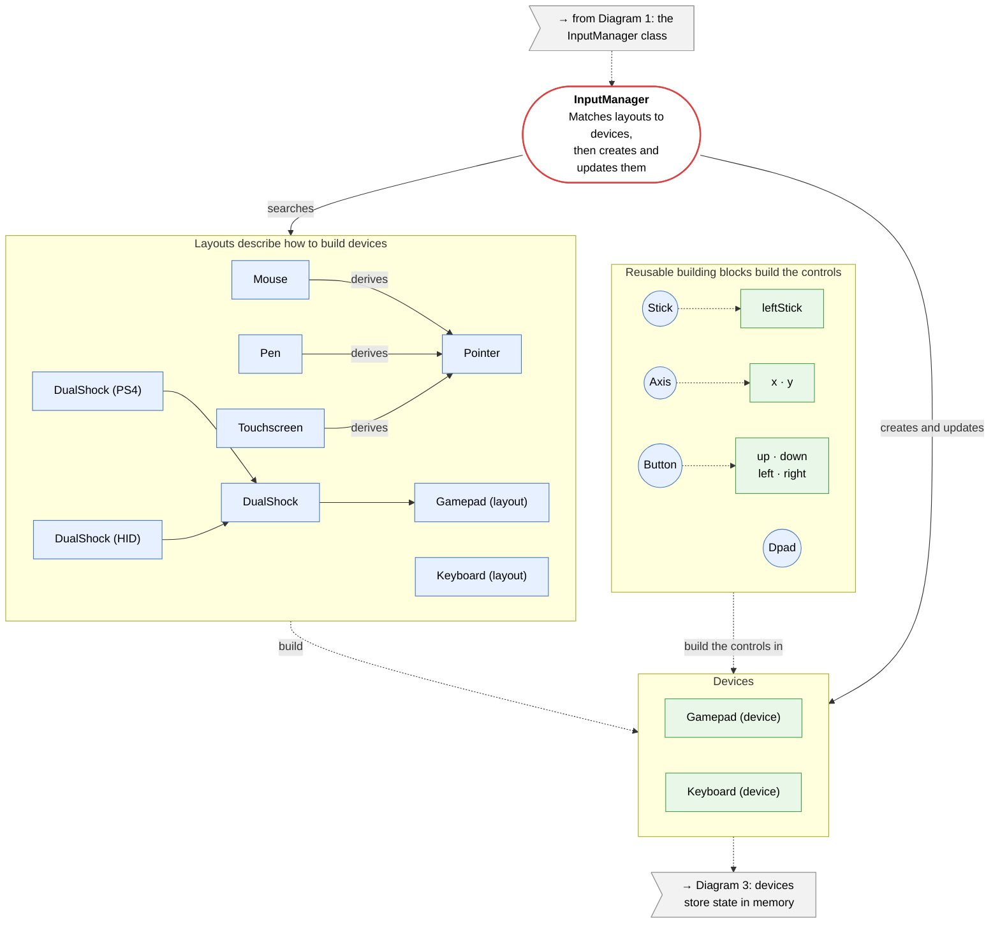
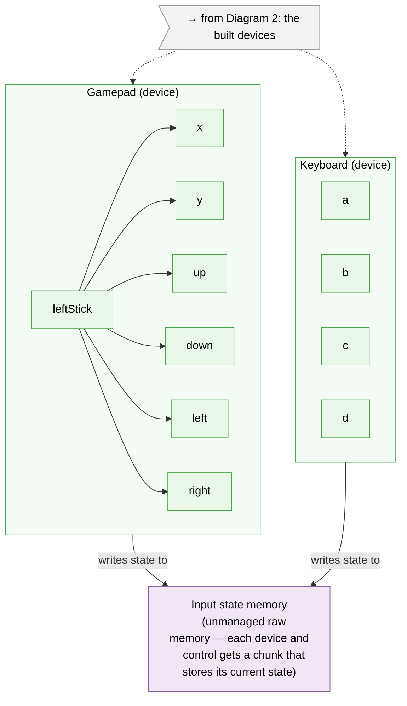
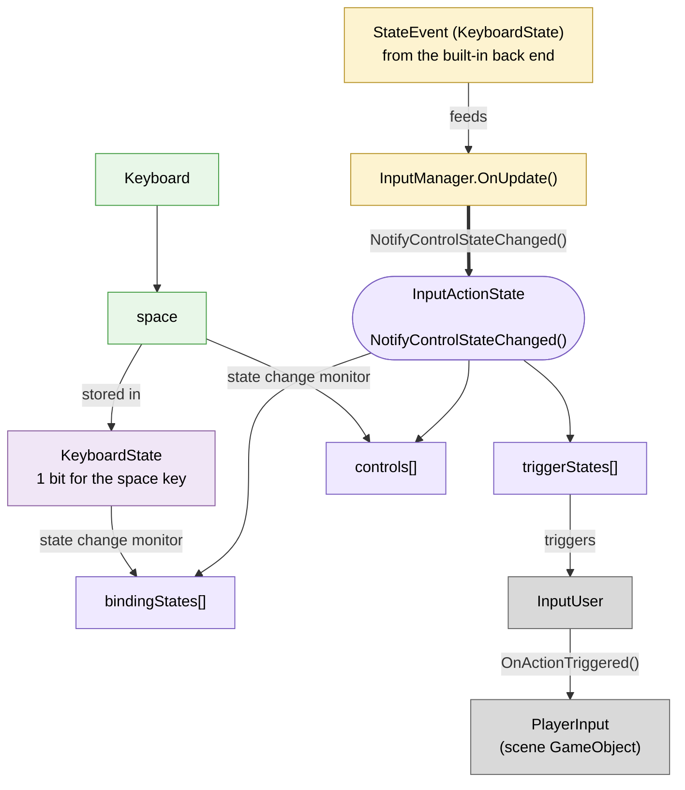
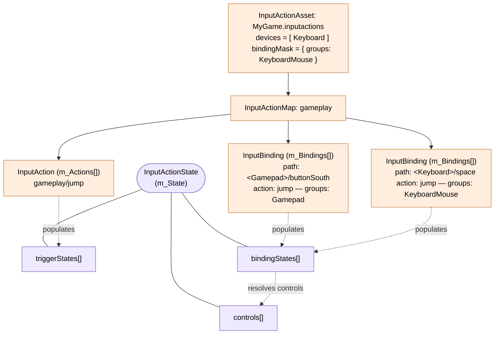

# Input System architecture

Understand how the Input System's low-level and high-level layers turn platform input into actions that your application responds to.

The Input System has two layers. The low-level layer receives raw input from the platform-specific back end that ships with Unity, and stores that input as device state in unmanaged memory. The high-level layer interprets that state as controls, actions, and bindings that your application code responds to.

This page describes the built-in back end that supplies the input, then the low-level system that stores it, then the high-level system that interprets it.

## The built-in back end

The foundation of the Input System is the built-in back-end code. This platform-specific code collects information about the available devices, and the input data from those devices. The code isn't part of the Input System package; it ships with Unity itself, and it has an implementation for each runtime platform that Unity supports. As a result, Unity must release an update to fix some platform-specific input issues. A new version of the Input System package can't fix them.

The Input System interfaces with the built-in back end in two ways:

- The built-in back end sends [events](input-events.md) to the Input System. These events tell the Input System when the platform adds or removes an [input device](devices.md), and when a device's state changes. For efficiency, the built-in back end reports these events as a simple buffer of raw, unmanaged memory that contains a stream of events.
- The Input System sends [commands](device-commands.md) to devices in the built-in back end. Commands are also buffers of memory that the built-in back end interprets. A command can have a different meaning for each device type and platform.

## The low-level system

The low-level Input System code processes and interprets the memory in the event stream that the built-in back end provides. It then dispatches individual events.

When the Input System discovers a device in the event stream, it creates a device representation for that device. The low-level code sees a device as a block of raw, unmanaged memory. When the low-level code receives a state event for a device, it writes the data from that event into the device's [state representation](control-state.md) in memory. The state therefore always holds an up-to-date representation of the device and all its controls.

The low-level system code also contains structs that describe the data layout of commonly known devices.

The low-level system works as a layered pipeline. The following three diagrams each show one stage of that pipeline:

1. The platform back ends queue events for the `InputManager` class.
2. The `InputManager` class uses layouts to build devices.
3. Each device writes its state into input state memory.

Each diagram ends with a node that names the diagram it hands off to.

**Note**: `InputManager` is the Input System class that owns devices and drives updates. Don't confuse it with the **Input Manager** window, which configures Unity's legacy input settings.

The following table describes the color coding that all the diagrams on this page use:

| **Color** | **Represents** |
| :--- | :--- |
| Yellow | Platform back ends, and the runtime plumbing that carries events between them and the Input System. |
| White with a red border | The `InputManager` class. |
| Blue | Layouts, and the reusable control building blocks that layouts are made from. |
| Green | Devices and their controls. |
| Purple | Input state memory. |
| Lavender | The `InputActionState` object and the arrays it holds. |
| Orange | Action assets, action maps, actions, and bindings. |
| Gray | Scene GameObjects, and the nodes that link one diagram to the next. |

### 1. Platform back ends queue events

The built-in back ends push discovery and state events into three queues that drive the `InputManager` class. The `InputManager` class sends commands back to the back ends.

```mermaid
flowchart TB
    %% Diagram 1 of 3: platform back ends queue events
    backends["Platform back ends
    Windows · macOS · Linux · UWP · iOS · Android
    · Switch · Xbox · PS4 · Web · XR"]
    DDQ["Device discovery queue"]
    EQ["Event queue"]
    BEQ["Background event queue
    (async; flushes into the foreground queue)"]
    InputManager(["<b>InputManager</b>
    Matches layouts to devices (InputDeviceMatcher),
    builds devices (InputDeviceBuilder), creates and updates them"])

    backends --> DDQ & EQ & BEQ
    DDQ -->|"Device discovered"| InputManager
    EQ -->|"Update (flushes event buffers)"| InputManager
    InputManager -->|"Queue event"| EQ
    InputManager -->|"Device command (IOCTL-style)"| backends

    InputManager -.-> out1>"→ Diagram 2: layouts build devices"]

    classDef runtime fill:#fdf3d0,stroke:#b9962e,color:#000;
    classDef manager fill:#ffffff,stroke:#e0403f,stroke-width:2px,color:#000;
    classDef signpost fill:#f2f2f2,stroke:#999,color:#000;
    class backends,DDQ,EQ,BEQ runtime;
    class InputManager manager;
    class out1 signpost;
```

### 2. Layouts build devices

Layouts derive from one another. Together with reusable control building blocks, they describe how to build devices and their controls. The `InputManager` class searches these layouts and creates the concrete devices.

For example, the `Mouse`, `Pen`, and `Touchscreen` layouts all derive from the `Pointer` layout, and the PS4 and HID variants of `DualShock` both derive from a shared `DualShock` layout that in turn derives from `Gamepad`. Building blocks such as `Stick`, `Axis`, `Button`, and `Dpad` supply the individual controls that each device exposes.

```mermaid
flowchart TB
    %% Diagram 2 of 3: layouts build devices
    %% Bands stack top-to-bottom; each band is compact left-to-right.

    in2>"→ from Diagram 1: the InputManager class"] -.-> InputManager
    InputManager(["<b>InputManager</b>
    Matches layouts to devices,
    then creates and updates them"])

    %% ---- Band A: layouts derive from one another ----
    subgraph LAYOUTS["Layouts describe how to build devices"]
        direction LR
        Mouse -->|derives| Pointer
        Pen -->|derives| Pointer
        Touchscreen -->|derives| Pointer
        DS_PS4["DualShock (PS4)"] --> DualShock
        DS_HID["DualShock (HID)"] --> DualShock
        DualShock --> Gamepad_L["Gamepad (layout)"]
        Keyboard_L["Keyboard (layout)"]
    end

    %% ---- Band B: reusable building blocks build the controls ----
    subgraph BLOCKS["Reusable building blocks build the controls"]
        direction LR
        Stick(("Stick")) -.-> leftStick["leftStick"]
        Axis(("Axis")) -.-> axes["x · y"]
        Button(("Button")) -.-> buttons["up · down
        left · right"]
        Dpad(("Dpad"))
    end

    %% ---- Band C: the devices the InputManager class creates ----
    subgraph DEVICES["Devices"]
        direction LR
        Gamepad_D["Gamepad (device)"]
        Keyboard_D["Keyboard (device)"]
    end

    %% ---- Cross-band flow (top-to-bottom) ----
    InputManager -->|"searches"| LAYOUTS
    LAYOUTS -.->|"build"| DEVICES
    BLOCKS -.->|"build the controls in"| DEVICES
    InputManager -->|"creates and updates"| DEVICES

    DEVICES -.-> out2>"→ Diagram 3: devices store state in memory"]

    classDef layout fill:#e6f0ff,stroke:#4a78c0,color:#000;
    classDef device fill:#e8f7e8,stroke:#4aa04a,color:#000;
    classDef manager fill:#ffffff,stroke:#e0403f,stroke-width:2px,color:#000;
    classDef signpost fill:#f2f2f2,stroke:#999,color:#000;
    class Mouse,Pen,Touchscreen,Pointer,DS_PS4,DS_HID,DualShock,Gamepad_L,Keyboard_L,Stick,Axis,Button,Dpad layout;
    class Gamepad_D,Keyboard_D,leftStick,axes,buttons device;
    class InputManager manager;
    class in2,out2 signpost;
```

### 3. Devices store their state in memory

Each built device exposes a tree of controls. When state events arrive, the Input System writes the device and control state into input state memory, where each device and control has its own chunk of unmanaged memory.

For example, a `Gamepad` device exposes a `leftStick` control that resolves to the `x`, `y`, `up`, `down`, `left`, and `right` controls, and a `Keyboard` device exposes one control per key. Both devices write into the same input state memory.

```mermaid
flowchart TB
    %% Diagram 3 of 3: devices store their state in memory
    %% Outer flow is top-to-bottom; subgraphs run left-to-right so controls stay readable.
    in3>"→ from Diagram 2: the built devices"] -.-> GP & KB

    subgraph GP["Gamepad (device)"]
        direction LR
        leftStick["leftStick"] --> x & y & up & down & left & right
    end

    subgraph KB["Keyboard (device)"]
        direction LR
        a
        b
        c
        d
    end

    StateMemory["Input state memory
    (unmanaged raw memory — each device and
    control gets a chunk that stores its current state)"]

    GP -->|"writes state to"| StateMemory
    KB -->|"writes state to"| StateMemory

    classDef device fill:#e8f7e8,stroke:#4aa04a,color:#000;
    classDef mem fill:#f0e6f6,stroke:#8a5ea0,color:#000;
    classDef signpost fill:#f2f2f2,stroke:#999,color:#000;
    class leftStick,x,y,up,down,left,right,a,b,c,d device;
    class StateMemory mem;
    class in3 signpost;
    style GP fill:#f4faf4,stroke:#4aa04a,color:#000;
    style KB fill:#f4faf4,stroke:#4aa04a,color:#000;
```

## The high-level system

The high-level Input System code uses [layouts](Layouts.md) to interpret the data in a device's state buffers. Layouts describe a device's data and its controls in memory. The Input System creates layouts from the predefined structs of commonly known devices that the low-level system supplies, or dynamically at runtime. For example, the Input System creates layouts at runtime for [generic HIDs](hid-specification.md).

Based on the information in the layouts, the Input System creates a representation for each of the device's [controls](controls.md). You can then read the state of each control individually.

The high-level system also lets you do the following:

- Map controls to your application's mechanics. Use [actions](Actions.md) to [bind](bindings.md) one or more controls to an input in your application. The Input System monitors these controls for state changes, and notifies your application logic through [callbacks](set-callbacks-on-actions.md).
- Specify more complex behaviors for your actions. [Processors](Processors.md) transform the input data before the Input System sends it to you, and [interactions](Interactions.md) let you specify patterns of input on a control to listen for, such as multi-taps.

Two diagrams describe the high-level system: one for how input flows through the system at runtime, and one for how you author actions as assets. Both diagrams show a single player. Each additional player has its own `InputActionState` object. Each additional player also has a cloned `InputActionAsset` object with its own device list and binding mask.

### Runtime input flow

At runtime, input reaches your scene through four steps:

1. The Input System writes a device's control state into input state memory.
2. A state change monitor notices the change.
3. The Input System updates the `InputActionState` object.
4. The resulting action fires a callback on the `PlayerInput` component in the scene.

The following diagram traces those steps for a single control, the space key on a keyboard. The keyboard's space control stores its value as one bit of `KeyboardState`. A `StateEvent` object carrying that state feeds `InputManager.OnUpdate()`, which calls `NotifyControlStateChanged()` on the `InputActionState` object. That object holds three arrays: `triggerStates[]`, `bindingStates[]`, and `controls[]`. State change monitors update the binding and control arrays, and the trigger array notifies `InputUser`, which calls `OnActionTriggered()` on the `PlayerInput` component.

```mermaid
flowchart TB
    %% ---------- Devices ----------
    Keyboard["Keyboard"] --> space["space"]

    %% ---------- Input state memory ----------
    KBbit["KeyboardState
    1 bit for the space key"]
    space -->|"stored in"| KBbit

    %% ---------- Runtime ----------
    StateEvent["StateEvent (KeyboardState)
    from the built-in back end"] -->|feeds| OnUpdate["InputManager.OnUpdate()"]

    %% ---------- Action state ----------
    AState(["InputActionState
    NotifyControlStateChanged()"])
    trig["triggerStates[]"]
    bind["bindingStates[]"]
    ctrl["controls[]"]
    AState --> trig & bind & ctrl
    OnUpdate ==>|"NotifyControlStateChanged()"| AState
    KBbit -->|"state change monitor"| bind
    space -->|"state change monitor"| ctrl

    %% ---------- Callback out to the scene ----------
    trig -->|triggers| IU["InputUser"]
    IU -->|"OnActionTriggered()"| PI["PlayerInput
    (scene GameObject)"]

    classDef device fill:#e8f7e8,stroke:#4aa04a,color:#000;
    classDef mem fill:#f0e6f6,stroke:#8a5ea0,color:#000;
    classDef astate fill:#efe9ff,stroke:#7a5ec0,color:#000;
    classDef runtime fill:#fdf3d0,stroke:#b9962e,color:#000;
    classDef go fill:#d9d9d9,stroke:#666,color:#000;
    class Keyboard,space device;
    class KBbit mem;
    class AState,trig,bind,ctrl astate;
    class StateEvent,OnUpdate runtime;
    class IU,PI go;
```

### Action asset structure

An `InputActionAsset` object contains action maps, actions, and bindings. At runtime, these populate the arrays inside the `InputActionState` object that the previous diagram shows.

The following diagram shows an asset named `MyGame.inputactions` that lists `Keyboard` as its device and masks bindings to the `KeyboardMouse` group. The asset contains a `gameplay` action map, which contains a `jump` action and two bindings for that action: `<Keyboard>/space` in the `KeyboardMouse` group, and `<Gamepad>/buttonSouth` in the `Gamepad` group. The action populates `triggerStates[]`, the bindings populate `bindingStates[]`, and the binding states resolve to `controls[]`.

```mermaid
flowchart TB
    %% ---------- Asset hierarchy ----------
    Asset["InputActionAsset: MyGame.inputactions
    devices = [ Keyboard ]
    bindingMask = { groups: KeyboardMouse }"]
    Map["InputActionMap: gameplay"]
    Act["InputAction (m_Actions[])
    gameplay/jump"]
    Bind_a["InputBinding (m_Bindings[])
    path: &lt;Keyboard&gt;/space
    action: jump — groups: KeyboardMouse"]
    Bind_b["InputBinding (m_Bindings[])
    path: &lt;Gamepad&gt;/buttonSouth
    action: jump — groups: Gamepad"]
    Asset --> Map
    Map --> Act
    Map --> Bind_a & Bind_b

    %% ---------- Populates the runtime action state ----------
    Act -.->|populates| trig["triggerStates[]"]
    Bind_a -.->|populates| bind["bindingStates[]"]
    Bind_b -.->|populates| bind
    bind -.->|resolves controls| ctrl["controls[]"]
    State(["InputActionState
    (m_State)"]) --- trig & bind & ctrl

    classDef asset fill:#ffeede,stroke:#c07a3a,color:#000;
    classDef astate fill:#efe9ff,stroke:#7a5ec0,color:#000;
    class Asset,Map,Act,Bind_a,Bind_b asset;
    class trig,bind,ctrl,State astate;
```

## Additional resources

- [Input events](input-events.md)
- [Device commands](device-commands.md)
- [Control state](control-state.md)
- [Layouts](Layouts.md)
- [Controls](controls.md)
- [Actions](Actions.md)
- [Bindings](bindings.md)
