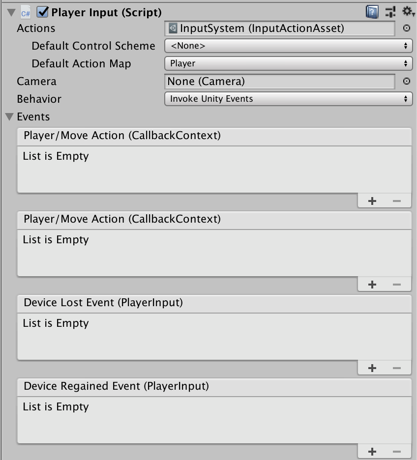

# GameObject Components for Input

Two `MonoBehaviour` components are available to simplify setting up and working with input. They are generally the quickest and easiest way to get started with input in Unity.

|Component|Description|
|---------|-----------|
|[`PlayerInput`](#playerinput-component)|Represents a single player along with the player's associated [input actions](Actions.md).|
|[`PlayerInputManager`](#playerinputmanager-component)|Handles setups that allow for several players including scenarios such as player lobbies and split-screen gameplay.|

>NOTE: These components are built on top of the public input system API. As such, they don't do anything that you cannot program yourself. They are meant primarily as an easy out-of-the-box setup to obsolete much of the need for custom scripting.

## `PlayerInput` Component


Each `PlayerInput` represents a separate player in the game. Multiple `PlayerInput` instances may coexist at the same time (though not on the same `GameObject`) to represent local multiplayer setups. Each player will be paired to a unique set of devices for exclusive use by the player, although it is possible to manually pair devices such that players share a device (e.g. for left/right keyboard splits or hotseat use).

Each `PlayerInput` corresponds to one [`InputUser`](UserManagement.md). The `InputUser` can be queried from the component using `PlayerInput.user`.

You can use the following properties to configure `PlayerInput`.

|Property|Description|
|--------|-----------|
|`Actions`|The set of [input actions](Actions.md) associated with the player. To receive input, each player must have an associated set of actions. See [here](#actions) for details.|
|`Default Control Scheme`|Which [control scheme](ActionBindings.md#control-schemes) to use from what is defined in `Actions` by default.|
|`Default Action Map`|Which [action map](Actions.md#overview) in `Actions` to enable by default. If set to `None`, then the player will start out with no actions being enabled.|
|`Camera`|The individual camera associated with the player.<br><br>This is __only required__ when employing [split-screen](#split-screen) setups. It has no effect otherwise.|
|`Behavior`|How the `PlayerInput` component notifies game code about things that happen with the player. See [here](#notification-behaviors).|

### Actions

To receive input, each player requires an associated set of input actions. When creating these through the "Create Actions..." button in the `PlayerInput` inspector, a default set of actions will be created. However, the `PlayerInput` component places no restrictions on the arrangement of actions.

`PlayerInput` will handle [enabling and disabling](Actions.md#using-actions) automatically and will also take care of installing [callbacks](Actions.md#responding-to-actions) on the actions. Also, when multiple `PlayerInput` components use the same actions, the components will automatically take care of creating [private copies of the actions](Actions.md#using-actions-with-multiple-players).

When first enabled, `PlayerInput` will enable all actions from the action map identified by `Default Action Map`. If no default action map has been set, no actions will be enabled by default. To manually enable actions, you can simply call `Enable` and `Disable` on the action maps or actions like you would do [without `PlayerInput`](Actions.md#using-actions). You can check or switch which action map is currently enabled using the `PlayerInput.currentActionMap` property. To switch action maps by action map name, you can also call `PlayerInput.SwitchActions`.

To disable input on a player, call `PlayerInput.PassivateInput`. To re-enable it, call `PlayerInput.ActivateInput`. The latter will enable the default action map, if set.

When `PlayerInput` is disabled, it will automatically disable the currently active action map (`PlayerInput.currentActionMap`) and disassociate any devices paired to the player.

See [the following section](#notification-behaviors) for how to be notified when an action is triggered by a player.

#### `SendMessage`/`BroadcastMessage` Actions

When the [notification behavior](#notification-behaviors) of `PlayerInput` is set to `Send Messages` or `Broadcast Messages`, actions can be responded to by defining methods in components like so:

```CSharp
public class MyPlayerScript : MonoBehaviour
{
    // "fire" action becomes "OnFire" method. If you're not interested in the
    // value from the control that triggers the action, simply have a method
    // without arguments.
    public void OnFire()
    {
    }

    // If you are interested in the value from the control that triggers an action,
    // you can declare a parameter of type InputValue.
    public void OnMove(InputValue value)
    {
        // Read value from control. The type depends on what type of controls
        // the action is bound to.
        var v = value.Get<Vector2>();

        // IMPORTANT: The given InputValue is only valid for the duration of the callback.
        //            Storing the InputValue references somewhere and calling Get<T>()
        //            later will not work correctly.
    }
}
```

The component must sit on the same `GameObject` if `Send Messages` is chosen or on the same or any child `GameObject` if `Broadcast Messages` is chosen.

#### `UnityEvent` Actions

When the [notification behavior](#notification-behaviors) of `PlayerInput` is set to `Invoke Unity Events`, each action has to individually be routed to a target method. The methods have the same format as the [`started`, `performed`, and `cancelled` callbacks](Actions.md#started-performed-and-cancelled-callbacks) on `InputAction`.

```CSharp
public class MyPlayerScript : MonoBehaviour
{
    public void OnFire(InputAction.CallbackContext context)
    {
    }

    public void OnMove(InputAction.CallbackContext context)
    {
        var value = context.ReadValue<Vector2>();
    }
}
```

### Notification Behaviors

You can use the `Behavior` property in the inspector  to determine how a `PlayerInput` component notifies game code when something related to the player has occurred. The following options are available to choose the specific mechanism that `PlayerInput` employs.

|Behavior|Description|
|--------|-----------|
|`Send Messages`|Uses `GameObject.SendMessage` on the `GameObject` that the `PlayerInput` component belongs to. The messages that will be sent by the component are shown in the UI.|
|`Broadcast Messages`|Like `Send Message` but instead of `GameOBject.SendMessage` uses `GameObject.BroadcastMessage`. This will broadcast the message down the `GameObject` hierarchy.|
|`Invoke Unity Events`|Uses a separate `UnityEvent` for each individual type of message. When this is selected, the events that are available on the given `PlayerInput` are accessible from the "Events" foldout. The argument received by events triggered for actions is the same as the one received by [`started`, `performed`, and `cancelled` callbacks](Actions.md#started-performed-and-cancelled-callbacks).<br><br>|
|`Invoke CSharp Events`|Similar to `Invoke Unity Events` except that the events are plain C# events available on the `PlayerInput` API. These cannot be initialized from the inspector but have to be manually registered callbacks for in script.<br><br>The following events are available:<br><br><ul><li><em>onActionTriggered</em> (collective event for all actions on the player)</li><li><em>onDeviceLost</em></li><li><em>onDeviceRegained</em></li></ul>|

In addition to per-action notifications, the following general notifications are employed by `PlayerInput`.

|Notification|Description|
|------------|-----------|
|`Device Lost`|The player has lost one of the devices assigned to it. This can happen, for example, if a wireless device runs out of battery.|
|`Device Regained`||

### Control Schemes

### Device Assignments

Each `PlayerInput` can be assigned one or more devices. By default, no two `PlayerInput` components will be assigned the same devices &mdash; although this can be forced explicitly by manually assigning devices to a player when calling `PlayerInput.Instantiate` or by calling `InputUser.PerformPairingWithDevice` on the `InputUser` of a `PlayerInput`.

The devices assigned .

### UI Input

    ////TODO: This is still being worked on

### Local Multiplayer

In local multiplayer games,


## `PlayerInputManager` Component


If a game can have more than a single player, as is the case in a local co-op game for example, then some part of the game has to manage aspects like how players join the game and which devices get paired to which player. The `PlayerManager` component takes care of this and can handle both single-player and multi-player setups.

|Property|Description|
|--------|-----------|
|`Join Behavior`||
|`Player Prefab`||
|`Joining Enabled By Default`||
|`Limit Number of Players`||
|`Enable Split-Screen`||

### Player Joining

#### Lobbies

Many local multiplayer games employ lobbies where all players have to join the game before the game itself is started. In a lobby, it is often undesirable to have a player's full in-game representation active &mdash; both in terms of how the player is rendered as well as how it receives input.

TODO

### Split-Screen

By default, any UI elements can be interacted with by any player in the game. However, in split-screen setups, it is possible to have screen-space UIs that are restricted to just one specific camera.

>NOTE: This only pertains to `Canvas` components that have `Render Mode` set to `Screen-Space Camera`. World-space UIs can be interacted with by any player. If you need to be able to tell which player initiated an interaction with a world-space UI element, use `UIInputModule.currentDevice` to get the device that triggered the current UI event and then find the player who owns the device.


### `PlayerInputManager` Notifications

`PlayerInputManager` sends notifications when something notable happens with the current player setup. How these notifications are delivered through the `Notification Behavior` property the [same way as for `PlayerInput`](#notification-behaviors).

You can listen to the following notifications.

|Notification|Description|
|------------|-----------|
|`Player Joined`|A new player has joined the game. Passes the `PlayerInput` instance of the player who has joined.<br><br>Note that if there are already active `PlayerInput` components present when `PlayerInputManager` is enabled, it will send a `Player Joined` notification for each of these.|
|`Player Left`||
