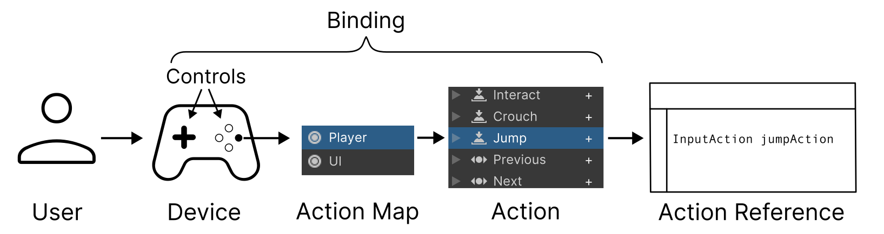

# Basic Concepts

This page introduces the basic concepts that relate to working with the Input System. They relate to the steps in the sequence of events that occur when a user sends input to your game or app. The Input System provides features which implement these steps, or you can choose to implement some of them yourself.

|Concept|Description|
|-------|-----------|
|[**User**](UserManagement.html)| The person playing your game or using your app, by holding or touching the input device and providing input.|
|[**Input Device**](SupportedDevices.html)| Often referred to just as a "**device**" within the context of input. A physical piece of hardware, such as a keyboard, gamepad, mouse, or touchscreen which allows the user to send input into Unity.|
|[**Control**](Controls.html)|The separate individual parts of an input device which each send input values into Unity. For example, a gamepad’s **controls** comprise multiple buttons, sticks and triggers, and a mouse’s controls include the two X and Y sensors on the underside, and the various buttons and scroll wheels on the top side.|
|[**Action**](Actions.html)| Actions are a high-level concept that describe individual things that a user might want to do in your game or app, such as "Jump" within a game, or "Select" in an on-screen UI. They are things a user can do in your game or app as a result of input, regardless of what device or control they use to perform it. Actions generally have conceptual names that you choose to suit your project, and should usually be verbs. For example "Run", "Jump" "Crouch", "Use", "Start", "Quit".|
|[**Action Map**](ActionsEditor.html#configure-action-maps) | Action Maps allow you to organise Actions into groups which represent specific situations where a set of actions make sense together. You can simultaneously enable or disable all Actions in an action map, so it is useful to group Actions in Action Maps by the context in which they are relevant. For example, you might have one action map for controlling a player, and another for interacting with your game's UI.|
|[**Binding**](ActionBindings.html)| A connection defined between an **Action** and specific device controls. For example, your "Move" action might have bindings to the arrow keys and WSAD keys on the keyboard, and the left stick on a joypad, and the primary 2D axis on a VR controller. Multiple bindings like this means your game can accept cross-platform input. |
|[**Your Action Code**](RespondingToActions.md)| The part of your script which is executed based on the actions you have configured. In your code, you can use references to actions to either read the current value or state of the action (also known as "polling"), or set up a callback to call your own method when actions are performed.|
|[**Action Asset**](ActionAssets.md) | An asset type which contains a saved configuration of Action Maps, Actions and Bindings. You can specify one Action Asset in your project as the [project-wide actions](ProjectWideActions.md), which allows you to easily reference those actions in code by using [`InputSystem.actions`](../api/UnityEngine.InputSystem.InputSystem.html). |
