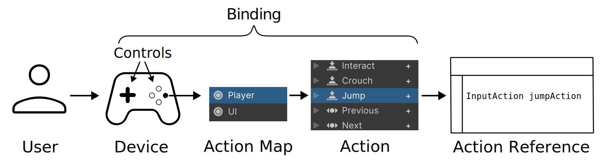

# Input System Concepts

This page introduces the concepts that relate to working with the Input System.

When you become familiar with these concepts, you will be able to understand the difference between the [workflows](Workflows.html) available within the Input System, and choose which workflow best suits your project.

## Basic concepts

These basic concepts and terms refer to the steps in the sequence of events that occur when a user sends input to your game or app. The Input System provides features which implement these steps, or you can choose to implement some of them yourself.

|Concept|Description|
|-------|-----------|
|[**User**](UserManagement.html)| The person playing your game or using your app, by holding or touching the input device and providing input.|
|[**Input Device**](SupportedDevices.html)| Often referred to just as a "**device**" within the context of input. A physical piece of hardware, such as a keyboard, gamepad, mouse, or touchscreen which allows the user to send input into Unity.|
|[**Controls**](Controls.html)|The separate individual parts of an input device which each send input values into Unity. For example, a gamepad’s **controls** comprise multiple buttons, sticks and triggers, and a mouse’s controls include the two X and Y sensors on the underside, and the various buttons and scroll wheels on the top side.|
|[**Interactions**](Interactions.html)|These describe different ways of using the controls on a device. For example, pressing a button down, releasing a button, a long press, or a double tap. Interactions can be thought of as "patterns of input". The Input System provides ways of identifying and responding to different types of interaction.|
|[**Actions**](Actions.html)| These are things a user can do in your game or app as a result of input, regardless of what device or control they use to perform it. Actions generally have conceptual names that you choose to suit your project, and should usually be verbs. For example "Run", "Jump" "Crouch", "Use", "Start", "Quit". The Input System can help you manage and edit your actions, or you can implement them yourself.|
|[**Action Asset**](ActionAssets.html)|An asset type which allows you to define and configure groups of actions as a set. The Action Asset UI allows you to bind controls, group related actions into [**Action Maps**](ActionAssets.html#editing-action-maps), and specify which controls belong to different [**Control Schemes**](ActionAssets.html#editing-control-schemes).|
|[**Embedded Actions**](Actions.html#creating-actions-by-embedding-them-in-monobehaviours)|Actions defined directly as fields in your scripts (as opposed to in an Action Asset). These types of action are the same as those defined in an Action Asset, and their inspector UI allows you to bind controls. However, because they’re defined as individual fields in your script, you do not benefit from the Action Asset’s ability to group Actions together into Action Maps and Control Schemes.|
|[**Binding**](ActionBindings.html)| A connection defined between an **Action** and one or more **Controls**. For example, in a car racing game, pressing the right shoulder button on a controller might be bound to the action "Change Gear Up". The **Action Asset** and **Embedded Actions** both provide a similar UI to create and edit bindings.|

## Extended concepts

These concepts relate to more advanced handling of input, and aren't necessary to understand straight away if you are implementing simple input, or learning about the system for the first time.

|Concept|Description|
|-------|-----------|
|[**Processor**](Processors.md)|An operation that the Input System applies to an input value. For example, an "invert" Processor inverts a floating-point value.|
|[**Phase**](Interactions.md#operation)|The current state of an [Interaction](Interactions.md), for example, "Started", "Performed", or "Canceled".|
|[**Control Scheme**](ActionBindings.md#control-schemes)|Allows you to define mappings of Bindings to different Control Schemes, and to switch your Action Maps between different Control Schemes to enable different subsets of Bindings for your Actions. Control Schemes can have associated Device types, so that the game can automatically enable them for [users](UserManagement.md) when using that type of Device.|
|[**Action Map**](ActionAssets.md#editing-action-maps)|A named collection of Actions. You can simultaneously enable or disable all Actions in an action map, so it is useful to group Actions in Action Maps by the context in which they are relevant (for example: "gameplay").|
