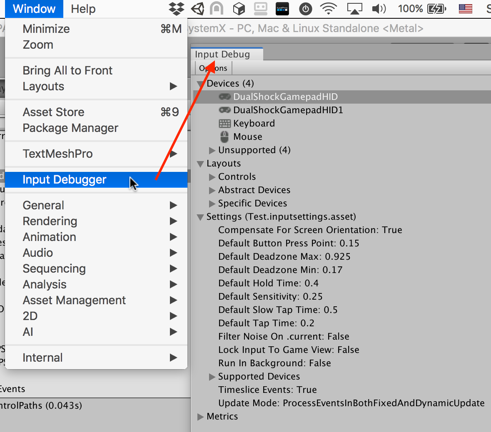
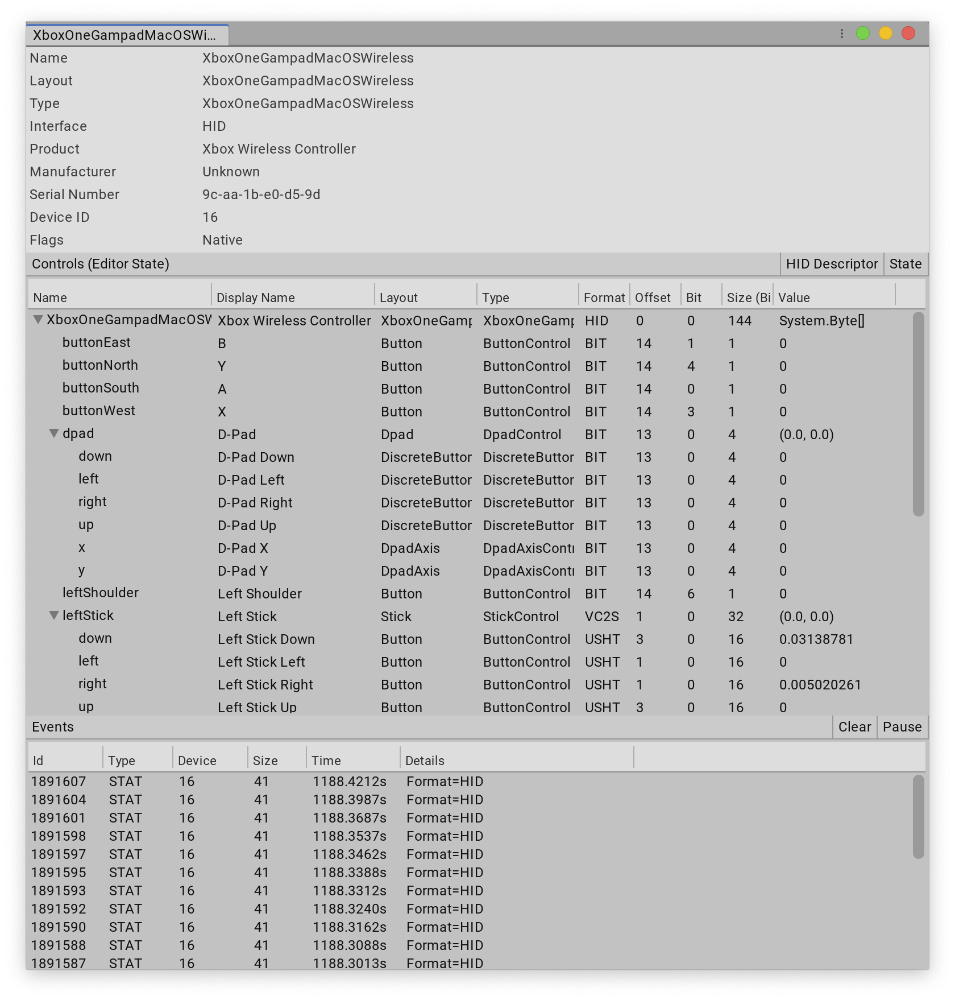
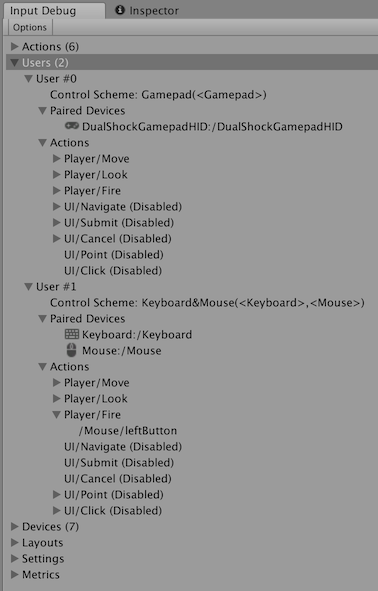
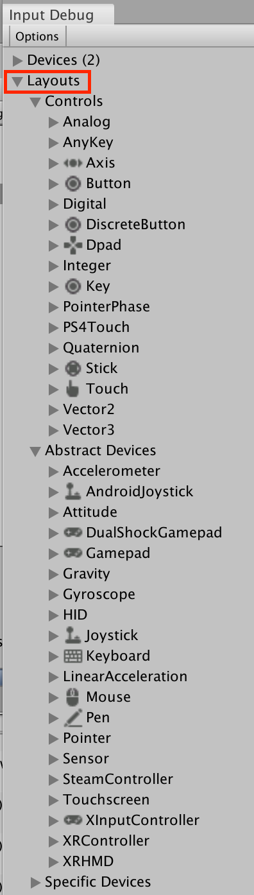
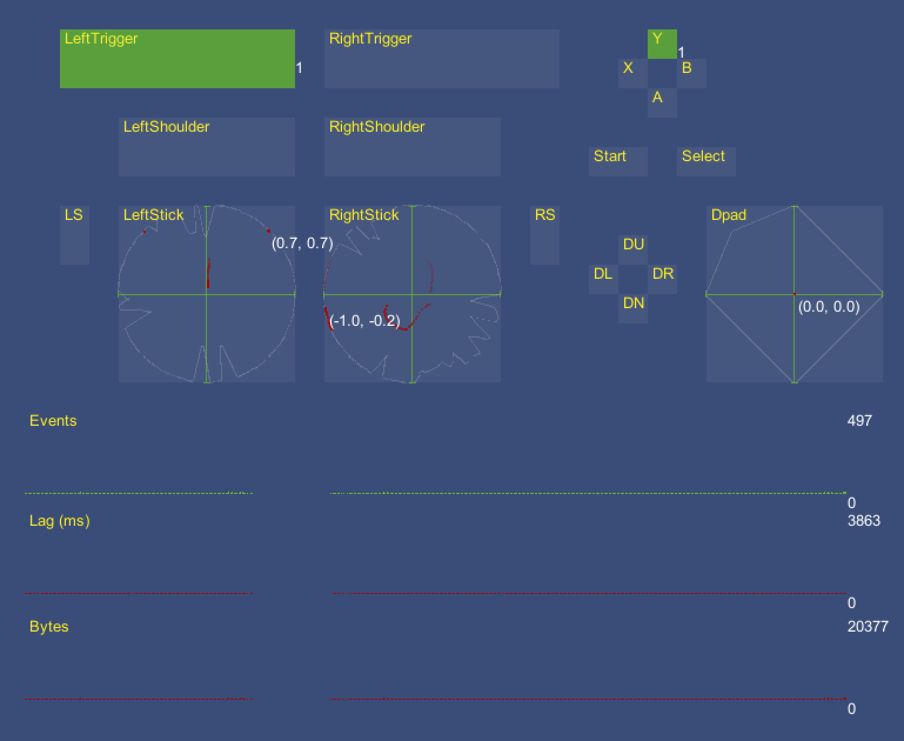

# Debugging

- [Debugging](#debugging)
  - [Input Debugger](#input-debugger)
    - [Debugging Devices](#debugging-devices)
    - [Debugging Actions](#debugging-actions)
    - [Debugging users and PlayerInput](#debugging-users-and-playerinput)
    - [Debugging layouts](#debugging-layouts)
    - [Debugging remotely](#debugging-remotely)
  - [Input visualizers](#input-visualizers)
    - [`InputControlVisualizer`](#inputcontrolvisualizer)
    - [`InputActionVisualizer`](#inputactionvisualizer)
  - [Device Simulator](#device-simulator)
  - [Unity Remote (iOS, Android)](#unity-remote)
  - [Other tips:](#other-tips)

When something isn't working as expected, the quickest way to troubleshoot what's wrong is the Input Debugger in the Unity Editor. The Input Debugger provides access to the activity of the Input System in both the Editor and the connected Players.

To open the Input Debugger, go to __Window > Analysis > Input Debugger__ from Unity's main menu.

## Input Debugger



The Input Debugger displays a tree breakdown of the state of the Input System.

|Item|Description|
|----|-----------|
|Devices|A list of all [Input Devices](Devices.md) that are currently in the system, and a list of unsupported/unrecognized Devices.|
|Layouts|A list of all registered Control and Device layouts. This is the database of supported hardware, and information on how to represent a given piece of input hardware.|
|Actions|Only visible in Play mode, and only if at least one [Action](Actions.md) is enabled.<br><br>A list of all currently enabled Actions, and the Controls they are bound to.<br><br>See [Debugging Actions](#debugging-actions).|
|Users|Only visible when one or more `InputUser` instances exist. See documentation on [user management](UserManagement.md).<br><br>A list of all currently active users, along with their active Control Schemes and Devices, all their associated Actions, and the Controls these Actions are bound to.<br><br>Note that `PlayerInput` uses `InputUser` to run. When using `PlayerInput` components, each player has an entry in this list.<br><br>See [Debugging users and PlayerInput](#debugging-users-and-playerinput).|
|Settings|The currently active Input System [settings](Settings.md).|
|Metrics|Statistics about Input System resource usage.|

### Debugging Devices

In the Input Debugger window, navigate to the __Devices__ list and double-click any [Input Device](Devices.md). This opens a window that displays information about the Device, including real-time state information for its Controls.



The top of the Device window displays general information about the specific Device, such as name, manufacturer, and serial number.

The __Controls__ section lists the Device's Controls and their individual states. This is useful when debugging input issues, because you can verify whether the data that the Input System receives from the Input Device is what you expect it to be. There are two buttons at the top of this panel:

* __HID Descriptor__: Only displayed for devices that use the HID protocol to connect. This opens a window that displays the detailed [HID](HID.md) specifications for the Device and each of it's logical controls.

* __State__: Display the current state of the Device in a new window. This is identical to the information displayed in this view, but doesn't update in real time, so you can take a snapshot of input state data and take the time to inspect it as needed.

The __Events__ section lists all [input events](Events.md) generated by the Device. You can double-click any event in the list to inspect the full Device state at the time the event occurred. To get a side-by-side difference between the state of the Device at different points in time, select multiple events, right-click them, and click __Compare__ from the context menu.

### Debugging Actions

The Input Debugger window lists all enabled [Actions](Actions.md) in the __Actions__ list. This list only appears if at least one Action is active and the Editor is in Play mode. If an Action has actively bound Controls, you can click the arrow next to the Action to see a list of the Controls. This is useful to debug whether your Bindings correctly map to the Controls you want them to bind to. See documentation on [Binding resolution](ActionBindings.md#binding-resolution) for more information about how Unity maps Bindings to Controls.

>__Note__: Actions that belong to [`InputUsers`](UserManagement.md) don't appear here. They appear in the [__Users__](#debugging-users-and-playerinput) list instead.

### Debugging users and PlayerInput

When there are [`InputUser`](UserManagement.md) instances (if you use `PlayerInput`, each `PlayerInput` instance implicitly creates one), the Input Debugger's __Users__ list displays each instance along with its paired Devices and active Actions. The listed Devices and Actions work the same way as those displayed in the [__Devices__](#debugging-devices) and [__Actions__](#debugging-actions) lists in the debugging window.



### Debugging layouts

The [__Layouts__](Layouts.md) list in the Input Debugger window displays a breakdown of all registered [Control and Device layouts](Layouts.md). This is the database of supported hardware and the knowledge of how to represent a given piece of input hardware. It's useful when you want to [create a new Device mapping](HID.md#creating-a-custom-device-layout) and see how the Input System represents it.



### Debugging remotely

You can connect the Input Debugger to a Player that runs on a remote computer or device. This makes it possible to observe input activity from the Player in the Editor. This connection uses the `PlayerConnection` mechanism, which is the same one the Unity profiler uses to connect to a Player.

>__Note__: At the moment, debugging input in Players is restricted to seeing Devices and events from connected Players. There is no support for seeing other input-related data such as Actions and input users from Players.

To see remote Devices from built Players, open the Input Debugger window's __Remote Devices__ drop-down list. This list displays the remote Player instance you can connect to (if there are any). The same list appears in the Profiler and Console windows, and any connections are shared between those windows. If any Player(s) are connected, you can enable __Show remote devices__ in the same drop-down list. If Players are connected, and __Show remote devices__ is enabled, the [__Devices__](#debugging-devices) list in the Input Debugger window splits into a __Local__ section and a __Remote__ section. The __Remote__ section displays any Input Device from any connected Player, and lets you inspect Device state and events in real time, as if it were a local Device.

## Input visualizers

The Input System package comes with a __Visualizers__ sample, which provides various components which let you monitor the state of various Input System elements in real time using on-screen visualizers.

To install the sample, navigate to the Input System package in the Package Manager window (see [Installation](Installation.md)), and next to the __Visualizers__ sample, click __Import in project__.

The sample provides two visualizer components:

### `InputControlVisualizer`

Visualizes the current state of a single Control in real time. You can have multiple Control visualizers to visualize the state of multiple Controls. Check the `GamepadVisualizer`, `MouseVisualizer`, or `PenVisualizer` Scenes in the sample for examples.



### `InputActionVisualizer`

Visualizes the current state of a single Action in real time. You can have multiple Action visualizers to visualize the state of multiple Actions. This can also display the current value of the Action and the Control currently driving the Action, and track the state of [Interactions](Interactions.md) over time. Check the `SimpleControlsVisualizer` Scene in the sample for examples.


## Device Simulator

When Device Simulator window is in use, mouse and pen inputs on the simulated device screen are turned into touchscreen inputs. Device Simulator uses its own touchscreen device, which it creates and destroys together with the Device Simulator window.

To prevent conflicts between simulated touchscreen inputs and native mouse and pen inputs, Device Simulator disables all native mouse and pen devices.

## Unity Remote

The Unity Remote is an app available for iOS and Android which allows using a mobile device for input while running in the Unity Editor. You can find details about the app and how to install it in the [Unity manual](https://docs.unity3d.com/Manual/UnityRemote5.html).

If you would like to try out the Unity Remote app, you can [install](Installation.md#installing-samples) the "Unity Remote" sample that is provided with the Input System package.

>__Note__: Joysticks/gamepads are not yet supported over the Unity Remote. No joystick/gamepad input from the mobile device will come through in the editor.

>__Note__: This requires Unity 2021.2.18 or later.

When in play mode in the Editor and connected to the Unity Remote app, you will see a number of Devices have been added with the [`InputDevice.remote`](../api/UnityEngine.InputSystem.InputDevice.html#UnityEngine_InputSystem_InputDevice_remote) flag set to true:

- [`Touchscreen`](../api/UnityEngine.InputSystem.Touchscreen.html)
- [`Accelerometer`](../api/UnityEngine.InputSystem.Accelerometer.html)

If a gyro is present on the mobile device:

- [`Gyroscope`](../api/UnityEngine.InputSystem.Gyroscope.html)
- [`AttitudeSensor`](../api/UnityEngine.InputSystem.AttitudeSensor.html)
- [`LinearAccelerationSensor`](../api/UnityEngine.InputSystem.LinearAccelerationSensor.html)
- [`GravitySensor`](../api/UnityEngine.InputSystem.GravitySensor.html)

These Devices can be used just like local Devices. They will receive input from the connected mobile device which in turn will receive the rendered output of the game running in the editor.

The [`Accelerometer`](../api/UnityEngine.InputSystem.Accelerometer.html) device will automatically be enabled and will not need you to call [`InputSystem.EnableDevice`](../api/UnityEngine.InputSystem.InputSystem.html#UnityEngine_InputSystem_InputSystem_EnableDevice_UnityEngine_InputSystem_InputDevice_) explicitly. Setting the sampling frequency on the accelerometer from the Unity Remote using [`Sensor.samplingFrequency`](../api/UnityEngine.InputSystem.Sensor.html#UnityEngine_InputSystem_Sensor_samplingFrequency) has no effect.

The remaining sensors listed above will need to be explicitly enabled via [`InputSystem.EnableDevice`](../api/UnityEngine.InputSystem.InputSystem.html#UnityEngine_InputSystem_InputSystem_EnableDevice_UnityEngine_InputSystem_InputDevice_) just like local sensors. Setting the sampling frequency on these sensors from the Unity Remote using [`Sensor.samplingFrequency`](../api/UnityEngine.InputSystem.Sensor.html#UnityEngine_InputSystem_Sensor_samplingFrequency) will be relayed to the device but note that setting the frequency on one of them will set it for all of them.

Touch coordinates from the device will be translated to the screen coordinates of the Game View inside the Editor.

## Other tips:

To record events flowing through the system, use this code:

```C#

    // You can also provide a device ID to only
    // trace events for a specific device.
    var trace = new InputEventTrace();

    trace.Enable();

    var current = new InputEventPtr();
    while (trace.GetNextEvent(ref current))
    {
        Debug.Log("Got some event: " + current);
    }

    // Also supports IEnumerable.
    foreach (var eventPtr in trace)
        Debug.Log("Got some event: " + eventPtr);

    // Trace consumes unmanaged resources. Make sure you dispose it correctly to avoid memory leaks.
    trace.Dispose();

```

To see events as they're processed, use this code:

```C#

    InputSystem.onEvent +=
        (eventPtr, device) =>
        {
            // Can handle events yourself, for example, and then stop them
            // from further processing by marking them as handled.
            eventPtr.handled = true;
        };

```
