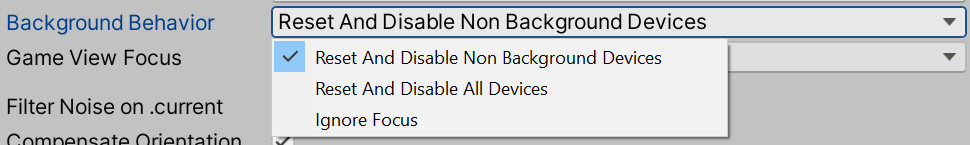
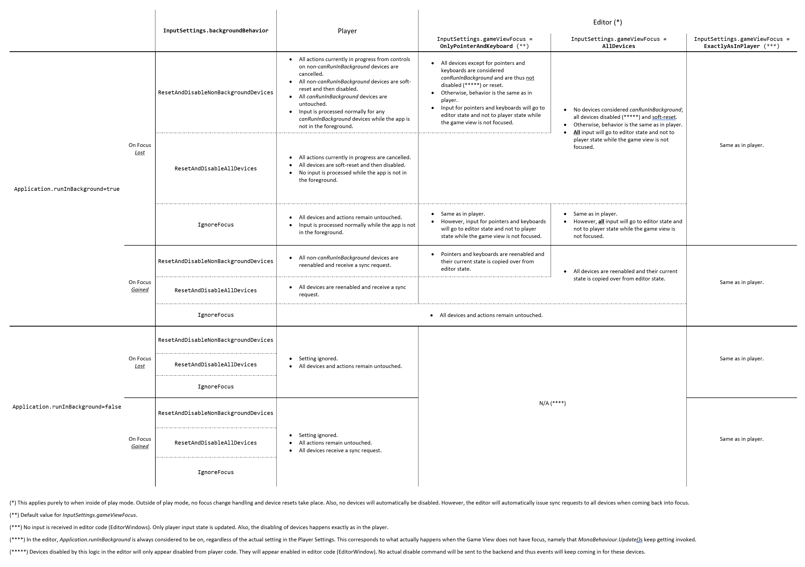

# Devices

- [Devices](#devices)
  - [Device descriptions](#device-descriptions)
    - [Capabilities](#capabilities)
    - [Matching](#matching)
      - [Hijacking the matching process](#hijacking-the-matching-process)
    - [Device lifecycle](#device-lifecycle)
      - [Device creation](#device-creation)
      - [Device removal](#device-removal)
      - [Device resets](#device-resets)
      - [Device syncs](#device-syncs)
      - [Device enabling and disabling](#device-enabling-and-disabling)
      - [Background and focus change behavior](#background-and-focus-change-behavior)
      - [Domain reloads in the Editor](#domain-reloads-in-the-editor)
  - [Native Devices](#native-devices)
    - [Disconnected Devices](#disconnected-devices)
  - [Device IDs](#device-ids)
  - [Device usages](#device-usages)
  - [Device commands](#device-commands)
    - [Sending commands to Devices](#sending-commands-to-devices)
    - [Adding custom device Commands](#adding-custom-device-commands)
  - [Device state](#device-state)
    - [State changes](#state-changes)
      - [Monitoring state changes](#monitoring-state-changes)
      - [Synthesizing state](#synthesizing-state)
  - [Working with Devices](#working-with-devices)
    - [Monitoring Devices](#monitoring-devices)
    - [Adding and removing Devices](#adding-and-removing-devices)
    - [Creating custom Devices](#creating-custom-devices)
      - [Step 1: The state struct](#step-1-the-state-struct)
      - [Step 2: The Device class](#step-2-the-device-class)
      - [Step 3: The Update method](#step-3-the-update-method)
      - [Step 4: Device registration and creation](#step-4-device-registration-and-creation)
      - [Step 5: `current` and `all` (optional)](#step-5-current-and-all-optional)
      - [Step 6: Device Commands (Optional)](#step-6-device-commands-optional)

Physically, Input Devices represent devices attached to the computer, which a user can use to control the app. Logically, Input Devices are the top-level container for [Controls](Controls.md). The [`InputDevice`](../api/UnityEngine.InputSystem.InputDevice.html) class is itself a specialization of [`InputControl`](../api/UnityEngine.InputSystem.InputControl.html). See [supported Devices](SupportedDevices.md) to see what kind of Devices the Input System currently supports.

To query the set of all currently present Devices, you can use [`InputSystem.devices`](../api/UnityEngine.InputSystem.InputSystem.html#UnityEngine_InputSystem_InputSystem_devices).

## Device descriptions

An [`InputDeviceDescription`](../api/UnityEngine.InputSystem.Layouts.InputDeviceDescription.html) describes a Device. The Input System uses this primarily during the Device discovery process. When a new Device is reported (by the runtime or by the user), the report contains a Device description. Based on the description, the system then attempts to find a Device [layout](Layouts.md) that matches the description. This process is based on [Device matchers](#matching).

After a Device has been created, you can retrieve the description it was created from through the [`InputDevice.description`](../api/UnityEngine.InputSystem.InputDevice.html#UnityEngine_InputSystem_InputDevice_description) property.

Every description has a set of standard fields:

|Field|Description|
|-----|-----------|
|[`interfaceName`](../api/UnityEngine.InputSystem.Layouts.InputDeviceDescription.html#UnityEngine_InputSystem_Layouts_InputDeviceDescription_interfaceName)|Identifier for the interface/API that is making the Device available. In many cases, this corresponds to the name of the platform, but there are several more specific interfaces that are commonly used: [HID](https://www.usb.org/hid), [RawInput](https://docs.microsoft.com/en-us/windows/desktop/inputdev/raw-input), [XInput](https://docs.microsoft.com/en-us/windows/desktop/xinput/xinput-game-controller-apis-portal).<br>This field is required.|
|[`deviceClass`](../api/UnityEngine.InputSystem.Layouts.InputDeviceDescription.html#UnityEngine_InputSystem_Layouts_InputDeviceDescription_deviceClass)|A broad categorization of the Device. For example, "Gamepad" or "Keyboard".|
|[`product`](../api/UnityEngine.InputSystem.Layouts.InputDeviceDescription.html#UnityEngine_InputSystem_Layouts_InputDeviceDescription_product)|Name of the product as reported by the Device/driver itself.|
|[`manufacturer`](../api/UnityEngine.InputSystem.Layouts.InputDeviceDescription.html#UnityEngine_InputSystem_Layouts_InputDeviceDescription_manufacturer)|Name of the manufacturer as reported by the Device/driver itself.|
|[`version`](../api/UnityEngine.InputSystem.Layouts.InputDeviceDescription.html#UnityEngine_InputSystem_Layouts_InputDeviceDescription_version)|If available, provides the version of the driver or hardware for the Device.|
|[`serial`](../api/UnityEngine.InputSystem.Layouts.InputDeviceDescription.html#UnityEngine_InputSystem_Layouts_InputDeviceDescription_serial)|If available, provides the serial number for the Device.|
|[`capabilities`](../api/UnityEngine.InputSystem.Layouts.InputDeviceDescription.html#UnityEngine_InputSystem_Layouts_InputDeviceDescription_capabilities)|A string in JSON format that describes Device/interface-specific capabilities. See the [section on capabilities](#capabilities).|

### Capabilities

Aside from a number of standardized fields, such as `product` and `manufacturer`, a Device description can contain a [`capabilities`](../api/UnityEngine.InputSystem.Layouts.InputDeviceDescription.html#UnityEngine_InputSystem_Layouts_InputDeviceDescription_capabilities) string in JSON format. This string describes characteristics which help the Input System to interpret the data from a Device, and map it to Control representations. Not all Device interfaces report Device capabilities. Examples of interface-specific Device capabilities are [HID descriptors](HID.md). WebGL, Android, and Linux use similar mechanisms to report available Controls on connected gamepads.

### Matching

[`InputDeviceMatcher`](../api/UnityEngine.InputSystem.Layouts.InputDeviceMatcher.html) instances handle matching an [`InputDeviceDescription`](../api/UnityEngine.InputSystem.Layouts.InputDeviceDescription.html) to a registered layout. Each matcher loosely functions as a kind of regular expression. Each field in the description can be independently matched with either a plain string or regular expression. Matching is not case-sensitive. For a matcher to apply, all of its individual expressions have to match.

To matchers to any layout, call [`InputSystem.RegisterLayoutMatcher`](../api/UnityEngine.InputSystem.InputSystem.html#UnityEngine_InputSystem_InputSystem_RegisterLayoutMatcher_System_String_UnityEngine_InputSystem_Layouts_InputDeviceMatcher_). You can also supply them when you register a layout.

```CSharp
// Register a new layout and supply a matcher for it.
InputSystem.RegisterLayoutMatcher<MyDevice>(
    matches: new InputDeviceMatcher()
        .WithInterface("HID")
        .WithProduct("MyDevice.*")
        .WithManufacturer("MyBrand");

// Register an alternate matcher for an already registered layout.
InputSystem.RegisterLayoutMatcher<MyDevice>(
    new InputDeviceMatcher()
        .WithInterface("HID")

```

If multiple matchers are matching the same [`InputDeviceDescription`](../api/UnityEngine.InputSystem.Layouts.InputDeviceDescription.html), the Input System chooses the matcher that has the larger number of properties to match against.

#### Hijacking the matching process

You can overrule the internal matching process from outside to select a different layout for a Device than the system would normally choose. This also makes it possible to quickly build new layouts. To do this, add a custom handler to the  [`InputSystem.onFindControlLayoutForDevice`](../api/UnityEngine.InputSystem.InputSystem.html#UnityEngine_InputSystem_InputSystem_onFindLayoutForDevice) event. If your handler returns a non-null layout string, then the Input System uses this layout.

### Device lifecycle

#### Device creation

Once the system has chosen a [layout](Layouts.md) for a device, it instantiates an [`InputDevice`](../api/UnityEngine.InputSystem.InputDevice.html) and populates it with [`InputControls`](../api/UnityEngine.InputSystem.InputControl.html) as the layout dictates. This process is internal and happens automatically.

>__Note__: You can't create valid [`InputDevices`](../api/UnityEngine.InputSystem.InputDevice.html) and [`InputControls`](../api/UnityEngine.InputSystem.InputControl.html) by manually instantiating them with `new`. To guide the creation process, you must use [layouts](Layouts.md).

After the Input System assembles the [`InputDevice`](../api/UnityEngine.InputSystem.InputDevice.html), it calls [`FinishSetup`](../api/UnityEngine.InputSystem.InputControl.html#UnityEngine_InputSystem_InputControl_FinishSetup_) on each control of the device and on the device itself. Use this to finalize the setup of the Controls.

After an [`InputDevice`](../api/UnityEngine.InputSystem.InputDevice.html) is fully assembled, the Input System adds it to the system. As part of this process, the Input System calls [`MakeCurrent`](../api/UnityEngine.InputSystem.InputDevice.html#UnityEngine_InputSystem_InputDevice_MakeCurrent_) on the Device, and signals  [`InputDeviceChange.Added`](../api/UnityEngine.InputSystem.InputDeviceChange.html#UnityEngine_InputSystem_InputDeviceChange_Added) on [`InputSystem.onDeviceChange`](../api/UnityEngine.InputSystem.InputSystem.html#UnityEngine_InputSystem_InputSystem_onDeviceChange). The Input System also calls [`InputDevice.OnAdded`](../api/UnityEngine.InputSystem.InputDevice.html#UnityEngine_InputSystem_InputDevice_OnAdded_).

Once added, the [`InputDevice.added`](../api/UnityEngine.InputSystem.InputDevice.html#UnityEngine_InputSystem_InputDevice_added) flag is set to true.

To add devices manually, you can call one of the `InputSystem.AddDevice` methods such as [`InputSystem.AddDevice(layout)`](../api/UnityEngine.InputSystem.InputSystem.html#UnityEngine_InputSystem_InputSystem_AddDevice_System_String_System_String_System_String_).

```CSharp
// Add a gamepad. This bypasses the matching process and creates a device directly
// with the Gamepad layout.
InputSystem.AddDevice<Gamepad>();

// Add a device such that the matching process is employed:
InputSystem.AddDevice(new InputDeviceDescription
{
    interfaceName = "XInput",
    product = "Xbox Controller",
});
```

When a device is added, the Input System automatically issues a [sync request](../api/UnityEngine.InputSystem.LowLevel.RequestSyncCommand.html) on the device. This instructs the device to send an event representing its current state. Whether this request succeeds depends on the whether the given device supports the sync command.

#### Device removal

When a Device is disconnected, it is removed from the system. A notification appears for [`InputDeviceChange.Removed`](../api/UnityEngine.InputSystem.InputDeviceChange.html) (sent via [`InputSystem.onDeviceChange`](../api/UnityEngine.InputSystem.InputSystem.html#UnityEngine_InputSystem_InputSystem_onDeviceChange)) and the Devices are removed from the [`devices`](../api/UnityEngine.InputSystem.InputSystem.html#UnityEngine_InputSystem_InputSystem_onDeviceChange) list. The system also calls [`InputDevice.OnRemoved`](../api/UnityEngine.InputSystem.InputDevice.html#UnityEngine_InputSystem_InputDevice_OnRemoved_).

The [`InputDevice.added`](../api/UnityEngine.InputSystem.InputDevice.html#UnityEngine_InputSystem_InputDevice_added) flag is reset to false in the process.

Note that Devices are not destroyed when removed. Device instances remain valid and you can still access them in code. However, trying to read values from the controls of these Devices leads to exceptions.

#### Device resets

Resetting a Device resets its Controls to their default state. You can do this manually using [`InputSystem.ResetDevice`](../api/UnityEngine.InputSystem.InputSystem.html#UnityEngine_InputSystem_InputSystem_ResetDevice_UnityEngine_InputSystem_InputDevice_System_Boolean_):

```CSharp
    InputSystem.ResetDevice(Gamepad.current);
```

There are two types of resets as determined by the second parameter to [`InputSystem.ResetDevice`](../api/UnityEngine.InputSystem.InputSystem.html#UnityEngine_InputSystem_InputSystem_ResetDevice_UnityEngine_InputSystem_InputDevice_System_Boolean_):

|Type|Description|
|----|-----------|
|"Soft" Resets|This is the default. With this type, only controls that are *not* marked as [`dontReset`](Layouts.md#control-items) are reset to their default value. This excludes controls such as [`Pointer.position`](../api/UnityEngine.InputSystem.Pointer.html#UnityEngine_InputSystem_Pointer_position) from resets and thus prevents mouse positions resetting to `(0,0)`.|
|"Hard" Resets|In this type, *all* controls are reset to their default value regardless of whether they have [`dontReset`](Layouts.md#control-items) set or not.|

Resetting Controls this way is visible on [Actions](Actions.md). If you reset a Device that is currently driving one or more Action, the Actions are cancelled. This cancellation is different from sending an event with default state. Whereas the latter may inadvertently [perform](../api/UnityEngine.InputSystem.InputAction.html#UnityEngine_InputSystem_InputAction_performed) Actions (e.g. a button that was pressed would not appear to have been released), a reset will force clean cancellation.

Resets may be triggered automatically by the Input System depending on [application focus](#background-and-focus-change-behavior).

#### Device syncs

A Device may be requested to send an event with its current state through [`RequestSyncCommand`](../api/UnityEngine.InputSystem.LowLevel.RequestSyncCommand.html). It depends on the platform and type of Device whether this is supported or not.

A synchronization request can be explicitly sent using [`InputSystem.TrySyncDevice`](../api/UnityEngine.InputSystem.InputSystem.html#UnityEngine_InputSystem_InputSystem_TrySyncDevice_UnityEngine_InputSystem_InputDevice_). If the device supports sync requests, the method returns true and an [`InputEvent`](../api/UnityEngine.InputSystem.LowLevel.InputEvent.html) will have been queued on the device for processing in the next [update](../api/UnityEngine.InputSystem.InputSystem.html#UnityEngine_InputSystem_InputSystem_Update_).

Synchronization requests are also automatically sent by the Input System in certain situations. See [Background and focus change behavior](#background-and-focus-change-behavior) for more details.

#### Device enabling and disabling

When a Device is added, the Input System sends it an initial [`QueryEnabledStateCommand`](../api/UnityEngine.InputSystem.LowLevel.QueryEnabledStateCommand.html) to find out whether the device is currently enabled or not. The result of this is reflected in the [`InputDevice.enabled`](../api/UnityEngine.InputSystem.InputDevice.html#UnityEngine_InputSystem_InputDevice_enabled) property.

When disabled, no events other than removal ([`DeviceRemoveEvent`](../api/UnityEngine.InputSystem.LowLevel.DeviceRemoveEvent.html)) and configuration change ([`DeviceConfigurationEvent`](../api/UnityEngine.InputSystem.LowLevel.DeviceConfigurationEvent.html)) events are processed for a Device, even if they are sent.

A Device can be manually disabled and re-enabled via [`InputSystem.DisableDevice`](../api/UnityEngine.InputSystem.InputSystem.html#UnityEngine_InputSystem_InputSystem_DisableDevice_) and [`InputSystem.EnableDevice`](../api/UnityEngine.InputSystem.InputSystem.html#UnityEngine_InputSystem_InputSystem_EnableDevice_) respectively.

Note that [sensors](Sensors.md) start in a disabled state by default, and you need to enable them in order for them to generate events.

The Input System may automatically disable and re-enable Devices in certain situations, as detailed in the [next section](#background-and-focus-change-behavior).

#### Background and focus change behavior

In general, input is tied to [application focus](https://docs.unity3d.com/ScriptReference/Application-isFocused.html). This means that Devices do not receive input while the application is not in the foreground and thus no [Actions](Actions.md) will receive input either. When the application comes back into focus, all devices will receive a [sync](#device-syncs) request to have them send their current state (which may have changed while the application was in the background) to the application. Devices that do not support sync requests will see a [soft reset](#device-resets) that resets all Controls not marked as [`dontReset`](Layouts.md#control-items) to their default state.

On platforms such as iOS and Android, that do not support running Unity applications in the background, this is the only supported behavior.

If the application is configured to run while in the background (that is, not having focus), input behavior can be selected from several options. This is supported in two scenarios:

* In Unity's [Player Settings](https://docs.unity3d.com/Manual/class-PlayerSettings.html) you can explicity enable `Run In Background` for specific players that support it (such as Windows or Mac standalone players). Note that in these players this setting is always enabled automatically in *development* players.
* In the editor, application focus is tied to focus on the Game View. If no Game View is focused, the application is considered to be running in the background. However, while in play mode, the editor will *always* keep running the player loop regardless of focus on the Game View window. This means that in the editor, `Run In Background` is considered to always be enabled.

If the application is configured this way to keep running while in the background, the player loop and thus the Input System, too, will keep running even when the application does not have focus. What happens with respect to input then depends on two factors:

1. On the ability of individual devices to receive input while the application is not running in the foreground. This is only supported by a small subset of devices and platforms. VR devices ([`TrackedDevice`](../api/UnityEngine.InputSystem.TrackedDevice.html)) such as HMDs and VR controllers generally support this.<br><br>To find out whether a specific device supports this, you can query the [`InputDevice.canRunInBackground`](../api/UnityEngine.InputSystem.InputDevice.html#UnityEngine_InputSystem_InputDevice_canRunInBackground) property. This property can also be forced to true or false via a Device's [layout](Layouts.md#control-items).
2. On two settings you can find in the project-wide [Input Settings](Settings.md). Specifically, [`InputSettings.backgroundBehavior`](../api/UnityEngine.InputSystem.InputSettings.html#UnityEngine_InputSystem_InputSettings_backgroundBehavior):<br><br>and [`InputSettings.editorInputBehaviorInPlayMode`](../api/UnityEngine.InputSystem.InputSettings.html#UnityEngine_InputSystem_InputSettings_editorInputBehaviorInPlayMode):<br><br>The table below shows a detailed breakdown of how input behaviors vary based on these two settings and in relation to the `Run In Background` player setting in Unity.

>__Note__: [`InputDevice.canRunInBackground`](../api/UnityEngine.InputSystem.InputDevice.html#UnityEngine_InputSystem_InputDevice_canRunInBackground) is overridden by the editor in certain situations (see table below). In general, the value of the property does not have to be the same between the editor and the player and depends on the specific platform and device.

The following table shows the full matrix of behaviors according to the [Input Settings](Settings.md) and whether the game is running in the editor or in the player.



#### Domain reloads in the Editor

The Editor reloads the C# application domain whenever it reloads and recompiles scripts, or when the Editor goes into Play mode. This requires the Input System to reinitialize itself after each domain reload. During this process, the Input System attempts to recreate devices that were instantiated before the domain reload. However, the state of each Device doesn't carry across, which means that Devices reset to their default state on domain reloads.

Note that layout registrations do not persist across domain reloads. Instead, the Input System relies on all registrations to become available as part of the initialization process (for example, by using `[InitializeOnLoad]` to run registration as part of the domain startup code in the Editor). This allows you to change registrations and layouts in script, and the change to immediately take effect after a domain reload.

## Native Devices

Devices that the [native backend](Architecture.md#native-backend) reports are considered native (as opposed to Devices created from script code). To identify these Devices, you can check the [`InputDevice.native`](../api/UnityEngine.InputSystem.InputDevice.html#UnityEngine_InputSystem_InputDevice_native) property.

The Input System remembers native Devices. For example, if the system has no matching layout when the Device is first reported, but a layout which matches the device is registered later, the system uses this layout to recreate the Device.

You can force the Input System to use your own [layout](Layouts.md) when the native backend discovers a specific Device, by describing the Device in the layout, like this:

```
     {
        "name" : "MyGamepad",
        "extend" : "Gamepad",
        "device" : {
            // All strings in here are regexs and case-insensitive.
            "product" : "MyController",
            "manufacturer" : "MyCompany"
        }
     }
```

Note: You don't have to restart Unity in order for changes in your layout to take effect on native Devices. The Input System applies changes automatically on every domain reload, so you can just keep refining a layout and your Device is recreated with the most up-to-date version every time scripts are recompiled.


### Disconnected Devices

If you want to get notified when Input Devices disconnect, subscribe to the [`InputSystem.onDeviceChange`](../api/UnityEngine.InputSystem.InputSystem.html#UnityEngine_InputSystem_InputSystem_onDeviceChange) event, and look for events of type [`InputDeviceChange.Disconnected`](../api/UnityEngine.InputSystem.InputDeviceChange.html).

The Input System keeps track of disconnected Devices in [`InputSystem.disconnectedDevices`](../api/UnityEngine.InputSystem.InputSystem.html#UnityEngine_InputSystem_InputSystem_disconnectedDevices). If one of these Devices reconnects later, the Input System can detect that the Device was connected before, and reuses its [`InputDevice`](../api/UnityEngine.InputSystem.InputDevice.html) instance. This allows the [`PlayerInputManager`](PlayerInputManager.md) to reassign the Device to the same [user](UserManagement.md) again.

## Device IDs

Each Device that is created receives a unique numeric ID. You can access this ID through [`InputDevice.deviceId`](../api/UnityEngine.InputSystem.InputDevice.html#UnityEngine_InputSystem_InputDevice_deviceId).

All IDs are only used once per Unity session.

## Device usages

Like any [`InputControl`](../api/UnityEngine.InputSystem.InputControl.html), a Device can have usages associated with it. You can query usages with the [`usages`](../api/UnityEngine.InputSystem.InputControl.html#UnityEngine_InputSystem_InputControl_usages) property, and use[`InputSystem.SetDeviceUsage()`](../api/UnityEngine.InputSystem.InputSystem.html#UnityEngine_InputSystem_InputSystem_SetDeviceUsage_UnityEngine_InputSystem_InputDevice_System_String_) to set them. Usages can be arbitrary strings with arbitrary meanings. One common case where the Input System assigns Devices usages is the handedness of XR controllers, which are tagged with the "LeftHand" or "RightHand" usages.

## Device commands

While input [events](Events.md) deliver data from a Device, commands send data back to the Device. The Input System uses these to retrieve specific information from the Device, to trigger functions on the Device (such as rumble effects), and for a variety of other needs.

### Sending commands to Devices

The Input System sends commands to the Device through [`InputDevice.ExecuteCommand<TCommand>`](../api/UnityEngine.InputSystem.InputDevice.html#UnityEngine_InputSystem_InputDevice_ExecuteCommand__1___0__). To monitor Device commands, use [`InputSystem.onDeviceCommand`](../api/UnityEngine.InputSystem.InputSystem.html#UnityEngine_InputSystem_InputSystem_onDeviceCommand).

Each Device command implements the [`IInputDeviceCommandInfo`](../api/UnityEngine.InputSystem.LowLevel.IInputDeviceCommandInfo.html) interface, which only requires the [`typeStatic`](../api/UnityEngine.InputSystem.LowLevel.IInputDeviceCommandInfo.html#UnityEngine_InputSystem_LowLevel_IInputDeviceCommandInfo_typeStatic) property to identify the type of the command. The native implementation of the Device should then understand how to handle that command. One common case is the `"HIDO"` command type which is used to send [HID output reports](HID.md#hid-output) to HIDs.

### Adding custom device Commands

To create custom Device commands (for example, to support some functionality for a specific HID), create a `struct` that contains all the data to be sent to the Device, and add a [`typeStatic`](../api/UnityEngine.InputSystem.LowLevel.IInputDeviceCommandInfo.html#UnityEngine_InputSystem_LowLevel_IInputDeviceCommandInfo_typeStatic) property to make that struct implement the [`IInputDeviceCommandInfo`](../api/UnityEngine.InputSystem.LowLevel.IInputDeviceCommandInfo.html) interface. To send data to a HID, this property should return `"HIDO"`.

You can then create an instance of this struct and populate all its fields, then use [`InputDevice.ExecuteCommand<TCommand>`](../api/UnityEngine.InputSystem.InputDevice.html#UnityEngine_InputSystem_InputDevice_ExecuteCommand__1___0__) to send it to the Device. The data layout of the struct must match the native representation of the data as the device interprets it.

## Device state

Like any other type of [Control](Controls.md#control-state), each Device has a block of memory allocated to it which stores the state of all the Controls associated with the Device.

### State changes

State changes are usually initiated through [state events](Events.md#state-events) from the native backend, but you can use [`InputControl<>.WriteValueIntoState()`](../api/UnityEngine.InputSystem.InputControl-1.html#UnityEngine_InputSystem_InputControl_1_WriteValueIntoState__0_System_Void__) to manually overwrite the state of any Control.

#### Monitoring state changes

You can use [`InputState.AddChangeMonitor()`](../api/UnityEngine.InputSystem.LowLevel.InputState.html#UnityEngine_InputSystem_LowLevel_InputState_AddChangeMonitor_UnityEngine_InputSystem_InputControl_System_Action_UnityEngine_InputSystem_InputControl_System_Double_UnityEngine_InputSystem_LowLevel_InputEventPtr_System_Int64__System_Int32_System_Action_UnityEngine_InputSystem_InputControl_System_Double_System_Int64_System_Int32__) to register a callback to be called whenever the state of a Control changes. The Input System uses the same mechanism to implement [input Actions](Actions.md).

#### Synthesizing state

The Input System can synthesize a new state from an existing state. An example of such a synthesized state is the [`press`](../api/UnityEngine.InputSystem.Pointer.html#UnityEngine_InputSystem_Pointer_press) button  Control that [`Touchscreen`](../api/UnityEngine.InputSystem.Touchscreen.html) inherits from [`Pointer`](../api/UnityEngine.InputSystem.Pointer.html). Unlike a mouse, which has a physical button, for [`Touchscreen`](../api/UnityEngine.InputSystem.Touchscreen.html) this is a [synthetic Control](Controls.md#synthetic-controls) that doesn't correspond to actual data coming in from the Device backend. Instead, the Input System considers the button to be pressed if any touch is currently ongoing, and released otherwise.

To do this, the Input System uses [`InputState.Change`](../api/UnityEngine.InputSystem.LowLevel.InputState.html#UnityEngine_InputSystem_LowLevel_InputState_Change__1_UnityEngine_InputSystem_InputControl___0_UnityEngine_InputSystem_LowLevel_InputUpdateType_UnityEngine_InputSystem_LowLevel_InputEventPtr_), which allows feeding arbitrary state changes into the system without having to run them through the input event queue. The Input System incorporates state changes directly and synchronously. State change [monitors](#monitoring-state-changes) still trigger as expected.

## Working with Devices

### Monitoring Devices

To be notified when new Devices are added or existing Devices are removed, use [`InputSystem.onDeviceChange`](../api/UnityEngine.InputSystem.InputSystem.html#UnityEngine_InputSystem_InputSystem_onDeviceChange).

```CSharp
InputSystem.onDeviceChange +=
    (device, change) =>
    {
        switch (change)
        {
            case InputDeviceChange.Added:
                // New Device.
                break;
            case InputDeviceChange.Disconnected:
                // Device got unplugged.
                break;
            case InputDeviceChange.Connected:
                // Plugged back in.
                break;
            case InputDeviceChange.Removed:
                // Remove from Input System entirely; by default, Devices stay in the system once discovered.
                break;
            default:
                // See InputDeviceChange reference for other event types.
                break;
        }
    }
```

[`InputSystem.onDeviceChange`](../api/UnityEngine.InputSystem.InputSystem.html#UnityEngine_InputSystem_InputSystem_onDeviceChange) delivers notifications for other device-related changes as well. See the [`InputDeviceChange` enum](../api/UnityEngine.InputSystem.InputDeviceChange.html) for more information.

### Adding and removing Devices

To manually add and remove Devices through the API, use [`InputSystem.AddDevice()`](../api/UnityEngine.InputSystem.InputSystem.html#UnityEngine_InputSystem_InputSystem_AddDevice_UnityEngine_InputSystem_InputDevice_) and [`InputSystem.RemoveDevice()`](../api/UnityEngine.InputSystem.InputSystem.html#UnityEngine_InputSystem_InputSystem_RemoveDevice_UnityEngine_InputSystem_InputDevice_).

This allows you to create your own Devices, which can be useful for testing purposes, or for creating virtual Input Devices which synthesize input from other events. As an example, see the [on-screen Controls](OnScreen.md) that the Input System provides. The Input Devices used for on-screen Controls are created entirely in code and have no [native representation](#native-devices).

### Creating custom Devices

>__Note__: This example deals only with Devices that have fixed layouts (that is, you know the specific model or models that you want to implement). This is different from an interface such as HID, where Devices can describe themselves through the interface and take on a wide variety of forms. A fixed Device layout can't cover self-describing Devices, so you need to use a [layout builder](Layouts.md#generated-layouts) to build Device layouts from information you obtain at runtime.

There are two main situations in which you might need to create a custom Device:

1. You have an existing API that generates input, and which you want to reflect into the Input System.
2. You have an HID that the Input System ignores, or that the Input system auto-generates a layout for that doesn't work well enough for your needs.

For the second scenario, see [Overriding the HID Fallback](HID.md#creating-a-custom-device-layout).

The steps below deal with the first scenario, where you want to create a new Input Device entirely from scratch and provide input to it from a third-party API.

#### Step 1: The state struct

The first step is to create a C# `struct` that represents the form in which the system receives and stores input, and also describes the `InputControl` instances that the Input System must create for the Device in order to retrieve its state.

```CSharp
// A "state struct" describes the memory format that a Device uses. Each Device can
// receive and store memory in its custom format. InputControls then connect to
// the individual pieces of memory and read out values from them.
//
// If it's important for the memory format to match 1:1 at the binary level
// to an external representation, it's generally advisable to use
// LayoutLind.Explicit.
[StructLayout(LayoutKind.Explicit, Size = 32)]
public struct MyDeviceState : IInputStateTypeInfo
{
    // You must tag every state with a FourCC code for type
    // checking. The characters can be anything. Choose something that allows
    // you to easily recognize memory that belongs to your own Device.
    public FourCC format => new FourCC('M', 'Y', 'D', 'V');

    // InputControlAttributes on fields tell the Input System to create Controls
    // for the public fields found in the struct.

    // Assume a 16bit field of buttons. Create one button that is tied to
    // bit #3 (zero-based). Note that buttons don't need to be stored as bits.
    // They can also be stored as floats or shorts, for example. The
    // InputControlAttribute.format property determines which format the
    // data is stored in. If omitted, the system generally infers it from the value
    // type of the field.
    [InputControl(name = "button", layout = "Button", bit = 3)]
    public ushort buttons;

    // Create a floating-point axis. If a name is not supplied, it is taken
    // from the field.
    [InputControl(layout = "Axis")]
    public short axis;
}
```

The Input System's layout mechanism uses [`InputControlAttribute`](../api/UnityEngine.InputSystem.Layouts.InputControlAttribute.html) annotations to add Controls to the layout of your Device. For details, see the [layout system](Layouts.md) documentation.

With the state struct in place, you now have a way to send input data to the Input System and store it there. The next thing you need is an [`InputDevice`](../api/UnityEngine.InputSystem.InputDevice.html) that uses your custom state struct and represents your custom Device.

#### Step 2: The Device class

Next, you need a class derived from one of the [`InputDevice`](../api/UnityEngine.InputSystem.InputDevice.html) base classes. You can either base your Device directly on [`InputDevice`](../api/UnityEngine.InputSystem.InputDevice.html), or you can pick a more specific Device type, like [`Gamepad`](../api/UnityEngine.InputSystem.Gamepad.html).

This example assumes that your Device doesn't fit into any of the existing Device classes, so it derives directly from [`InputDevice`](../api/UnityEngine.InputSystem.InputDevice.html).

```CSharp
// InputControlLayoutAttribute attribute is only necessary if you want
// to override the default behavior that occurs when you register your Device
// as a layout.
// The most common use of InputControlLayoutAttribute is to direct the system
// to a custom "state struct" through the `stateType` property. See below for details.
[InputControlLayout(displayName = "My Device", stateType = typeof(MyDeviceState))]
public class MyDevice : InputDevice
{
    // In the state struct, you added two Controls that you now want to
    // surface on the Device, for convenience. The Controls
    // get added to the Device either way. When you expose them as properties,
    // it is easier to get to the Controls in code.

    public ButtonControl button { get; private set; }
    public AxisControl axis { get; private set; }

    // The Input System calls this method after it constructs the Device,
    // but before it adds the device to the system. Do any last-minute setup
    // here.
    protected override void FinishSetup()
    {
        base.FinishSetup();

        // NOTE: The Input System creates the Controls automatically.
        //       This is why don't do `new` here but rather just look
        //       the Controls up.
        button = GetChildControl<ButtonControl>("button");
        axis = GetChildControl<AxisControl>("axis");
    }
}
```

#### Step 3: The Update method

You now have a Device in place along with its associated state format. You can call the following method to create a fully set-up Device with your two Controls on it:

```CSharp
InputSystem.AddDevice<MyDevice>();
```

However, this Device doesn't receive input yet, because you haven't added any code that generates input. To do that, you can use [`InputSystem.QueueStateEvent`](../api/UnityEngine.InputSystem.InputSystem.html#UnityEngine_InputSystem_InputSystem_QueueStateEvent__1_UnityEngine_InputSystem_InputDevice___0_System_Double_) or [`InputSystem.QueueDeltaStateEvent`](../api/UnityEngine.InputSystem.InputSystem.html#UnityEngine_InputSystem_InputSystem_QueueDeltaStateEvent__1_UnityEngine_InputSystem_InputControl___0_System_Double_) from anywhere, including from a thread. The following example uses [`IInputUpdateCallbackReceiver`](../api/UnityEngine.InputSystem.LowLevel.IInputUpdateCallbackReceiver.html), which, when implemented by any [`InputDevice`](../api/UnityEngine.InputSystem.InputDevice.html), adds an [`OnUpdate()`](../api/UnityEngine.InputSystem.LowLevel.IInputUpdateCallbackReceiver.html#UnityEngine_InputSystem_LowLevel_IInputUpdateCallbackReceiver_OnUpdate) method that automatically gets called during [`InputSystem.onBeforeUpdate`](../api/UnityEngine.InputSystem.InputSystem.html#UnityEngine_InputSystem_InputSystem_onBeforeUpdate) and provides input events to the current input update.

>__Note__: If you already have a place where input for your device becomes available, you can skip this step and queue input events from there instead of using [`IInputUpdateCallbackReceiver`](../api/UnityEngine.InputSystem.LowLevel.IInputUpdateCallbackReceiver.html).

```CSharp
public class MyDevice : InputDevice, IInputUpdateCallbackReceiver
{
    //...

    public void OnUpdate()
    {
        // In practice, this would read out data from an external
        // API. This example uses some empty input.
        var state = new MyDeviceState();
        InputSystem.QueueStateEvent(this, state);
    }
}
```

#### Step 4: Device registration and creation

You now have a functioning device, but you haven't registered it (added it to the system) yet. This means you can't see the device when, for example, you create bindings in the [Action editor](ActionAssets.md#editing-input-action-assets).

You can register your device type with the system from within the code that runs automatically as part of Unity's startup. To do so, modify the definition of `MyDevice` like so:

```CSharp
// Add the InitializeOnLoad attribute to automatically run the static
// constructor of the class after each C# domain load.
#if UNITY_EDITOR
[InitializeOnLoad]
#endif
public class MyDevice : InputDevice, IInputUpdateCallbackReceiver
{
    //...

    static MyDevice()
    {
        // RegisterLayout() adds a "Control layout" to the system.
        // These can be layouts for individual Controls (like sticks)
        // or layouts for entire Devices (which are themselves
        // Controls) like in our case.
        InputSystem.RegisterLayout<MyDevice>();
    }

    // You still need a way to trigger execution of the static constructor
    // in the Player. To do this, you can add the RuntimeInitializeOnLoadMethod
    // to an empty method.
    [RuntimeInitializeOnLoadMethod(RuntimeInitializeLoadType.BeforeSceneLoad)]
    private static void InitializeInPlayer() {}
}
```

This registers the Device type with the system and makes it available in the Control picker. However, you still need a way to add an instance of the Device when it is connected.

In theory, you could call [`InputSystem.AddDevice<MyDevice>()`](../api/UnityEngine.InputSystem.InputSystem.html#UnityEngine_InputSystem_InputSystem_AddDevice__1_System_String_) somewhere, but in a real-world setup you likely have to correlate the Input Devices you create with their identities in the third-party API.

It might be tempting to do something like this:

```CSharp
public class MyDevice : InputDevice, IInputUpdateCallbackReceiver
{
    //...

    // This does NOT work correctly.
    public ThirdPartyAPI.DeviceId externalId { get; set; }
}
```

and then set that on the Device after calling [`AddDevice<MyDevice>`](../api/UnityEngine.InputSystem.InputSystem.html#UnityEngine_InputSystem_InputSystem_AddDevice__1_System_String_). However, this doesn't work as expected in the Editor, because the Input System requires Devices to be created solely from their [`InputDeviceDescription`](../api/UnityEngine.InputSystem.Layouts.InputDeviceDescription.html) in combination with the chosen layout (and layout variant). In addition, the system supports a fixed set of mutable per-device properties such as device usages (that is, [`InputSystem.SetDeviceUsage()`](../api/UnityEngine.InputSystem.InputSystem.html#UnityEngine_InputSystem_InputSystem_SetDeviceUsage_UnityEngine_InputSystem_InputDevice_System_String_) and related methods). This allows the system to easily recreate Devices after domain reloads in the Editor, as well as to create replicas of remote Devices when connecting to a Player. To comply with this requirement, you must cast that information provided by the third-party API into an [`InputDeviceDescription`](../api/UnityEngine.InputSystem.Layouts.InputDeviceDescription.html) and then use an [`InputDeviceMatcher`](../api/UnityEngine.InputSystem.Layouts.InputDeviceMatcher.html) to match the description to our custom `MyDevice` layout.

This example assumes that the third-party API has two callbacks, like this:

```CSharp
public static ThirdPartyAPI
{
    // This example assumes that the argument is a string that
    // contains the name of the Device, and that no two Devices
    // have the same name in the external API.
    public static Action<string> deviceAdded;
    public static Action<string> deviceRemoved;
}
```

You can hook into those callbacks and create and destroy devices in response.

```CSharp
// This example uses a MonoBehaviour with [ExecuteInEditMode]
// on it to run the setup code. You can do this many other ways.
[ExecuteInEditMode]
public class MyDeviceSupport : MonoBehaviour
{
    protected void OnEnable()
    {
        ThirdPartyAPI.deviceAdded += OnDeviceAdded;
        ThirdPartyAPI.deviceRemoved += OnDeviceRemoved;
    }

    protected void OnDisable()
    {
        ThirdPartyAPI.deviceAdded -= OnDeviceAdded;
        ThirdPartyAPI.deviceRemoved -= OnDeviceRemoved;
    }

    private void OnDeviceAdded(string name)
    {
        // Feed a description of the Device into the system. In response, the
        // system matches it to the layouts it has and creates a Device.
        InputSystem.AddDevice(
            new InputDeviceDescription
            {
                interfaceName = "ThirdPartyAPI",
                product = name
            });
    }

    private void OnDeviceRemoved(string name)
    {
        var device = InputSystem.devices.FirstOrDefault(
            x => x.description == new InputDeviceDescription
            {
                interfaceName = "ThirdPartyAPI",
                product = name,
            });

        if (device != null)
            InputSystem.RemoveDevice(device);
    }

    // Move the registration of MyDevice from the
    // static constructor to here, and change the
    // registration to also supply a matcher.
    protected void Awake()
    {
        // Add a match that catches any Input Device that reports its
        // interface as "ThirdPartyAPI".
        InputSystem.RegisterLayout<MyDevice>(
            matches: new InputDeviceMatcher()
                .WithInterface("ThirdPartyAPI"));
    }
}
```

#### Step 5: `current` and `all` (optional)

For convenience, you can quickly access the last used device of a given type, or list all devices of a specific type. To do this, add support for a `current` and for an `all` getter to the API of `MyDevice`.

```CSharp
public class MyDevice : InputDevice, IInputCallbackReceiver
{
    //...

    public static MyDevice current { get; private set; }

    public static IReadOnlyList<MyDevice> all => s_AllMyDevices;
    private static List<MyDevice> s_AllMyDevices = new List<MyDevice>();

    public override void MakeCurrent()
    {
        base.MakeCurrent();
        current = this;
    }

    protected override void OnAdded()
    {
        base.OnAdded();
        s_AllMyDevices.Add(this);
    }

    protected override void OnRemoved()
    {
        base.OnRemoved();
        s_AllMyDevices.Remove(this);
    }
}
```

#### Step 6: Device Commands (Optional)

A final, but optional, step is to add support for Device commands. A "device command" is that opposite of input. In other words, it consists of data traveling __to__ the input device, which might also return data as part of the operation (much like a function call). You can use this to communicate with the backend of the device in order to query configuration, or to initiate effects such as haptics. At the moment there isn't a proper interface available for this, however there are still some scenarios that can be solved with the current interfaces.

E.g. the following shows, when implementing a non-hardware-backed device (simulated device), how to simulate hardware reporting that the device can be run in the background and supports sync commands. This is useful to prevent the device from cancelling Actions when application focus is lost and restored. For more info see [Device syncs](#device-syncs)

```CSharp
public class MyDevice : InputDevice, IInputCallbackReceiver
{
    //...

    protected override unsafe long ExecuteCommand(InputDeviceCommand* commandPtr)
    {
        var type = commandPtr->type;
        if (type == RequestSyncCommand.Type)
        {
            // Report that the device supports the sync command and has handled it.
            // This will prevent device reset during focus changes.
            result = InputDeviceCommand.GenericSuccess;
            return true;
        }

        if (type == QueryCanRunInBackground.Type)
        {
            // Notify that the device supports running in the background.
            ((QueryCanRunInBackground*)commandPtr)->canRunInBackground = true;
            result = InputDeviceCommand.GenericSuccess;
            return true;
        }

        result = default;
        return false;
    }
}
```
