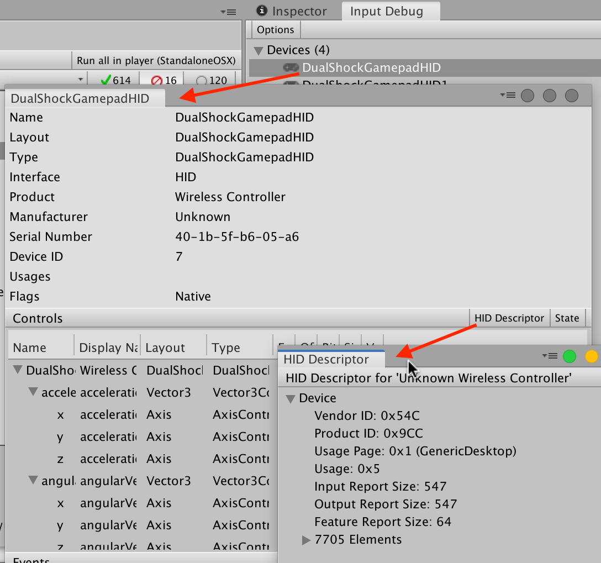

# HID Support

Human Interface Device (HID) is a [specification](https://www.usb.org/hid) to describe peripheral user input devices connected to computers via USB or Bluetooth. HID is commonly used to implement devices such as gamepads, joysticks, or racing wheels.

The Input System directly supports HID (connected via both USB and Bluetooth) on Windows, MacOS, and the Universal Windows Platform (UWP). The system might support HID on other platforms, but not deliver input through HID-specific APIs. For example, on Linux, the system supports gamepad and joystick HIDs through SDL, but doesn't support other HIDs.

Every HID comes with a device descriptor. To browse through the descriptor of an HID from the Input Debugger, click the __HID Descriptor__ button in the device debugger window. To specify the type of the device, the HID descriptor reports entry numbers in the [HID usage tables](https://www.usb.org/document-library/hid-usage-tables-112), and a list of all controls on the device, along with their data ranges and usages.



The Input System handles HIDs in one of two ways:

1. The system has a known layout for the specific HID.
2. If the system does not have a known layout, it auto-generates one for the HID.

## Auto-generated layouts

By default, the Input System creates layouts and Device representations for any HID which reports its usage as `GenericDesktop/Joystick`, `GenericDesktop/Gamepad`, or `GenericDesktop/MultiAxisController` (see the [HID usage table specifications](https://www.usb.org/document-library/hid-usage-tables-112) for more information). To change the list of supported usages, set [`HIDSupport.supportedHIDUsages`](../api/UnityEngine.InputSystem.HID.HIDSupport.html#UnityEngine_InputSystem_HID_HIDSupport_supportedHIDUsages).

When the Input System automatically creates a layout for an HID, it always reports these Devices as [`Joysticks`](Joystick.md), represented by the [`Joystick` device class](../api/UnityEngine.InputSystem.Joystick.html). The first elements with a reported HID usage of `GenericDesktop/X` and `GenericDesktop/Y` together form the joystick's [`stick`](../api/UnityEngine.InputSystem.Joystick.html#UnityEngine_InputSystem_Joystick_stick) Control. The system then adds Controls for all further HID axis or button elements, using the Control names reported by the HID specification. The Input System assigns the first control with an HID usage of `Button/Button 1` to the joystick's [`trigger`](../api/UnityEngine.InputSystem.Joystick.html#UnityEngine_InputSystem_Joystick_trigger) Control.

The auto-generated layouts represent a "best effort" on the part of the Input System. The way Human Interface Devices describe themselves in accordance with the HID standard is too ambiguous in practice, so generated layouts might lead to Controls that don't work as expected. For example, while the layout builder can identify hat switches and D-pads, it can often only make guesses as to which direction represents which. The same goes for individual buttons, which generally aren't assigned any meaning in HID.

The best way to resolve the situation of HIDs not working as expected is to add a custom layout, which bypasses auto-generation altogether. See [Creating a custom device layout](#creating-a-custom-device-layout) for details.

## HID output

HIDs can support output (for example, to toggle lights or force feedback motors on a gamepad). Unity controls output by sending HID Output Report commands to a Device. Output reports use Device-specific data formats. To use HID Output Reports, call [`InputDevice.ExecuteCommand`](../api/UnityEngine.InputSystem.InputDevice.html#UnityEngine_InputSystem_InputDevice_ExecuteCommand__1___0__) to send a command struct with the [`typeStatic`](../api/UnityEngine.InputSystem.LowLevel.IInputDeviceCommandInfo.html#properties) property set as `"HIDO"` to a Device. The command struct contains the Device-specific data sent out to the HID.

## Creating a custom device layout

Often, when using the layouts auto-generated for HIDs, the result isn't ideal. Controls don't receive proper names specific to the Device, some Controls might not work as expected, and some Controls that use vendor-specific formats might not appear altogether.

The best way to deal with this is to override the HID fallback and set up a custom Device layout specifically for your Device. This overrides the default auto-generation and gives you full control over how the Device is exposed.

Below are three example workflows showing different ways to achieve this.

- [Example 1 - Use an existing C# InputDevice](#custom-device-workflow-example-1---use-an-existing-c-inputdevice)
- [Example 2 - Create your own InputDevice class](#custom-device-workflow-example-2---create-your-own-inputdevice-class)
- [Example 3 - A more complex example using the PS4 DualShock Controller](#custom-device-workflow-example-3---ps4-dualshock-controller)

### Custom Device Workflow Example 1 - Use an existing C# InputDevice

If you want to use one of the existing C# [`InputDevice`](../api/UnityEngine.InputSystem.InputDevice.html) classes in code to interface with your Device, you can build on an existing layout using JSON:

```
    {
        "name" : "MyDevice",
        "extend" : "Gamepad", // Or some other thing
        "controls" : [
            {
                "name" : "firstButton",
                "layout" : "Button",
                "offset" : 0,
                "bit": 0,
                "format" : "BIT",
            },
            {
                "name" : "secondButton",
                "layout" : "Button",
                "offset" : 0,
                "bit": 1,
                "format" : "BIT",
            },
            {
                "name" : "axis",
                "layout" : "Axis",
                "offset" : 4,
                "format" : "FLT",
                "parameters" : "clamp=true,clampMin=0,clampMax=1"
            }
        ]
    }
```
You then register your layout with the system and then instantiate it:

```C#
    InputSystem.RegisterControlLayout(myDeviceJson);
    var device = InputSystem.AddDevice("MyDevice");
```

### Custom Device Workflow Example 2 - Create your own InputDevice class

Alternatively, you can create your own [`InputDevice`](../api/UnityEngine.InputSystem.InputDevice.html) class and state layouts in C#.

```C#
    public struct MyDeviceState : IInputStateTypeInfo
    {
        // FourCC type codes are used to identify the memory layouts of state blocks.
        public FourCC format => new FourCC('M', 'D', 'E', 'V');

        [InputControl(name = "firstButton", layout = "Button", bit = 0)]
        [InputControl(name = "secondButton", layout = "Button", bit = 1)]
        public int buttons;
        [InputControl(layout = "Analog", parameters="clamp=true,clampMin=0,clampMax=1")]
        public float axis;
    }

    [InputState(typeof(MyDeviceState)]
    public class MyDevice : InputDevice
    {
        public ButtonControl firstButton { get; private set; }
        public ButtonControl secondButton { get; private set; }
        public AxisControl axis { get; private set; }

        protected override void FinishSetup(InputControlSetup setup)
        {
             firstButton = setup.GetControl<ButtonControl>(this, "firstButton");
             secondButton = setup.GetControl<ButtonControl>(this, "secondButton");
             axis = setup.GetControl<AxisControl>(this, "axis");
             base.FinishSetup(setup);
        }
    }
```

To create an instance of your Device, register it as a layout and then instantiate it:

```C#
    InputSystem.RegisterControlLayout("MyDevice", typeof(MyDevice));
    InputSystem.AddDevice("MyDevice");
```

### Custom Device Workflow Example 3 - PS4 DualShock Controller

This example workflow uses the same technique as the previous example, but provides more detail by using the PS4 DualShock controller as a more complex device to set up.

The following example assumes that the Input System doesn't already have a custom layout for the PS4 DualShock controller, and that you want to add such a layout.

In this example, you want to expose the controller as a [`Gamepad`](Gamepad.md) and you roughly know the HID data format used by the Device.

>__Tip__: If you don't know the format of a given HID you want to support, you can open the Input Debugger with the Device plugged in and pop up both the debugger view for the Device and the window showing the HID descriptor. Then, you can go through the Controls one by one, see what happens in the debug view, and correlate that to the Controls in the HID descriptor. You can also double-click individual events and compare the raw data coming in from the Device. If you select two events in the event trace, you can then right-click them and choose __Compare__ to open a window that shows only the differences between the two events.

#### Step 1: The state struct

The first step is to describe in detail what format that input data for the Device comes in, as well as the [`InputControl`](../api/UnityEngine.InputSystem.InputControl.html) instances that should read out individual pieces of information from that data.

The HID input reports from the PS4 controller look approximately like this:

```C++
struct PS4InputReport
{
    byte reportId;             // #0
    byte leftStickX;           // #1
    byte leftStickY;           // #2
    byte rightStickX;          // #3
    byte rightStickY;          // #4
    byte dpad : 4;             // #5 bit #0 (0=up, 2=right, 4=down, 6=left)
    byte squareButton : 1;     // #5 bit #4
    byte crossButton : 1;      // #5 bit #5
    byte circleButton : 1;     // #5 bit #6
    byte triangleButton : 1;   // #5 bit #7
    byte leftShoulder : 1;     // #6 bit #0
    byte rightShoulder : 1;    // #6 bit #1
    byte leftTriggerButton : 2;// #6 bit #2
    byte rightTriggerButton : 2;// #6 bit #3
    byte shareButton : 1;      // #6 bit #4
    byte optionsButton : 1;    // #6 bit #5
    byte leftStickPress : 1;   // #6 bit #6
    byte rightStickPress : 1;  // #6 bit #7
    byte psButton : 1;         // #7 bit #0
    byte touchpadPress : 1;    // #7 bit #1
    byte padding : 6;
    byte leftTrigger;          // #8
    byte rightTrigger;         // #9
}
```

You can translate this into a C# struct:

```CSharp
// We receive data as raw HID input reports. This struct
// describes the raw binary format of such a report.
[StructLayout(LayoutKind.Explicit, Size = 32)]
struct DualShock4HIDInputReport : IInputStateTypeInfo
{
    // Because all HID input reports are tagged with the 'HID ' FourCC,
    // this is the format we need to use for this state struct.
    public FourCC format => new FourCC('H', 'I', 'D');

    // HID input reports can start with an 8-bit report ID. It depends on the device
    // whether this is present or not. On the PS4 DualShock controller, it is
    // present. We don't really need to add the field, but let's do so for the sake of
    // completeness. This can also help with debugging.
    [FieldOffset(0)] public byte reportId;

    // The InputControl annotations here probably look a little scary, but what we do
    // here is relatively straightforward. The fields we add we annotate with
    // [FieldOffset] to force them to the right location, and then we add InputControl
    // to attach controls to the fields. Each InputControl attribute can only do one of
    // two things: either it adds a new control or it modifies an existing control.
    // Given that our layout is based on Gamepad, almost all the controls here are
    // inherited from Gamepad, and we just modify settings on them.

    [InputControl(name = "leftStick", layout = "Stick", format = "VC2B")]
    [InputControl(name = "leftStick/x", offset = 0, format = "BYTE",
        parameters = "normalize,normalizeMin=0,normalizeMax=1,normalizeZero=0.5")]
    [InputControl(name = "leftStick/left", offset = 0, format = "BYTE",
        parameters = "normalize,normalizeMin=0,normalizeMax=1,normalizeZero=0.5,clamp,clampMin=0,clampMax=0.5,invert")]
    [InputControl(name = "leftStick/right", offset = 0, format = "BYTE",
        parameters = "normalize,normalizeMin=0,normalizeMax=1,normalizeZero=0.5,clamp,clampMin=0.5,clampMax=1")]
    [InputControl(name = "leftStick/y", offset = 1, format = "BYTE",
        parameters = "invert,normalize,normalizeMin=0,normalizeMax=1,normalizeZero=0.5")]
    [InputControl(name = "leftStick/up", offset = 1, format = "BYTE",
        parameters = "normalize,normalizeMin=0,normalizeMax=1,normalizeZero=0.5,clamp,clampMin=0,clampMax=0.5,invert")]
    [InputControl(name = "leftStick/down", offset = 1, format = "BYTE",
        parameters = "normalize,normalizeMin=0,normalizeMax=1,normalizeZero=0.5,clamp,clampMin=0.5,clampMax=1,invert=false")]
    [FieldOffset(1)] public byte leftStickX;
    [FieldOffset(2)] public byte leftStickY;

    [InputControl(name = "rightStick", layout = "Stick", format = "VC2B")]
    [InputControl(name = "rightStick/x", offset = 0, format = "BYTE", parameters = "normalize,normalizeMin=0,normalizeMax=1,normalizeZero=0.5")]
    [InputControl(name = "rightStick/left", offset = 0, format = "BYTE", parameters = "normalize,normalizeMin=0,normalizeMax=1,normalizeZero=0.5,clamp,clampMin=0,clampMax=0.5,invert")]
    [InputControl(name = "rightStick/right", offset = 0, format = "BYTE", parameters = "normalize,normalizeMin=0,normalizeMax=1,normalizeZero=0.5,clamp,clampMin=0.5,clampMax=1")]
    [InputControl(name = "rightStick/y", offset = 1, format = "BYTE", parameters = "invert,normalize,normalizeMin=0,normalizeMax=1,normalizeZero=0.5")]
    [InputControl(name = "rightStick/up", offset = 1, format = "BYTE", parameters = "normalize,normalizeMin=0,normalizeMax=1,normalizeZero=0.5,clamp,clampMin=0,clampMax=0.5,invert")]
    [InputControl(name = "rightStick/down", offset = 1, format = "BYTE", parameters = "normalize,normalizeMin=0,normalizeMax=1,normalizeZero=0.5,clamp,clampMin=0.5,clampMax=1,invert=false")]
    [FieldOffset(3)] public byte rightStickX;
    [FieldOffset(4)] public byte rightStickY;

    [InputControl(name = "dpad", format = "BIT", layout = "Dpad", sizeInBits = 4, defaultState = 8)]
    [InputControl(name = "dpad/up", format = "BIT", layout = "DiscreteButton", parameters = "minValue=7,maxValue=1,nullValue=8,wrapAtValue=7", bit = 0, sizeInBits = 4)]
    [InputControl(name = "dpad/right", format = "BIT", layout = "DiscreteButton", parameters = "minValue=1,maxValue=3", bit = 0, sizeInBits = 4)]
    [InputControl(name = "dpad/down", format = "BIT", layout = "DiscreteButton", parameters = "minValue=3,maxValue=5", bit = 0, sizeInBits = 4)]
    [InputControl(name = "dpad/left", format = "BIT", layout = "DiscreteButton", parameters = "minValue=5, maxValue=7", bit = 0, sizeInBits = 4)]
    [InputControl(name = "buttonWest", displayName = "Square", bit = 4)]
    [InputControl(name = "buttonSouth", displayName = "Cross", bit = 5)]
    [InputControl(name = "buttonEast", displayName = "Circle", bit = 6)]
    [InputControl(name = "buttonNorth", displayName = "Triangle", bit = 7)]
    [FieldOffset(5)] public byte buttons1;

    [InputControl(name = "leftShoulder", bit = 0)]
    [InputControl(name = "rightShoulder", bit = 1)]
    [InputControl(name = "leftTriggerButton", layout = "Button", bit = 2)]
    [InputControl(name = "rightTriggerButton", layout = "Button", bit = 3)]
    [InputControl(name = "select", displayName = "Share", bit = 4)]
    [InputControl(name = "start", displayName = "Options", bit = 5)]
    [InputControl(name = "leftStickPress", bit = 6)]
    [InputControl(name = "rightStickPress", bit = 7)]
    [FieldOffset(6)] public byte buttons2;

    [InputControl(name = "systemButton", layout = "Button", displayName = "System", bit = 0)]
    [InputControl(name = "touchpadButton", layout = "Button", displayName = "Touchpad Press", bit = 1)]
    [FieldOffset(7)] public byte buttons3;

    [InputControl(name = "leftTrigger", format = "BYTE")]
    [FieldOffset(8)] public byte leftTrigger;

    [InputControl(name = "rightTrigger", format = "BYTE")]
    [FieldOffset(9)] public byte rightTrigger;

    [FieldOffset(30)] public byte batteryLevel;
}
```

#### Step 2: The InputDevice

Next, you need an `InputDevice` to represent your device. Because you're dealing with a gamepad, you must create a new subclass of `Gamepad`.

For simplicity, this example ignores the fact that there is a `DualShockGamepad` class that the actual `DualShockGamepadHID` is based on.

```CSharp
// Using InputControlLayoutAttribute, we tell the system about the state
// struct we created, which includes where to find all the InputControl
// attributes that we placed on there. This is how the Input System knows
// what controls to create and how to configure them.
[InputControlLayout(stateType = typeof(DualShock4HIDInputReport)]
public DualShock4GamepadHID : Gamepad
{
}
```

#### Step 3: Registering the Device

The last step is to register your new type of Device and set up the Input System so that when a PS4 controller is connected, the Input System generates your custom Device instead of using the default HID fallback.

This only requires a call to [`InputSystem.RegisterLayout<T>`](../api/UnityEngine.InputSystem.InputSystem.html#UnityEngine_InputSystem_InputSystem_RegisterLayout__1_System_String_System_Nullable_UnityEngine_InputSystem_Layouts_InputDeviceMatcher__), giving it an [`InputDeviceMatcher`](../api/UnityEngine.InputSystem.Layouts.InputDeviceMatcher.html) that matches the description for a PS4 DualShock HID. In theory, you can place this call anywhere, but the best point for registering layouts is generally during startup. Doing so ensures that your custom layout is visible to the Unity Editor and therefore exposed, for example, in the Input Control picker.

You can insert your registration into the startup sequence by modifying the code for your `DualShock4GamepadHID` Device as follows:

```CSharp
[InputControlLayout(stateType = typeof(DualShock4HIDInputReport)]
#if UNITY_EDITOR
[InitializeOnLoad] // Make sure static constructor is called during startup.
#endif
public DualShock4GamepadHID : Gamepad
{
    static DualShock4GamepadHID()
    {
        // This is one way to match the Device.
        InputSystem.RegisterLayout<DualShock4GamepadHID>(
            new InputDeviceMatcher()
                .WithInterface("HID")
                .WithManufacturer("Sony.+Entertainment")
                .WithProduct("Wireless Controller"));

        // Alternatively, you can also match by PID and VID, which is generally
        // more reliable for HIDs.
        InputSystem.RegisterLayout<DualShock4GamepadHID>(
            matches: new InputDeviceMatcher()
                .WithInterface("HID")
                .WithCapability("vendorId", 0x54C) // Sony Entertainment.
                .WithCapability("productId", 0x9CC)); // Wireless controller.
    }

    // In the Player, to trigger the calling of the static constructor,
    // create an empty method annotated with RuntimeInitializeOnLoadMethod.
    [RuntimeInitializeOnLoadMethod(RuntimeInitializeLoadType.BeforeSceneLoad)]
    static void Init() {}
}
```

Your custom layout now picks up any Device that matches the manufacturer and product name strings, or the vendor and product IDs in its HID descriptor. The Input System now represents a `DualShock4GamepadHID` Device instance.

For more information, you can also read the [Device matching](Devices.md#matching) documentation.
