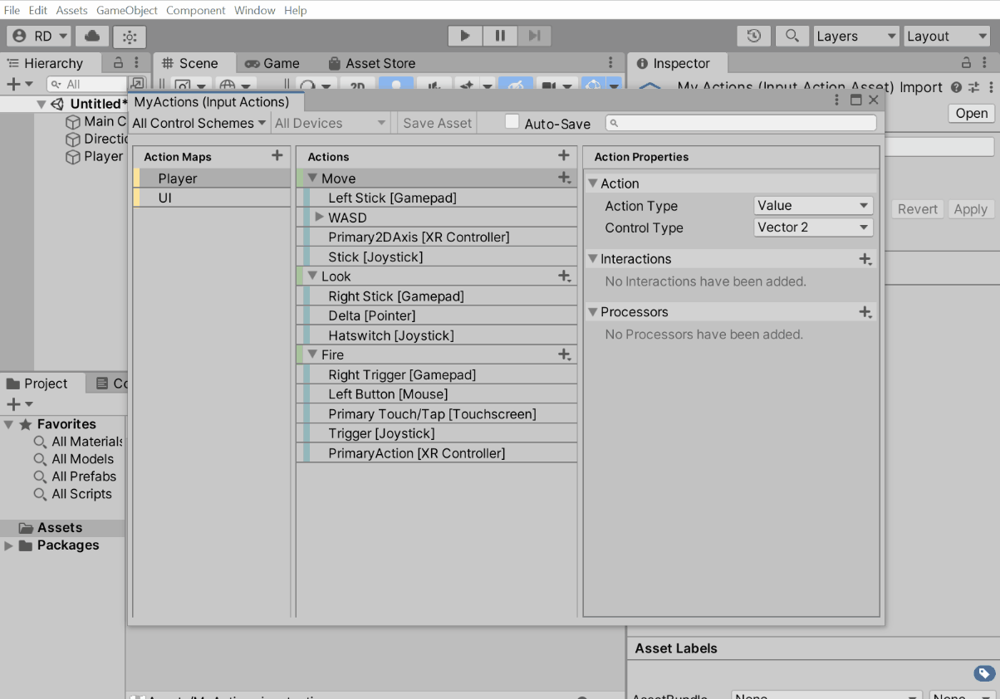

# How do I…?

Get Started:

* [... set up input in a blank project?](#set-up-input-in-a-blank-project)
* [... set up uGUI to work with the input system?](#set-up-ugui-to-work-with-the-input-system)
* [... keep using the old input system alongside the new one?](#keep-using-the-old-input-system-alongside-the-new-one)

Players:

-----------
* [... have multiple local players in my game?](#have-multiple-local-players-in-my-game)
* [... detect when the player is switching from keyboard&mouse to gamepad?](#detect-when-a-player-is-switching-from-keyboard-mouse-to-gamepad)

Actions:

* [... create a button input?](#create-a-button-input)
* [... create a value input?](#create-a-value-input)
* [... create a SHIFT+B input?](#create-a-shift-b-input)
* [... create a WASD input?](#create-a-wasd-input)
* [... require a button to be pressed quickly or slowly?](#require-a-button-to-be-pressed-quickly-or-slowly)

Rebinding:

* [... let the user rebind an action to a different control?](#let-a-user-rebind-an-action-to-a-different-control)
* [... show in the UI what an action is currently bound to?](#show-in-the-ui-what-an-action-is-currently-bound-to)
* [... save and load rebinds?](#save-and-load-rebinds)

UI:

* [... prevent input consumed by the UI from triggering actions in the game?](#prevent-input-consumed-by-the-ui-from-triggering-actions-in-the-game)

Devices:

* [... detect when a device is connected or disconnected?](#detect-when-a-device-is-connected-or-disconnected)
* [... find out which devices are available?](#find-out-which-devices-are-available)
* [... wait for the player to press a button on any device?](#wait-for-the-player-to-press-a-button-on-any-device)

Gamepads:

* [... let a gamepad control the mouse cursor?](#let-a-gamepad-control-the-mouse-cursor)
* [... determine whether the player is using an Xbox or PlayStation controller?](#determine-whether-the-player-is-using-an-xbox-or-playstation-controller)

Touch:

* [... read touch input as with `UnityEngine.touches`?](#read-touch-input-as-with-unityengine-touches)
* [... create a virtual joystick?](#create-a-virtual-joystick)

Keyboards:

* [... bind to the 'q' *text* input?](#bind-to-the-q-text-input)
* [... have two players use the same keyboard?](#have-two-players-use-the-same-keyboard)
* [... receive text input?](#receive-text-input)
* [... find out which text character corresponds to a key?](...)

Sensors:

* [... read gyroscope input?](#read-gyroscope-input)

Debugging:

* [... test my game on Android or iOS?](#...)
* [... see what actions are enabled and what they are bound to?](#...)

Testing:

* [... create mock input in an automated test?](#create-mock-input-in-an-automated-test)
* [... set an action's value programmatically?](#set-an-actions-value-programmatically)
* [... record and replay input?](#record-and-replay-input)

### <a name="set-up-input-in-a-blank-project"></a>... set up input in a blank project?

1. Install the input system package through the Unity Package Manager as per [the documentation](Installation.md).
   
   This adds the [`UnityEngine.InputSystem`](../api/UnityEngine.InputSystem.html) API to your project and enables support for it in the native Unity runtime.<br><br>
2. Add a [`PlayerInput`](Components.md#playerinput-component) to a `GameObject`.
   
   This adds an [`.inputactions`](ActionAssets.md) asset to your project and sets up one player in the game to use those actions.<br><br>
3. Read input from the actions in script.
   
   ```CSharp
   public class CharacterController : MonoBehaviour
   {
       public InputActionReference fire;
       public InputActionReference move;

       public void Update()
       {
           if (fire.action.WasPressedThisFrame())
               Fire();

           var moveVector = move.action.ReadValue<Vector2>();
           Move(moveVector);
       }

       //...
   }
   ```
   There are other ways in which input from the actions can be consumed. For details, see the documentation for [`PlayerInput`](Components.md#playerinput-component) and [actions](Actions.md).

////TODO: problem: above script doesn't work as is for local multiplayer

### <a name="set-up-ugui-to-work-with-the-input-system"></a> ... set up uGUI to work with the input system?

Go to the `EventSystem` object and click the "Replace with InputSystemUIInputModule" button. Optionally, to use your own bindings instead of the default ones, drag your custom `.inputactions` asset into the `Actions Asset` field.


This will set up uGUI to receive events generated from input defined in an [`.inputactions`](ActionAssets.md) asset. If needed, you can customize the bindings.

### <a name="keep-using-the-old-input-system-alongside-the-new-one"></a> ... keep using the old input system alongside the new one?

After [installation](Installation.md), set `Active Input Handling` in `Player Preferences` to `Both`.


### <a name="have-multiple-local-players-in-my-game"></a> ... have multiple local players in my game?

Each [`PlayerInput`](Components.md#playerinput-component) represents one player. Having more than one `GameObject` with the `PlayerInput` component on it in the game automatically creates multiple independent players. Each player TODO............................


```CSharp
// Enumerate all player currently in the game.
foreach (var player in playerInput.all)
   Debug.Log($"Player ...");
```

----------------

### <a name="let-a-user-rebind-an-action-to-a-different-control"></a> ... let the user rebind an action to a different control?


### <a name="save-and-load-rebinds"></a> ... save and load rebinds?

Call [`SaveBindingOverridesAsJson`](../api/UnityEngine.InputSystem.InputActionRebindingExtensions.html#UnityEngine_InputSystem_InputActionRebindingExtensions_SaveBindingOverridesAsJson_UnityEngine_InputSystem_IInputActionCollection2_) to create a string containing all rebinds for the given set of actions and [`LoadBindingOverridesFromJson`](../api/UnityEngine.InputSystem.InputActionRebindingExtensions.html#UnityEngine_InputSystem_InputActionRebindingExtensions_LoadBindingOverridesFromJson_UnityEngine_InputSystem_IInputActionCollection2_System_String_System_Boolean_) to restore rebinds from such a string.

```CSharp
void SaveUserRebinds(PlayerInput player)
{
    var rebinds = player.actions.SaveBindingOverridesAsJson();
    PlayerPrefs.SetString("rebinds", rebinds);
}

void LoadUserRebinds(PlayerInput player)
{
    var rebinds = PlayerPrefs.GetString("rebinds");
    player.actions.LoadBindingOverridesFromJson(rebinds);
}
```

---------

### <a name="create-mock-input-in-an-automated-test"></a> ... create mock input in an automated test?


```CSharp
// InputTestFixture isolates input for testing. No devices and no input from the host machine.
// Automatically cleans up any input-related setup put in place by a test.
class Tests : InputTestFixture
{
   [Test] // Works with [Test] and [UnityTest].
   public void Test()
   {
      // Can add devices here or in setup. Whatever we add to or register with the
      // input system will be removed after the test has finished.
      var mouse = InputSystem.AddDevice<Mouse>();

      // Move the mouse.
      Set(mouse.position, new Vector2(123, 234));

      // Can also step input manually in tests. In a [UnityTest], this
      // happens automatically whenever Unity advances by a frame.
      InputSystem.Update();
   }
}
```
