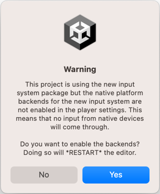
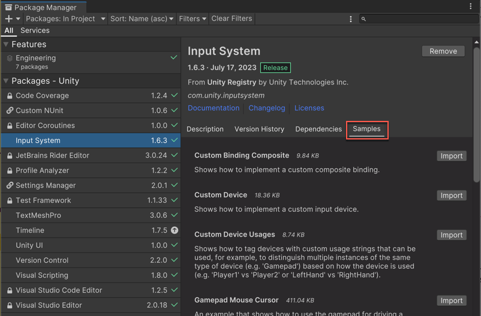

# Installation guide

* [Installing the package](#installing-the-package)
* [Enabling the new input backends](#enabling-the-new-input-backends)
* [Installing samples](#installing-samples)

This guide describes how to install and activate the Input System package for your Unity Project.

>__Note__: The new Input System requires Unity 2019.1+ and the .NET 4 runtime. It doesn't work in projects using the old .NET 3.5 runtime.

## Installing the package

To install the new Input System, open Unity's package manager (menu: __Window > Package Manager__). Select the __Input System__ package from the list, then click __Install__.

## Enabling the new input backends

By default, Unity's classic Input Manager (`UnityEngine.Input`) is active and support for the new Input System is inactive. This allows existing Unity Projects to keep working as they are.

When you install the Input System package, Unity will ask whether you want to enable the new backends. If you click **Yes**, Unity will enable the new backends and disable the old backends, and the Editor will restart.

You can find the corresponding setting in the Player settings (menu: __Edit > Project Settings > Player__), under **Active Input Handling**. You can change this setting at any time. Doing so will restart the Editor.

>**Note:** You can enable __both__ the old __and__ the new system at the same time. To do so, set **Active Input Handling** to **Both**.

When the new input backends are enabled, the `ENABLE_INPUT_SYSTEM=1` C# `#define` is added to builds. Similarly, when the old input backends are enabled, the `ENABLE_LEGACY_INPUT_MANAGER=1` C# `#define` is added. Because both can be enabled at the same time, it is possible for __both__ defines to be 1 at the same time.

## Installing samples

The Input System package comes with a number of samples. You can install these directly from the Package Manager window in Unity (menu: __Window > Package Manager__). To see the list, select the Input System package in the Package Manager window. Click **Import into Project** next to a sample to copy it into the current Project.

