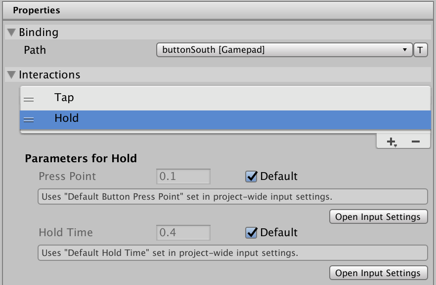
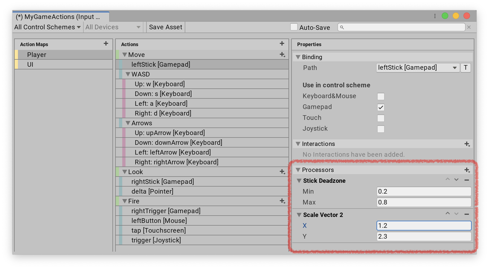
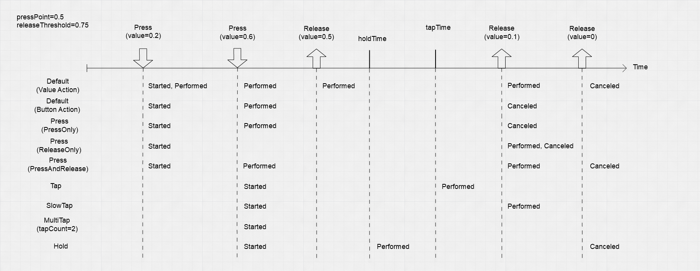

# Interactions

* [Operation](#operation)
    * [Multiple Controls on an Action](#multiple-controls-on-an-action)
    * [Multiple Interactios on a Binding](#multiple-interactions-on-a-binding)
    * [Timeouts](#timeouts)
* [Using Interactions](#using-interactions)
    * [Interactions applied to Bindings](#interactions-applied-to-bindings)
    * [Interactions applied to Actions](#interactions-applied-to-actions)
* [Predefined Interactions](#predefined-interactions)
    * [Default Interaction](#default-interaction)
    * [Press](#press)
    * [Hold](#hold)
    * [Tap](#tap)
    * [SlowTap](#slowtap)
    * [MultiTap](#multitap)
* [Custom Interactions](#writing-custom-interactions)

An Interaction represents a specific input pattern. For example, a [hold](#hold) is an Interaction that requires a Control to be held for at least a minimum amount of time.

Interactions drive responses on Actions. You can place them on individual Bindings or an Action as a whole, in which case they apply to every Binding on the Action. At runtime, when a particular interaction completes, this triggers the Action.



## Operation

An Interaction has a set of distinct phases it can go through in response to receiving input.

|Phase|Description|
|-----|-----------|
|`Waiting`|The Interaction is waiting for input.|
|`Started`|The Interaction has been started (that is, it received some of its expected input), but is not complete yet.|
|`Performed`|The Interaction is complete.|
|`Canceled`|The Interaction was interrupted and aborted. For example, the user pressed and then released a button before the minimum time required for a [hold  Interaction](#hold) to complete.|

Not every Interaction triggers every phase, and the pattern in which specific Interactions trigger phases depends on the Interaction type.

While `Performed` is typically the phase that triggers the actual response to an Interaction, `Started` and `Canceled` can be  useful for providing UI feedback while the Interaction is in progress. For example, when a [hold](#hold) is `Started`, the app can display a progress bar that fills up until the hold time has been reached. If, however, the hold is `Canceled` before it completes, the app can reset the progress bar to the beginning.

The following example demonstrates this kind of setup with a fire Action that the user can tap to fire immediately, or hold to charge:

```CSharp
var fireAction = new InputAction("fire");
fireAction.AddBinding("<Gamepad>/buttonSouth")
    // Tap fires, slow tap charges. Both act on release.
    .WithInteractions("tap;slowTap");

fireAction.started +=
    context =>
    {
        if (context.Interaction is SlowTapInteraction)
            ShowChargingUI();
    };

fireAction.performed +=
    context =>
    {
        if (context.Interaction is SlowTapInteraction)
            ChargedFire();
        else
            Fire();
    };

fireAction.canceled +=
    _ => HideChargingUI();
```

### Multiple Controls on an Action

If you have multiple Controls bound to a Binding or an Action which has an Interaction, then the Input System first applies the [Control conflict resolution](ActionBindings.md#conflicting-inputs) logic to get a single value for the Action, which it then feeds to the Interaction logic. Any of the bound Controls can perform the Interaction.

### Multiple Interactions on a Binding

If multiple Interactions are present on a single Binding or Action, then the Input System checks the Interactions in the order they are present on the Binding. The code example [above](#operation) illustrates this example. The Binding on the `fireAction` Action has two Interactions: `WithInteractions("tap;slowTap")`. The [tap](#tap) Interaction gets a first chance at interpreting the input from the Action. If the button is pressed, the Action calls the `Started` callback on the tap Interaction. If the user keeps holding the button, the tap Interaction times out, and the Action calls the [`Canceled`](../api/UnityEngine.InputSystem.InputAction.html#UnityEngine_InputSystem_InputAction_canceled) callback for the tap Interaction and starts processing the [slow tap](#slowtap) Interaction (which now receives a `Started` callback).

At any one time, only one Interaction can be "driving" the action (that is, it gets to determine the action's current [`phase`](../api/UnityEngine.InputSystem.InputAction.html#UnityEngine_InputSystem_InputAction_phase)). If an Interaction higher up in the stack cancels, Interactions lower down in the stack can take over.

### Timeouts

Interactions might need to wait a certain time for a specific input to occur or to not occur. An example of this is the [Hold](#hold) interaction which, after a button is pressed, has to wait for a set [duration](../api/UnityEngine.InputSystem.Interactions.HoldInteraction.html#UnityEngine_InputSystem_Interactions_HoldInteraction_duration) until the "hold" is complete. To do this, an interaction installs a timeout using [`SetTimeout`](../api/UnityEngine.InputSystem.InputInteractionContext.html#UnityEngine_InputSystem_InputInteractionContext_SetTimeout_System_Single_).

It can be useful to know how much of a timeout is left for an interaction to complete. For example, you might want to display a bar in the UI that is charging up while the interaction is waiting to complete. To query the percentage to which a timeout has completed, use [`GetTimeoutCompletionPercentage`](../api/UnityEngine.InputSystem.InputAction.html#UnityEngine_InputSystem_InputAction_GetTimeoutCompletionPercentage_).

```CSharp
// Returns a value between 0 (inclusive) and 1 (inclusive).
var warpActionCompletion = playerInput.actions["warp"].GetTimeoutCompletionPercentage();
```

Note that each Interaction can have its own separate timeout (but only a single one at any one time). If [multiple interactions](#multiple-interactions-on-a-binding) are in effect, then [`GetTimeoutCompletionPercentage`](../api/UnityEngine.InputSystem.InputAction.html#UnityEngine_InputSystem_InputAction_GetTimeoutCompletionPercentage_) will only use the timeout of the one interaction that is currently driving the action.

Some Interactions might involve multiple timeouts in succession. In this case, knowing only the completion of the currently running timeout (if any) is often not useful. An example is [`MultiTapInteraction`](../api/UnityEngine.InputSystem.Interactions.MultiTapInteraction.html), which involves a timeout on each individual tap, as well as a timeout in-between taps. The Interaction is complete only after a full tap sequence has been performed.

An Interaction can use [`SetTotalTimeoutCompletionTime`](../api/UnityEngine.InputSystem.InputInteractionContext.html#UnityEngine_InputSystem_InputInteractionContext_SetTotalTimeoutCompletionTime_System_Single_) to inform the Input System of the total time it will run timeouts for.

## Using Interactions

You can install Interactions on [Bindings](ActionBindings.md) or [Actions](Actions.md).

### Interactions applied to Bindings

When you create Bindings for your [Actions](Actions.md), you can choose to add Interactions to the Bindings.

If you're using [Input Action Assets](ActionAssets.md), you can add any Interaction to your Bindings in the Input Action editor. Once you [created some Bindings](ActionAssets.md#editing-bindings), select the Binding you want to add Interactions to, so that the right pane of the window shows the properties for that Binding. Next, click on the plus icon on the __Interactions__ foldout to open a list of all available Interactions types. Choose an Interaction type to add an Interaction instance of that type. The Interaction now appears in the __Interactions__ foldout. If the Interaction has any parameters, you can now edit them here as well:



To remove an Interaction, click the minus button next to it. To change the [order of Interactions](#multiple-interactions-on-a-binding), click the up and down arrows.

If you create your Bindings in code, you can add Interactions like this:

```CSharp
var Action = new InputAction();
action.AddBinding("<Gamepad>/leftStick")
    .WithInteractions("tap(duration=0.8)");
```

### Interactions applied to Actions

Applying Interactions directly to an Action is equivalent to applying them to all Bindings for the Action. It is thus more or less a shortcut that avoids manually adding the same Interaction(s) to each of the Bindings.

If Interactions are applied __both__ to an Action and to its Bindings, then the effect is the same as if the Action's Interactions are *appended* to the list of Interactions on each of the Bindings. This means that the Binding's Interactions are applied *first*, and then the Action's Interactions are applied *after*.

You can add and edit Interactions on Actions in the [Input Action Assets](ActionAssets.md) editor window the [same way](#interactions-applied-to-bindings) as you would do for Bindings: select an Action to Edit, then add the Interactions in the right window pane.

If you create your Actions in code, you can add Interactions like this:

```CSharp
var Action = new InputAction(Interactions: "tap(duration=0.8)");
```

## Predefined Interactions

The Input System package comes with a set of basic Interactions you can use. If an Action has no Interactions set, the system uses its [default Interaction](#default-interaction).

>__Note__: The built-in Interactions operate on Control actuation and don't use Control values directly. The Input System evaluates the `pressPoint` parameters against the magnitude of the Control actuation. This means you can use these Interactions on any Control which has a magnitude, such as sticks, and not just on buttons.

The following diagram shows the behavior of the built-in Interactions for a simple button press.



### Default Interaction

If you haven't specifically added an Interaction to a Binding or its Action, the default Interaction applies to the Binding.

[`Value`](Actions.md#value) type Actions have the following behavior:

1. As soon as a bound Control becomes [actuated](Controls.md#control-actuation), the Action goes from `Waiting` to `Started`, and then immediately to `Performed` and back to `Started`. One callback occurs on [`InputAction.started`](../api/UnityEngine.InputSystem.InputAction.html#UnityEngine_InputSystem_InputAction_started), followed by one callback on [`InputAction.performed`](../api/UnityEngine.InputSystem.InputAction.html#UnityEngine_InputSystem_InputAction_performed).
2. For as long as the bound Control remains actuated, the Action stays in `Started` and triggers `Performed` whenever the value of the Control changes (that is, one call occurs to [`InputAction.performed`](../api/UnityEngine.InputSystem.InputAction.html#UnityEngine_InputSystem_InputAction_performed)).
3. When the bound Control stops being actuated, the Action goes to `Canceled` and then back to `Waiting`. One call occurs to [`InputAction.canceled`](../api/UnityEngine.InputSystem.InputAction.html#UnityEngine_InputSystem_InputAction_canceled).

[`Button`](Actions.md#button) type Actions have the following behavior:

1. As soon as a bound Control becomes [actuated](Controls.md#control-actuation), the Action goes from `Waiting` to `Started`. One callback occurs on [`InputAction.started`](../api/UnityEngine.InputSystem.InputAction.html#UnityEngine_InputSystem_InputAction_started).
2. If a Control then reaches or exceeds the button press threshold, the Action goes from `Started` to `Performed`. One callback occurs on [`InputAction.performed`](../api/UnityEngine.InputSystem.InputAction.html#UnityEngine_InputSystem_InputAction_performed). The default value of the button press threshold is defined in the [input settings](../api/UnityEngine.InputSystem.InputSettings.html#UnityEngine_InputSystem_InputSettings_defaultButtonPressPoint). However, an individual control can [override](../api/UnityEngine.InputSystem.Controls.ButtonControl.html#UnityEngine_InputSystem_Controls_ButtonControl_pressPoint) this value.
3. Once the Action has `Performed`, if all Controls then go back to a level of actuation at or below the [release threshold](../api/UnityEngine.InputSystem.InputSettings.html#UnityEngine_InputSystem_InputSettings_buttonReleaseThreshold), the Action goes from `Performed` to `Canceled`. One call occurs to [`InputAction.canceled`](../api/UnityEngine.InputSystem.InputAction.html#UnityEngine_InputSystem_InputAction_canceled).
4. If the Action never went to `Performed`, it will go to `Canceled` as soon as all Controls are released. One call occurs to [`InputAction.canceled`](../api/UnityEngine.InputSystem.InputAction.html#UnityEngine_InputSystem_InputAction_canceled).

[`PassThrough`](Actions.md#pass-through) type Actions have a simpler behavior. The Input System doesn't try to track bound Controls as a single source of input. Instead, it triggers a `Performed` callback for each value change.

|__Callback__|[`InputActionType.Value`](Actions.md#value)|[`InputActionType.Button`](Actions.md#button)|[`InputActionType.PassThrough`](Actions.md#pass-through)|
|-----------|-------------|------------|-----------------|
|[`started`](../api/UnityEngine.InputSystem.InputAction.html#UnityEngine_InputSystem_InputAction_started)|Control(s) changed value away from the default value.|Button started being pressed but has not necessarily crossed the press threshold yet.|First Control actuation after Action was enabled.|
|[`performed`](../api/UnityEngine.InputSystem.InputAction.html#UnityEngine_InputSystem_InputAction_performed)|Control(s) changed value.|Button was pressed to at least the button [press threshold](../api/UnityEngine.InputSystem.InputSettings.html#UnityEngine_InputSystem_InputSettings_defaultButtonPressPoint).|Control changed value.|
|[`canceled`](../api/UnityEngine.InputSystem.InputAction.html#UnityEngine_InputSystem_InputAction_canceled)|Control(s) are no longer actuated.|Button was released. If the button was pressed above the press threshold, the button has now fallen to or below the [release threshold](../api/UnityEngine.InputSystem.InputSettings.html#UnityEngine_InputSystem_InputSettings_buttonReleaseThreshold). If the button was never fully pressed, the button is now back to completely unpressed.|Action is disabled.|

### Press

You can use a [`PressInteraction`](../api/UnityEngine.InputSystem.Interactions.PressInteraction.html) to explicitly force button-like interactions. Use the [`behavior`](../api/UnityEngine.InputSystem.Interactions.PressInteraction.html#UnityEngine_InputSystem_Interactions_PressInteraction_behavior) parameter to select if the Interaction should trigger on button press, release, or both.

|__Parameters__|Type|Default value|
|---|---|---|
|[`pressPoint`](../api/UnityEngine.InputSystem.Interactions.PressInteraction.html#UnityEngine_InputSystem_Interactions_PressInteraction_pressPoint)|`float`|[`InputSettings.defaultButtonPressPoint`](../api/UnityEngine.InputSystem.InputSettings.html#UnityEngine_InputSystem_InputSettings_defaultButtonPressPoint)|
|[`behavior`](../api/UnityEngine.InputSystem.Interactions.PressInteraction.html#UnityEngine_InputSystem_Interactions_PressInteraction_behavior)|[`PressBehavior`](../api/UnityEngine.InputSystem.Interactions.PressBehavior.html)|`PressOnly`|


|__Callbacks__/[`behavior`](../api/UnityEngine.InputSystem.Interactions.PressInteraction.html#UnityEngine_InputSystem_Interactions_PressInteraction_behavior)|`PressOnly`|`ReleaseOnly`|`PressAndRelease`|
|---|-----------|-------------|-----------------|
|[`started`](../api/UnityEngine.InputSystem.InputAction.html#UnityEngine_InputSystem_InputAction_started)|Control magnitude crosses [`pressPoint`](../api/UnityEngine.InputSystem.Interactions.PressInteraction.html#UnityEngine_InputSystem_Interactions_PressInteraction_pressPoint)|Control magnitude crosses [`pressPoint`](../api/UnityEngine.InputSystem.Interactions.PressInteraction.html#UnityEngine_InputSystem_Interactions_PressInteraction_pressPoint)|Control magnitude crosses [`pressPoint`](../api/UnityEngine.InputSystem.Interactions.PressInteraction.html#UnityEngine_InputSystem_Interactions_PressInteraction_pressPoint)|
|[`performed`](../api/UnityEngine.InputSystem.InputAction.html#UnityEngine_InputSystem_InputAction_performed)|Control magnitude crosses [`pressPoint`](../api/UnityEngine.InputSystem.Interactions.PressInteraction.html#UnityEngine_InputSystem_Interactions_PressInteraction_pressPoint)|Control magnitude goes back below [`pressPoint`](../api/UnityEngine.InputSystem.Interactions.PressInteraction.html#UnityEngine_InputSystem_Interactions_PressInteraction_pressPoint)|- Control magnitude crosses [`pressPoint`](../api/UnityEngine.InputSystem.Interactions.PressInteraction.html#UnityEngine_InputSystem_Interactions_PressInteraction_pressPoint)<br>or<br>- Control magnitude goes back below [`pressPoint`](../api/UnityEngine.InputSystem.Interactions.PressInteraction.html#UnityEngine_InputSystem_Interactions_PressInteraction_pressPoint)|
|[`canceled`](../api/UnityEngine.InputSystem.InputAction.html#UnityEngine_InputSystem_InputAction_canceled)|not used|not used|not used|

### Hold

A [`HoldInteraction`](../api/UnityEngine.InputSystem.Interactions.HoldInteraction.html) requires the user to hold a Control for [`duration`](../api/UnityEngine.InputSystem.Interactions.HoldInteraction.html#UnityEngine_InputSystem_Interactions_HoldInteraction_duration) seconds before the Input System triggers the Action.

|__Parameters__|Type|Default value|
|---|---|---|
|[`duration`](../api/UnityEngine.InputSystem.Interactions.HoldInteraction.html#UnityEngine_InputSystem_Interactions_HoldInteraction_duration)|`float`|[`InputSettings.defaultHoldTime`](../api/UnityEngine.InputSystem.InputSettings.html#UnityEngine_InputSystem_InputSettings_defaultHoldTime)|
|[`pressPoint`](../api/UnityEngine.InputSystem.Interactions.HoldInteraction.html#UnityEngine_InputSystem_Interactions_HoldInteraction_pressPoint)|`float`|[`InputSettings.defaultButtonPressPoint`](../api/UnityEngine.InputSystem.InputSettings.html#UnityEngine_InputSystem_InputSettings_defaultButtonPressPoint)|

|__Callbacks__||
|---|---|
|[`started`](../api/UnityEngine.InputSystem.InputAction.html#UnityEngine_InputSystem_InputAction_started)|Control magnitude crosses [`pressPoint`](../api/UnityEngine.InputSystem.Interactions.HoldInteraction.html#UnityEngine_InputSystem_Interactions_HoldInteraction_pressPoint).|
|[`performed`](../api/UnityEngine.InputSystem.InputAction.html#UnityEngine_InputSystem_InputAction_performed)|Control magnitude held above [`pressPoint`](../api/UnityEngine.InputSystem.Interactions.HoldInteraction.html#UnityEngine_InputSystem_Interactions_HoldInteraction_pressPoint) for >= [`duration`](../api/UnityEngine.InputSystem.Interactions.HoldInteraction.html#UnityEngine_InputSystem_Interactions_HoldInteraction_duration).|
|[`canceled`](../api/UnityEngine.InputSystem.InputAction.html#UnityEngine_InputSystem_InputAction_canceled)|Control magnitude goes back below [`pressPoint`](../api/UnityEngine.InputSystem.Interactions.HoldInteraction.html#UnityEngine_InputSystem_Interactions_HoldInteraction_pressPoint) before [`duration`](../api/UnityEngine.InputSystem.Interactions.HoldInteraction.html#UnityEngine_InputSystem_Interactions_HoldInteraction_duration) (that is, the button was not held long enough).|

### Tap

A [`TapInteraction`](../api/UnityEngine.InputSystem.Interactions.TapInteraction.html) requires the user to press and release a Control within [`duration`](../api/UnityEngine.InputSystem.Interactions.TapInteraction.html#UnityEngine_InputSystem_Interactions_TapInteraction_duration) seconds to trigger the Action.

|__Parameters__|Type|Default value|
|---|---|---|
|[`duration`](../api/UnityEngine.InputSystem.Interactions.TapInteraction.html#UnityEngine_InputSystem_Interactions_TapInteraction_duration)|`float`|[`InputSettings.defaultTapTime`](../api/UnityEngine.InputSystem.InputSettings.html#UnityEngine_InputSystem_InputSettings_defaultTapTime)|
|[`pressPoint`](../api/UnityEngine.InputSystem.Interactions.TapInteraction.html#UnityEngine_InputSystem_Interactions_TapInteraction_pressPoint)|`float`|[`InputSettings.defaultButtonPressPoint`](../api/UnityEngine.InputSystem.InputSettings.html#UnityEngine_InputSystem_InputSettings_defaultButtonPressPoint)|

|__Callbacks__||
|---|---|
|[`started`](../api/UnityEngine.InputSystem.InputAction.html#UnityEngine_InputSystem_InputAction_started)|Control magnitude crosses [`pressPoint`](../api/UnityEngine.InputSystem.Interactions.TapInteraction.html#UnityEngine_InputSystem_Interactions_TapInteraction_pressPoint).|
|[`performed`](../api/UnityEngine.InputSystem.InputAction.html#UnityEngine_InputSystem_InputAction_performed)|Control magnitude goes back below [`pressPoint`](../api/UnityEngine.InputSystem.Interactions.TapInteraction.html#UnityEngine_InputSystem_Interactions_TapInteraction_pressPoint) before [`duration`](../api/UnityEngine.InputSystem.Interactions.TapInteraction.html#UnityEngine_InputSystem_Interactions_TapInteraction_duration).|
|[`canceled`](../api/UnityEngine.InputSystem.InputAction.html#UnityEngine_InputSystem_InputAction_canceled)|Control magnitude held above [`pressPoint`](../api/UnityEngine.InputSystem.Interactions.TapInteraction.html#UnityEngine_InputSystem_Interactions_TapInteraction_pressPoint) for >= [`duration`](../api/UnityEngine.InputSystem.Interactions.TapInteraction.html#UnityEngine_InputSystem_Interactions_TapInteraction_duration) (that is, the tap was too slow).|

### SlowTap

A [`SlowTapInteraction`](../api/UnityEngine.InputSystem.Interactions.SlowTapInteraction.html) requires the user to press and hold a Control for a minimum duration of [`duration`](../api/UnityEngine.InputSystem.Interactions.SlowTapInteraction.html#UnityEngine_InputSystem_Interactions_SlowTapInteraction_duration) seconds, and then release it, to trigger the Action.

|__Parameters__|Type|Default value|
|---|---|---|
|[`duration`](../api/UnityEngine.InputSystem.Interactions.SlowTapInteraction.html#UnityEngine_InputSystem_Interactions_SlowTapInteraction_duration)|`float`|[`InputSettings.defaultSlowTapTime`](../api/UnityEngine.InputSystem.InputSettings.html#UnityEngine_InputSystem_InputSettings_defaultSlowTapTime)|
|[`pressPoint`](../api/UnityEngine.InputSystem.Interactions.SlowTapInteraction.html#UnityEngine_InputSystem_Interactions_SlowTapInteraction_pressPoint)|`float`|[`InputSettings.defaultButtonPressPoint`](../api/UnityEngine.InputSystem.InputSettings.html#UnityEngine_InputSystem_InputSettings_defaultButtonPressPoint)|

|__Callbacks__||
|---|---|
|[`started`](../api/UnityEngine.InputSystem.InputAction.html#UnityEngine_InputSystem_InputAction_started)|Control magnitude crosses [`pressPoint`](../api/UnityEngine.InputSystem.Interactions.SlowTapInteraction.html#UnityEngine_InputSystem_Interactions_SlowTapInteraction_pressPoint).|
|[`performed`](../api/UnityEngine.InputSystem.InputAction.html#UnityEngine_InputSystem_InputAction_performed)|Control magnitude goes back below [`pressPoint`](../api/UnityEngine.InputSystem.Interactions.SlowTapInteraction.html#UnityEngine_InputSystem_Interactions_SlowTapInteraction_pressPoint) after [`duration`](../api/UnityEngine.InputSystem.Interactions.SlowTapInteraction.html#UnityEngine_InputSystem_Interactions_SlowTapInteraction_duration).|
|[`canceled`](../api/UnityEngine.InputSystem.InputAction.html#UnityEngine_InputSystem_InputAction_canceled)|Control magnitude goes back below [`pressPoint`](../api/UnityEngine.InputSystem.Interactions.SlowTapInteraction.html#UnityEngine_InputSystem_Interactions_SlowTapInteraction_pressPoint) before [`duration`](../api/UnityEngine.InputSystem.Interactions.SlowTapInteraction.html#UnityEngine_InputSystem_Interactions_SlowTapInteraction_duration) (that is, the tap was too fast).|

### MultiTap

A [`MultiTapInteraction`](../api/UnityEngine.InputSystem.Interactions.MultiTapInteraction.html) requires the user to press and release a Control within [`tapTime`](../api/UnityEngine.InputSystem.Interactions.MultiTapInteraction.html#UnityEngine_InputSystem_Interactions_MultiTapInteraction_tapTime) seconds [`tapCount`](../api/UnityEngine.InputSystem.Interactions.MultiTapInteraction.html#UnityEngine_InputSystem_Interactions_MultiTapInteraction_tapCount) times, with no more then [`tapDelay`](../api/UnityEngine.InputSystem.Interactions.MultiTapInteraction.html#UnityEngine_InputSystem_Interactions_MultiTapInteraction_tapDelay) seconds passing between taps, for the Interaction to trigger. You can use this to detect double-click or multi-click gestures.

|__Parameters__|Type|Default value|
|---|---|---|
|[`tapTime`](../api/UnityEngine.InputSystem.Interactions.MultiTapInteraction.html#UnityEngine_InputSystem_Interactions_MultiTapInteraction_tapTime)|`float`|[`InputSettings.defaultTapTime`](../api/UnityEngine.InputSystem.InputSettings.html#UnityEngine_InputSystem_InputSettings_defaultTapTime)|
|[`tapDelay`](../api/UnityEngine.InputSystem.Interactions.MultiTapInteraction.html#UnityEngine_InputSystem_Interactions_MultiTapInteraction_tapDelay)|`float`|2 * [`tapTime`](../api/UnityEngine.InputSystem.Interactions.MultiTapInteraction.html#UnityEngine_InputSystem_Interactions_MultiTapInteraction_tapTime)|
|[`tapCount`](../api/UnityEngine.InputSystem.Interactions.MultiTapInteraction.html#UnityEngine_InputSystem_Interactions_MultiTapInteraction_tapCount)|`int`|2|
|[`pressPoint`](../api/UnityEngine.InputSystem.Interactions.MultiTapInteraction.html#UnityEngine_InputSystem_Interactions_MultiTapInteraction_pressPoint)|`float`|[`InputSettings.defaultButtonPressPoint`](../api/UnityEngine.InputSystem.InputSettings.html#UnityEngine_InputSystem_InputSettings_defaultButtonPressPoint)|

|__Callbacks__||
|---|---|
|[`started`](../api/UnityEngine.InputSystem.InputAction.html#UnityEngine_InputSystem_InputAction_started)|Control magnitude crosses [`pressPoint`](../api/UnityEngine.InputSystem.Interactions.MultiTapInteraction.html#UnityEngine_InputSystem_Interactions_MultiTapInteraction_pressPoint).|
|[`performed`](../api/UnityEngine.InputSystem.InputAction.html#UnityEngine_InputSystem_InputAction_performed)|Control magnitude went back below [`pressPoint`](../api/UnityEngine.InputSystem.Interactions.MultiTapInteraction.html#UnityEngine_InputSystem_Interactions_MultiTapInteraction_pressPoint) and back up above it repeatedly for [`tapCount`](../api/UnityEngine.InputSystem.Interactions.MultiTapInteraction.html#UnityEngine_InputSystem_Interactions_MultiTapInteraction_tapCount) times.|
|[`canceled`](../api/UnityEngine.InputSystem.InputAction.html#UnityEngine_InputSystem_InputAction_canceled)|- After going back below [`pressPoint`](../api/UnityEngine.InputSystem.Interactions.MultiTapInteraction.html#UnityEngine_InputSystem_Interactions_MultiTapInteraction_pressPoint), Control magnitude did not go back above [`pressPoint`](../api/UnityEngine.InputSystem.Interactions.MultiTapInteraction.html#UnityEngine_InputSystem_Interactions_MultiTapInteraction_pressPoint) within [`tapDelay`](../api/UnityEngine.InputSystem.Interactions.MultiTapInteraction.html#UnityEngine_InputSystem_Interactions_MultiTapInteraction_tapDelay) time (that is, taps were spaced out too far apart).<br>or<br>- After going back above [`pressPoint`](../api/UnityEngine.InputSystem.Interactions.MultiTapInteraction.html#UnityEngine_InputSystem_Interactions_MultiTapInteraction_pressPoint), Control magnitude did not go back below [`pressPoint`](../api/UnityEngine.InputSystem.Interactions.MultiTapInteraction.html#UnityEngine_InputSystem_Interactions_MultiTapInteraction_pressPoint) within [`tapTime`](../api/UnityEngine.InputSystem.Interactions.MultiTapInteraction.html#UnityEngine_InputSystem_Interactions_MultiTapInteraction_tapTime) time (that is, taps were too long).|

## Writing custom Interactions

You can also write a custom Interaction to use in your Project. You can use custom Interactions in the UI and code the same way you use built-in Interactions. Add a class implementing the [`IInputInteraction`](../api/UnityEngine.InputSystem.IInputInteraction.html) interface, like this:

```CSharp
// Interaction which performs when you quickly move an
// axis all the way from extreme to the other.
public class MyWiggleInteraction : IInputInteraction
{
    public float duration = 0.2;

    void Process(ref InputInteractionContext context)
    {
        if (context.timerHasExpired)
        {
            context.Canceled();
            return;
        }

        switch (context.phase)
        {
            case InputActionPhase.Waiting:
                if (context.Control.ReadValue<float>() == 1)
                {
                    context.Started();
                    context.SetTimeout(duration);
                }
                break;

            case InputActionPhase.Started:
                if (context.Control.ReadValue<float>() == -1)
                    context.Performed();
                break;
        }
    }

    // Unlike processors, Interactions can be stateful, meaning that you can keep a
    // local state that mutates over time as input is received. The system might
    // invoke the Reset() method to ask Interactions to reset to the local state
    // at certain points.
    void Reset()
    {
    }
}
```

Now, you need to tell the Input System about your Interaction. Call this method in your initialization code:

```CSharp
InputSystem.RegisterInteraction<MyWiggleInteraction>();
```

Your new Interaction is now available in the [Input Action Asset Editor window](ActionAssets.md). You can also add it in code like this:

```CSharp
var Action = new InputAction(Interactions: "MyWiggle(duration=0.5)");
```
