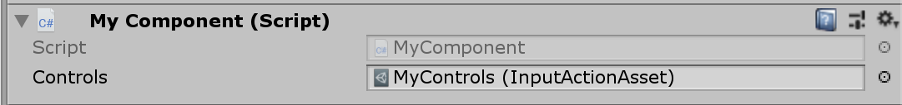

    ////TODO: the screenshots are outdated and need updating

# Migrate From Old Input System

This guide provides a listing of the APIs in `UnityEngine.Input` (and related APIs in `UnityEngine`) and their corresponding APIs in the new input system. Not all APIs have a corresponding version in the new API yet.

>NOTE: The new APIs are currently in the `UnityEngine.Experimental.Input` namespace. The namespace is omitted here for brevity. `UnityEngine.Input` is referenced in full for easy disambiguation.

## [`UnityEngine.Input`](https://docs.unity3d.com/ScriptReference/Input.html)

### [`UnityEngine.Input.acceleration`](https://docs.unity3d.com/ScriptReference/Input-acceleration.html)

`Accelerometer.current.acceleration.ReadValue()`

### [`UnityEngine.Input.accelerationEventCount`](https://docs.unity3d.com/ScriptReference/Input-accelerationEventCount.html)

See next section.

### [`UnityEngine.Input.accelerationEvents`](https://docs.unity3d.com/ScriptReference/Input-accelerationEvents.html)

Acceleration events are not made available separately from other input events. The following code will listen to all input events and filter out state changes on `Accelerometer` devices.

```
InputSystem.onEvent +=
    eventPtr =>
    {
        if (eventPtr.IsA<StateEvent>() || eventPtr.IsA<DeltaStateEvent>())
        {
            var accelerometer = InputSystem.TryGetDeviceById(eventPtr.deviceId) as Accelerometer;
            if (accelerometer != null)
            {
                var acceleration = accelerometer.acceleration.ReadValueFrom(eventPtr);
                //...
            }
        }
    }
```

>////TODO: wrap in nicer APIs

### [`UnityEngine.Input.anyKey`](https://docs.unity3d.com/ScriptReference/Input-anyKey.html)

ATM this only exists for the keyboard, not yet in a way where it also covers mouse buttons.

`Keyboard.current.anyKey.isPressed`

>////REVIEW: I think we want to have this in a way where it isn't just keyboard and mouse buttons but any meaningful "user triggered control"

### [`UnityEngine.Input.anyKeyDown`](https://docs.unity3d.com/ScriptReference/Input-anyKeyDown.html)

No corresponding API yet.

### [`UnityEngine.Input.backButtonLeavesApp`](https://docs.unity3d.com/ScriptReference/Input-backButtonLeavesApp.html)

No corresponding API yet.

### [`UnityEngine.Input.compass`](https://docs.unity3d.com/ScriptReference/Input-compass.html)

`Compass.current`

### [`UnityEngine.Input.compass.enabled`](https://docs.unity3d.com/ScriptReference/Compass-enabled.html)

```
// Get.
Compass.current.enabled

// Set.
InputSystem.EnableDevice(Compass.current);
InputSystem.DisableDevice(Compass.current);
```

### [`UnityEngine.Input.compass.headingAccuracy`](https://docs.unity3d.com/ScriptReference/Compass-headingAccuracy.html)

No corresponding API yet.

### [`UnityEngine.Input.compass.magneticHeading`](https://docs.unity3d.com/ScriptReference/Compass-magneticHeading.html)

No corresponding API yet.

### [`UnityEngine.Input.compass.rawVector`](https://docs.unity3d.com/ScriptReference/Compass-rawVector.html)

No corresponding API yet.

### [`UnityEngine.Input.compass.timestamp`](https://docs.unity3d.com/ScriptReference/Compass-timestamp.html)

`Compass.current.lastUpdateTime`

>////TODO: time units don't match

### [`UnityEngine.Input.compass.trueHeading`](https://docs.unity3d.com/ScriptReference/Compass-trueHeading.html)

No corresponding API yet.

### [`UnityEngine.Input.compensateSensors`](https://docs.unity3d.com/ScriptReference/Input-compensateSensors.html)

No corresponding API yet.

### [`UnityEngine.Input.compositionCursorPos`](https://docs.unity3d.com/ScriptReference/Input-compositionCursorPos.html)

No corresponding API yet.

### [`UnityEngine.Input.compositionString`](https://docs.unity3d.com/ScriptReference/Input-compositionString.html)

No corresponding API yet.

### [`UnityEngine.Input.deviceOrientation`](https://docs.unity3d.com/ScriptReference/Input-deviceOrientation.html)

No corresponding API yet.

### [`UnityEngine.Input.gyro`](https://docs.unity3d.com/ScriptReference/Input-gyro.html)

`Gyro.current`

### [`UnityEngine.Input.gyro.attitude`](https://docs.unity3d.com/ScriptReference/Gyroscope-attitude.html)

`Gyro.current.orientation.ReadValue()`

### [`UnityEngine.Input.gyro.enabled`](https://docs.unity3d.com/ScriptReference/Gyroscope-enabled.html)

```
// Get.
Gyro.current.enabled

// Set.
InputSystem.EnableDevice(Gyro.current);
InputSystem.DisableDevice(Gyro.current);
```

### [`UnityEngine.Input.gyro.gravity`](https://docs.unity3d.com/ScriptReference/Gyroscope-gravity.html)

`Gyro.current.gravity.ReadValue()`

### [`UnityEngine.Input.gyro.rotationRate`](https://docs.unity3d.com/ScriptReference/Gyroscope-rotationRate.html)

`Gyro.current.angularVelocity.ReadValue()`

### [`UnityEngine.Input.gyro.rotationRateUnbiased`](https://docs.unity3d.com/ScriptReference/Gyroscope-rotationRateUnbiased.html)

No corresponding API yet.

### [`UnityEngine.Input.gyro.updateInterval`](https://docs.unity3d.com/ScriptReference/Gyroscope-updateInterval.html)

`Gyro.current.samplingFrequency = 30.0f; // 30 Hz.`

>////FIXME: time units don't match

### [`UnityEngine.Input.gyro.userAcceleration`](https://docs.unity3d.com/ScriptReference/Gyroscope-userAcceleration.html)

`Gyro.current.acceleration.ReadValue()`

### [`UnityEngine.Input.imeCompositionMode`](https://docs.unity3d.com/ScriptReference/Input-imeCompositionMode.html)

No corresponding API yet.

### [`UnityEngine.Input.imeIsSelected`](https://docs.unity3d.com/ScriptReference/Input-imeIsSelected.html)

No corresponding API yet.

### [`UnityEngine.Input.inputString`](https://docs.unity3d.com/ScriptReference/Input-inputString.html)

```
Keyboard.current.onText +=
    character => /* ... */;
```

### [`UnityEngine.Input.location`](https://docs.unity3d.com/ScriptReference/Input-location.html)

No corresponding API yet.

### [`UnityEngine.Input.location.isEnabledByUser`](https://docs.unity3d.com/ScriptReference/LocationService-isEnabledByUser.html)

No corresponding API yet.

### [`UnityEngine.Input.location.lastData`](https://docs.unity3d.com/ScriptReference/LocationService-lastData.html)

No corresponding API yet.

### [`UnityEngine.Input.location.lastData.altitude`](https://docs.unity3d.com/ScriptReference/LocationInfo-altitude.html)

No corresponding API yet.

### [`UnityEngine.Input.location.lastData.horizontalAccuracy`](https://docs.unity3d.com/ScriptReference/LocationInfo-altitude.html)

No corresponding API yet.

### [`UnityEngine.Input.location.lastData.latitude`](https://docs.unity3d.com/ScriptReference/LocationInfo-latitude.html)

No corresponding API yet.

### [`UnityEngine.Input.location.lastData.timestamp`](https://docs.unity3d.com/ScriptReference/LocationInfo-timestamp.html)

No corresponding API yet.

### [`UnityEngine.Input.location.lastData.verticalAccuracy`](https://docs.unity3d.com/ScriptReference/LocationInfo-verticalAccuracy.html)

No corresponding API yet.

### [`UnityEngine.Input.location.lastData.status`](https://docs.unity3d.com/ScriptReference/LocationService-status.html)

No corresponding API yet.

### [`UnityEngine.Input.location.Start`](https://docs.unity3d.com/ScriptReference/LocationService.Start.html)

No corresponding API yet.

### [`UnityEngine.Input.location.Stop`](https://docs.unity3d.com/ScriptReference/LocationService.Stop.html)

No corresponding API yet.

### [`UnityEngine.Input.mousePosition`](https://docs.unity3d.com/ScriptReference/Input-mousePosition.html)

`Mouse.current.position.ReadValue()`

>NOTE: Mouse simulation from touch is not implemented yet.

### [`UnityEngine.Input.mousePresent`](https://docs.unity3d.com/ScriptReference/Input-mousePresent.html)

`Mouse.current != null`

### [`UnityEngine.Input.multiTouchEnabled`](https://docs.unity3d.com/ScriptReference/Input-multiTouchEnabled.html)

No corresponding API yet.

### [`UnityEngine.Input.simulateMouseWithTouches`](https://docs.unity3d.com/ScriptReference/Input-multiTouchEnabled.html)

No corresponding API yet.

### [`UnityEngine.Input.stylusTouchSupported`](https://docs.unity3d.com/ScriptReference/Input-stylusTouchSupported.html)

No corresponding API yet.

### [`UnityEngine.Input.touchCount`](https://docs.unity3d.com/ScriptReference/Input-touchCount.html)

`Touchscreen.current.activeTouches.Count`

### [`UnityEngine.Input.touches`](https://docs.unity3d.com/ScriptReference/Input-touches.html)

`Touchscreen.current.activeTouches`

### [`UnityEngine.Input.touchPressureSupported`](https://docs.unity3d.com/ScriptReference/Input-touchPressureSupported.html)

No corresponding API yet.

### [`UnityEngine.Input.touchSupported`](https://docs.unity3d.com/ScriptReference/Input-touchSupported.html)

`Touchscreen.current != null`

### [`UnityEngine.Input.GetAccelerationEvent`](https://docs.unity3d.com/ScriptReference/Input.GetAccelerationEvent.html)

See `UnityEngine.Input.accelerationEvents`.

### [`UnityEngine.Input.GetAxis`](https://docs.unity3d.com/ScriptReference/Input.GetAxis.html)

There is no global setup corresponding exactly to "virtual axis" setups in the old player input settings. Instead, sets of "input actions" can be set up as independent assets or put directly on your C# components.

>DISCLAIMER: The action part of the input system is still very unfinished and will change.

As an example, let's recreate the following axis configuration:


#### Option A: Put input actions on your component

1. Declare one or more fields or properties type `InputAction`.
   ```
   public class MyComponent : MonoBehaviour
   {
       public InputAction fireAction;
   ```
2. Hook up a response to the action.
   ```
       void Awake()
       {
           fireAction.performed += ctx => Fire();
       }

       void Fire()
       {
           //...
       }
   ```
3. Put the component on a `GameObject` and configure bindings in the inspector by clicking the plus sign on the bindings list to add bindings and using the "Pick" button to pick controls to bind to.

   
4. Enable and disable the action as needed.
   ```
       void OnEnable()
       {
           fireAction.Enable();
       }

       void OnDisable()
       {
           fireAction.Disable();
       }
   ```

#### Option B: Create input action asset

1. Create an input action asset by right-clicking in the project browser and selecting "Create >> Input Actions" (alternatively you can go to "Assets >> Create >> Input Actions" in the main menu bar). Give a name to the asset.
2. Select the asset and in the inspector, click "Add New Set" to add a new set of actions.
3. Double-click the "default" name to give the set a better name. E.g. "gameplay".
4. Double-click "\<Add Action...>" to add an action.
5. Double-click the action to give it a name.
6. Add bindings to the action by clicking the plus sign and using the "Pick" button to select controls.
7. Enable "Generate C# Wrapper Class" in the importer settings and hit "Apply". Your inspector should now look something like this:

   
8. Add a field to your component to reference the asset using the generated C# wrapper.
   ```
   public class MyComponent : MonoBehaviour
   {
       public MyControls controls;
   ```
9. Drag the .inputactions asset you created onto the field in the inspector.

   
10. Hook up a response to the fire action.
   ```
       public void Awake()
       {
           controls.gameplay.fire.performed += ctx => Fire();
       }
   ```
11. Enable and disable the action as appropriate.
   ```
       public void OnEnable()
       {
           controls.Enable();
       }

       public void OnDisable()
       {
           controls.Disable();
       }
   ```

#### Hints

- To force button-like behavior on the control referenced in a binding, add a "Press" modified to it.
- You can access the control that triggered an action from the callback. Through it, you can also query its current value.
   ```
   fireAction.performed +=
       ctx =>
       {
           var control = ctx.control; // Grab control.
           var value = ctx.GetValue<float>(); // Read value from control.

           // Can do control-specific checks.
           var button = control as ButtonControl;
           if (button != null && button.wasPressedThisFrame)
               /* ... */;
       }
   ```

### [`UnityEngine.Input.GetAxisRaw`](https://docs.unity3d.com/ScriptReference/Input.GetAxisRaw.html)

No corresponding API yet.

### [`UnityEngine.Input.GetButton`](https://docs.unity3d.com/ScriptReference/Input.GetButton.html)

See `UnityEngine.Input.GetAxis`.

### [`UnityEngine.input.GetButtonDown`](https://docs.unity3d.com/ScriptReference/Input.GetButtonDown.html)

See `UnityEngine.Input.GetAxis`.

### [`UnityEngine.input.GetButtonUp`](https://docs.unity3d.com/ScriptReference/Input.GetButtonUp.html)

See `UnityEngine.Input.GetAxis`.

### [`UnityEngine.Input.GetJoystickNames`](https://docs.unity3d.com/ScriptReference/Input.GetJoystickNames.html)

There is no API that corresponds to this 100% (for good reason; `GetJoystickNames` was never a good API).

Here are various ways to discover connected devices:

```
// Query a list of all connected devices (does not allocate; read-only access)
InputSystem.devices

// Get notified when a device is added or removed
InputSystem.onDeviceChange +=
    (device, change) =>
    {
        if (change == InputDeviceChange.Added || change == InputDeviceChange.Removed)
        {
            Debug.Log($"Device '{device}' was {change}");
        }
    }

// Find all gamepads and joysticks.
var devices = InputSystem.devices;
for (var i = 0; i < devices.Count; ++i)
{
    var device = devices[i];
    if (device is Joystick || device is Gamepad)
    {
        Debug.Log("Found " + device);
    }
}
```

### [`UnityEngine.Input.GetKey`](https://docs.unity3d.com/ScriptReference/Input.GetKey.html)

```
// Using KeyControl property directly.
Keyboard.current.spaceKey.isPressed
Keyboard.current.aKey.isPressed // etc.

// Using Key enum.
Keyboard.current[Key.Space].isPressed

// Using key name.
((KeyControl)Keyboard.current["space"]).isPressed
```

>NOTE: Keys are identified by physical layout not according to the current language mapping of the keyboard. To query the name of the key according to the language mapping, use `KeyControl.displayName`.

### [`UnityEngine.Input.GetKeyDown`](https://docs.unity3d.com/ScriptReference/Input.GetKeyDown.html)

```
// Using KeyControl property directly.
Keyboard.current.spaceKey.wasPressedThisFrame
Keyboard.current.aKey.wasPressedThisFrame // etc.

// Using Key enum.
Keyboard.current[Key.Space].wasPressedThisFrame

// Using key name.
((KeyControl)Keyboard.current["space"]).wasPressedThisFrame
```

>NOTE: Keys are identified by physical layout not according to the current language mapping of the keyboard. To query the name of the key according to the language mapping, use `KeyControl.displayName`.

### [`UnityEngine.Input.GetKeyUp`](https://docs.unity3d.com/ScriptReference/Input.GetKeyUp.html)

```
// Using KeyControl property directly.
Keyboard.current.spaceKey.wasReleasedThisFrame
Keyboard.current.aKey.wasReleasedThisFrame // etc.

// Using Key enum.
Keyboard.current[Key.Space].wasReleasedThisFrame

// Using key name.
((KeyControl)Keyboard.current["space"]).wasReleasedThisFrame
```

>NOTE: Keys are identified by physical layout not according to the current language mapping of the keyboard. To query the name of the key according to the language mapping, use `KeyControl.displayName`.

### [`UnityEngine.Input.GetMouseButton`](https://docs.unity3d.com/ScriptReference/Input.GetMouseButton.html)

```
Mouse.current.leftButton.isPressed
Mouse.current.rightButton.isPressed
Mouse.current.middleButton.isPressed

// You can also go through all buttons on the mouse (does not allocate)
var controls = Mouse.current.allControls;
for (var i = 0; i < controls.Count; ++i)
{
    var button = controls[i] as ButtonControl;
    if (button != null && button.isPressed)
        /* ... */;
}

// Or look up controls by name
((ButtonControl)Mouse.current["leftButton"]).isPressed
```

### [`UnityEngine.Input.GetMouseButtonDown`](https://docs.unity3d.com/ScriptReference/Input.GetMouseButtonDown.html)

```
Mouse.current.leftButton.wasPressedThisFrame
Mouse.current.rightButton.wasPressedThisFrame
Mouse.current.middleButton.wasPressedThisFrame
```

### [`UnityEngine.Input.GetMouseButtonUp`](https://docs.unity3d.com/ScriptReference/Input.GetMouseButtonUp.html)

```
Mouse.current.leftButton.wasReleasedThisFrame
Mouse.current.rightButton.wasReleasedThisFrame
Mouse.current.middleButton.wasReleasedThisFrame
```

### [`UnityEngine.Input.GetTouch`](https://docs.unity3d.com/ScriptReference/Input.GetTouch.html)

`Touchscreen.current.activeTouches[i]`

### [`UnityEngine.Input.IsJoystickPreconfigured`](https://docs.unity3d.com/ScriptReference/Input.IsJoystickPreconfigured.html)

No corresponding API yet.

### [`UnityEngine.Input.ResetInputAxes`](https://docs.unity3d.com/ScriptReference/Input.ResetInputAxes.html)

No corresponding API yet.

## [`UnityEngine.Handheld`](https://docs.unity3d.com/ScriptReference/Handheld.html)

No corresponding API yet. Use `Handheld` for now.

## [`UnityEngine.TouchScreenKeyboard`](https://docs.unity3d.com/ScriptReference/TouchScreenKeyboard.html)

No corresponding API yet. Use `TouchScreenKeyboard` for now.
