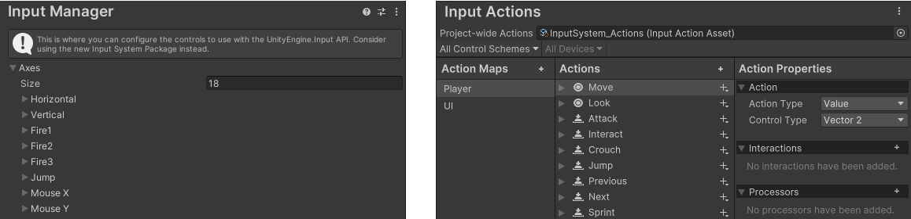

# Migrating from the old Input Manager

- [Read the introductory documentation first](#read-the-introductory-documentation-first)
- [Which system is enabled?](#which-system-is-enabled)
- [Comparison of API in the old Input Manager and the new Input System package](#comparison-of-api-in-the-old-input-manager-and-the-new-input-system-package)
  - [Action-based input](#action-based-input)
  - [Directly reading Gamepad and Joystick controls](#directly-reading-gamepad-and-joystick-controls)
  - [Keyboard](#keyboard)
  - [Mouse](#mouse)
  - [Touch and Pen](#touch-and-pen)
  - [Sensors](#sensors)

This page is provided to help you match input-related API from Unity's old, built-in input (known as the [Input Manager](https://docs.unity3d.com/Manual/class-InputManager.html)) to the corresponding API in the new Input System package.

## Read the introductory documentation first

If you're new to the Input System package and have landed on this page looking for documentation, it's best to read the [QuickStart Guide](QuickStartGuide.md), and the [Concepts](Concepts.md) and [Workflows](Workflows.md) pages from the introduction section of the documentation, so that you can make sure you're choosing the best workflow for your project's input requirements.

This is because there are a number of different ways to read input using the Input System, and some of the directly corresponding API methods on this page might give you the quickest - but least flexible - solution, and may not be suitable for a project with more complex requirements.

## Which system is enabled?

When installing the new Input System, Unity prompts you to enable the new input system and disable the old one. You can change this setting at any time later, by going to **Edit > Project Settings > Player > Other Settings > Active Input Handling**, [as described here](./Installation.md#enabling-the-new-input-backends).

There are scripting symbols defined which allow you to use conditional compilation based on which system is enabled, as shown in the example below.

```CSharp
#if ENABLE_INPUT_SYSTEM
    // New input system backends are enabled.
#endif

#if ENABLE_LEGACY_INPUT_MANAGER
    // Old input backends are enabled.
#endif
```

> **Note:** It is possible to have both systems enabled at the same time, in which case both sets of code in the example above above will be active.

## Comparison of API in the old Input Manager and the new Input System package

Below is a list comparing the API from the old Input Manager with the corresponding API for the new Input System package.
All of the new Input System package APIs listed below are in the `UnityEngine.InputSystem` namespace. The namespace is omitted here for brevity.

### Action-based input

Action-based input refers to reading pre-configured named axes, buttons, or other controls. ([Read more about Action-based input](./Workflow-Actions.md))

- In the old Input Manager, these are defined in the **Axes** list, in the **Input Manager** section of the **Project Settings** window. _(Below, left)_
- In the new Input System, these are defined in the [Actions Editor](ActionsEditor.md), which can be found in the **Input System Package** section of the **Project Settings** window, or by opening an [Action Asset](ActionAssets.md). _(Below, right)_

</br>_On the left, the old Input Manager Axes Configuration window, in Project settings. On the right, the new Input System's [Actions Editor](ActionsEditor.md)._

__Note:__ In some cases for named axes and buttons, the new Input System requires slightly more code than the old Input Manager, but this results in better performance. This is because in the new Input System, the logic is separated into two parts: the first is to find and store a reference to the action (usually done once, for example in your `Start` method), and the second is to read the action (usually done every frame, for example in your `Update` method). In contrast, the old Input Manager used a string-based API to "find" and "read" the value at the same time, because it was not possible to store a reference to a button or axis. This results in worse performance, because the axis or button is looked up each time the value is read.

To find and store references to actions, which can be axes or buttons use [`FindAction`](../api/UnityEngine.InputSystem.InputActionAsset.html#UnityEngine_InputSystem_InputActionAsset_FindAction_System_String_System_Boolean_). For example:
```
 // A 2D axis action named "Move"
InputAction moveAction = InputSystem.actions.FindAction("Move");

 // A button action named "Jump"
InputAction jumpAction = InputSystem.actions.FindAction("Jump");
```

Then, to read the action values, use the following:

|Input Manager (Old)|Input System (New)|
|--|--|
[`Input.GetAxis`](https://docs.unity3d.com/ScriptReference/Input.GetAxis.html)<br/>In the old Input Manager System, all axes are 1D and return float values. For example, to read the horizontal and vertical axes:<br/>`float h = Input.GetAxis("Horizontal");`<br/>`float v = Input.GetAxis("Vertical");`<br/><br/> | Use [`ReadValue`](../api/UnityEngine.InputSystem.InputBindingComposite-1.html#UnityEngine_InputSystem_InputBindingComposite_1_ReadValue_UnityEngine_InputSystem_InputBindingCompositeContext__) on the reference to the action to read the current value of the axis. In the new Input System, axes can be 1D, 2D or other value types. You must specify the correct value type that corresponds with how the action is set up. This example shows a 2D axis:<br/>`Vector2 moveVector = moveAction.ReadValue<Vector2>();`.<br/><br/>
[`Input.GetButton`](https://docs.unity3d.com/ScriptReference/Input.GetButton.html)<br/>Example:<br/>`bool jumpValue = Input.GetButton("Jump");`<br/><br/>|Use [`IsPressed`](../api/UnityEngine.InputSystem.InputAction.html#UnityEngine_InputSystem_InputAction_IsPressed_) on the reference to the action to read the button value.<br/>Example:<br/>`bool jumpValue = jumpAction.IsPressed();`.<br/><br/>
[`Input.GetButtonDown`](https://docs.unity3d.com/ScriptReference/Input.GetButtonDown.html)<br/>Example: `bool jump = Input.GetButtonDown("Jump");`<br/><br/>|Use [`WasPressedThisFrame`](../api/UnityEngine.InputSystem.InputAction.html#UnityEngine_InputSystem_InputAction_WasPressedThisFrame_) on the reference to the action to read if the button was pressed this frame.<br/>Example: `bool jumpValue = jumpAction.WasPressedThisFrame();`.<br/><br/>
[`Input.GetButtonUp`](https://docs.unity3d.com/ScriptReference/Input.GetButtonUp.html)<br/>Example: `bool jump = Input.GetButtonUp("Jump");`<br/><br/>|Use [`WasReleasedThisFrame`](../api/UnityEngine.InputSystem.InputAction.html#UnityEngine_InputSystem_InputAction_WasReleasedThisFrame_) on the reference to the action to read whether the button was released this frame.<br/>Example: `bool jumpValue = jumpAction.WasReleasedThisFrame();`.<br/><br/>
[`Input.GetAxisRaw`](https://docs.unity3d.com/ScriptReference/Input.GetAxisRaw.html)<br/>For example, to read the raw values of the horizontal and vertical axes:<br/>`float h = Input.GetAxisRaw("Horizontal");`<br/>`float v = Input.GetAxisRaw("Vertical");`<br/><br/>|No direct equivalent, but if there are [processors](Processors.md) associated with the action, you can use [`InputControl<>.ReadUnprocessedValue()`](../api/UnityEngine.InputSystem.InputControl-1.html#UnityEngine_InputSystem_InputControl_1_ReadUnprocessedValue) to read unprocessed values.<br/>Example: `Vector2 moveVector = moveAction.ReadUnprocessedValue();`<br/>Note: This returns the same value as ReadValue when there are no processors on the action.


### Directly reading Gamepad and Joystick controls

Directly reading hardware controls bypasses the new Input System's action-based workflow, which has some benefits and some drawbacks. ([Read more about directly reading devices](./Workflow-Direct.md))


|Input Manager (Old)|Input System (New)|
|--|--|
[`Input.GetKey`](https://docs.unity3d.com/ScriptReference/Input.GetKey.html)<br/>Example: `Input.GetKey(KeyCode.JoystickButton0)`<br/><br/>|Use [`isPressed`](../api/UnityEngine.InputSystem.Controls.ButtonControl.html#UnityEngine_InputSystem_Controls_ButtonControl_isPressed) on the corresponding Gamepad button.<br/>Example: `InputSystem.GamePad.current.buttonNorth.isPressed`.<br/>
[`Input.GetKeyDown`](https://docs.unity3d.com/ScriptReference/Input.GetKeyDown.html)<br/>Example: `Input.GetKeyDown(KeyCode.JoystickButton0)`<br/><br/>|Use [`wasPressedThisFrame`](../api/UnityEngine.InputSystem.Controls.ButtonControl.html#UnityEngine_InputSystem_Controls_ButtonControl_wasPressedThisFrame) on the corresponding Gamepad button.<br/>Example: `InputSystem.GamePad.current.buttonNorth.WasPressedThisFrame`.<br/>
[`Input.GetKeyUp`](https://docs.unity3d.com/ScriptReference/Input.GetKeyUp.html)<br/>Example: `Input.GetKeyUp(KeyCode.JoystickButton0)`<br/><br/>|Use [`wasReleasedThisFrame`](../api/UnityEngine.InputSystem.Controls.ButtonControl.html#UnityEngine_InputSystem_Controls_ButtonControl_wasReleasedThisFrame) on the corresponding Gamepad button.<br/>Example: `InputSystem.GamePad.current.buttonNorth.wasReleasedThisFrame`.<br/>
[`Input.GetJoystickNames`](https://docs.unity3d.com/ScriptReference/Input.GetJoystickNames.html)|There is no API that corresponds to this exactly, but there are examples of [how to read all connected devices here](Gamepad.html#discover-all-connected-devices).
[`Input.IsJoystickPreconfigured`](https://docs.unity3d.com/ScriptReference/Input.IsJoystickPreconfigured.html)|Not needed. Devices which derive from [`Gamepad`](../api/UnityEngine.InputSystem.Gamepad.html) always correctly implement the mapping of axes and buttons to the corresponding [`InputControl`](../api/UnityEngine.InputSystem.InputControl.html) members of the [`Gamepad`](../api/UnityEngine.InputSystem.Gamepad.html) class. [`Input.ResetInputAxes`](https://docs.unity3d.com/ScriptReference/Input.ResetInputAxes.html)


### Keyboard
|Input Manager (Old)|Input System (New)|
|--|--|
[`Input.GetKey`](https://docs.unity3d.com/ScriptReference/Input.GetKey.html)<br/>Example: `Input.GetKey(KeyCode.Space)`<br/><br/>|Use [`isPressed`](../api/UnityEngine.InputSystem.Controls.ButtonControl.html#UnityEngine_InputSystem_Controls_ButtonControl_isPressed) on the corresponding key.<br/> Example: `InputSystem.Keyboard.current.spaceKey.isPressed`<br/><br/>
[`Input.GetKeyDown`](https://docs.unity3d.com/ScriptReference/Input.GetKeyDown.html)<br/>Example: `Input.GetKeyDown(KeyCode.Space)`<br/><br/>|Use [`wasPressedThisFrame`](../api/UnityEngine.InputSystem.Controls.ButtonControl.html#UnityEngine_InputSystem_Controls_ButtonControl_wasPressedThisFrame) on the corresponding key.<br/> Example: `InputSystem.Keyboard.current.spaceKey.wasPressedThisFrame`<br/><br/>
[`Input.GetKeyUp`](https://docs.unity3d.com/ScriptReference/Input.GetKeyUp.html)<br/>Example: `Input.GetKeyUp(KeyCode.Space)`<br/><br/>|Use [`wasReleasedThisFrame`](../api/UnityEngine.InputSystem.Controls.ButtonControl.html#UnityEngine_InputSystem_Controls_ButtonControl_wasReleasedThisFrame) on the corresponding key.<br/> Example: `InputSystem.Keyboard.current.spaceKey.wasReleasedThisFrame`<br/><br/>
[`Input.anyKey`](https://docs.unity3d.com/ScriptReference/Input-anyKey.html)|Use [`onAnyButtonPress`](../api/UnityEngine.InputSystem.InputSystem.html#UnityEngine_InputSystem_InputSystem_onAnyButtonPress).<br/>This also includes controller buttons as well as keyboard keys.
[`Input.anyKeyDown`](https://docs.unity3d.com/ScriptReference/Input-anyKeyDown.html)|Use [`Keyboard.current.anyKey.wasUpdatedThisFrame`](../api/UnityEngine.InputSystem.Keyboard.html#UnityEngine_InputSystem_Keyboard_anyKey)
[`Input.compositionCursorPos`](https://docs.unity3d.com/ScriptReference/Input-compositionCursorPos.html)|Use [`Keyboard.current.SetIMECursorPosition(myPosition)`](../api/UnityEngine.InputSystem.Keyboard.html#UnityEngine_InputSystem_Keyboard_SetIMECursorPosition_UnityEngine_Vector2_)
[`Input.compositionString`](https://docs.unity3d.com/ScriptReference/Input-compositionString.html)|Subscribe to the [`Keyboard.onIMECompositionChange`](../api/UnityEngine.InputSystem.Keyboard.html#UnityEngine_InputSystem_Keyboard_onIMECompositionChange).
[`Input.imeCompositionMode`](https://docs.unity3d.com/ScriptReference/Input-imeCompositionMode.html)|Use: [`Keyboard.current.SetIMEEnabled(true)`](../api/UnityEngine.InputSystem.Keyboard.html#UnityEngine_InputSystem_Keyboard_SetIMEEnabled_System_Boolean_)<br/>Also see: [Keyboard text input documentation](Keyboard.html#ime).
[`Input.imeIsSelected`](https://docs.unity3d.com/ScriptReference/Input-imeIsSelected.html)|Use: [`Keyboard.current.imeSelected`](../api/UnityEngine.InputSystem.Keyboard.html#UnityEngine_InputSystem_Keyboard_imeSelected)
[`Input.inputString`](https://docs.unity3d.com/ScriptReference/Input-inputString.html)|Subscribe to the [`Keyboard.onTextInput`](../api/UnityEngine.InputSystem.Keyboard.html#UnityEngine_InputSystem_Keyboard_onTextInput) event:<br/>`Keyboard.current.onTextInput += character => /* ... */;`

### Mouse
|Input Manager (Old)|Input System (New)|
|--|--|
[`Input.GetMouseButton`](https://docs.unity3d.com/ScriptReference/Input.GetMouseButton.html)<br/>Example: `Input.GetMouseButton(0)`|Use [`isPressed`](../api/UnityEngine.InputSystem.Controls.ButtonControl.html#UnityEngine_InputSystem_Controls_ButtonControl_isPressed) on the corresponding mouse button.<br/>Example: `InputSystem.Mouse.current.leftButton.isPressed`
[`Input.GetMouseButtonDown`](https://docs.unity3d.com/ScriptReference/Input.GetMouseButtonDown.html)<br/>Example: `Input.GetMouseButtonDown(0)`|Use [`wasPressedThisFrame`](../api/UnityEngine.InputSystem.Controls.ButtonControl.html#UnityEngine_InputSystem_Controls_ButtonControl_wasPressedThisFrame) on the corresponding mouse button.<br/>Example: `InputSystem.Mouse.current.leftButton.wasPressedThisFrame`
[`Input.GetMouseButtonUp`](https://docs.unity3d.com/ScriptReference/Input.GetMouseButtonUp.html)<br/>Example: `Input.GetMouseButtonUp(0)`|Use [`wasReleasedThisFrame`](../api/UnityEngine.InputSystem.Controls.ButtonControl.html#UnityEngine_InputSystem_Controls_ButtonControl_wasReleasedThisFrame) on the corresponding mouse button.<br/>Example: `InputSystem.Mouse.current.leftButton.wasReleasedThisFrame`
[`Input.mousePosition`](https://docs.unity3d.com/ScriptReference/Input-mousePosition.html)|Use [`Mouse.current.position.ReadValue()`](../api/UnityEngine.InputSystem.Mouse.html)<br/>Example: `Vector2 position = Mouse.current.position.ReadValue();`<br/>__Note__: Mouse simulation from touch isn't implemented yet.
[`Input.mousePresent`](https://docs.unity3d.com/ScriptReference/Input-mousePresent.html)|No corresponding API yet.

### Touch and Pen

|Input Manager (Old)|Input System (New)|
|--|--|
[`Input.GetTouch`](https://docs.unity3d.com/ScriptReference/Input.GetTouch.html)<br/>For example:<br/>`Touch touch = Input.GetTouch(0);`<br/>`Vector2 touchPos = touch.position;`|Use [`EnhancedTouch.Touch.activeTouches[i]`](../api/UnityEngine.InputSystem.EnhancedTouch.Touch.html#UnityEngine_InputSystem_EnhancedTouch_Touch_activeTouches)<br/>Example: `Vector2 touchPos = EnhancedTouch.Touch.activeTouches[0].position;`<br/>__Note__: Enable enhanced touch support first by calling [`EnhancedTouch.Enable()`](../api/UnityEngine.InputSystem.EnhancedTouch.EnhancedTouchSupport.html#UnityEngine_InputSystem_EnhancedTouch_EnhancedTouchSupport_Enable).
[`Input.multiTouchEnabled`](https://docs.unity3d.com/ScriptReference/Input-multiTouchEnabled.html)|No corresponding API yet.
[`Input.simulateMouseWithTouches`](https://docs.unity3d.com/ScriptReference/Input-multiTouchEnabled.html)|No corresponding API yet.
[`Input.stylusTouchSupported`](https://docs.unity3d.com/ScriptReference/Input-stylusTouchSupported.html)|No corresponding API yet.
[`Input.touchCount`](https://docs.unity3d.com/ScriptReference/Input-touchCount.html)|[`EnhancedTouch.Touch.activeTouches.Count`](../api/UnityEngine.InputSystem.EnhancedTouch.Touch.html#UnityEngine_InputSystem_EnhancedTouch_Touch_activeTouches)<br/>__Note__: Enable enhanced touch support first by calling [`EnhancedTouchSupport.Enable()`](../api/UnityEngine.InputSystem.EnhancedTouch.EnhancedTouchSupport.html#UnityEngine_InputSystem_EnhancedTouch_EnhancedTouchSupport_Enable)
[`Input.touches`](https://docs.unity3d.com/ScriptReference/Input-touches.html)|[`EnhancedTouch.Touch.activeTouches`](../api/UnityEngine.InputSystem.EnhancedTouch.Touch.html#UnityEngine_InputSystem_EnhancedTouch_Touch_activeTouches)<br/>__Note__: Enable enhanced touch support first by calling [`EnhancedTouch.Enable()`](../api/UnityEngine.InputSystem.EnhancedTouch.EnhancedTouchSupport.html#UnityEngine_InputSystem_EnhancedTouch_EnhancedTouchSupport_Enable)
[`Input.touchPressureSupported`](https://docs.unity3d.com/ScriptReference/Input-touchPressureSupported.html)|No corresponding API yet.
[`Input.touchSupported`](https://docs.unity3d.com/ScriptReference/Input-touchSupported.html)|[`Touchscreen.current != null`](../api/UnityEngine.InputSystem.Touchscreen.html#UnityEngine_InputSystem_Touchscreen_current)
[`Input.backButtonLeavesApp`](https://docs.unity3d.com/ScriptReference/Input-backButtonLeavesApp.html)|No corresponding API yet.
[`GetPenEvent`](https://docs.unity3d.com/ScriptReference/Input.GetPenEvent.html)<br/>[`GetLastPenContactEvent`](https://docs.unity3d.com/ScriptReference/Input.GetLastPenContactEvent.html)<br/>[`ResetPenEvents`](https://docs.unity3d.com/ScriptReference/Input.ResetPenEvents.html)<br/>[`ClearLastPenContactEvent`](https://docs.unity3d.com/ScriptReference/Input.ClearLastPenContactEvent.html)|Use: [`Pen.current`](../api/UnityEngine.InputSystem.Pen.html#UnityEngine_InputSystem_Pen_current)<br/>See the [Pen, tablet and stylus support](Pen.md) docs for more information.
<hr/>


Note: [`UnityEngine.TouchScreenKeyboard`](https://docs.unity3d.com/ScriptReference/TouchScreenKeyboard.html) is not part of the old Input Manager API, so you can continue to use it when migrating to the new Input System package.

### Sensors
|Input Manager (Old)|Input System (New)|
|--|--|
[`Input.acceleration`](https://docs.unity3d.com/ScriptReference/Input-acceleration.html)|[`Accelerometer.current.acceleration.ReadValue()`](../api/UnityEngine.InputSystem.Accelerometer.html).
[`Input.accelerationEventCount`](https://docs.unity3d.com/ScriptReference/Input-accelerationEventCount.html)<br/>[`Input.accelerationEvents`](https://docs.unity3d.com/ScriptReference/Input-accelerationEvents.html)|Acceleration events aren't made available separately from other input events. See the [accelerometer code sample on the Sensors page](Sensors.html#accelerometer).
[`Input.compass`](https://docs.unity3d.com/ScriptReference/Input-compass.html)|No corresponding API yet.
[`Input.compensateSensors`](https://docs.unity3d.com/ScriptReference/Input-compensateSensors.html)|[`InputSettings.compensateForScreenOrientation`](../api/UnityEngine.InputSystem.InputSettings.html#UnityEngine_InputSystem_InputSettings_compensateForScreenOrientation).
[`Input.deviceOrientation`](https://docs.unity3d.com/ScriptReference/Input-deviceOrientation.html)|No corresponding API yet.
[`Input.gyro`](https://docs.unity3d.com/ScriptReference/Input-gyro.html)|The `UnityEngine.Gyroscope` class is replaced by multiple separate sensor Devices in the new Input System:<br/>[`Gyroscope`](../api/UnityEngine.InputSystem.Gyroscope.html) to measure angular velocity.<br/>[`GravitySensor`](../api/UnityEngine.InputSystem.GravitySensor.html) to measure the direction of gravity.<br/>[`AttitudeSensor`](../api/UnityEngine.InputSystem.AttitudeSensor.html) to measure the orientation of the device.<br/>[`Accelerometer`](../api/UnityEngine.InputSystem.Accelerometer.html) to measure the total acceleration applied to the device.<br/>[`LinearAccelerationSensor`](../api/UnityEngine.InputSystem.LinearAccelerationSensor.html) to measure acceleration applied to the device, compensating for gravity.
[`Input.gyro.attitude`](https://docs.unity3d.com/ScriptReference/Gyroscope-attitude.html)|[`AttitudeSensor.current.orientation.ReadValue()`](../api/UnityEngine.InputSystem.AttitudeSensor.html).
[`Input.gyro.enabled`](https://docs.unity3d.com/ScriptReference/Gyroscope-enabled.html)|Get: `Gyroscope.current.enabled`<br/>Set:<br/>`EnableDevice(Gyroscope.current);`<br/>`DisableDevice(Gyroscope.current);`<br/><br/>__Note__: The new Input System replaces `UnityEngine.Gyroscope` with multiple separate sensor devices. Substitute [`Gyroscope`](../api/UnityEngine.InputSystem.Gyroscope.html) with other sensors in the sample as needed. See the notes for `Input.gyro` above for details.
[`Input.gyro.gravity`](https://docs.unity3d.com/ScriptReference/Gyroscope-gravity.html)|[`GravitySensor.current.gravity.ReadValue()`](../api/UnityEngine.InputSystem.GravitySensor.html)
[`Input.gyro.rotationRate`](https://docs.unity3d.com/ScriptReference/Gyroscope-rotationRate.html)|[`Gyroscope.current.angularVelocity.ReadValue()`](../api/UnityEngine.InputSystem.Gyroscope.html).
[`Input.gyro.rotationRateUnbiased`](https://docs.unity3d.com/ScriptReference/Gyroscope-rotationRateUnbiased.html)|No corresponding API yet.
[`Input.gyro.updateInterval`](https://docs.unity3d.com/ScriptReference/Gyroscope-updateInterval.html)|[`Sensor.samplingFrequency`](../api/UnityEngine.InputSystem.Sensor.html#UnityEngine_InputSystem_Sensor_samplingFrequency)<br/>Example:<br/>`Gyroscope.current.samplingFrequency = 1.0f / updateInterval;`<br/><br/>__Notes__:<br/>[`samplingFrequency`](../api/UnityEngine.InputSystem.Sensor.html#UnityEngine_InputSystem_Sensor_samplingFrequency) is in Hz, not in seconds as [`updateInterval`](https://docs.unity3d.com/ScriptReference/Gyroscope-updateInterval.html), so you need to divide 1 by the value.<br/><br/>The new Input System replaces `UnityEngine.Gyroscope` with multiple separate sensor devices. Substitute [`Gyroscope`](../api/UnityEngine.InputSystem.Gyroscope.html) with other sensors in the sample as needed. See the notes for `Input.gyro` above for details.
[`Input.gyro.userAcceleration`](https://docs.unity3d.com/ScriptReference/Gyroscope-userAcceleration.html)|[`LinearAccelerationSensor.current.acceleration.acceleration.ReadValue()`](../api/UnityEngine.InputSystem.LinearAccelerationSensor.html)
[`Input.location`](https://docs.unity3d.com/ScriptReference/Input-location.html)|No corresponding API yet.
[`Input.GetAccelerationEvent`](https://docs.unity3d.com/ScriptReference/Input.GetAccelerationEvent.html)|See notes for `Input.accelerationEvents` above.
