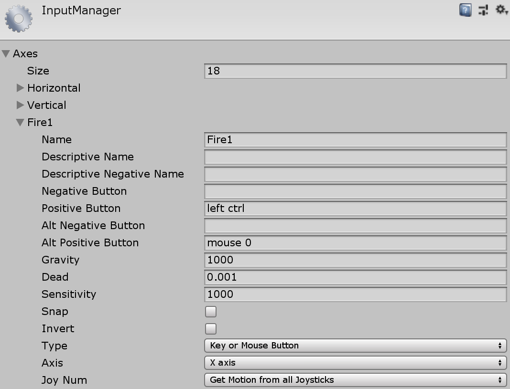
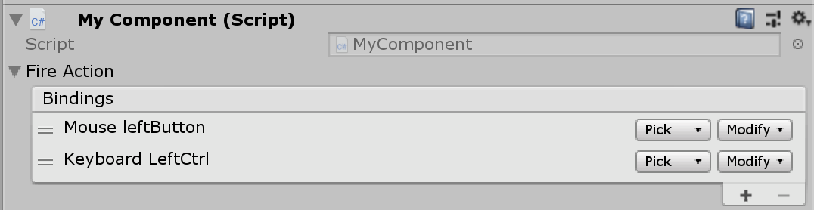
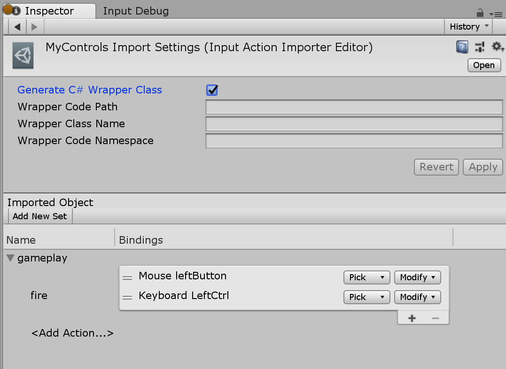
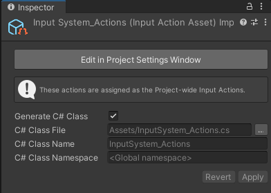

# Migrating from the old input system

This guide provides a list of APIs in `UnityEngine.Input` (and other related APIs in `UnityEngine`) and their corresponding APIs in the new Input System. Not all APIs have a corresponding version in the new API yet.

>__Note__: All of the new APIs are in the `UnityEngine.InputSystem` namespace. The namespace is omitted here for brevity. `UnityEngine.InputSystem` is referenced in full for easy disambiguation.

## [`UnityEngine.Input`](https://docs.unity3d.com/ScriptReference/Input.html)

### [`UnityEngine.Input.acceleration`](https://docs.unity3d.com/ScriptReference/Input-acceleration.html)

Use [`Accelerometer.current.acceleration.ReadValue()`](../api/UnityEngine.InputSystem.Accelerometer.html).

### [`UnityEngine.Input.accelerationEventCount`](https://docs.unity3d.com/ScriptReference/Input-accelerationEventCount.html)

See [`UnityEngine.Input.accelerationEvents`](#accelerationEvents).

### <a name="accelerationEvents"></a>[`UnityEngine.Input.accelerationEvents`](https://docs.unity3d.com/ScriptReference/Input-accelerationEvents.html)

Acceleration events aren't made available separately from other input events. The following code traces all input events on the [`Accelerometer.current`](../api/UnityEngine.InputSystem.Accelerometer.html) device.

```CSharp
    private InputEventTrace trace;

    void StartTrace()
    {
        trace = new InputEventTrace() {deviceId = Accelerometer.current.deviceId};
        trace.Enable();
    }

    void Update()
    {
        foreach (var e in trace)
        {
            //...
        }
        trace.Clear();
    }
```

### [`UnityEngine.Input.anyKey`](https://docs.unity3d.com/ScriptReference/Input-anyKey.html)

For keyboard keys, use:
* [`Keyboard.current.anyKey.isPressed`](../api/UnityEngine.InputSystem.Keyboard.html)

For mouse buttons, use:
* [`Mouse.current.leftButton.isPressed`](../api/UnityEngine.InputSystem.Mouse.html)
* [`Mouse.current.rightButton.isPressed`](../api/UnityEngine.InputSystem.Mouse.html)
* [`Mouse.current.middleButton.isPressed`](../api/UnityEngine.InputSystem.Mouse.html)

### [`UnityEngine.Input.anyKeyDown`](https://docs.unity3d.com/ScriptReference/Input-anyKeyDown.html)

Use [`Keyboard.current.anyKey.wasUpdatedThisFrame`](../api/UnityEngine.InputSystem.Keyboard.html)

### [`UnityEngine.Input.backButtonLeavesApp`](https://docs.unity3d.com/ScriptReference/Input-backButtonLeavesApp.html)

No corresponding API yet.

### [`UnityEngine.Input.compass`](https://docs.unity3d.com/ScriptReference/Input-compass.html)

No corresponding API yet.

### [`UnityEngine.Input.compensateSensors`](https://docs.unity3d.com/ScriptReference/Input-compensateSensors.html)

Use [`InputSystem.settings.compensateForScreenOrientation`](../api/UnityEngine.InputSystem.InputSettings.html#UnityEngine_InputSystem_InputSettings_compensateForScreenOrientation).

### [`UnityEngine.Input.compositionCursorPos`](https://docs.unity3d.com/ScriptReference/Input-compositionCursorPos.html)

Use [`Keyboard.current.SetIMECursorPosition(myPosition)`](../api/UnityEngine.InputSystem.Keyboard.html#UnityEngine_InputSystem_Keyboard_SetIMECursorPosition_Vector2_).

### [`UnityEngine.Input.compositionString`](https://docs.unity3d.com/ScriptReference/Input-compositionString.html)

Subscribe to the [`Keyboard.onIMECompositionChange`](../api/UnityEngine.InputSystem.Keyboard.html#UnityEngine_InputSystem_Keyboard_onIMECompositionChange) event:

```CSharp
    var compositionString = "";
    Keyboard.current.onIMECompositionChange += composition =>
    {
        compositionString = composition.ToString();
    };
```

### [`UnityEngine.Input.deviceOrientation`](https://docs.unity3d.com/ScriptReference/Input-deviceOrientation.html)

No corresponding API yet.

### <a name="gyro"></a>[`UnityEngine.Input.gyro`](https://docs.unity3d.com/ScriptReference/Input-gyro.html)

The `UnityEngine.Gyroscope` class is replaced by multiple separate sensor Devices in the new Input System:

* [`Gyroscope`](../api/UnityEngine.InputSystem.Gyroscope.html) to measure angular velocity.
* [`GravitySensor`](../api/UnityEngine.InputSystem.GravitySensor.html) to measure the direction of gravity.
* [`AttitudeSensor`](../api/UnityEngine.InputSystem.AttitudeSensor.html) to measure the orientation of the device.
* [`Accelerometer`](../api/UnityEngine.InputSystem.Accelerometer.html) to measure the total acceleration applied to the device.
* [`LinearAccelerationSensor`](../api/UnityEngine.InputSystem.LinearAccelerationSensor.html) to measure acceleration applied to the device, compensating for gravity.

### [`UnityEngine.Input.gyro.attitude`](https://docs.unity3d.com/ScriptReference/Gyroscope-attitude.html)

Use [`AttitudeSensor.current.orientation.ReadValue()`](../api/UnityEngine.InputSystem.AttitudeSensor.html).

### [`UnityEngine.Input.gyro.enabled`](https://docs.unity3d.com/ScriptReference/Gyroscope-enabled.html)

```
// Get:
`Gyroscope.current.enabled`

// Set:
`InputSystem.EnableDevice(Gyroscope.current);`
`InputSystem.DisableDevice(Gyroscope.current);`
```

>__Note__: The new Input System replaces `UnityEngine.Gyroscope` with multiple separate sensor devices. Substitute [`Gyroscope`](../api/UnityEngine.InputSystem.Gyroscope.html) with other sensors in the sample as needed. See [`UnityEngine.Input.gyro`](#gyro) section for details.

### [`UnityEngine.Input.gyro.gravity`](https://docs.unity3d.com/ScriptReference/Gyroscope-gravity.html)

Use [`GravitySensor.current.gravity.ReadValue()`](../api/UnityEngine.InputSystem.GravitySensor.html).

### [`UnityEngine.Input.gyro.rotationRate`](https://docs.unity3d.com/ScriptReference/Gyroscope-rotationRate.html)

Use [`Gyroscope.current.angularVelocity.ReadValue()`](../api/UnityEngine.InputSystem.Gyroscope.html).

### [`UnityEngine.Input.gyro.rotationRateUnbiased`](https://docs.unity3d.com/ScriptReference/Gyroscope-rotationRateUnbiased.html)

No corresponding API yet.

### [`UnityEngine.Input.gyro.updateInterval`](https://docs.unity3d.com/ScriptReference/Gyroscope-updateInterval.html)

Use [`Sensor.samplingFrequency`](../api/UnityEngine.InputSystem.Sensor.html#UnityEngine_InputSystem_Sensor_samplingFrequency):

```
Gyroscope.current.samplingFrequency = 1.0f / updateInterval;
```

>__Note__:
>* [`samplingFrequency`](../api/UnityEngine.InputSystem.Sensor.html#UnityEngine_InputSystem_Sensor_samplingFrequency) is in Hz, not in seconds as [`updateInterval`](https://docs.unity3d.com/ScriptReference/Gyroscope-updateInterval.html), so you need to divide 1 by the value.
>* The new Input System replaces `UnityEngine.Gyroscope` with multiple separate sensor devices. Substitute [`Gyroscope`](../api/UnityEngine.InputSystem.Gyroscope.html) with other sensors in the sample as needed. See [`UnityEngine.Input.gyro`](#gyro) for details.

### [`UnityEngine.Input.gyro.userAcceleration`](https://docs.unity3d.com/ScriptReference/Gyroscope-userAcceleration.html)

Use [`LinearAccelerationSensor.current.acceleration.acceleration.ReadValue()`](../api/UnityEngine.InputSystem.LinearAccelerationSensor.html).

### [`UnityEngine.Input.imeCompositionMode`](https://docs.unity3d.com/ScriptReference/Input-imeCompositionMode.html)

No corresponding API yet.

### [`UnityEngine.Input.imeIsSelected`](https://docs.unity3d.com/ScriptReference/Input-imeIsSelected.html)

```
// Get:
Keyboard.current.imeSelected

// Set:
Keyboard.current.SetIMEEnabled(true);
```

### [`UnityEngine.Input.inputString`](https://docs.unity3d.com/ScriptReference/Input-inputString.html)

Subscribe to the [`Keyboard.onTextInput`](../api/UnityEngine.InputSystem.Keyboard.html#UnityEngine_InputSystem_Keyboard_onTextInput) event:

```
Keyboard.current.onTextInput +=
    character => /* ... */;
```

### [`UnityEngine.Input.location`](https://docs.unity3d.com/ScriptReference/Input-location.html)

No corresponding API yet.

### [`UnityEngine.Input.mousePosition`](https://docs.unity3d.com/ScriptReference/Input-mousePosition.html)

Use [`Mouse.current.position.ReadValue()`](../api/UnityEngine.InputSystem.Mouse.html).

>__Note__: Mouse simulation from touch isn't implemented yet.

### [`UnityEngine.Input.mousePresent`](https://docs.unity3d.com/ScriptReference/Input-mousePresent.html)

Use [`Mouse.current != null`](../api/UnityEngine.InputSystem.Mouse.html#UnityEngine_InputSystem_Mouse_current).

### [`UnityEngine.Input.multiTouchEnabled`](https://docs.unity3d.com/ScriptReference/Input-multiTouchEnabled.html)

No corresponding API yet.

### [`UnityEngine.Input.simulateMouseWithTouches`](https://docs.unity3d.com/ScriptReference/Input-multiTouchEnabled.html)

No corresponding API yet.

### [`UnityEngine.Input.stylusTouchSupported`](https://docs.unity3d.com/ScriptReference/Input-stylusTouchSupported.html)

No corresponding API yet.

### [`UnityEngine.Input.touchCount`](https://docs.unity3d.com/ScriptReference/Input-touchCount.html)

Use [`InputSystem.EnhancedTouch.Touch.activeTouches.Count`](../api/UnityEngine.InputSystem.EnhancedTouch.Touch.html#UnityEngine_InputSystem_EnhancedTouch_Touch_activeTouches)

>__Note__: Enable enhanced touch support first by calling [`InputSystem.EnhancedTouch.Enable()`](../api/UnityEngine.InputSystem.EnhancedTouch.EnhancedTouchSupport.html#UnityEngine_InputSystem_EnhancedTouch_EnhancedTouchSupport_Enable).

### [`UnityEngine.Input.touches`](https://docs.unity3d.com/ScriptReference/Input-touches.html)

Use [`InputSystem.EnhancedTouch.Touch.activeTouches`](../api/UnityEngine.InputSystem.EnhancedTouch.Touch.html#UnityEngine_InputSystem_EnhancedTouch_Touch_activeTouches).

>__Note__: Enable enhanced touch support first by calling [`InputSystem.EnhancedTouch.Enable()`](../api/UnityEngine.InputSystem.EnhancedTouch.EnhancedTouchSupport.html#UnityEngine_InputSystem_EnhancedTouch_EnhancedTouchSupport_Enable).

### [`UnityEngine.Input.touchPressureSupported`](https://docs.unity3d.com/ScriptReference/Input-touchPressureSupported.html)

No corresponding API yet.

### [`UnityEngine.Input.touchSupported`](https://docs.unity3d.com/ScriptReference/Input-touchSupported.html)

Use [`Touchscreen.current != null`](../api/UnityEngine.InputSystem.Touchscreen.html#UnityEngine_InputSystem_Touchscreen_current).

### [`UnityEngine.Input.GetAccelerationEvent`](https://docs.unity3d.com/ScriptReference/Input.GetAccelerationEvent.html)

See [`UnityEngine.Input.accelerationEvents`](#accelerationEvents).

### <a name="getAxis"></a>[`UnityEngine.Input.GetAxis`](https://docs.unity3d.com/ScriptReference/Input.GetAxis.html)

[//]: # (TODO: we should probably reference PlayerInput here in addition to or instead of the manual action setups described here)

There is no global setup that corresponds exactly to virtual axis setups in the old __Input Manager__ settings. Instead, you can create sets of [Input Actions](Actions.md) as independent Assets, or put them directly on your C# components.

For example, if you want to recreate the following axis configuration:



#### Option A: Put Input Actions on your component

1. Declare one or more fields of type [`InputAction`](../api/UnityEngine.InputSystem.InputAction.html).

   ```
       public class MyComponent : MonoBehaviour
       {
           public InputAction fireAction;
   ```

2. Configure a response to the Action.
   ```
           void Awake()
           {
               fireAction.performed += ctx => Fire();
           }

           void Fire()
           {
               //...
           }
   ```
3. Put the component on a `GameObject`. You can now configure Bindings in the Inspector window. Click the plus sign on the Bindings list to add Bindings, and double-click the Bindings to pick Controls to bind to.

   
4. Enable and disable the Action as needed.
   ```
           void OnEnable()
           {
               fireAction.Enable();
           }

           void OnDisable()
           {
               fireAction.Disable();
           }
   ```

#### Option B: Create an Input Action Asset

1. Create an Input Action Asset (right-click in the Project browser and select __Create > Input Actions__). Give the Asset a name.
2. Double-click the Asset to open the Input Actions editor window.
3. In the __Action Maps__ column, click the plus sign to add a new Action Map.
4. Double-click the __New Action Map__ name to rename the set. Use a descriptive name, such as *gameplay*.
5. In the __Actions__ column, click the plus sign to add a new Action.
6. Double-click the Action to give it a name.
7. Add Bindings to the Action. To do this, click the plus sign on the Action and choose a Binding type from the list.
8. Select the Binding and click on the __Path__ button in the right column to pick Controls to bind to.
9. Click __Save Asset__. Your Input Action editor should now look like this:

   

10. Check the __Generate C# Wrapper Class__ checkbox in the Inspector window for the Asset, then click __Apply__. Your Inspector should now look like this:

   

11. Add an instance of the generated C# wrapper class to your component.
   ```
   public class MyComponent : MonoBehaviour
   {
       MyControls controls;
   ```

12. Create the instance and hook up a response to the fire Action.

   ```
       public void Awake()
       {
           controls = new MyControls();
           controls.gameplay.fire.performed += ctx => Fire();
       }
   ```
13. Enable and disable the Action as appropriate.
   ```
       public void OnEnable()
       {
           controls.Enable();
       }

       public void OnDisable()
       {
           controls.Disable();
       }
   ```

#### Hints

- To force button-like behavior on the control referenced in a Binding, add a [press Interaction](Interactions.md#press) to it.
- You can access the Control that triggered an Action from the callback. Through it, you can also query its current value.
   ```
   fireAction.performed +=
       ctx =>
       {
           var control = ctx.control; // Grab control.
           var value = ctx.GetValue<float>(); // Read value from control.

           // Can do control-specific checks.
           var button = control as ButtonControl;
           if (button != null && button.wasPressedThisFrame)
               /* ... */;
       }
   ```

### [`UnityEngine.Input.GetAxisRaw`](https://docs.unity3d.com/ScriptReference/Input.GetAxisRaw.html)

Not directly applicable. You can use [`InputControl<>.ReadUnprocessedValue()`](../api/UnityEngine.InputSystem.InputControl-1.html#UnityEngine_InputSystem_InputControl_1_ReadUnprocessedValue) to read unprocessed values from any control.

### [`UnityEngine.Input.GetButton`](https://docs.unity3d.com/ScriptReference/Input.GetButton.html)

See [`UnityEngine.Input.GetAxis`](#getAxis) for how to set up a Binding to a button or axis.

You can also use [`ButtonControl.isPressed`](../api/UnityEngine.InputSystem.Controls.ButtonControl.html#UnityEngine_InputSystem_Controls_ButtonControl_isPressed) to detect if a button Control is pressed directly without using Bindings.

### [`UnityEngine.input.GetButtonDown`](https://docs.unity3d.com/ScriptReference/Input.GetButtonDown.html)

See [`UnityEngine.Input.GetAxis`](#getAxis) for how to set up a Binding to a button or axis. You can use the [press Interaction](Interactions.md#press) to detect when a button is pressed.

You can also use [`ButtonControl.wasPressedThisFrame`](../api/UnityEngine.InputSystem.Controls.ButtonControl.html#UnityEngine_InputSystem_Controls_ButtonControl_wasPressedThisFrame) to detect if a button Control was pressed down this frame directly without using Bindings.

### [`UnityEngine.input.GetButtonUp`](https://docs.unity3d.com/ScriptReference/Input.GetButtonUp.html)

See [`UnityEngine.Input.GetAxis`](#getAxis) for how to set up a Binding to a button or axis. You can use the [press Interaction](Interactions.md#press) with a `Release Only` trigger to detect when a button is released.

You can also use [`ButtonControl.wasReleasedThisFrame`](../api/UnityEngine.InputSystem.Controls.ButtonControl.html#UnityEngine_InputSystem_Controls_ButtonControl_wasReleasedThisFrame) to detect if a button Control was released this frame directly without using Bindings.

### [`UnityEngine.Input.GetJoystickNames`](https://docs.unity3d.com/ScriptReference/Input.GetJoystickNames.html)

There is no API that corresponds to this exactly.

Here are various ways to discover connected Devices:

```
// Query a list of all connected Devices (does not allocate; read-only access).
InputSystem.devices

// Get notified when a Device is added or removed.
InputSystem.onDeviceChange +=
    (device, change) =>
    {
        if (change == InputDeviceChange.Added || change == InputDeviceChange.Removed)
        {
            Debug.Log($"Device '{device}' was {change}");
        }
    }

// Find all gamepads and joysticks.
var devices = InputSystem.devices;
for (var i = 0; i < devices.Count; ++i)
{
    var device = devices[i];
    if (device is Joystick || device is Gamepad)
    {
        Debug.Log("Found " + device);
    }
}
```

### [`UnityEngine.Input.GetKey`](https://docs.unity3d.com/ScriptReference/Input.GetKey.html)

Use [`ButtonControl.isPressed`](../api/UnityEngine.InputSystem.Controls.ButtonControl.html#UnityEngine_InputSystem_Controls_ButtonControl_isPressed) on the corresponding key:

```
// Using KeyControl property directly.
Keyboard.current.spaceKey.isPressed
Keyboard.current.aKey.isPressed // etc.

// Using Key enum.
Keyboard.current[Key.Space].isPressed

// Using key name.
((KeyControl)Keyboard.current["space"]).isPressed
```

>__Note__: The Input System identifies keys by physical layout, not according to the current language mapping of the keyboard. To query the name of the key according to the language mapping, use [`KeyControl.displayName`](../api/UnityEngine.InputSystem.InputControl.html#UnityEngine_InputSystem_InputControl_displayName).

### [`UnityEngine.Input.GetKeyDown`](https://docs.unity3d.com/ScriptReference/Input.GetKeyDown.html)

Use [`ButtonControl.wasPressedThisFrame`](../api/UnityEngine.InputSystem.Controls.ButtonControl.html#UnityEngine_InputSystem_Controls_ButtonControl_wasPressedThisFrame) on the corresponding key:

```
// Using KeyControl property directly.
Keyboard.current.spaceKey.wasPressedThisFrame
Keyboard.current.aKey.wasPressedThisFrame // etc.

// Using Key enum.
Keyboard.current[Key.Space].wasPressedThisFrame

// Using key name.
((KeyControl)Keyboard.current["space"]).wasPressedThisFrame
```

>__Note__: The Input System identifies keys by physical layout, not according to the current language mapping of the keyboard. To query the name of the key according to the language mapping, use [`KeyControl.displayName`](../api/UnityEngine.InputSystem.InputControl.html#UnityEngine_InputSystem_InputControl_displayName).

### [`UnityEngine.Input.GetKeyUp`](https://docs.unity3d.com/ScriptReference/Input.GetKeyUp.html)

Use [`ButtonControl.wasReleasedThisFrame`](../api/UnityEngine.InputSystem.Controls.ButtonControl.html#UnityEngine_InputSystem_Controls_ButtonControl_wasReleasedThisFrame) on the corresponding key:

```
// Using KeyControl property directly.
Keyboard.current.spaceKey.wasReleasedThisFrame
Keyboard.current.aKey.wasReleasedThisFrame // etc.

// Using Key enum.
Keyboard.current[Key.Space].wasReleasedThisFrame

// Using key name.
((KeyControl)Keyboard.current["space"]).wasReleasedThisFrame
```

>__Note__: The Input System identifies keys by physical layout, not according to the current language mapping of the keyboard. To query the name of the key according to the language mapping, use [`KeyControl.displayName`](../api/UnityEngine.InputSystem.InputControl.html#UnityEngine_InputSystem_InputControl_displayName).

### [`UnityEngine.Input.GetMouseButton`](https://docs.unity3d.com/ScriptReference/Input.GetMouseButton.html)

Use [`ButtonControl.isPressed`](../api/UnityEngine.InputSystem.Controls.ButtonControl.html#UnityEngine_InputSystem_Controls_ButtonControl_isPressed) on the corresponding mouse button:

```
Mouse.current.leftButton.isPressed
Mouse.current.rightButton.isPressed
Mouse.current.middleButton.isPressed

// You can also go through all buttons on the mouse (does not allocate).
var controls = Mouse.current.allControls;
for (var i = 0; i < controls.Count; ++i)
{
    var button = controls[i] as ButtonControl;
    if (button != null && button.isPressed)
        /* ... */;
}

// Or look up controls by name.
((ButtonControl)Mouse.current["leftButton"]).isPressed
```

### [`UnityEngine.Input.GetMouseButtonDown`](https://docs.unity3d.com/ScriptReference/Input.GetMouseButtonDown.html)

Use [`ButtonControl.wasPressedThisFrame`](../api/UnityEngine.InputSystem.Controls.ButtonControl.html#UnityEngine_InputSystem_Controls_ButtonControl_wasPressedThisFrame) on the corresponding mouse button:

```
Mouse.current.leftButton.wasPressedThisFrame
Mouse.current.rightButton.wasPressedThisFrame
Mouse.current.middleButton.wasPressedThisFrame
```

### [`UnityEngine.Input.GetMouseButtonUp`](https://docs.unity3d.com/ScriptReference/Input.GetMouseButtonUp.html)

Use [`ButtonControl.wasReleasedThisFrame`](../api/UnityEngine.InputSystem.Controls.ButtonControl.html#UnityEngine_InputSystem_Controls_ButtonControl_wasReleasedThisFrame) on the corresponding mouse button:

```
Mouse.current.leftButton.wasReleasedThisFrame
Mouse.current.rightButton.wasReleasedThisFrame
Mouse.current.middleButton.wasReleasedThisFrame
```

### [`UnityEngine.Input.GetTouch`](https://docs.unity3d.com/ScriptReference/Input.GetTouch.html)

Use [`InputSystem.EnhancedTouch.Touch.activeTouches[i]`](../api/UnityEngine.InputSystem.EnhancedTouch.Touch.html#UnityEngine_InputSystem_EnhancedTouch_Touch_activeTouches)

>__Note__: Enable enhanced touch support first by calling [`InputSystem.EnhancedTouch.Enable()`](../api/UnityEngine.InputSystem.EnhancedTouch.EnhancedTouchSupport.html#UnityEngine_InputSystem_EnhancedTouch_EnhancedTouchSupport_Enable).

### [`UnityEngine.Input.IsJoystickPreconfigured`](https://docs.unity3d.com/ScriptReference/Input.IsJoystickPreconfigured.html)

Not needed. Devices which derive from [`Gamepad`](../api/UnityEngine.InputSystem.Gamepad.html) always correctly implement the mapping of axes and buttons to the corresponding [`InputControl`](../api/UnityEngine.InputSystem.InputControl.html) members of the [`Gamepad`](../api/UnityEngine.InputSystem.Gamepad.html) class.

### [`UnityEngine.Input.ResetInputAxes`](https://docs.unity3d.com/ScriptReference/Input.ResetInputAxes.html)

Not directly applicable.

## [`UnityEngine.TouchScreenKeyboard`](https://docs.unity3d.com/ScriptReference/TouchScreenKeyboard.html)

No corresponding API yet. Use `TouchScreenKeyboard` for now.
