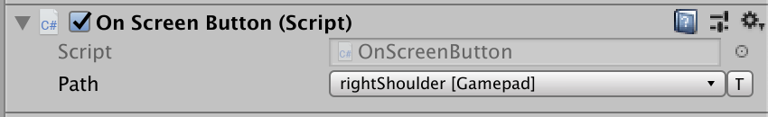
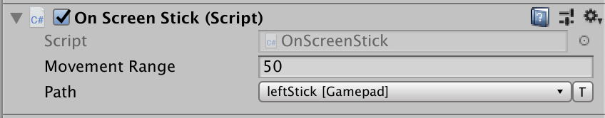

# On-screen Controls

You can use on-screen Controls to simulate Input Devices with UI widgets that the user interacts with on the screen. The most prominent example is the use of stick and button widgets on touchscreens to emulate a joystick or gamepad.

There are currently two Control types implemented out of the box: [buttons](#on-screen-buttons) and [sticks](#on-screen-sticks). You can implement custom Controls by extending the base [`OnScreenControl`](../api/UnityEngine.InputSystem.OnScreen.OnScreenControl.html) class (see documentation on [writing custom on screen Controls](#writing-custom-on-screen-controls) to learn more).

>__Note__: On-screen Controls don't have a predefined visual representation. It's up to you to set up the visual aspect of a Control (for example, by adding a sprite or UI component to the GameObject). On-screen Controls take care of the interaction logic and of setting up and generating input from interactions.

Each on-screen Control uses a [Control path](Controls.md#control-paths) to reference the Control that it should report input as. For example, the following on-screen button reports input as the right shoulder button of a gamepad:



The collection of on-screen Controls present in a Scene forms one or more [Input Devices](Devices.md). The Input System creates one Input Device for each distinct type of Device the Controls reference. For example, if one on-screen button references `<Gamepad>/buttonSouth` and another on-screen button references `<Keyboard>/a`, the Input System creates both a `Gamepad` and a `Keyboard`. This happens automatically when the components are enabled. When disabled, the Input System automatically removes the Devices again.

To query the Control (and, implicitly, the Device) that an on-screen Control feeds into, you can use the [`OnScreenControl.control`](../api/UnityEngine.InputSystem.OnScreen.OnScreenControl.html#UnityEngine_InputSystem_OnScreen_OnScreenControl_control) property.

>__Note__: This design allows you to use on-screen Controls to create input for arbitrary Input Devices, in addition to joysticks and gamepads.

## On-screen buttons

To create an on-screen button:

1. Add a UI `Button` object.
2. Add the [`OnScreenButton`](../api/UnityEngine.InputSystem.OnScreen.OnScreenButton.html) component to it.
3. Set the [`Control Path`](../api/UnityEngine.InputSystem.OnScreen.OnScreenControl.html#UnityEngine_InputSystem_OnScreen_OnScreenControl_controlPath) to refer to a [`ButtonControl`](../api/UnityEngine.InputSystem.Controls.ButtonControl.html) (for example, `<Gamepad>/buttonSouth`). The type of device referenced by the control path determines the type of virtual device created by the component.


The [`OnScreenButton`](../api/UnityEngine.InputSystem.OnScreen.OnScreenButton.html) component requires the target Control to be a `Button` Control. [`OnScreenButton`](../api/UnityEngine.InputSystem.OnScreen.OnScreenButton.html) sets the target Control value to 1 when it receives a pointer-down (`IPointerDownHandler.OnPointerDown`) event, or 0 when it receives a pointer-up (`IPointerUpHandler.OnPointerUp`) event.

## On-screen sticks

To create an on-screen stick:

1. Create a UI `Image` object.
2. Add the [`OnScreenStick`](../api/UnityEngine.InputSystem.OnScreen.OnScreenStick.html) component to it.
3. Set the [`Control Path`](../api/UnityEngine.InputSystem.OnScreen.OnScreenControl.html#UnityEngine_InputSystem_OnScreen_OnScreenControl_controlPath) to refer to a [`Vector2Control`](../api/UnityEngine.InputSystem.Controls.Vector2Control.html) (for example, `<Gamepad>/leftStick`). The type of device referenced by the control path determines the type of virtual device created by the component.



The [`OnScreenStick`](../api/UnityEngine.InputSystem.OnScreen.OnScreenStick.html) component requires the target Control to be a `Vector2` Control. [`OnScreenStick`](../api/UnityEngine.InputSystem.OnScreen.OnScreenStick.html) starts the movement of the stick Control when it receives a pointer-down (`IPointerDownHandler.OnPointerDown`) event, and stops it when it receives a pointer-up (`IPointerUpHandler.OnPointerUp`) event.

In-between, the stick moves according to the pointer being dragged (`IDragHandler.OnDrag`) within a box centered on the pointer-down screen point, and with an edge length  defined in the component's __Movement Range__ property. A movement range of 50, for example, means that the stick's on-screen area is 25 pixels up, down, left, and right of the pointer-down point on screen.

If you want to be notified when the user starts and/or stops touching the on-screen stick, implement `IPointerDownHandler` and/or `IPointerUpHandler` on a component and add it to the stick `GameObject`.

### Isolated mode

The [`OnScreenStick`](../api/UnityEngine.InputSystem.OnScreen.OnScreenStick.html) simulates input events from the device specified in the [`OnScreenControl.control`](../api/UnityEngine.InputSystem.OnScreen.OnScreenControl.html#UnityEngine_InputSystem_OnScreen_OnScreenControl_control) property. To the Input System itself, these are normal events and can cause the paired device to change in games and applications where dynamic device switching is used, for example when the [`PlayerInput`](../api/UnityEngine.InputSystem.PlayerInput.html) component is used with the [`PlayerInput.neverAutoSwitchControlSchemes`](../api/UnityEngine.InputSystem.PlayerInput.html#UnityEngine_InputSystem_PlayerInput_neverAutoSwitchControlSchemes)) propety set to false. As the stick is dragged around, the paired device will alternate between the device that owns the pointer (mouse, touch, pen etc) and the device from the control path, which can result in jittery movement of the on-screen stick.

Use Isolated Input Actions to fix this. This mode uses a local set of Input Action instances to drive interaction with the stick, and not the actions defined in the UI. The downside of this mode is that pointer actions will be duplicated in both the on-screen stick component and any Input Action Assets being used to drive the UI. Note that if a set of bindings is not specified for the Pointer Down Action and Pointer Move Actions, the following defaults will be used:

* Pointer Down Action
    - `<Mouse>/leftButton`
    - `<Pen>/tip`
    - `<Touchscreen>/touch*/press`
    - `<XRController>/trigger`

* Pointer Move Action
    - `<Mouse>/position`
    - `<Pen>/position`
    - `<Touchscreen>/touch*/position`

## Writing custom on-screen Controls

You can add support for new types of [Input Controls](Controls.md) by extending [`OnScreenControl`](../api/UnityEngine.InputSystem.OnScreen.OnScreenControl.html). An easy example to follow is [`OnScreenButton`](../api/UnityEngine.InputSystem.OnScreen.OnScreenButton.html).

```CSharp
    [AddComponentMenu("Input/On-Screen Button")]
    public class OnScreenButton : OnScreenControl, IPointerDownHandler, IPointerUpHandler
    {
        public void OnPointerUp(PointerEventData data)
        {
            SendValueToControl(0.0f);
        }

        public void OnPointerDown(PointerEventData data)
        {
            SendValueToControl(1.0f);
        }

        [InputControl(layout = "Button")]
        [SerializeField]
        private string m_ControlPath;

        protected override string controlPathInternal
        {
            get => m_ControlPath;
            set => m_ControlPath = value;
        }
    }
```
