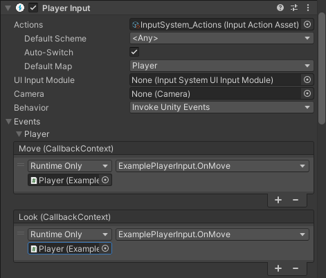

# The PlayerInput component

The Input System provides two related components that simplify how you set up and work with input: the **Player Input** component and the [**Player Input Manager**](PlayerInputManager.md) component.

The **Player Input** component represents a single player, and that player's associated [Input Actions](Actions.md), whereas the [**Player Input Manager**](PlayerInputManager.md) component handles setups that allow for several concurrent users (for example, player lobbies and split-screen gameplay in a game).


## The Player Input component


*Above, the Player Input component as visible in the inspector, with an Actions Asset called "ExampleActions" assigned.*

Each [`PlayerInput`](../api/UnityEngine.InputSystem.PlayerInput.html) instance represents a separate player or user. You can use multiple `PlayerInput` instances at the same time (although not on the same `GameObject`) to represent local multiplayer setups. The Input System pairs each player to a unique set of Devices that the player uses exclusively, but you can also manually pair Devices in a way that enables two or more players to share a Device (for example, left/right keyboard splits or hot seat use).

Each `PlayerInput` corresponds to one [`InputUser`](UserManagement.md). You can use [`PlayerInput.user`](../api/UnityEngine.InputSystem.PlayerInput.html#UnityEngine_InputSystem_PlayerInput_user) to query the `InputUser` from the component.

>__Note__: These components are built on top of the public Input System API. As such, they don't do anything that you can't program yourself. They are meant primarily as an easy, out-of-the-box setup that eliminates much of the need for custom scripting.

## Getting started

To get started using the Player Input component, use the following steps:

1. [Add](https://docs.unity3d.com/Manual/UsingComponents.html) a **Player Input** component to a GameObject. This would usually be the GameObject that represents the player in your game.<br/><br/>
2. [Create an Input Actions asset](ActionAssets.md). You can do this by clicking the "Create Actions..." button which is visible in the Player Input component inspector if you have not yet assigned actions to it (shown below).<br/><br/><br/><br/>
3. When creating the actions asset, Unity asks you where to create the new Asset. Choose a name and folder inside the **Assets** folder of your Project (or just accept the defaults) and select Okay. This creates a new `.inputactions` Asset in your Project, connects it to the Player Input component, and brings up the editor window for the Input Action asset.<br/><br/>
4. [Configure the Actions Asset](ActionAssets.md) so that it contains the actions you want your users to be able to perform, bound to the controls they should use to perform them.<br/><br/><br/><br/>
5. Set up Action responses, by selecting a **Behaviour** type from the Behaviour menu. The Behaviour type you select affects how you should implement the methods that handle your Action responses. See the  [notification behaviors](#notification-behaviors) section further down for details.<br/><br/><br/><br/>


## Configuring the Player Input component

You can use the following properties to configure `PlayerInput`:

|Property|Description|
|--------|-----------|
|[`Actions`](../api/UnityEngine.InputSystem.PlayerInput.html#UnityEngine_InputSystem_PlayerInput_actions)|The set of [Input Actions](Actions.md) associated with the player. To receive input, each player must have an associated set of Actions. See documentation on [Actions](#actions) for details.|
|[`Default Control Scheme`](../api/UnityEngine.InputSystem.PlayerInput.html#UnityEngine_InputSystem_PlayerInput_defaultControlScheme)|Which [Control Scheme](ActionBindings.md#control-schemes) (from what is defined in [`Actions`](../api/UnityEngine.InputSystem.PlayerInput.html#UnityEngine_InputSystem_PlayerInput_actions)) to enable by default.|
|[`Default Action Map`](../api/UnityEngine.InputSystem.PlayerInput.html#UnityEngine_InputSystem_PlayerInput_defaultActionMap)|Which [Action Map](Actions.md#overview) in [`Actions`](../api/UnityEngine.InputSystem.PlayerInput.html#UnityEngine_InputSystem_PlayerInput_actions) to enable by default. If set to `None`, then the player starts with no Actions being enabled.|
|[`Camera`](../api/UnityEngine.InputSystem.PlayerInput.html#UnityEngine_InputSystem_PlayerInput_camera)|The individual camera associated with the player. This is only required when employing [split-screen](PlayerInputManager.md#split-screen) setups and has no effect otherwise.|
|[`Behavior`](../api/UnityEngine.InputSystem.PlayerInput.html#UnityEngine_InputSystem_PlayerInput_notificationBehavior)|How the `PlayerInput` component notifies game code about things that happen with the player. See documentation on [notification behaviors](#notification-behaviors).|

### Actions

To receive input, each player must have an associated set of Input Actions. When you create these via the Player Input inspector's __Create Actions__ button, the Input System creates a default set of Actions. However, the Player Input component places no restrictions on the arrangement of Actions.

The Player Input component automatically handles [enabling and disabling](Actions.md#using-actions) Actions, and also handles installing [callbacks](Actions.md#responding-to-actions) on the Actions. When multiple Player Input components use the same Actions, the components automatically create [private copies of the Actions](Actions.md#using-actions-with-multiple-players).

When first enabled, the Player Input component enables all Actions from the the [`Default Action Map`](../api/UnityEngine.InputSystem.PlayerInput.html#UnityEngine_InputSystem_PlayerInput_defaultActionMap). If no default Action Map exists, the Player Input component does not enable any Actions. To manually enable Actions, you can call [`Enable`](../api/UnityEngine.InputSystem.InputActionMap.html#UnityEngine_InputSystem_InputActionMap_Enable) and [`Disable`](../api/UnityEngine.InputSystem.InputActionMap.html#UnityEngine_InputSystem_InputActionMap_Disable) on the Action Maps or Actions, like you would do [without `PlayerInput`](Actions.md#using-actions). To check which Action Map is currently enabled, or to switch to a different one, use the  [`PlayerInput.currentActionMap`](../api/UnityEngine.InputSystem.PlayerInput.html#UnityEngine_InputSystem_PlayerInput_currentActionMap) property. To switch Action Maps with an Action Map name, you can also call [`PlayerInput.SwitchCurrentActionMap`](../api/UnityEngine.InputSystem.PlayerInput.html#UnityEngine_InputSystem_PlayerInput_SwitchCurrentActionMap_System_String_).

To disable a player's input, call [`PlayerInput.DeactivateInput`](../api/UnityEngine.InputSystem.PlayerInput.html#UnityEngine_InputSystem_PlayerInput_DeactivateInput). To re-enable it, call [`PlayerInput.ActivateInput`](../api/UnityEngine.InputSystem.PlayerInput.html#UnityEngine_InputSystem_PlayerInput_ActivateInput). The latter enables the default Action Map, if it exists.

When `PlayerInput` is disabled, it automatically disables the currently active Action Map ([`PlayerInput.currentActionMap`](../api/UnityEngine.InputSystem.PlayerInput.html#UnityEngine_InputSystem_PlayerInput_currentActionMap)) and disassociate any Devices paired to the player.

See the [notification behaviors](#notification-behaviors) section below for how to be notified when player triggers an Action.

### When using **Send Messages** or **Broadcast Messages**

When the [notification behavior](#notification-behaviors) of `PlayerInput` is set to **Send Messages** or **Broadcast Messages**, you can set your app to respond to Actions by defining methods in components like so:

```CSharp
public class MyPlayerScript : MonoBehaviour
{
    // "jump" action becomes "OnJump" method.

    // If you're not interested in the value from the control that triggers the action, use a method without arguments.
    public void OnJump()
    {
        // your Jump code here
    }

    // If you are interested in the value from the control that triggers an action, you can declare a parameter of type InputValue.
    public void OnMove(InputValue value)
    {
        // Read value from control. The type depends on what type of controls.
        // the action is bound to.
        var v = value.Get<Vector2>();

        // IMPORTANT:
        // The given InputValue is only valid for the duration of the callback. Storing the InputValue references somewhere and calling Get<T>() later does not work correctly.
    }
}
```

The component must be on the same `GameObject` if you are using `Send Messages`, or on the same or any child `GameObject` if you are using `Broadcast Messages`.

### When using **Invoke Unity Events**

When the [notification behavior](#notification-behaviors) of `PlayerInput` is set to `Invoke Unity Events`, each Action has to be routed to a target method. The methods have the same format as the [`started`, `performed`, and `canceled` callbacks](Actions.md#action-callbacks) on [`InputAction`](../api/UnityEngine.InputSystem.InputAction.html).

```CSharp
public class MyPlayerScript : MonoBehaviour
{
    public void OnFire(InputAction.CallbackContext context)
    {
    }

    public void OnMove(InputAction.CallbackContext context)
    {
        var value = context.ReadValue<Vector2>();
    }
}
```

### Notification behaviors

You can use the [`Behavior`](../api/UnityEngine.InputSystem.PlayerInput.html#UnityEngine_InputSystem_PlayerInput_notificationBehavior) property in the Inspector to determine how a `PlayerInput` component notifies game code when something related to the player has occurred.

The following options are available:

|Behavior|Description|
|--------|-----------|
|[`Send Messages`](../api/UnityEngine.InputSystem.PlayerNotifications.html)|Uses [`GameObject.SendMessage`](https://docs.unity3d.com/ScriptReference/GameObject.SendMessage.html) on the `GameObject` that the `PlayerInput` component belongs to.|
|[`Broadcast Messages`](../api/UnityEngine.InputSystem.PlayerNotifications.html)|Uses [`GameObject.BroadcastMessage`](https://docs.unity3d.com/ScriptReference/GameObject.BroadcastMessage.html) on the `GameObject` that the `PlayerInput` component belongs to. This broadcasts the message down the `GameObject` hierarchy.|
|[`Invoke Unity Events`](../api/UnityEngine.InputSystem.PlayerNotifications.html)|Uses a separate [`UnityEvent`](https://docs.unity3d.com/ScriptReference/Events.UnityEvent.html) for each individual type of message. When this is selected, the events available on the `PlayerInput` are accessible from the __Events__ foldout. The argument received by events triggered for Actions is the same as the one received by [`started`, `performed`, and `canceled` callbacks](Actions.md#action-callbacks).<br><br>|
|[`Invoke CSharp Events`](../api/UnityEngine.InputSystem.PlayerNotifications.html)|Similar to `Invoke Unity Events`, except that the events are plain C# events available on the `PlayerInput` API. You cannot configure these from the Inspector. Instead, you have to register callbacks for the events in your scripts.<br><br>The following events are available:<br><br><ul><li>[`onActionTriggered`](../api/UnityEngine.InputSystem.PlayerInput.html#UnityEngine_InputSystem_PlayerInput_onActionTriggered) (collective event for all actions on the player)</li><li>[`onDeviceLost`](../api/UnityEngine.InputSystem.PlayerInput.html#UnityEngine_InputSystem_PlayerInput_onDeviceLost)</li><li>[`onDeviceRegained`](../api/UnityEngine.InputSystem.PlayerInput.html#UnityEngine_InputSystem_PlayerInput_onDeviceRegained)</li></ul>|

In addition to per-action notifications, `PlayerInput` sends the following general notifications:

|Notification|Description|
|------------|-----------|
|[`DeviceLostMessage`](../api/UnityEngine.InputSystem.PlayerInput.html#UnityEngine_InputSystem_PlayerInput_DeviceLostMessage)|The player has lost one of the Devices assigned to it. This can happen, for example, if a wireless device runs out of battery.|
|[`DeviceRegainedMessage`](../api/UnityEngine.InputSystem.PlayerInput.html#UnityEngine_InputSystem_PlayerInput_DeviceRegainedMessage)|Notification that triggers when the player recovers from Device loss and is good to go again.|

### Device assignments

Each `PlayerInput` can have one or more Devices assigned to it. By default, no two `PlayerInput` components are assigned the same Devices, but you can force this; to do so, manually assign Devices to a player when calling [`PlayerInput.Instantiate`](../api/UnityEngine.InputSystem.PlayerInput.html#UnityEngine_InputSystem_PlayerInput_Instantiate_UnityEngine_GameObject_System_Int32_System_String_System_Int32_UnityEngine_InputSystem_InputDevice_), or call [`InputUser.PerformPairingWithDevice`](../api/UnityEngine.InputSystem.Users.InputUser.html#UnityEngine_InputSystem_Users_InputUser_PerformPairingWithDevice_UnityEngine_InputSystem_InputDevice_UnityEngine_InputSystem_Users_InputUser_UnityEngine_InputSystem_Users_InputUserPairingOptions_) on the `InputUser` of a `PlayerInput`.

If the `PlayerInput` component has any Devices assigned, it matches these to the [Control Schemes](ActionBindings.md#control-schemes) in the associated Action Asset, and only enables Control Schemes which match its Input Devices.

### UI input

The `PlayerInput` component can work together with an [`InputSystemUIInputModule`](UISupport.md#setting-up-ui-input) to drive the [UI system](UISupport.md).

To set this up, assign a reference to a `InputSystemUIInputModule` component in the [`UI Input Module`](../api/UnityEngine.InputSystem.PlayerInput.html#UnityEngine_InputSystem_PlayerInput_uiInputModule) field of the `PlayerInput` component. The `PlayerInput` and `InputSystemUIInputModule` components should be configured to work with the same [`InputActionAsset`](Actions.md) for this to work.

Once you've completed this setup, when the `PlayerInput` component configures the Actions for a specific player, it assigns the same Action configuration to the `InputSystemUIInputModule`. In other words, the same Action and Device configuration that controls the player now also controls the UI.

If you use [`MultiplayerEventSystem`](UISupport.md#multiplayer-uis) components to dispatch UI events, you can also use this setup to simultaneously have multiple UI instances on the screen, each controlled by a separate player.
