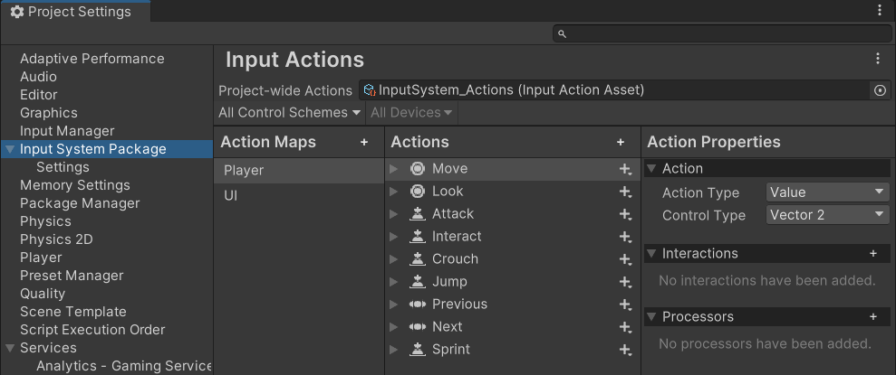

# Project-Wide Actions

The Input System stores your configuration of [Input Actions](Actions.md) and their associated [Bindings](ActionBindings.md), [Action Maps](ActionsEditor.html#configure-action-maps) and [Control Schemes](ActionBindings.md#control-schemes) in an [Action Asset](ActionAssets.md) file.

While it's possible to have more than one Action Asset in a project, most projects only ever need a single Action Asset. This is because an Action Asset can contain multiple [Action Maps](ActionsEditor.html#configure-action-maps), which each containing a set of actions relevant to the various parts of your project (such as UI navigation, gameplay, etc).

The Input System's **project-wide actions** feature allows you to choose an individual Action Asset as being available project-wide, which means the actions within that asset are available more conveniently through the Input System API without needing to set up a reference to the Actions Asset.

The Action Asset assigned as project-wide is also a [preloaded asset](https://docs.unity3d.com/ScriptReference/PlayerSettings.GetPreloadedAssets.html), loaded when your app starts up, and kept available until until it terminates.

Unless you have specific project requirements that require more than one Action Asset, the recommended workflow is to use a single Action Asset assigned as the project-wide actions, as described below.

## Create and Assign a Project-Wide Actions Asset

To create and assign the current project-wide actions, go to **Edit** > **Project Settings** > **Input System Package**.

If you don't yet have an Action Asset assigned as project-wide in your project, the Input System Package settings window displays an empty field for you to assign your action asset, and a button allowing you to create and assign one.
</br>
*The Input System Package Project Settings with no project-wide actions assigned*

> **Note:** If you already have an Action Asset assigned, this button is not displayed, and instead the Actions Editor is displayed, allowing you to edit the project-wide actions.

To create an Action Asset with default actions pre-configured, click  **"Create a new project-wide Action Asset"**. The asset is created in your project, and automatically assigned as the **project-wide actions**.

The Action Asset appears in your Project view, and is named "InputSystem_Actions". This is where your new configuration of actions is saved, including any changes you make to it.

<br/>
*The new Actions Asset in your Project window*

## Edit project-wide actions

Once you have created and assigned project-wide actions, the Input System Package page in Project Settings displays the **Actions Editor** interface. Read more about how to use the [Actions Editor](ActionsEditor.md) to configure your actions.


*The Input System Package Project Settings after creating and assigning the default actions*

## The default actions

When you create and assign default project-wide actions using the method described above, the Action Asset comes pre-configured with some default Actions such as "Move", "Jump", and more, which suit many common app and game scenarios. They are configured to read input from the most common types of input controller such as Keyboard, Mouse, Gamepad, Touchscreen and XR.

These default actions mean that in many cases, you can start scripting with the Input System without any configuration by referring to the names of the default actions that are already configured for you. You can also rename and reconfigure the default actions, or delete these default configurations to suit your needs.

If you’d like to delete all the default actions so that you can start from an empty configuration, you don’t need to delete the individual actions one-by-one. You can delete the each Action Map, which deletes all the Actions contained in the maps in one go.

You can also delete all action maps, or reset all the actions back to the default values from the **more** (⋮) menu at the top right of the Input Actions section of the settings window, below the Project Settings window search field.


> **Note:** this **more** (⋮) menu is not available when the Actions Editor is open in a separate window, it is only present in the Project Settings window.

## Using project-wide actions in code

The benefit of assign an Action Asset as the project-wide actions is that you can access the actions directly through the [`InputSystem.actions`](../api/UnityEngine.InputSystem.InputSystem.html) property directly, rather than needing to set up a reference to your Action Asset first.

For example, you can get a reference to an action named "Move" in your project-wide actions using a line of code like this:

```
  InputSystem.actions.FindAction("Move");
```

Project-wide actions are also enabled by default.
