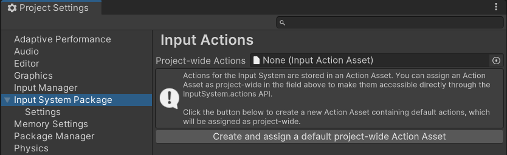

# Quickstart Guide

This page has a brief description of how to quickly start using the Input System. The Input System has [multiple workflows](Workflows.md) which you might prefer that offer different benefits. This quickstart guide shows a workflow which suits most common scenarios.

First, install the Input System package. For information on how to install the new Input System, see [Installation](Installation.md).

## Create and assign the default project-wide actions

The input system stores your input configuration in an **Actions Asset**. When you first install the input system package, you must create this Actions Asset.

You can do this by going to by going to **Edit** > **Project Settings** > **Input System Package** > **Input Actions**, then click the button labelled **Create and assign a default project-wide Action Asset**.



## View and edit the default input settings

Once you have created and assigned some project-wide actions, the **Input Actions Settings window** allows you to view and edit your input configuration.


*The input actions settings window displaying the default actions*

You can use this window to view the Actions to find out their names, value types, and what their corresponding bindings. You can also edit, delete, or add new Actions here.

[Read more about using the Input Action Settings Window.](ActionsEditor.md)


## The default Action Maps and Actions

Action Maps allow you to organise Actions into groups which represent specific situations where a set of actions make sense together.

The Input System's default configuration comes with two Action Maps: "Player" and "UI". These each contain default actions that are typically useful for gameplay and user interface interactions respectively.

The "Player" Action Map defines several game-related actions such as "Move", "Look", "Jump" and "Attack" actions. The "UI" action map defines several user-interface-related actions such as "Navigate", "Submit" and "Cancel".

 Each each default action has bindings to several different types of Control. For example:

- The "Move" action is bound to the "WSAD" keyboard keys and arrow keys, a gamepad stick, the primary 2D axis on an XR controller
- The "Jump" action is bound to the space key, the "south" button on a gamepad, and the secondary button on an XR controller.


## Read values from the default Actions

The Input System comes pre-configured with some default Actions such as "Move", "Jump", and more, which suit many common app and game scenarios. They are configured to read input most types of input controller such as Keyboard, Mouse, Gamepad, Touchscreen and XR.

This means, in many cases, you can start scripting with the Input System without any configuration.

This workflow uses the following steps:

1. Add the Input System "`using`" statement at the top of your script.
2. Create variables to hold the Action references.
3. In your Start method, find the and store the Action references.
4. In your Update method, read the values from the Action references, and add your own code to respond accordingly.

These steps are shown in the example script below:

```CSharp
using UnityEngine;
using UnityEngine.InputSystem;  // 1. The Input System "using" statement

public class Example : MonoBehaviour
{
    // 2. These variables are to hold the Action references
    InputAction moveAction;
    InputAction jumpAction;

    private void Start()
    {
        // 3. Find the references to the "Move" and "Jump" actions
        moveAction = InputSystem.actions.FindAction("Move");
        jumpAction = InputSystem.actions.FindAction("Jump");
    }

    void Update()
    {
        // 4. Read the "Move" action value, which is a 2D vector
        // and the "Jump" action state, which is a boolean value

        Vector2 moveValue = moveAction.ReadValue<Vector2>();
        // your movement code here

        if (jumpAction.IsPressed())
        {
            // your jump code here
        }
    }
}
```

These actions named "Move" and "Jump" in this script work straight away with no configuration required because they match the names of some of the pre-configured defaults in the Input System package.

> **Note**: Different types of Action have different value types, and so have different methods to access their value, which is why you see `.ReadValue<Vector2>()` used to read a 2D axis, and `.IsPressed()` to read a button state, in the example above.

> **Note:** If you create more than one Action with same name in different Action Maps, you must specify the Action Map and the Action Name separated by a `/` character when using FindAction. For example: `InputSystem.actions.FindAction("Player/Move")`
