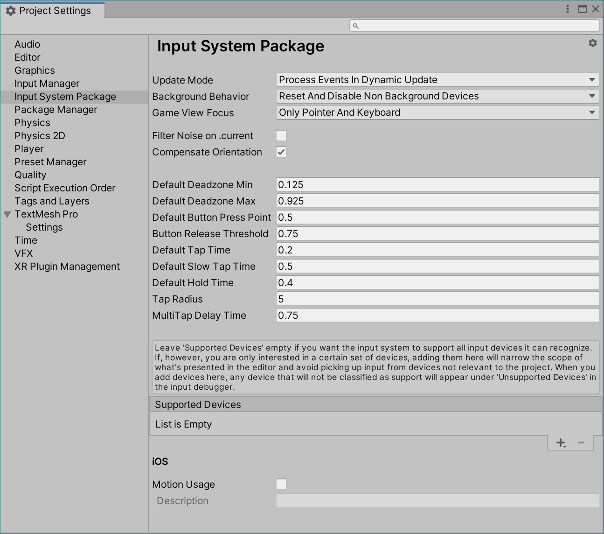
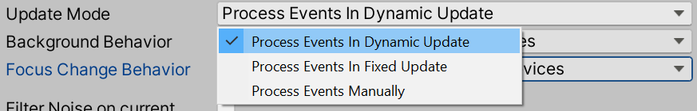
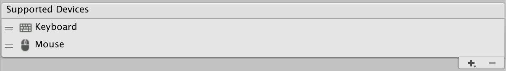
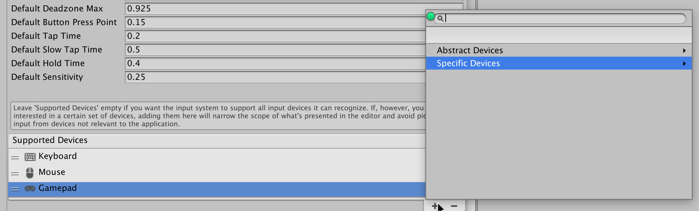
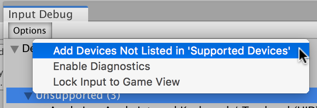

# Input settings

To configure the Input System individually for each project, go to __Edit > Project Settings… > Input System Package__ from Unity's main menu.

The Input System stores input settings in Assets. If your Project doesn't contain an input settings Asset, click __Create settings asset__ in the Settings window to create one. If your Project contains multiple settings Assets, use the gear menu in the top-right corner of the window to choose which one to use. You can also use this menu to create additional settings Assets.

>__Note__: Unity saves changes to these settings when you save the Project.

This page describes each input setting in detail.

## Update Mode

This is a fundamental setting that determines when the Input System processes input.

The Input System processes input in one of three distinct ways:

|Type|Description|
|----|-----------|
|[`Fixed Update`](../api/UnityEngine.InputSystem.InputSettings.UpdateMode.html)|The Input System processes events at fixed-length intervals. This corresponds to how [`MonoBehaviour.FixedUpdate`](https://docs.unity3d.com/ScriptReference/MonoBehaviour.FixedUpdate.html) operates. The length of each interval is determined by [`Time.fixedDeltaTime`](https://docs.unity3d.com/ScriptReference/Time-fixedDeltaTime.html).|
|[`Dynamic Update`](../api/UnityEngine.InputSystem.InputSettings.UpdateMode.html)|The Input System processes events at irregular intervals determined by the current framerate.|
|[`Manual Update`](../api/UnityEngine.InputSystem.InputSettings.UpdateMode.html)|The Input System does not process events automatically. Instead, it processes them whenever you call [`InputSystem.Update()`](../api/UnityEngine.InputSystem.InputSystem.html#UnityEngine_InputSystem_InputSystem_Update).|

>__Note__: The system performs two additional types of updates in the form of  [`InputUpdateType.BeforeRender`](../api/UnityEngine.InputSystem.LowLevel.InputUpdateType.html) (late update for XR tracking Devices) and [`InputUpdateType.Editor`](../api/UnityEngine.InputSystem.LowLevel.InputUpdateType.html) (for EditorWindows). Neither of these update types change how the application consumes input.

## Filter Noise On Current

[//]: # (REVIEW: should this be enabled by default)

This setting is disabled by default, and it's only relevant for apps that use the `.current` properties (such as [`Gamepad.current`](../api/UnityEngine.InputSystem.Gamepad.html#UnityEngine_InputSystem_Gamepad_current)) in the API. If your app doesn't use these properties, leave this setting disabled. Otherwise, it adds needless overhead.

Whenever there is input on a Device, the system make the respective Device `.current`. For example, if a [`Gamepad`](../api/UnityEngine.InputSystem.Gamepad.html) receives new input, [`Gamepad.current`](../api/UnityEngine.InputSystem.Gamepad.html#UnityEngine_InputSystem_Gamepad_current) is assigned to that gamepad.

Some Devices have noise in their input, and receive input even if nothing is interacting with them. For example, the PS4 DualShock controller generates a constant stream of input because of its built-in gyro. This means that if both an Xbox and a PS4 controller are connected, and the user is using the Xbox controller, the PS4 controller still pushes itself to the front continuously and makes itself current.

To counteract this, enable noise filtering. When this setting is enabled and your application receives input, the system determines whether the input comes from a Device that has noisy Controls ([`InputControl.noisy`](../api/UnityEngine.InputSystem.InputControl.html#UnityEngine_InputSystem_InputControl_noisy)). If it does, the system also determines whether the given input contains any state changes on a Control that isn't flagged as noisy. If so, that Device becomes current. Otherwise, your application still consumes the input, which is also visible on the Device, but the Device doesn't become current.

>__Note__: The system doesn't currently detect most forms of noise, but does detect those on gamepad sticks. This means that if the sticks wiggle a small amount but are still within deadzone limits, the Device still becomes current. This doesn't require actuating the sticks themselves. On most gamepads, there's a small tolerance within which the sticks move when the entire device moves.

## Compensate For Screen Orientation

If this setting is enabled, rotation values reported by [sensors](Sensors.md) are rotated around the Z axis as follows:

|Screen orientation|Effect on rotation values|
|---|---|
|[`ScreenOrientation.Portrait`](https://docs.unity3d.com/ScriptReference/ScreenOrientation.html)|Values remain unchanged|
|[`ScreenOrientation.PortraitUpsideDown`](https://docs.unity3d.com/ScriptReference/ScreenOrientation.html)|Values rotate by 180 degrees.|
|[`ScreenOrientation.LandscapeLeft`](https://docs.unity3d.com/ScriptReference/ScreenOrientation.html)|Values rotate by 90 degrees.|
|[`ScreenOrientation.LandscapeRight`](https://docs.unity3d.com/ScriptReference/ScreenOrientation.html)|Values rotate by 270 degrees.|

This setting affects the following sensors:
* [`Gyroscope`](../api/UnityEngine.InputSystem.Gyroscope.html)
* [`GravitySensor`](../api/UnityEngine.InputSystem.GravitySensor.html)
* [`AttitudeSensor`](../api/UnityEngine.InputSystem.AttitudeSensor.html)
* [`Accelerometer`](../api/UnityEngine.InputSystem.Accelerometer.html)
* [`LinearAccelerationSensor`](../api/UnityEngine.InputSystem.LinearAccelerationSensor.html)

## Default value properties

|Property|Description|
|----|-----------|
|Default Deadzone Min|The default minimum value for [Stick Deadzone](Processors.md#stick-deadzone) or [Axis Deadzone](Processors.md#axis-deadzone) processors when no `min` value is explicitly set on the processor.|
|Default Deadzone Max|The default maximum value for [Stick Deadzone](Processors.md#stick-deadzone) or [Axis Deadzone](Processors.md#axis-deadzone) processors when no `max` value is explicitly set on the processor.|
|Default Button Press Point|The default [press point](../api/UnityEngine.InputSystem.Controls.ButtonControl.html#UnityEngine_InputSystem_Controls_ButtonControl_pressPointOrDefault) for [Button Controls](../api/UnityEngine.InputSystem.Controls.ButtonControl.html), and for various [Interactions](Interactions.md). For button Controls which have analog physics inputs (such as triggers on a gamepad), this configures how far they need to be held down for the system to consider them pressed.|
|Default Tap Time|Default duration for [Tap](Interactions.md#tap) and [MultiTap](Interactions.md#multitap) Interactions. Also used by by touchscreen Devices to distinguish taps from to new touches.|
|Default Slow Tap Time|Default duration for [SlowTap](Interactions.md#tap) Interactions.|
|Default Hold Time|Default duration for [Hold](Interactions.md#hold) Interactions.|
|Tap Radius|Maximum distance between two finger taps on a touchscreen Device for the system to consider this a tap of the same touch (as opposed to a new touch).|
|Multi Tap Delay Time|Default delay between taps for [MultiTap](Interactions.md#multitap) Interactions. Also used by touchscreen Devices to count multi-taps (See [`TouchControl.tapCount`](../api/UnityEngine.InputSystem.Controls.TouchControl.html#UnityEngine_InputSystem_Controls_TouchControl_tapCount)).|

## Supported Devices

A Project usually supports a known set of input methods. For example, a mobile app might support only touch, and a console application might support only gamepads. A cross-platform application might support gamepads, mouse, and keyboard, but might not require XR Device support.

To narrow the options that the Editor UI presents to you, and to avoid creating input Devices and consuming input that your application won't use, you can restrict the set of supported Devices on a per-project basis.

If __Supported Devices__ is empty, no restrictions apply, which means that the Input System adds any Device that Unity recognizes and processes input for it. However, if __Support Devices__ contains one or more entries, the Input System only adds Devices that are of one of the listed types.

>__Note__: When the __Support Devices__ list changes, the system removes or re-adds Devices as needed. The system always keeps information about what Devices are available for potential, which means that no Device is permanently lost as long as it stays connected.

To add Devices to the list, click the Add (+) icon and choose a Device from the menu that appears.

__Abstract Devices__ contains common Device abstractions such as "Keyboard" and "Mouse". __Specific Devices__ contains specific hardware products.

### Override in Editor

In the Editor, you might want to use input Devices that the application doesn't support. For example, you might want to use a tablet in the Editor even if your application only supports gamepads.

To force the Editor to add all locally available Devices, even if they're not in the list of __Supported Devices__, open the [Input Debugger](Debugging.md) (menu: __Window > Analysis > Input Debugger__), and select __Options > Add Devices Not Listed in 'Supported Devices'__.

This setting is stored as a user setting (that is, other users who open the same Project can't see the setting).
