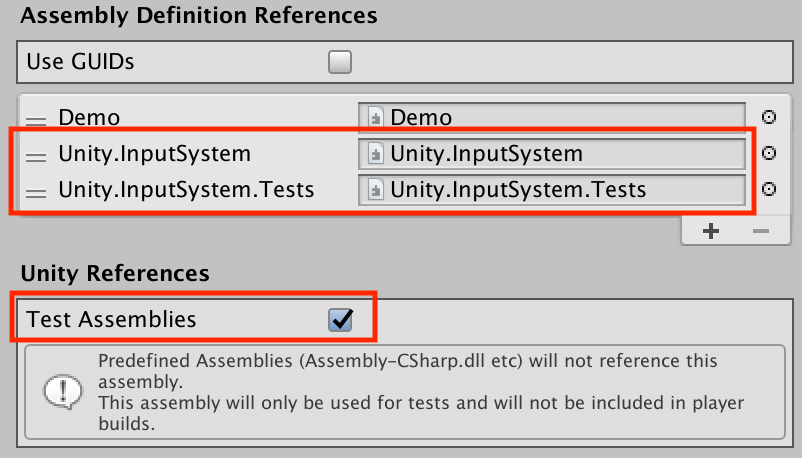

# Input testing

The Input System has built-in support for writing automated input tests. You can drive input entirely from code, without any dependencies on platform backends and physical hardware devices. The automated input tests you write consider the generated input to be the same as input generated at runtime by actual platform code.

## Setting up test assemblies

To set up a test assembly that uses the Input System's automation framework, follow these steps:

1. In the `Packages/manifest.json` file of your project, `com.unity.inputsystem` must be listed in `testables`. This is necessary for test code that comes with the package to be included with test builds of your project.<br><br>You can, for example, add this after the `dependencies` property like so:
    ```
    },
    "testables" : [
        "com.unity.inputsystem"
    ]
    ```
2. Create a new assembly definition (menu: __Create > Assembly Definition__) or go to an assembly definition for a test assembly that you have already created.
3. Add references to `nunit.framework.dll`, `UnityEngine.TestRunner`, and `UnityEditor.TestRunner` (as described in [How to create a new test assembly](https://docs.unity3d.com/Packages/com.unity.test-framework@1.0/manual/workflow-create-test-assembly.html)), as well as `Unity.InputSystem` and `Unity.InputSystem.TestFramework` for the Input System.



## Setting up test fixtures

Use [`InputTestFixture`](../api/UnityEngine.InputSystem.InputTestFixture.html) to create an isolated version of the Input System for tests. The fixture sets up a blank, default-initialized version of the Input System for each test, and restores the Input System to its original state after the test completes. The default-initialized version has all built-in registrations (such as layout and processors), but doesn't have any pre-existing Input Devices.

>__NOTE:__ [`InputTestFixture`](../api/UnityEngine.InputSystem.InputTestFixture.html) will not have custom registrations performed from Unity startup code such as `[InitializeOnLoad]` or `[RuntimeInitializeOnLoadMethod]`. Layouts needed during tests have to be manually registered as part of the test setup.

You can use the fixture as a base class for your own fixture:

```CSharp
class MyTests : InputTestFixture
{
    [Test]
    public void CanPressButtonOnGamepad()
    {
        var gamepad = InputSystem.AddDevice<Gamepad>();
        Press(gamepad.buttonSouth);
    }

    // If you need custom setup and tear-down logic, override the methods inherited
    // from InputTestFixture.
    // IMPORTANT: If you use NUnit's [Setup] and [TearDown] attributes on methods in your
    //            test fixture, this will *override* the methods inherited from
    //            InputTestFixture and thus cause them to not get executed. Either
    //            override the methods as illustrated here or call the Setup() and
    //            TearDown() methods of InputTestFixture explicitly.
    public override void Setup()
    {
        base.Setup();
        // Add setup code here.
    }
    public override void TearDown()
    {
        // Add teardown code here.
        base.TearDown();
    }
}
```

>__IMPORTANT:__ If you do this, do __not__ add a `[SetUp]` or `[TearDown]` method. Doing so will cause the methods in [`InputTestFixture`](../api/UnityEngine.InputSystem.InputTestFixture.html) to not be called, thus leading to the test fixture not properly initializing or shutting down. Instead, override the `Setup` and/or `TearDown` method inherited from `InputTestFixture`.

Alternatively, you can instantiate it in your fixture:

```CSharp
[TestFixture]
class MyTestFixture
{
    private InputTestFixture input = new InputTestFixture();

    // NOTE: You have to manually call Setup() and TearDown() in this scenario.

    [SetUp]
    void Setup()
    {
        input.Setup();
    }

    [TearDown]
    void TearDown()
    {
        input.TearDown();
    }
}
```

This is especially useful when creating a larger setup for game testing using `PrebuiltSetup`.

```CSharp
[PrebuildSetup("GameTestPrebuildSetup")]
public class GameTestFixture
{
    public Game game { get; set; }
    public InputTestFixture input { get; set; }

    public Mouse mouse { get; set; }
    public Keyboard keyboard { get; set; }
    public Touchscreen touchscreen { get; set; }
    public Gamepad gamepad { get; set; }

    //...
}

#if UNITY_EDITOR
public class GameTestPrebuildSetup : IPrebuildSetup
{
    public void Setup()
    {
        UnityEditor.EditorBuildSettings.scenes = new[]
        {
            new UnityEditor.EditorBuildSettingsScene("Assets/Scenes/Main.unity", true)
        };
    }
}
#endif
```

Note that you do __not__ generally need to clean up any input-related data you set up. This includes devices you add, layouts you registered, [`InputSettings`](../api/UnityEngine.InputSystem.InputSystem.html#UnityEngine_InputSystem_InputSystem_settings) you modify, and any other alteration to the state of [`InputSystem`](../api/UnityEngine.InputSystem.InputSystem.html). [`InputTestFixture`](../api/UnityEngine.InputSystem.InputTestFixture.html) will automatically throw away the current state of the Input System and restore the state from before the test was started.

## Writing tests

When writing a test, use [`InputSystem.AddDevice<T>()`](../api/UnityEngine.InputSystem.InputSystem.html#UnityEngine_InputSystem_InputSystem_AddDevice__1_System_String_) to add new Devices.

```CSharp
    [Test]
    public void PlayerInput_CanInstantiatePlayer_WithSpecificControlScheme()
    {
        InputSystem.AddDevice<Gamepad>();
        var keyboard = InputSystem.AddDevice<Keyboard>();
        var mouse = InputSystem.AddDevice<Mouse>();

        var prefab = new GameObject();
        prefab.SetActive(false);
        var prefabPlayerInput = prefab.AddComponent<PlayerInput>();
        prefabPlayerInput.actions = InputActionAsset.FromJson(kActions);

        var player = PlayerInput.Instantiate(prefab, controlScheme: "Keyboard&Mouse");

        Assert.That(player.devices, Is.EquivalentTo(new InputDevice[] { keyboard, mouse }));
        Assert.That(player.controlScheme, Is.EqualTo("Keyboard&Mouse"));
    }
```

To feed input, the easiest way is to use the [`Press(button)`](../api/UnityEngine.InputSystem.InputTestFixture.html#UnityEngine_InputSystem_InputTestFixture_Press_UnityEngine_InputSystem_Controls_ButtonControl_System_Double_System_Double_System_Boolean_), [`Release(button)`](../api/UnityEngine.InputSystem.InputTestFixture.html#UnityEngine_InputSystem_InputTestFixture_Release_UnityEngine_InputSystem_Controls_ButtonControl_System_Double_System_Double_System_Boolean_), [`PressAndRelease(button)`](../api/UnityEngine.InputSystem.InputTestFixture.html#UnityEngine_InputSystem_InputTestFixture_PressAndRelease_UnityEngine_InputSystem_Controls_ButtonControl_System_Double_System_Double_System_Boolean_), `Set(control,value)`, and [`Trigger(action)`](../api/UnityEngine.InputSystem.InputTestFixture.html#UnityEngine_InputSystem_InputTestFixture_Trigger_UnityEngine_InputSystem_InputAction_) helper methods provided by [`InputTestFixture`](../api/UnityEngine.InputSystem.InputTestFixture.html).

```CSharp
    [Test]
    public void Actions_WhenDisabled_CancelAllStartedInteractions()
    {
        var gamepad = InputSystem.AddDevice<Gamepad>();

        var action1 = new InputAction("action1", binding: "<Gamepad>/buttonSouth", interactions: "Hold");
        var action2 = new InputAction("action2", binding: "<Gamepad>/leftStick");

        action1.Enable();
        action2.Enable();

        Press(gamepad.buttonSouth);
        Set(gamepad.leftStick, new Vector2(0.123f, 0.234f));

        using (var trace = new InputActionTrace())
        {
            trace.SubscribeTo(action1);
            trace.SubscribeTo(action2);

            runtime.currentTime = 0.234f;
            runtime.advanceTimeEachDynamicUpdate = 0;

            action1.Disable();
            action2.Disable();

            var actions = trace.ToArray();

            Assert.That(actions.Length, Is.EqualTo(2));
            //...
        }
    }
```

Alternatively, you can use code to feed arbitrary input events into the system, and run arbitrary input updates:

```CSharp
    [Test]
    public void PlayerInput_JoiningPlayerThroughButtonPress_WillFailIfDeviceIsNotUsableWithPlayerActions()
    {
        var playerPrefab = new GameObject();
        playerPrefab.SetActive(false);
        playerPrefab.AddComponent<PlayerInput>();
        playerPrefab.GetComponent<PlayerInput>().actions = InputActionAsset.FromJson(kActions);

        var manager = new GameObject();
        var listener = manager.AddComponent<MessageListener>();
        var managerComponent = manager.AddComponent<PlayerInputManager>();
        managerComponent.joinBehavior = PlayerJoinBehavior.JoinPlayersWhenButtonIsPressed;
        managerComponent.playerPrefab = playerPrefab;

        // Create a Device based on the HID layout with a single button control.
        const string kLayout = @"
            {
                ""name"" : ""TestDevice"",
                ""extend"" : ""HID"",
                ""controls"" : [
                    { ""name"" : ""button"", ""layout"" : ""Button"" }
                ]
            }
        ";

        InputSystem.RegisterLayout(kLayout);
        var device = InputSystem.AddDevice("TestDevice");

        using (StateEvent.From(device, out var eventPtr))
        {
            ((ButtonControl)device["button"]).WriteValueIntoEvent(1f, eventPtr);
            InputSystem.QueueEvent(eventPtr);
            InputSystem.Update();
        }

        Assert.That(listener.messages, Is.Empty);
        Assert.That(PlayerInput.all, Is.Empty);
    }
```

>__Note__: For reference, you can find the tests for the Input System itself in its [GitHub repository](https://github.com/Unity-Technologies/InputSystem/tree/stable/Assets/Tests/InputSystem).
