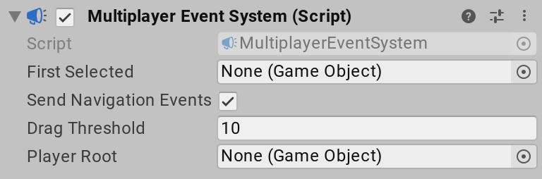

# UI support

You can use the Input System package to control any in-game UI created with the [Unity UI package](https://docs.unity3d.com/Manual/UISystem.html). The integration between the Input System and the UI system is handled by the [`InputSystemUIInputModule`](../api/UnityEngine.InputSystem.UI.InputSystemUIInputModule.html) component.

## `InputSystemUIInputModule` Component

The [`InputSystemUIInputModule`](../api/UnityEngine.InputSystem.UI.InputSystemUIInputModule.html) component acts as a drop-in replacement for the [`StandaloneInputModule`](https://docs.unity3d.com/Manual/script-StandaloneInputModule.html) component provided by the Unity UI package. [`InputSystemUIInputModule`](../api/UnityEngine.InputSystem.UI.InputSystemUIInputModule.html) provides the same kind of functionality as  [`StandaloneInputModule`](https://docs.unity3d.com/Manual/script-StandaloneInputModule.html), but it uses the Input System instead of the legacy Input Manager to drive UI input.

If you have a [`StandaloneInputModule`](https://docs.unity3d.com/Manual/script-StandaloneInputModule.html) component on a game object, and the Input System is installed, Unity will show a button in the Inspector offering to automatically replace it with a [`InputSystemUIInputModule`](../api/UnityEngine.InputSystem.UI.InputSystemUIInputModule.html) for you. The [`InputSystemUIInputModule`](../api/UnityEngine.InputSystem.UI.InputSystemUIInputModule.html) is pre-configured to use default Input Actions to drive the UI, but you can override that configuration to suit your needs.

You can use the following properties to configure [`InputSystemUIInputModule`](../api/UnityEngine.InputSystem.UI.InputSystemUIInputModule.html):

|Property|Description|
|--------|-----------|
|[`Repeat Delay`](../api/UnityEngine.InputSystem.UI.InputSystemUIInputModule.html#UnityEngine_InputSystem_UI_InputSystemUIInputModule_repeatDelay)|The initial delay (in seconds) between generating an initial navigation event and generating repeated navigation events when the __Move__ Action stays actuated.|
|[`Repeat Rate`](../api/UnityEngine.InputSystem.UI.InputSystemUIInputModule.html#UnityEngine_InputSystem_UI_InputSystemUIInputModule_repeatDelay)|The interval (in seconds) between repeated navigation events being generated when the __Move__ Action stays actuated.|
|[`Actions Asset`](../api/UnityEngine.InputSystem.UI.InputSystemUIInputModule.html#UnityEngine_InputSystem_UI_InputSystemUIInputModule_actionsAsset)|An [`Input Action Asset`](ActionAssets.md) containing all the Actions to control the UI. You can chose which Actions in the Asset correspond to which UI inputs using the following properties.  By default, this references a built-in asset named *DefaultInputActions*, which contains common default Actions for driving UI. If you want to set up your own Actions, [create a custom Input Action Asset](ActionAssets.md#creating-input-action-assets) and assign it here. When you assign a new Asset reference to this field in the Inspector, the Editor attempts to automatically map Actions to UI inputs based on common naming conventions.|

The following properties let you map Actions from the chosen [__Actions Asset__](../api/UnityEngine.InputSystem.UI.InputSystemUIInputModule.html#UnityEngine_InputSystem_UI_InputSystemUIInputModule_actionsAsset) to UI input Actions. In the inspector, these are shown as foldout lists showing all the Actions in the Asset:

|Property|Description|
|--------|-----------|
|[`Point`](../api/UnityEngine.InputSystem.UI.InputSystemUIInputModule.html#UnityEngine_InputSystem_UI_InputSystemUIInputModule_point)|An Action delivering a 2D screen position. Used as a cursor for pointing at UI elements to implement mouse-style UI interactions.|
|[`Left Click`](../api/UnityEngine.InputSystem.UI.InputSystemUIInputModule.html#UnityEngine_InputSystem_UI_InputSystemUIInputModule_leftClick)|An Action mapping to the primary cursor button used to interact with UI.|
|[`Middle Click`](../api/UnityEngine.InputSystem.UI.InputSystemUIInputModule.html#UnityEngine_InputSystem_UI_InputSystemUIInputModule_middleClick)|An Action mapping to the middle cursor button used to interact with UI.|
|[`Right Click`](../api/UnityEngine.InputSystem.UI.InputSystemUIInputModule.html#UnityEngine_InputSystem_UI_InputSystemUIInputModule_rightClick)|An Action mapping to the secondary cursor button used to interact with UI.|
|[`Scroll Wheel`](../api/UnityEngine.InputSystem.UI.InputSystemUIInputModule.html#UnityEngine_InputSystem_UI_InputSystemUIInputModule_scrollWheel)|An Action delivering gesture input to allow scrolling in the UI.|
|[`Move`](../api/UnityEngine.InputSystem.UI.InputSystemUIInputModule.html#UnityEngine_InputSystem_UI_InputSystemUIInputModule_move)|An Action delivering a 2D vector used to select the currently active UI [selectable](https://docs.unity3d.com/Manual/script-Selectable.html). This allows a gamepad or arrow-key style navigation of the UI.|
|[`Submit`](../api/UnityEngine.InputSystem.UI.InputSystemUIInputModule.html#UnityEngine_InputSystem_UI_InputSystemUIInputModule_submit)|An Action used to engage with or "click" the currently selected UI [selectable](https://docs.unity3d.com/Manual/script-Selectable.html).|
|[`Cancel`](../api/UnityEngine.InputSystem.UI.InputSystemUIInputModule.html#UnityEngine_InputSystem_UI_InputSystemUIInputModule_cancel)|An Action used to exit any interaction with the currently selected UI [selectable](https://docs.unity3d.com/Manual/script-Selectable.html).|
|[`Tracked Device Position`](../api/UnityEngine.InputSystem.UI.InputSystemUIInputModule.html#UnityEngine_InputSystem_UI_InputSystemUIInputModule_trackedDevicePosition)|An Action delivering a 3d position of one or multiple spatial tracking devices, such as XR hand controllers. In combination with [`Tracked Device Orientation`](../api/UnityEngine.InputSystem.UI.InputSystemUIInputModule.html#UnityEngine_InputSystem_UI_InputSystemUIInputModule_trackedDeviceOrientation), this allows XR-style UI interactions by pointing at UI [selectables](https://docs.unity3d.com/Manual/script-Selectable.html) in space.|
|[`Tracked Device Orientation`](../api/UnityEngine.InputSystem.UI.InputSystemUIInputModule.html#UnityEngine_InputSystem_UI_InputSystemUIInputModule_trackedDeviceOrientation)|An Action delivering a quaternion representing the rotation of one or multiple spatial tracking devices, such as XR hand controllers. In combination with [`Tracked Device Position`](../api/UnityEngine.InputSystem.UI.InputSystemUIInputModule.html#UnityEngine_InputSystem_UI_InputSystemUIInputModule_trackedDevicePosition), this allows XR-style UI interactions by pointing at UI [selectables](https://docs.unity3d.com/Manual/script-Selectable.html) in space.|
|[`Tracked Device Select`](../api/UnityEngine.InputSystem.UI.InputSystemUIInputModule.html#UnityEngine_InputSystem_UI_InputSystemUIInputModule_trackedDeviceSelect)|An Action used to submit "clicks" on UI [selectables](https://docs.unity3d.com/Manual/script-Selectable.html) coming from a spatial tracking device. For example, you can map this to the trigger button on an XR controller to  allows XR-style UI interactions in combination with [`Tracked Device Position`](../api/UnityEngine.InputSystem.UI.InputSystemUIInputModule.html#UnityEngine_InputSystem_UI_InputSystemUIInputModule_trackedDevicePosition) and [`Tracked Device Orientation`](../api/UnityEngine.InputSystem.UI.InputSystemUIInputModule.html#UnityEngine_InputSystem_UI_InputSystemUIInputModule_trackedDeviceOrientation).|

## `MultiplayerEventSystem` Component

The Input System can also handle multiple separate UI instances on the screen controlled separately from different input Bindings. This is useful for having multiple local players sharing a single screen with different controllers, so that every player can control their own UI instance. To allow this, you need to replace the [`EventSystem`](https://docs.unity3d.com/Manual/script-EventSystem.html) component from Unity with the Input System's [`MultiplayerEventSystem`](../api/UnityEngine.InputSystem.UI.MultiplayerEventSystem.html) component.

Unlike the [`EventSystem`](https://docs.unity3d.com/Manual/script-EventSystem.html) component, you can have multiple [`MultiplayerEventSystems`](../api/UnityEngine.InputSystem.UI.MultiplayerEventSystem.html) active in the scene at the same time. That way, you can have multiple players, each with their own [`InputSystemUIInputModule`](../api/UnityEngine.InputSystem.UI.InputSystemUIInputModule.html) and [`MultiplayerEventSystem`](../api/UnityEngine.InputSystem.UI.MultiplayerEventSystem.html)components, and each player can have their own set of Actions driving their own UI instance. If you are using the [`PlayerInput`](Components.md#playerinput-component) component, you can also set up [`PlayerInput`](Components.md#playerinput-component) to automatically configure the player's [`InputSystemUIInputModule`](../api/UnityEngine.InputSystem.UI.InputSystemUIInputModule.html) to use the player's Actions. See the documentation on [`PlayerInput`](Components.md#ui-input) to learn how.

The properties of the [`MultiplayerEventSystem`](../api/UnityEngine.InputSystem.UI.MultiplayerEventSystem.html) component are identical with those from the [`EventSystem`](https://docs.unity3d.com/Manual/script-EventSystem.html), as documented [here](https://docs.unity3d.com/Manual/script-EventSystem.html). Additionally, the [`MultiplayerEventSystem`](../api/UnityEngine.InputSystem.UI.MultiplayerEventSystem.html) component adds a [`Player Root`](../api/UnityEngine.InputSystem.UI.MultiplayerEventSystem.html#UnityEngine_InputSystem_UI_MultiplayerEventSystem_playerRoot) property, which you can set to a GameObject which contains all the UI [selectables](https://docs.unity3d.com/Manual/script-Selectable.html) this event system should handle in it's hierarchy. Mouse input that this event system processes then ignores any UI [selectables](https://docs.unity3d.com/Manual/script-Selectable.html) which are not on any game object in the hierarchy under  [`Player Root`](../api/UnityEngine.InputSystem.UI.MultiplayerEventSystem.html#UnityEngine_InputSystem_UI_MultiplayerEventSystem_playerRoot).
