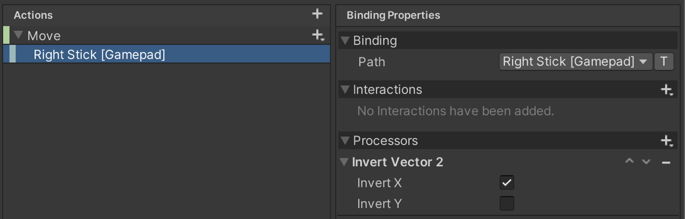
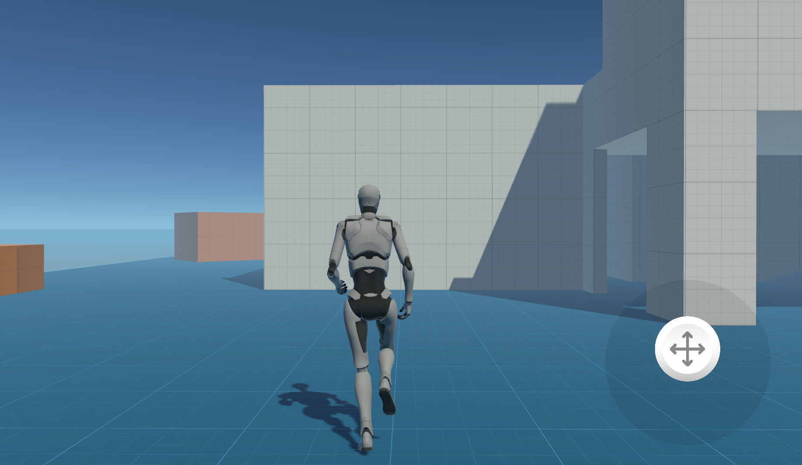
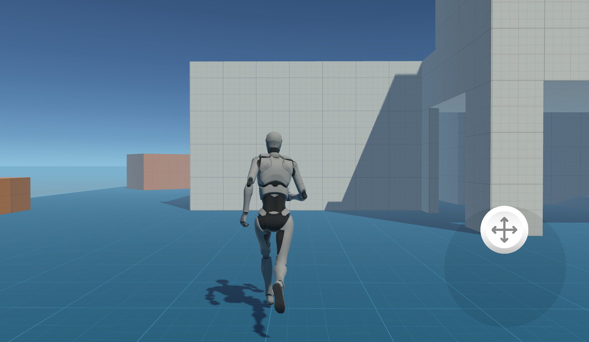
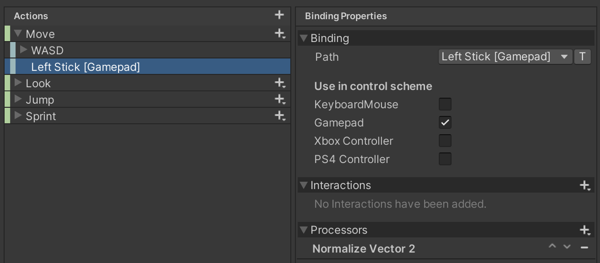
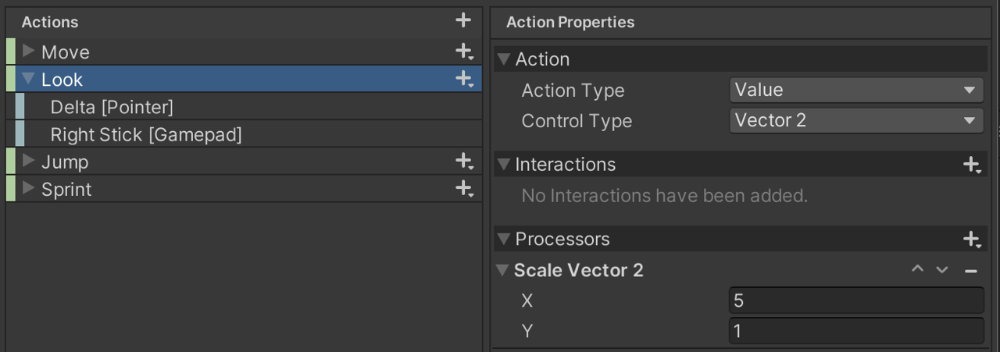
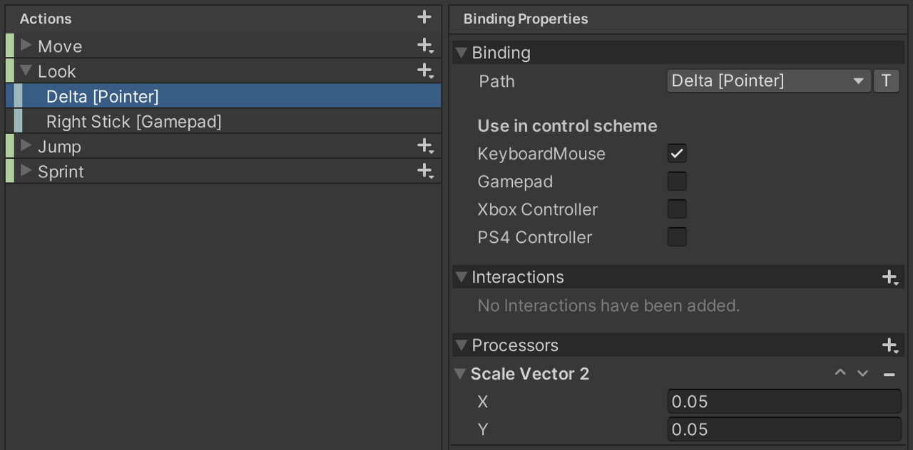
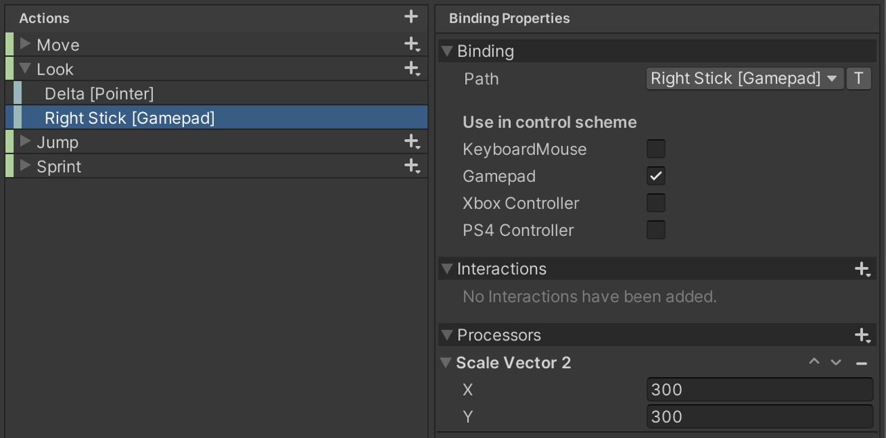
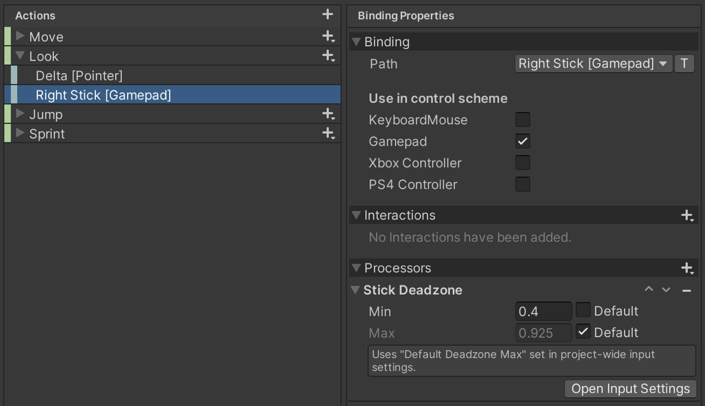

# Using Processors

An Input Processor takes a value and returns a processed result for it. The received value and result value must be of the same type. For example, you can use a [clamp](#clamp) Processor to clamp values from a control to a certain range.

>__Note__: To convert received input values into different types, see [composite Bindings](ActionBindings.md#composite-bindings).

* [Using Processors](#using-processors)
* [When to use which Processor](#when-to-use-which-processor)
    * [Invert](#invert)
    * [Normalize](#normalize)
    * [Scale](#scale)
    * [Deadzone](#deadzone)
    * [Clamp](#clamp)
   
## Using Processors

You can install Processors on [bindings](ActionBindings.md), [actions](Actions.md) or on [controls](Controls.md). See [How to apply Processors](HowToApplyProcessors.md) to learn more.

Each Processor is [registered](../api/UnityEngine.InputSystem.InputSystem.html#UnityEngine_InputSystem_InputSystem_RegisterProcessor__1_System_String_) using a unique name. To replace an existing Processor, register your own Processor under an existing name.

Processors can have parameters which can be booleans, integers, or floating-point numbers. When created in data such as [bindings](./ActionBindings.md), processors are described as strings that look like function calls:

```CSharp
    // This references the processor registered as "scale" and sets its "factor"
    // parameter (a floating-point value) to a value of 2.5.

    "scale(factor=2.5)"

    // Multiple processors can be chained together. They are processed
    // from left to right.
    //
    // Example: First invert the value, then normalize [0..10] values to [0..1].

    "invert,normalize(min=0,max=10)"
```

## When to use which Processor

Below you will find a short explanation and various example scenarios for the different Processor types. Note that there are more cases where the Processors apply and the described scenarios are just illustrating some of them. In some cases it might be useful to combine processors to achieve a certain goal. 
If you don't find a similar scenario for your use-case, please check out the [Processor Types](ProcessorTypes.md), this page also contains more information on how to write your own custom Processors.

### Invert             

The [Invert Processor](ProcessorTypes.md#invert) will invert the input values of any form (e.g. float, Vector2 or Vector3). This happens by multiplying the values with -1, the effect that results is for instance that a player navigation would be reverted. The left arrow would be interpreted like a richt arrow and vice versa. 

#### Ship navigation scenario

In order to use an axis control to mimic a ship's rudder, inverting the input will lead to the desired result. Pulling the stick left will steer the ship to the right, while pulling the stick to the right will lead to the ship moving left.


This can be achieved using an Invert Processor on the Action or the Binding. In this scenario the Processor is applied to the binding. Note that Inverting is enabled for X, but not for Y. Inverting the Y axis would lead to the ship moving backwards when the joystick is pulled up. In the following picture you can see the setup in the Action asset editor. 



Finally, the following code can be used in a script which sits on a GameObject which has a PlayerInput component with the reference to the respective Action Asset.

```c#
using UnityEngine;
using UnityEngine.InputSystem;

public class Boat : MonoBehaviour
{
    void OnMove(InputValue value)
    {
        // The X value will be used to rotate the boat
        var stick = value.Get<Vector2>();
        var direction = stick.x;
        transform.Rotate(Vector3.up, direction);
        // To move the boat forwards, this code block uses the Y value of the stick
        var speed = stick.y;
        transform.Translate(new Vector3(0,0,speed),Space.Self);
    }
}
```

### Normalize

 The [Normalize Processors](ProcessorTypes.md#normalize) will normalize the magnitude of the input vector to always be of length 1. This extracts the direction of the input from the data and clears it from additional infromation that are not needed. 
 In the case of float input values the values will be normalized between a to define min, zero and max value.
 The normalized input value is very useful for use cases where the particular values of an input are rather distorting a uniform action to take.

#### A steady running player

To let the player always move with the same speed, where the input just triggers the action and controls the direction, the Normalize Processor is a good choice. This is accomplished by retrieving the vector of an input without considering the length of the vector, but rather evaluating the direction of the input. 




In the pictures shown above we can see that the player moves forward in the same speed, not taking into acount how far the joystick was pushed up.

To apply the Processor, it can be added to the binding, like shown in the picture below.



Note: this scenaio uses the [Starter Assets](https://assetstore.unity.com/packages/essentials/starter-assets-thirdperson-updates-in-new-charactercontroller-pa-196526?srsltid=AfmBOoqLWdW2pU5Wt2reGYdWVodc1e0ko3cBKtfMQuPSgVqmL7yVA3dB), the included PlayerScript is utilized to move the player. 

### Scale

The [Scale Processor](ProcessorTypes.md#scale) multiplies the input value with a given factor X. This applies to float values, as well as Vectors, where each axis will be multiplied by the factor given for the axis. 
This way it is possible to assign a weight to input values, which can ease the use of a certain kind of control for instance, or triggering a particular action.

#### Horizontally aligned Camera

To make a look around move smoother and add some ease of use it may be nice to mitigate the rotation up and down and scale the input values for the rotation of the horizontal axis higher. For in-game landscapes which are mainly horizontally aligned, this is a useful feature to avoid the camera rotating to fast in an unintended way. 
To apply this affect to all bindings the Processor is applied to the action itself (Look). The following picture shows the setup with the Starter Assets example:



There are two Bindings attached to the Action. The ranges of the input values of the two bindings are very different. To mitigate the difference it helps to use another Scale Processor on each of the Bindings. See how the Scale Processor uniforms the input data values for a joystick and a Pointer (e.g. a Mouse) in the pictures below.




Note: this scenaio uses the [Starter Assets](https://assetstore.unity.com/packages/essentials/starter-assets-thirdperson-updates-in-new-charactercontroller-pa-196526?srsltid=AfmBOoqLWdW2pU5Wt2reGYdWVodc1e0ko3cBKtfMQuPSgVqmL7yVA3dB), the included PlayerScript is utilized to rotate the camera. 

#### Customizing mouse input

Antother example when Scale Processors can be very useful is to customize input via a game settings window. To allow a custom setup for the speed of the mouse in X and Y direction, a Scale Processor can be applied to a Binding which is limited to a Pointer device. 

### Deadzone

To filter noise from controls that are hardly in a default state, keep sending input values, or rarely report the maximum value, a [Deadzone Processor](ProcessorTypes.md#axis-deadzone) might be the right choice.
The given minimum value can filter out minimal movements or noise of the control, while the maximum value can mitigate the difference between the controls maximum value and the reported maximum values. 

#### The Deadzone Processor for Accesibility

The Deadzone Processor can be used to provide accessiblity to physically difficult input gestures, like very small movements on an input device. This can be used to be configurable through a game menu for instance. To cutoff input events from tiny movements on a joystick (e.g. for trembling hands), this is how the right stick Binding of a gamepad can be modified to ignore input events for small input values: 



The default for the minimum value is overwritten to allow a higher threshold for input values. For the maximum value the default is used to uniform the values for all gamepads (not all gamepads may ever send the maximum value).

Note: this scenaio uses the [Starter Assets](https://assetstore.unity.com/packages/essentials/starter-assets-thirdperson-updates-in-new-charactercontroller-pa-196526?srsltid=AfmBOoqLWdW2pU5Wt2reGYdWVodc1e0ko3cBKtfMQuPSgVqmL7yVA3dB), the included PlayerScript is utilized to rotate the camera. 

### Clamp

The [Clamp Processor](ProcessorTypes.md#clamp) clamps the input value into a specified range. The minimum value of the Processor will define the minimum input value that will be received, while the value can not be higher than the given maximum value. In combination with the Scale Processor it is easy to uniform value ranges of different devices and place them in a well defined value spectrum. 

#### Racing car

In a case where the player is not supposed to completely stop and needs to keep a base speed, but also can not to go a speed higher than value X, a Clamp Processor is the Processor you may want to use.