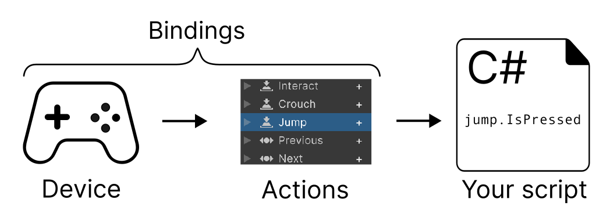
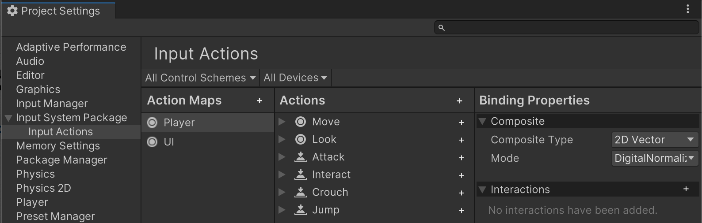

# Workflow Overview - Actions



While the Input System has a variety of workflows to choose from, this is the primary recommended workflow, which suits most common scenarios for game and app input.

In this workflow, you configure Actions in the [**Input Actions** editor](ActionsEditor.html), then set up references to those actions and read their values in your code.

## Configure Actions in the Actions Editor

Open the Input System settings by going to **Edit** > **Project Settings** > **Input System Package** > **Input Actions**.

If you have not yet created and assigned the default [project-wide actions](ProjectWideActions.md), the Input System settings window displays a button to do this.

Once you have created and assigned the default project-wide actions, the Actions Editor is displayed:


*The Input Actions editor in the Project Settings window*

The [Input Actions editor](ActionsEditor.html) provides a way to define and manage Actions which relate to what you want users to be able to do in your game or app. It also allows you to create bindings between your Actions and one or more types of control on various devices, such as a stick on a gamepad, a key on a keyboard, or a button on an XR controller.

Actions and Bindings allows you to separate the conceptual actions that you want in your game or app from the the specific decvices and controls that a player has to use to perform the actions, which can make your code simpler and more flexible. This is in contrast to [directly reading device states](Workflow-Direct.html) in your code, which can suit simple projects, but can become unwieldy and inflexible for more complex projects.

### The default Actions

The Input System comes pre-configured with some default Actions such as "Move", "Jump", and more, which suit many common app and game scenarios. They are configured to read input most types of input controller such as Keyboard, Mouse, Gamepad, Touchscreen and XR.

This means, in many cases, you can start scripting with the Input System without any configuration by referring to the names of the default actions that are already configured for you.

## Accessing your Actions from code

There are various ways to access your actions from code. One of the simplest ways is to use the `FindAction` method.

`FindAction` allows you to search for an action by name from within the set of configured acations, and returns a reference which you can then either read the value directly (also called "polling"), or you can attach callback methods that are called the action is performed. The workflow described on this page focuses only on reading the action values. [You can read more about using callbacks here](RespondingToActions.html#action-callbacks).

> __Tip__: Finding and storing a reference to an Action is similar to finding and storing a reference to a Component, so if you have done that elsewhere in Unity, this may be a familiar process.

To use `FindAction` to get references to your Actions and read user input in your script, use the following steps:

1. Create a new C# script in Unity.
1. Add the Input System's "using" statement to the top of your script. This allows you to use the Input System API throughout the rest of your script:

        using UnityEngine.InputSystem

1. Create some variables of type `InputAction` in your class body, one for each Action that you want to use in your script. These will store the references to each Action. A good naming convention is to add the word Action to the name of the action. For example:

        InputAction moveAction;
        InputAction jumpAction;

1. In your Start() method, use `FindAction` to find the reference to each action and store it in its respective variable, for example:

        moveAction = InputSystem.actions.FindAction("Move");
        jumpAction = InputSystem.actions.FindAction("Jump");

1. In your Update() method, read the value from your action variables. This allows you to write code that reads the latest values coming from your Actions each frame and respond accordingly.<br/><br/>The way you read a value depends on the Action's **value type**. For example some actions may return a 1D or 2D axis value, and other actions may return a boolean true/false value. In this example, the "Move" action returns a 2D axis, and the "Jump" action returns a boolean.

        Vector2 moveValue = moveAction.ReadValue<Vector2>();
        bool jumpValue = jumpAction.IsPressed();

The example script below shows all these steps combined together into a single script:

```CSharp
using UnityEngine;
using UnityEngine.InputSystem;

public class Example : MonoBehaviour
{
    // These variables are to hold the Action references
    InputAction moveAction;
    InputAction jumpAction;

    private void Start()
    {
        // Find the references to the "Move" and "Jump" actions
        moveAction = InputSystem.actions.FindAction("Move");
        jumpAction = InputSystem.actions.FindAction("Jump");
    }

    void Update()
    {
        // Read the "Move" action value, which is a 2D vector
        // and the "Jump" action state, which is a boolean value

        Vector2 moveValue = moveAction.ReadValue<Vector2>();
        // your movement code here

        if (jumpAction.IsPressed())
        {
            // your jump code here
        }
    }
}
```

> **Note:** You should avoid using `FindAction` in your Update() loop, because it performs a string-based lookup which could impact performance. This is why the Action refeferences in the example above are found during the Start() functionm, and stored in variables after finding them.

> **Note:** The [InputSystem.actions](../api/UnityEngine.InputSystem.InputSystem.html) API refers specifically to the Action Asset assigned as the [project-wide actions](ProjectWideActions.md). Most projects only require one Action Asset, but if you are using more than one Action Asset, you must create a reference using the type InputActionAsset to the asset you wish to access.
