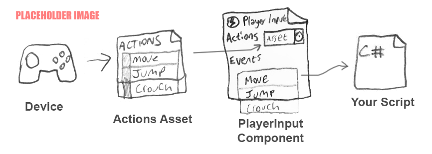

# Workflow Overview - Actions and the PlayerInput Component



The highest level of abstraction provided by the Input System is when you use [Actions](Actions.html) and the **Player Input component** together.

 The Player Input provides a way to make connections between your configured Actions and the C# methods in your own MonoBehaviour scripts, so that your desired C# methods are called when the user performs an input action.

It allows you to set up these connections using a UI in the inspector using an event-driven model, instead writing code to poll the values of your Actions as described in the [previous workflow example](Workflow-Actions.html)).

The PlayerInput component also helps with multi-player scenarios. You can use the PlayerInput component along with the PlayerInputManager component to handle automatic instantiation of new players when input occurs on new devices. For example, if you were making a four-player local cooperative game, PlayerInput with PlayerInputManager can handle allowing new players to join when they press start on their respective controller.


In the above example image, you can see the PlayerInput component set up to map the "move", "jump" actions to `OnMove` and `OnJump` methods in a script, via Unity Events.

This is an example of the script which would provide an implementation of these methods

```CSharp
using UnityEngine;
using UnityEngine.InputSystem;

// This script is designed to have the OnMove and
// OnJump methods called by a PlayerInput component

public class ExampleScript : MonoBehaviour
{
    Vector2 moveAmount;

    public void OnMove(InputAction.CallbackContext context)
    {
        // read the value for the "move" action each event call
        moveAmount = context.ReadValue<Vector2>();
    }

    public void OnJump(InputAction.CallbackContext context)
    {
        // your jump code goes here.
    }

    public void Update()
    {
        // to use the Vector2 value from the "move" action each
        // frame, use the "moveAmount" variable here.
    }

}
```

> __Note__: As a general rule, if you are using the PlayerInput workflow, you should read input through callbacks as described above, however if you need to access the input actions asset directly while using the PlayerInput component, you should access the [PlayerInput component's copy of the actions](../api/UnityEngine.InputSystem.PlayerInput.html#UnityEngine_InputSystem_PlayerInput_actions), not `InputSystem.actions`.
>
> This is because the PlayerInput component performs device filtering to automatically assign devices to multiple players, so each instance has its own copy of the actions filtered for each player. If you bypass this by reading `InputSystem.actions` directly, the automatic device assignment won't work.

This workflow has pros and cons when compared to the previous workflow which uses an [Actions without a PlayerInput component](Workflow-Actions.html).

You can see compared with the previous workflow, this workflow requires less code, because you do not have to reference the Actions Asset or set up the event handler methods in your own script. However it does require more set-up in the Editor, and could make debugging more difficult because the connections between your actions and code are not hard-coded.

As with the other workflows described in this section, there is a trade-off between flexibility, simplicity, and speed of implementation.

To get started using this workflow, [see the documentation for the Player Input component](PlayerInput.html).
