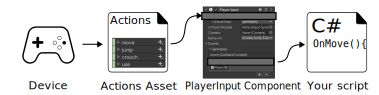
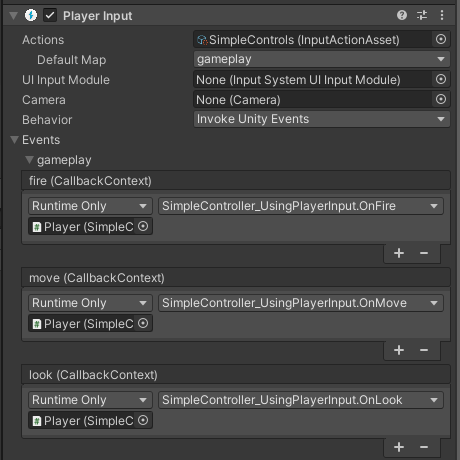

# Workflow Overview - Using an Actions Asset and PlayerInput Component




The highest level of abstraction provided by the Input System is when you use the [Actions Asset](ActionAssets.html) and the **Player Input component** together.

 The Player Input component takes a reference to an Actions Asset, and provides a way to make connections between the Actions defined in that asset, and C# methods in your own MonoBehaviour scripts, so that your desired C# methods are called when the user performs an input action.

It allows you to set up these connections using a UI in the inspector, instead of requiring you to write code to make those connections (as shown in the [previous workflow example](Workflow-ActionsAsset.html)), as well as letting you choose how those methods are called.

You would typically add the PlayerInput component to the same GameObject as your own MonoBehaviour script which contains the methods that should handle the response to the actions.



In the above example image, you can see the PlayerInput component set up to map the "move", "jump" actions to `OnMove` and `OnJump` methods in a script, via Unity Events.

This is an example of the script which would provide an implementation of these methods

```
using UnityEngine;
using UnityEngine.InputSystem;

// This script is designed to have the OnMove and
// OnJump methods called by a PlayerInput component

public class ExampleScript : MonoBehaviour
{
    Vector2 moveAmount;

    public void OnMove(InputAction.CallbackContext context)
    {
        // read the value for the "move" action each event call
        moveAmount = context.ReadValue<Vector2>();
    }

    public void OnJump(InputAction.CallbackContext context)
    {
        // your jump code goes here.
    }

    public void Update()
    {
        // to use the Vector2 value from the "move" action each
        // frame, use the "moveAmount" variable here.
    }

}
```


This workflow has pros and cons when compared to the previous workflow which uses an [Action Asset without a PlayerInput component](Workflow-ActionsAsset.html).

You can see compared with the previous workflow code example that this method requires less code, because you do not have to reference the Actions Asset or set up the event handler methods in your own script. However it does require more set-up in the Editor, and could make debugging more difficult because the connections between your actions and code are not hard-coded.

As with the other workflows described in this section, there is a trade-off between flexibility, simplicity, and speed of implementation.

Using the Player Input component provides the flexibility of being able to connect any action to any public method on a GameObject’s component without writing code, and allows you to make modifications to these connections without modifying code.

However, although requiring less code, you may find that coding the connections in your own script is simpler and faster than setting up and keeping track of these connections in a PlayerInput component on a GameObject.

To get started using this workflow, [see the documentation for the Player Input component](PlayerInput.html).
