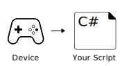
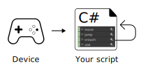
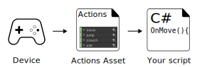

# Input System Workflows

There are multiple ways to use the Input System, and the workflow that’s right for you depends on how quickly you want to get up and running, how flexible you want your input code to be, and whether you prefer to set things up in the Unity Editor, or in code.

To understand the different workflows so that you can choose between them, it’s important to first understand the [concepts and terms](Concepts.html) used to describe them.

Each of the four main workflows described below offers different levels of flexibility and abstraction. They are listed in an order of abstraction from least to most, where each adds a layer of abstraction, and therefore flexibility, to the previous.

|   |   |
|---|---|
|[**Directly Reading Device States**](Workflow-Direct.html)  Your script explicitly refers to device controls and reads the values directly.  Can be the fastest way to set up input for one device, but it is the least flexible workflow. [Read more](Workflow-Direct.html) ||
|[**Using Embedded Actions**](Workflow-Embedded.html)  Your script uses the InputAction class directly. The actions display in your script’s inspector, and allow you to configure them in the editor. [Read more](Workflow-Embedded.html)||
|[**Using an Actions Asset**](Workflow-ActionsAsset.html)  Your script does not define actions directly. Instead your script references an Input Actions asset which defines your actions. The Input Actions window provides a UI to define, configure, and organize all your Actions into useful groupings. [Read more](Workflow-ActionsAsset.html)||
|[**Using an Actions Asset and a PlayerInput component**](Workflow-PlayerInput.html)  In addition to using an Actions Asset, the PlayerInput component provides a UI in the inspector to connect actions to event handlers in your script, removing the need for any intermediary code between the Input System and your Action Methods. [Read more](Workflow-PlayerInput.html)||

>[!Note]
>Because the Input System has multiple workflows, the code samples used throughout this documentation also vary, demonstrating techniques using various workflows. For example, some code samples may use embedded actions, and others might use an action asset.
