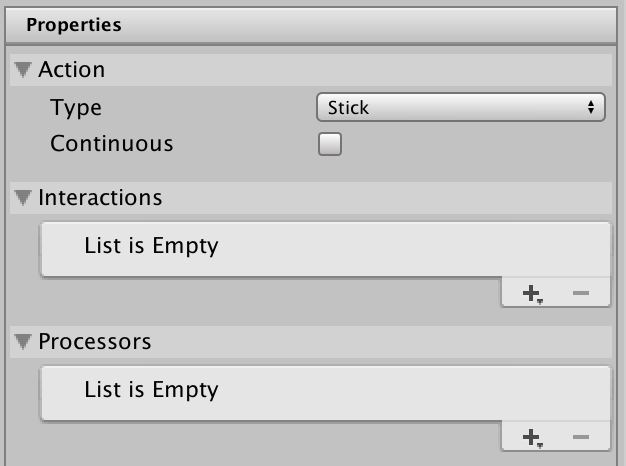

# About action and control types

Each action has an **action type** and a **control type**. These settings are displayed in the [Action Properties panel](./action-properties-panel-reference.md) when you select an action in the [Actions Editor window](./actions-editor.md).

When you configure an action, you can select an action type and control type that best represents what your action is for, and how you want it to be activated by the [controls](./controls.md) it is [bound](./bindings.md) to.

## Action type

The **action type** influences how the Input System processes state changes for the action, and relates to whether this action represents a discrete on/off button-style interaction or a value that can change gradually over time.

## Control type

The **control type** determines the type of value that should be sent to the action, such as an in integer or float value, or a 1D, 2D, or 3D axis.

The control type that you select has the effect of filtering the available controls to only those that are capable of providing the values appropriate for that control.

For example, if you select **2D axis** as the control type, only those types of controls that can supply a 2D vector as value are available as options for the binding control path, such as a thumb stick or Dpad.

There are more specific control types available which further filter the available bindings, such as **Stick**, **Dpad** or **Touch**. If you select one of these control types, the list of available controls is further limited to only those controls of those specific types when you [select a binding for your action](add-duplicate-delete-binding.md).
