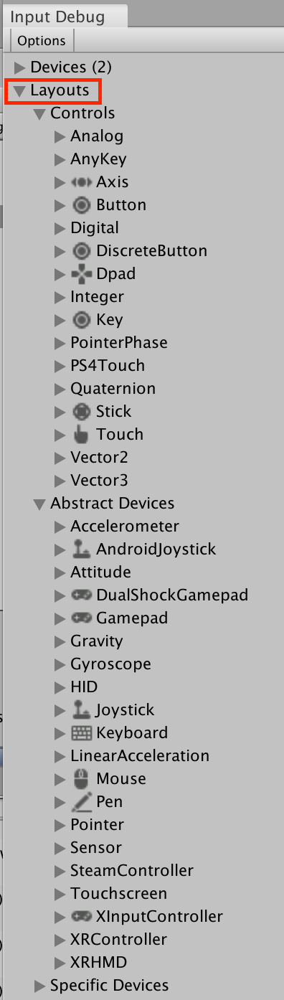

# About layouts

Layouts are the central mechanism by which the Input System learns about types of Input Devices and Input Controls. Each layout represents a specific composition of Input Controls. By matching the description of a Device to a layout, the Input System is able to create the correct type of Device and interpret the incoming input data correctly.

>__Note__: Layouts are an advanced, mostly internal feature of the Input System. Knowledge of the layout system is mostly useful if you want to support custom Devices or change the behavior of existing Devices.

A layout describes a memory format for input, and the Input Controls to build in order to read and write data to or from that memory.

The Input System ships with a large set of layouts for common Control types and common Devices. For other Device types, the system automatically generates layouts based on the Device description that the Device's interface reports.

You can browse the set of currently understood layouts from the Input Debugger.

A layout has two primary functions:

* Describe a certain memory layout containing input data.
* Assign names, structure, and meaning to the Controls operating on the data.

A layout can either be for a Control on a Device (for example, `Stick`), or for a Device itself (that is, anything based on [`InputDevice`](xref:UnityEngine.InputSystem.InputDevice)).

The Input System only loads layouts when they are needed (usually, when creating a new Device). To manually load a layout, you can use [`InputSystem.LoadLayout`](xref:UnityEngine.InputSystem.InputSystem). This returns an [`InputControlLayout`](xref:UnityEngine.InputSystem.Layouts.InputControlLayout) instance, which contains the final, fully merged (that is, containing any information inherited from base layouts and/or affected by layout overrides) structure of the layout.

You can register new layouts through [`InputSystem.RegisterLayout`](xref:UnityEngine.InputSystem.InputSystem).
