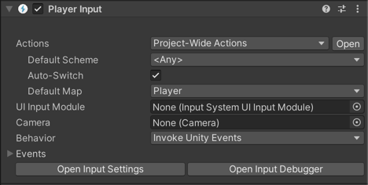

# About the Player Input component

 
*Above, the Player Input component displayed in the inspector.*

### Connecting actions to methods or callbacks

The **Player Input** component represents a single player, and the connection between that player's associated device, Actions, and methods or callbacks.

You can use a single instance of a Player Input component in a single-player game to set up a mapping between your Input Actions and methods or callbacks in the script that controls your player.

For example, by using the Player Input component, you can set up a mapping between actions such as "Jump" to C# methods in your script such as `public void OnJump()`.

There are a few options for doing exactly how the Player Input component does this, such as using SendMessage, or Unity Events, which is described in more detail below.

### Handling local multiplayer scenarios

You can also have multiple **Player Input** components active at the same time (each on a separate instance of a prefab) along with the [**Player Input Manager**](PlayerInputManager.md) component to implement local multiplayer features, such as device filtering, and screen-splitting.

In these local multiplayer scenarios, the Player Input component should be on a prefab that represents a player in your game, which the [**Player Input Manager**](PlayerInputManager.md) has a reference to. The **Player Input Manager** then instantiates players as they join the game and pairs each player instance to a unique device that the player uses exclusively (for example, one gamepad for each player). You can also manually pair devices in a way that enables two or more players to share a Device (for example, left/right keyboard splits or hot seat use).

Each `PlayerInput` corresponds to one [`InputUser`](UserManagement.md). You can use [`PlayerInput.user`](../api/UnityEngine.InputSystem.PlayerInput.html#UnityEngine_InputSystem_PlayerInput_user) to query the `InputUser` from the component.
