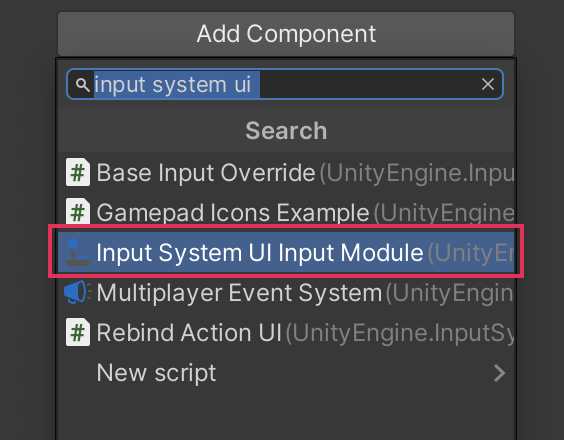

# Access the UI Input Module component

The UI Input Module is a component that passes input actions from the Input System to the UI in your scene.

You must add the UI Input Module to a GameObject in your scene, so that the UI can receive input from the Input System. To do this:

1. Create a new empty GameObject
2. Click [**Add Component**](https://docs.unity3d.com/Manual/UsingComponents.html) in the Inspector
3. In the search field displayed, type `input system ui`.
4. Select **Input System UI Input Module** to add it to the GameObject.

