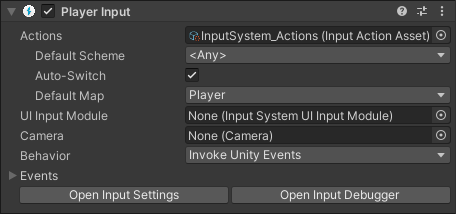

# Input Action Assets

The Input System stores your configuration of [Input Actions](Actions.md) and their associated [Bindings](ActionBindings.md), [Action Maps](ActionsEditor.html#configure-action-maps) and [Control Schemes](ActionBindings.md#control-schemes) in an [Action Asset](ActionAssets.md) file.

While it's possible to have more than one Action Asset in a project, most projects only ever need a single Action Asset. 

These Assets have the `.inputactions` file extension and are stored in a plain JSON format.

The input system creates an Action Asset when you set up the [default project-wide actions](ProjectWideActions.md), but you can also create new Action Assets directly in the Project window.

For most common scenarios, you do not need to use more than one Input Action Asset. This is because an Action Asset can contain multiple [Action Maps](ActionsEditor.html#configure-action-maps), which each containing a set of actions relevant to the various parts of your project (such as UI navigation, gameplay, etc).

## Descriptive heading

Use descriptive headings to break up the content and make the page easy to
scan. Organize content logically and introduce ideas gradually.

### Detailed heading

Don't use headings below H3 level.

## Additional resources

- [Link](related-content-on-Unity-owned-platforms)
- [Link](related-content-on-Unity-owned-platforms)

--------------------------------------------

- [Descriptive heading](#descriptive-heading)
  - [Detailed heading](#detailed-heading)
- [Additional resources](#additional-resources)
- [Project-Wide Actions](#project-wide-actions)
- [Using Input Action Assets](#using-input-action-assets)
  - [Using Action Assets with `PlayerInput`](#using-action-assets-with-playerinput)
  - [Modifying Input Action Assets at runtime](#modifying-input-action-assets-at-runtime)

## Project-Wide Actions

The Input System's **project-wide actions** feature allows you to choose an individual Action Asset to be available project-wide, which means the actions within that asset are available more conveniently through the Input System API without needing to set up references to a specific asset.

When you assign an Action Asset as project-wide, it also becomes automatically [preloaded](https://docs.unity3d.com/ScriptReference/PlayerSettings.GetPreloadedAssets.html) when your app starts up, and is kept available until it terminates.

Unless you have specific project requirements that require more than one Action Asset, the recommended workflow is to use a single Action Asset assigned as the project-wide actions.

## Using Input Action Assets

### Using Action Assets with `PlayerInput`

The [Player Input](PlayerInput.md) component provides a convenient way to handle input for one or multiple players. You can assign your Action Asset to the Player Input component so that it can then automatically handle activating Action Maps and selecting Control Schemes for you.

### Modifying Input Action Assets at runtime
There are several ways to modify an Input Action Asset at runtime. Any modifications that you make during Play mode to an Input Action Asset do not persist in the Input Action Asset after you exit Play mode. This means you can test your application in a realistic manner in the Editor without having to worry about inadvertently modifying the asset. For examples on how to modify an Input Action Asset, see the documentation on [Creating Actions in code](Actions.md#creating-actions-in-code) and [Changing Bindings](ActionBindings.md#changing-bindings).

