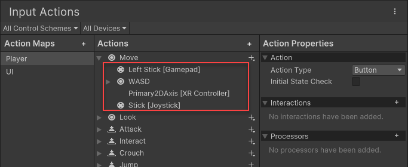

# Add, duplicate or delete a binding

Open the [Actions Editor window](actions-editor.md) to add, duplicate, or delete bindings.

## Add a binding

To add a new binding to an action:

1. Select the Add (+) icon on the action.
2. Select the appropriate [binding type](binding-types.md) from the menu that appears.

Once you have added a binding, the next step is usually to configure its [control path](./control-paths.md).

## Delete a binding

To delete an existing binding from an action:

1. Right-click the action.
2. Select __Delete__ from the context menu.

## Duplicate a binding

To duplicate an existing binding on an action:

1. Right-click the action.
2. Select __Duplicate__ from the context menu.

## Multiple bindings

You can add multiple bindings to an action, which is generally useful for supporting multiple types of input device. For example, in the default set of actions, the "Move" action has a binding to the left gamepad stick and the WSAD keys, which means input through any of these bindings will perform the action.

 
_The default "Move" action in the Actions Editor window, displaying the multiple bindings associated with it._
