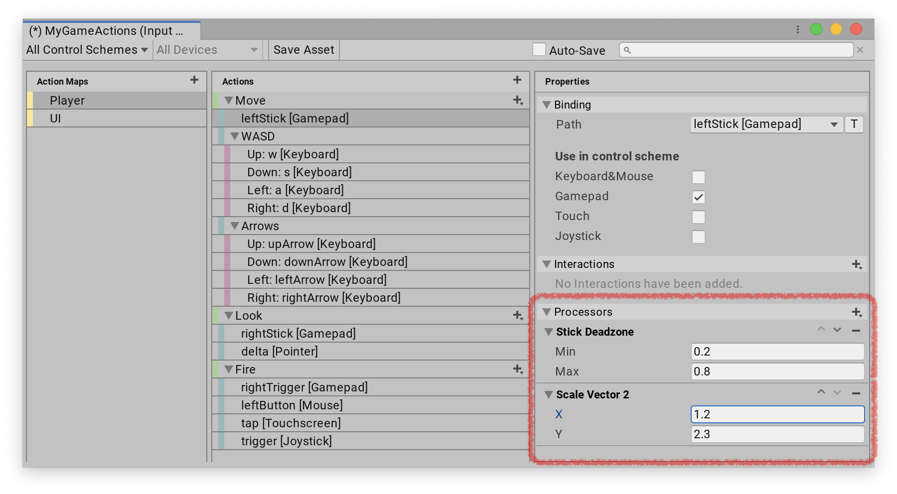

# Add processors to bindings and actions

You can add a processor to an action or binding in the Input Actions Editor.

## Processors on bindings

When you create bindings for your [actions](Actions.md), you can choose to add Processors to the bindings. These process the values from the controls they bind to, before the system applies them to the Action value. For instance, you might want to invert the `Vector2` values from the controls along the Y-axis before passing these values to the Action that drives the input logic for your application. To do this, you can add an [Invert Vector2](built-in-processors.md) Processor to your binding.

If you're using Actions defined in the [Input Actions Editor](actions-editor.md), or in an [action asset](action-assets.md), you can add any Processor to your bindings in the Input Action editor:

1. Select the binding you want to add Processors to so that the Binding Properties panel shows up on the right side.
2. Select the **Add (+)** icon on the __Processors__ foldout to open a list of all available Processors that match your control type.
3. Choose a Processor type to add a Processor instance of that type. The Processor now appears under the __Processors__ foldout.
4. (Optional) If the Processor has any parameters, you can edit them in the __Processors__ foldout.



To remove a Processor, click the Remove (-) icon next to it. You can also use the up and down arrows to change the order of Processors. This affects the order in which the system processes values.

If you create your bindings in code, you can add Processors like this:

```CSharp
var action = new InputAction();
action.AddBinding("<Gamepad>/leftStick")
    .WithProcessor("invertVector2(invertX=false)");
```

## Processors on Actions

Processors on Actions work in the same way as Processors on bindings, but they affect all controls bound to an Action, rather than just the controls from a specific binding. If there are Processors on both the binding and the Action, the system processes the ones from the binding first.

You can add and edit Processors on Actions in the [Input Actions Editor](actions-editor.md), or in an  [action asset](action-assets.md) the [same way](#processors-on-bindings) as you would for bindings: select an Action to edit, then add one or more Processors in the right window pane.

If you create your Actions in code, you can add Processors like this:

```CSharp
var action = new InputAction(processors: "invertVector2(invertX=false)");
```
