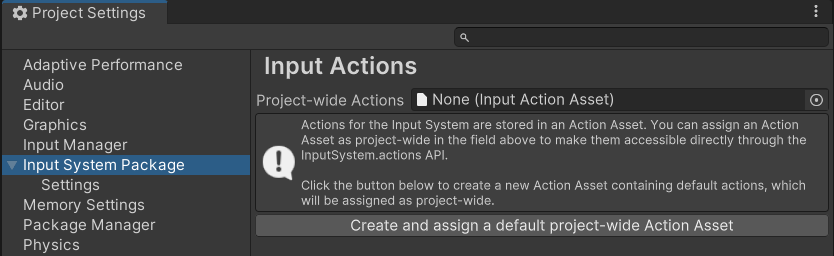

# Assign project-wide actions

To assign an existing Actions Asset as project-wide, do one of the following:

- Go to **Edit** > **Project Settings** > **Input System Package**, then drag the asset from your Project window into the **Project-wide Actions** field.
 
*The Input System Package Project Settings with no project-wide actions assigned*

or:

- Select the Asset in your Project window, then in the Inspector window, select **Assign as the Project-wide Input Actions**.

Only one Actions Asset can be assigned as project-wide. If a different asset was previously assigned as project-wide, it becomes unassigned.