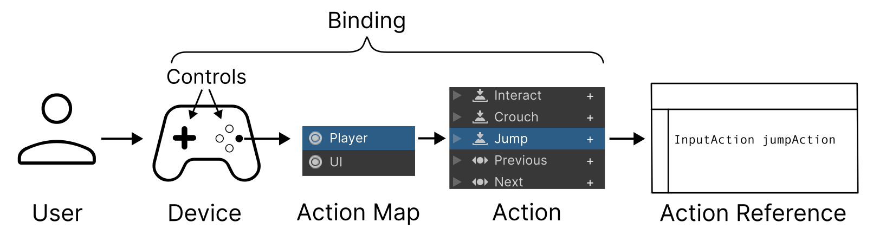

# Bindings

A **binding** represents a connection between an [Action](actions.md) and one or more [Controls](controls.md) identified by a [Control path](./control-paths.md). 

| **Topic**                       | **Description**                  |
| :------------------------------ | :------------------------------- |
| **[Introduction to Bindings](introduction-to-bindings.md)** | Learn the basic concepts of bindings. |
| **[Add, Duplicate or Delete a Binding](add-duplicate-delete-binding.md)** | Learn how to add, duplicate or delete bindings. |
| **[Select a control for Binding](select-control-binding.md)** | Learn how to choose a specific control that a binding is bound to, such as a specific button or stick on a gamepad, or a specific keyboard key. |
| **[Composite Bindings](composite-bindings-reference.md)** | Bindings made up of multiple simple bindings acting together. |
| **[Group bindings to control schemes](group-binding-to-control-scheme.md)** | Group types of related bindings together according to their control type, so that you can enable or disable groups of bindings |
| **[Binding resolution](binding-resolution.md)** | Learn how the Input Systems resolves binding configurations to currently-connected input devices. |
| **[Restrict bindings to specific devices](restrict-bindings-specific-device.md)** | Specify which specific devices a binding should resolve to. |
| **[Binding conflicts](binding-conflicts.md)** | Learn how the Input System resolves conflicting or ambiguous situations, such as when multiple bindings map to the same action. |
| **[Initial state checks](binding-initial-state-checks.md)** | Learn how the Input System deals with if a control is already pressed when an action is enabled, and how to modify this behavior.  |