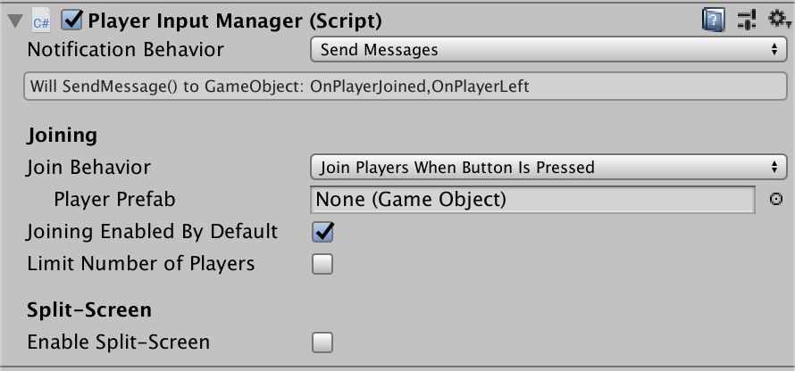

# Configure the Player Input Manager component

|Property|Description|
|--------|-----------|
|[`Notification Behavior`](xref:UnityEngine.InputSystem.PlayerInputManager)|How the [`PlayerInputManager`](xref:UnityEngine.InputSystem.PlayerInput) component notifies game code about changes to the connected players. [This works the same way as for the `PlayerInput` component](select-notification-behavior.md).|
|[`Join Behavior`](xref:UnityEngine.InputSystem.PlayerInputManager)|Determines the mechanism by which players can join when joining is enabled. See documentation on [join behaviors](#join-behaviors).|
|[`Player Prefab`](xref:UnityEngine.InputSystem.PlayerInputManager)|A prefab that represents a player in the game. The [`PlayerInputManager`](xref:UnityEngine.InputSystem.PlayerInputManager) component creates an instance of this prefab whenever a new player joins. This prefab must have one [`PlayerInput`](player-input-component.md) component in its hierarchy.|
|[`Joining Enabled By Default`](xref:UnityEngine.InputSystem.PlayerInputManager)|While this is enabled, new players can join with the mechanism determined by [`Join Behavior`](xref:UnityEngine.InputSystem.PlayerInputManager).|
|[`Limit Number of Players`](xref:UnityEngine.InputSystem.PlayerInputManager)|Enable this if you want to limit the number of players who can join the game.|
|[`Max Player Count`](xref:UnityEngine.InputSystem.PlayerInputManager)(Only shown when `Limit number of Players` is enabled.)|The maximum number of players allowed to join the game.|
|[`Enable Split-Screen`](xref:UnityEngine.InputSystem.PlayerInputManager)|If enabled, each player is automatically assigned a portion of the available screen area. See documentation on [split-screen](set-up-split-screen-local-multiplayer.md) multiplayer.|

## Join behaviors

You can use the [`Join Behavior`](xref:UnityEngine.InputSystem.PlayerInputManager) property in the Inspector to determine how a [`PlayerInputManager`](xref:UnityEngine.InputSystem.PlayerInputManager) component decides when to add new players to the game. The following options are available to choose the specific mechanism that [`PlayerInputManager`](xref:UnityEngine.InputSystem.PlayerInputManager) employs.

|Behavior|Description|
|--------|-----------|
|[`Join Players When Button IsPressed`](xref:UnityEngine.InputSystem.PlayerJoinBehavior)|Listen for button presses on Devices that are not paired to any player. If a player presses a button and joining is allowed, join the new player using the Device they pressed the button on.|
|[`Join Players When Join Action Is Triggered`](xref:UnityEngine.InputSystem.PlayerJoinBehavior)|Similar to `Join Players When Button IsPressed`, but this only joins a player if the control they triggered matches a specific action you define. For example, you can set up players to join when pressing a specific gamepad button.|
|[`Join Players Manually`](xref:UnityEngine.InputSystem.PlayerJoinBehavior)|Don't join players automatically. Call [`JoinPlayer`](xref:UnityEngine.InputSystem.PlayerInputManager) explicitly to join new players. Alternatively, create GameObjects with [`PlayerInput`](player-input-component.md) components directly and the Input System will automatically join them.|

## `PlayerInputManager` notifications

`PlayerInputManager` sends notifications when something notable happens with the current player setup. These notifications are delivered according to the `Notification Behavior` property, in the [same way as for `PlayerInput`](select-notification-behavior.md).

Your game can listen to the following notifications:

|Notification|Description|
|------------|-----------|
|[`PlayerJoinedMessage`](xref:UnityEngine.InputSystem.PlayerInputManager)|A new player joined the game. Passes the [`PlayerInput`](player-input-component.md) instance of the player who joined. `PlayerInputManager` sends a `Player Joined` notification for each of these.|
|[`PlayerLeftMessage`](xref:UnityEngine.InputSystem.PlayerInputManager)|A player left the game. Passes the [`PlayerInput`](player-input-component.md) instance of the player who left.|
