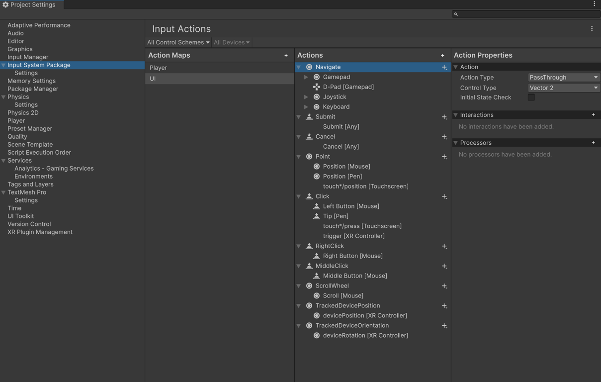

# Configure UI Input Actions

The default [project-wide actions asset](./about-project-wide-actions.md) comes with a built-in action map named **UI**, which contains all the actions required for UI interaction. To configure the bindings for these actions, use the [Actions Editor](./actions-editor.md).

To open the UI action map:

1. Go to **Project Settings > Input System Package**
1. In the **Action Maps** column, select **UI**.

The default [project-wide actions asset](./about-project-wide-actions.md) comes with all the required actions to be compatible with UI Toolkit and Unity UI.

## Modify UI input actions

You can modify, add, or remove bindings to the named actions in the UI action map to suit your project. However, to remain compatible with UI Toolkit, you must not change:

* The name of the action map (**UI**)
* The names of the actions it contains
* Their respective **Action Types**.

To see the specific actions and types that the [UI Input Module](xref:UnityEngine.InputSystem.UI.InputSystemUIInputModule) class expects, refer to the [UI action map reference](ui-action-map-reference.md).

## Reset the UI action map

> [!IMPORTANT]
> These instructions reset both the UI action map and the Player action map to their default bindings.

To reset the UI action map to its default bindings:

1. Open the **More (⋮)** menu, at the top-right of the Input Actions Editor window.
1. Select **Reset**.

To restore functionality to runtime `OnGUI` methods, you can change the **Active Input Handling** setting to **Both**. Doing this means that Unity processes the input twice, which could introduce a small performance impact.

This only affects runtime (play mode) `OnGUI` methods. Editor GUI code is unaffected and continues to receive input events.
