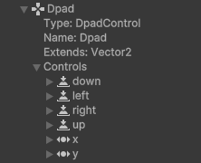

# Control hierarchies

Controls can be arranged in hierarchies. The root of a control hierarchy is always a [device](devices.md). You can find examples of hierarchies when browsing controls in the **Path** dropdown menu of the [Binding properties panel](./binding-properties-panel.md).

For example, the Dpad control of a gamepad has a  has child controls of left, right, up, down, and the separate horizontal and vertical 1D axes.

 *The Dpad control as viewed in the [Input Debugger window](the-input-debugger-window.md), showing its child controls of down, left, right, up, x, and y.*

The setup of hierarchies is exclusively controlled through [layouts](layouts.md).

You can access the parent of a Control using [`InputControl.parent`](../api/UnityEngine.InputSystem.InputControl.html#UnityEngine_InputSystem_InputControl_parent), and its children using [`InputControl.children`](../api/UnityEngine.InputSystem.InputControl.html#UnityEngine_InputSystem_InputControl_children). To access the flattened hierarchy of all Controls on a Device, use [`InputDevice.allControls`](../api/UnityEngine.InputSystem.InputDevice.html#UnityEngine_InputSystem_InputDevice_allControls).

