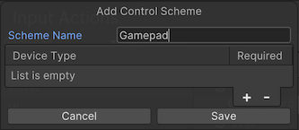

# Control schemes

Input action assets can have multiple [Control Schemes](control-schemes.md), which let you enable or disable different sets of bindings for your actions for different types of devices.

To see the Control Schemes in the Input Action Asset Editor window, open the Control Scheme drop-down list in the top left of the window. This menu lets you add or remove Control Schemes to your Actions Asset. If the Actions Asset contains any Control Schemes, you can select a Control Scheme, and then the window only shows bindings that are associated with that Scheme. If you select a binding, you can now pick the Control Schemes for which this binding should be active in the __Properties__ view to the left of the window.

When you add a new Control Scheme, or select an existing Control Scheme, and then select __Edit Control Scheme__, you can edit the name of the Control Scheme and which devices the Scheme should be active for. When you add a new Control Scheme, the "Device Type" list is empty by default (as shown above). You must add at least one type of device to this list for the Control Scheme to be functional.
